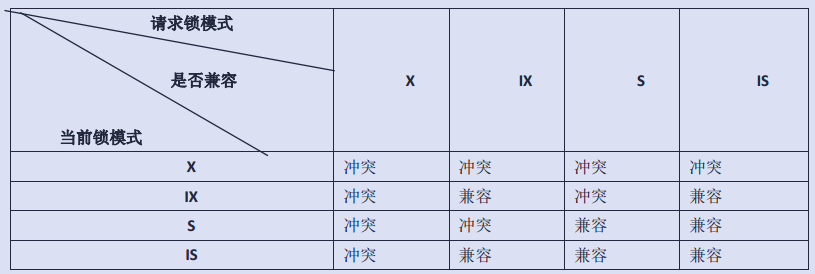

# MySQL锁（一）锁到底是个什么东西？

学习完事务相关的内容，我们紧接着就来看看锁相关的内容。其实事务的各种操作，说白了在底层也是以锁的机制实现的。为什么这么说呢？对于多线程的应用来说，要想解决并发时的一致性问题，终归都是要在锁上下功夫。就像我们要对同一个文件操作，多个线程同时更新文件必然会带来混乱，而锁则是让一个线程在操作的时候其它线程无法进行操作，这样就有效的保证了最终的数据是序列顺序的操作。同理，对于数据库也是一样的。

## 表锁

很多同学在面试时经常都会被问到一个问题，那就是 MyISAM 和 InnoDB 的区别，其中非常重要的一点就是 MyISAM 是表锁的，而 InnoDB 则是行锁。那么什么表锁和行锁呢？其实这就是锁的粒度问题。当进行一个操作时，表锁会锁住整张表，导致后续对这张表的操作都会等待锁的释放。

从这里可以看出，表锁的粒度比较粗，如果是高并发场景下，会导致严重的拥塞情况。但是，并不是说 MyISAM 就完全没法使用了。注意，我们的锁大部分情况下是为了解决更新时前后读写不一致的问题。因此，如果是只读只写，没有更新删除相关操作的数据表，使用 MyISAM 是完全没有问题，而且在 MyISAM 中还有一个称为 并发插入（Concurrent Insert）的特性，它支持在读取 MyISAM 表的同时插入记录，可以提升插入速度。

我们可以复制两个之前测试过的 test_user 表，这个表中有200万条数据。其中一个表是 InnoDB 类型，另一个是 MyISAM 类型，然后进行测试。

```sql
-- InnoDB 类型的 test_user2 表
-- 客户端一
mysql> update test_user2 set username='aabb';
-- 客户端二
mysql> select * from test_user2 where id = 1212121;
+---------+----------------------+------------------------------------------+------+---------------------+------------+--------+--------+
| id      | username             | password                                 | salt | created_at          | updated_at | status | gender |
+---------+----------------------+------------------------------------------+------+---------------------+------------+--------+--------+
| 1212121 | 78f7f07fc184bc34f1e8 | 40f2f3cfbb0a3c0d26e233d976407328dcfcc98f | 26a7 | 2021-09-05 14:57:55 | 1638368645 |     -1 |      1 |
+---------+----------------------+------------------------------------------+------+---------------------+------------+--------+--------+

-- MyISAM 类型的 test_user3 表
-- 客户端一
mysql> update test_user3 set username='aabb';
-- 客户端二
mysql> select * from test_user2 where id = 1212121;
-- MyISAM 中客户端二的查询语句需要等待上面的 update 完成
```

那么 InnoDB 就完全都是行锁吗？如果是 DDL 操作，也就是 ALTER TABLE 之类的操作，也会是整体的表锁。

表锁粒度大，比较粗，加锁快，开销小，不会出现死锁，但是并发性较差。是的，你没猜错，行锁跟它就是反过来的。

## 共享锁与排它锁

共享锁，又称为 S 锁，也可以叫做读锁。最简单的理解就是我们针对数据上锁后，其它的事务还可以读取，但是不能写入。

排它锁，又称为 X 锁，也可以叫做写锁。比较直观的理解就是当我们上了独占锁之后，其它事务不仅没法写入，连读都不让读了。

从上面的定义就可以看出，其实我们的事务最基础的实现就是通过锁的机制来实现的。这个其实就像是 Java 中的 synchronized 概念在数据中的体现。锁的操作是要耗费资源的，毕竟我们需要加锁、解锁、释放锁、检测是否有锁等等。因此，事务隔离级别越高，系统所需要的资源也就越大，执行效率也就越低。

上面这两种锁是针对行锁的，但其实 InnoDB 也是有表锁的，但它们是一种意向锁形式，也就是说，当一个事务在操作一行数据时，如果想要拿到共享锁或排它锁，则先要拿到对应的意向锁。这一段是什么意思呢？

假设 A 事务持有一个行排它锁，同时 B 事务又申请到了整个表的表写锁。理论上来说，事务 B 是可以对任意行进行读写的。但是现在矛盾了，A 不让读写这一行，B 却拥有整个表的权限。这可怎么办呢？于是，在普通的 共享锁 和 排它锁 的基础上又有了一个意向锁，分别对应着 意向共享锁 IS 和 意向排它锁 IX 。

当我们要操作一行数据时，同时会给这个表加上一个 意向锁 ，而另外一个事务要操作整个表时，会查看整个表是否已经被加了 意向锁 。这样就可以避免用遍历的方式来查看表中有没有上锁的记录。这个 意向锁 是针对 表 的 表锁。它是为了协调行锁和表锁的关系，让多种粒度的锁共存。表明的其实就是“某个事务正在某些行持有了锁或该事务准备去持有锁。”

从上面可以看出 共享锁 和 排它锁 既可以针对 表 也可以针对 行 。这四种锁概念之间也有相互的兼容性。比如说，S 锁和 S 以及 IS 锁是兼容的，毕竟都是读相关的内容，可以同时进行。而 X 锁是与其它锁都不兼容的，在修改写入的时候避免脏读、不一致读等情况，在上了 X 锁时，其它事务无法获取任何锁。具体的内容可以看以下表格。



这四个锁的概念其实并不复杂，写的时候要保证一致性，别的锁就都不能上了，只能等写操作完成，而读的时候就宽泛很多。事务的实现也正是基于这几个锁以及其它一些功能的补充所实现的。在一个事务开始的时候，依据 事务隔离级别 进行相应的锁添加，比如最低的事务隔离级别就不会加什么锁，而最高的序列化则是顺序执行，中间的两个 已提交读 和 可重复读 会利用锁来进行。除了普通的这两种锁外，还会有 MVVC 多版本并发控制 和 Next-Key Lock 锁 。

MVVC 多版本并发控制，是通过事务的 undo 日志，记录 roll_pointer 属性（版本信息），并形成一个版本链，通过这个版本链中记录的 事务id 来控制并发事务访问相同记录的行为。

间隙锁，是我们既想锁住某条记录，又想阻止其它事务在该记录前面的间隙插入新记录，而提出的一种称为 Next-Key Lock 的锁，也可以叫 临键锁 。和 临键锁 相关的还有一个 间隙锁 的概念，它们主要是为了解决 幻读 问题。

关于 MVVC 和 Next-Key Lock 以及 间隙锁 的问题，我们都将在后续的文章中逐步学习。

## 页锁

除了行锁和表锁之外，还有一种 页锁 在页的粒度上进行锁定，锁定的资源比行锁要多一些。同样的，它的锁定粒度和并发性也是介入行锁和表锁之间，并可能形成死锁。

关于页锁我们了解一下即可，资料并不是很多，而且主要是 BerkeleyDB 引擎会使用页锁，因此有兴趣的小伙伴可以自行查阅更多的资料，在我这里就只是简单的提一句咯。

## 锁功能的实现

正常情况下，插入、更新、删除是自动加 X 锁的（同时配合事务隔离级别），我们不用去管它。另外在事务中，根据不同的事务隔离级别，SELECT 语句也会有隐式加锁的情况，这也不是我们特别需要关心的。我们主要来看的就是对于普通 SELECT 语句的显式加锁。

```php
SELECT .... LOCK IN SHARE MODE;
```

上面这句语句就是为一条 SELECT 语句加上一个 S 锁。非常简单吧，其实加 X 锁也非常简单。

```php
SELECT .... FOR UPDATE;
```

是不是非常简单，至于锁表的语句也非常简单。

```php
LOCK TABLES t1 WRITE, t2 READ, ...; 
```

当我们要准备迁移数据库或做主从时，都会去锁一下表或者做全局锁，保证主从数据或者备份数据库的数据一致性。

## 总结

今天的内容很学术，很官方，但也确实是非常重要的内容。为啥呢？不说实战怎么样，这堆东西面试官很爱问啊。说实话，我能理解的水平也就到这里了，再深入的内容也无能为力了。所以各位大佬，如果感兴趣的话，可以继续深入搜索其它的相关资料进行研究哦。后续两篇文章，我们将以实践的方式更加深入锁的学习，精彩纷呈，千万不要错过哦。
