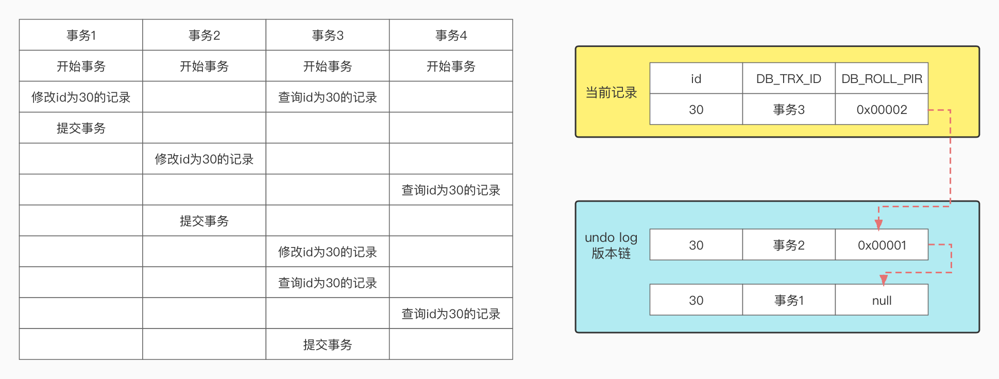

# MySQL中MVCC多版本并发控制的概念

锁相关的知识我们已经学习完了，在其中我们提到过一个概念，那就是 MVCC 。这又是个什么东西呢？今天我们就来好好看看 MVCC 到底是干嘛的。

MVCC 多版本并发控制，它主要是控制 读 操作，是一种 乐观锁 场景，解决 读-写 问题。在数据库中，事务主要处理的就是 读-读、读-写、写-读 所导致的不一致问题。而 MVCC 处理的正是其中的 读-写 问题。写-读 问题就是 X 锁解决的，这个相信大家在之前的学习中已经了解到了。MVCC 不加锁，所以它是一种 乐观锁 的实现。它不阻塞并发读，与 临界锁 一起在 RR 级别解决幻读问题。

## 读的分类

我们先来看一下读数据的几种情况。

- 当前读：读到的就是最新的数据，SELECT ... LOCK IN SHARE MODE 这种 S 锁是 当前读 ，读的时候上锁了别的事务都拿不到 写锁 了，读到的都是最新的数据。
- 一致性读（快照读）：不加锁的 SELECT 就都是快照读。如果其它事务没有提交，那么快照读是读不到最新的数据的。（已提交读和幻读问题的解决）

很明显，MVCC 走的就是快照读的方式。我们为数据行的多个版本实现数据的并发读，就需要一种多版本管理机制。MVCC 可以查询到一些正在被另外一个事务执行更新的行，并且可以看到它们被更新之前的值，这样在查询的时候就不用去等待另一个事务释放锁了。

注意，在 READ UNCOMMITTED 和 SERIALIZABLE 这两个级别中，一个是不走事务，一个是串行化的执行事务，它们都是执行的 当前读 。因为最低级别我们不关心一致性问题，而最高级别则是序列执行，不会有一个事务操作另一个事务更新的情况。因此，MVCC 的场景就是在 READ COMMITTED 和 REPEATABLE READ 这两个事务隔离级别中。

## MVCC 包含的内容

MVCC 的实现主要依赖于它所包含的三块内容，它们分别是：

- 隐藏字段 DB_TRX_ID、DB_ROLL_PTR
- Undo Log
- ReadView

接下来，我们就分别来看看这三部分内容。

## 行的隐藏字段

当我们创建表时，会为表指定字段，这个想必不用我多说了，大家都会，也都明白是什么意思。但是，这个新建的表中，其实还存在着几个隐藏的字段。

- DB_TRX_ID 改变行数据时，将当前 事务id 给到索引上
- DB_ROLL_PTR 是一个 roll_pointer 回滚指针
- DB_ROW_ID 如果没有设置主键，会有一个默认的隐藏主键（不是我们今天需要关注的内容）

当我们改变行记录时，DB_TRX_ID 会记录下来当前的 事务id ，然后把旧的版本的数据写入到 Undo Log 中，DB_ROLL_PTR 指向上一次的旧记录。没错，DB_ROLL_PTR 就是形成了一个链表，这个链表就是 版本链 。

哪里能看到这几个隐藏字段呢？首先找到你的数据库数据存放目录，然后找到你要查看的表，使用 ibd2sdi 工具就可以查看到。

```shell†
root> cd /usr/local/var/mysql8/blog_test
root> ibd2sdi tt.ibd 
// ……
"columns":[
// ……
// ……
]
// ……
```

在结果集中的 columns 字段下，就是我们创建的表的字段信息，最后三个字段就是 DB_TRX_ID、DB_ROLL_PTR 和 DB_ROW_ID（如果有设置主键，就不会有 DB_ROW_ID）。

## Undo Log 与版本链

现在我们已经知道了，通过 DB_ROLL_PTR 隐藏字段，可以在 Undo Log 中形成一个链式数据结构，也就是我们最终的 版本链 这个东西。比如我们有四个事务对数据进行修改，就像下面这张图一样。



左侧是我们的事务操作流程，右侧上方的黄框内是行数据，或者如果是当前读，那么现在这条数据的内容就是 事务4 的数据。右侧下方是记录在 Undo Log 中的日志数据。

当 事务1 执行并修改数据时，DB_TRX_ID 指定为 事务1 的 ID ，DB_ROLL_PTR 是空的，因为在 事务1 之前没有别的事务在运行。接着，事务2 执行并修改数据，DB_TRX_ID 指定为 事务2 的 ID ，DB_ROLL_PTR 指向 事务1 。为什么 事务2 要指向 事务1 ？因为我们是同时 BEGIN 这四个事务的，在 事务2 修改数据的时候有 事务1 的修改记录。

依次类推，最终数据稳定在 事务3 提交的数据上，注意我们的 事务4 只是查询，没有修改更新数据。

这个，就是 MVCC 定义中，多版本 这个词的概念。有了 多版本 的这个 版本链 之后呢？那就是管理控制了。我们马上要讲的 ReadView 读视图配合事务隔离级别，就形成了 版本并发控制 。

## ReadView

上面多个事务对同一个行记录进行更新会产生多个历史快照，它们保存在 Undo Log 中，而 ReadView 就是事务在使用 MVVC 机制进行快照读时产生的 读视图 ，也就是确定读出来的是 Undo Log 中的哪条数据。另外，当事务启动时，也会生成数据库系统当前的一个快照，InnoDB 为每个事务也都构造了一个数组，用来记录并维护系统当前的活跃事务（启动了还没提交的事务）的 ID 。

总之，两种快照，一个是系统当前正在运行的事务快照，一个是事务中针对读操作从 Undo Log 中选取的一个快照。数据库系统会通过当前事务的状态，未完成事务的情况，以及 版本链 中的记录，最后根据 事务隔离级别 来选择合适的数据生成 ReadView 。

### ReadView 的内容与规则

上面的描述看着很晕吧？没事，到最后我们看到结果的时候就会恍然大悟了。不过首先，我们要来看一下 ReadView 中包含哪些内容。

- creator_trx_id 创建这个 Read view 的 事务id ，也就是对记录 增、改、删 时所分配的 事务id ，只读事务不分配
- trx_ids 生成 ReadView 时当前系统中活跃的读写事务的 id 列表，启动事务时获取到的系统事务快照
- up_limit_id 活跃事务中最小的 事务id 
- low_limit_id 生成 ReadView 时系统中应该分配给下一个事务的 id ，整个数据库系统中的最大 id 值，不是 trx_ids 中的最大值

根据 ReadView 的内容，再根据下面的规则进行比对，从而获得当前事务是否能访问版本链上的某条记录。

1. 如果当前数据的 DB_TRX_ID 与 ReadView 中的 creator_trx_id 相同，就是当前事务在访问自己修改过的记录，所以当前版本可以被当前事务访问

2. 如果数据的 DB_TRX_ID 小于 ReadView 中的 up_limit_id ，就是这个数据的事务在当前事务生成的 ReadView 之前已经提交，当前这个版本的数据可以被当前事务访问

3. 如果数据的 DB_TRX_ID 大于或等于 ReadView 中的 low_limit_id ，那么这个版本的事务在当前事务 ReadView 之后才开启，这个版本操作的数据不能被访问

4. 如果数据的 DB_TRX_ID 在 ReadView 的 up_limit_id 和 low_limit_id 之间，就需要判断 DB_TRX_ID 在不在 trx_ids 列表中

    4.1 在，说明创建 ReadView 时这个记录上的事务还活跃的，这个版本不能被访问
    4.2 不在，说明记录上的事务已经被提交了，可以访问

内容和规则能看明白吗？如果看不明白可以多看两遍，只要达到了规则条件，那么我们所获得的，或者说是 SELECT 出来的数据内容，就是最新的这条符合规则的数据。

### ReadView 的执行步骤

我们上面学习到的所有内容，最后总结一下 ReadView 的执行步骤。

1. 获取当前事务的id，也就是版本号
2. 获取一个 ReadView 快照
3. 查询得到的数据，与 ReadView 中的事务版本号比对
4. 如果不符合 ReadView 规则，就要从 Undo Log 中获取历史快照（DB_ROLL_PTR 版本链向前查找）
5. 返回符合规则的数据

## 事务隔离级别的差别

好了，理论上 MVCC 的相关内容我们都说完了。最后一点则是事务隔离机制的不同，对于 MVCC 的影响也有不同。之前我们说过 REPEATABLE READ 是能防止 幻读 情况发生的。为什么能防止呢？原因就在于它的 快照读 机制与 READ COMMITTED 不同。 

简单点概括。

READ COMMITTED 每次都获取生成 ReadView 。如果有别的事务提交了，那么在当前事务会读到新的数据。

REPEATABLE READ 只有第一次 SELECT 时生成 ReadView ，后面的 SELECT 语句只会读取第一条的 ReadView ，不会产生新的 ReadView 。也就是说，如果有别的事务提交了，那么当前事务读到的内容也会发生变化。

我们可以通过代码来看它们的区别。

### READ COMMITTED

```sql
-- 事务1、事务2
mysql> begin;

-- 事务1、事务2
mysql> select * from tran_innodb where id = 5;
+----+------+------+
| id | name | age  |
+----+------+------+
|  5 | Joe  |   12 |
+----+------+------+
1 row in set (0.00 sec)

-- 事务1
mysql> update tran_innodb set name = 'Joe5';
Query OK, 19 rows affected (0.00 sec)
Rows matched: 19  Changed: 19  Warnings: 0

mysql> select * from tran_innodb where id = 5;
+----+------+------+
| id | name | age  |
+----+------+------+
|  5 | Joe5 |   12 |
+----+------+------+
1 row in set (0.00 sec)

-- 事务2
mysql> select * from tran_innodb where id = 5;
+----+------+------+
| id | name | age  |
+----+------+------+
|  5 | Joe  |   12 |
+----+------+------+
1 row in set (0.00 sec)

-- 事务1提交
mysql> commit;

-- 事务2
mysql> select * from tran_innodb where id = 5;
+----+------+------+
| id | name | age  |
+----+------+------+
|  5 | Joe5 |   12 |
+----+------+------+
1 row in set (0.00 sec)

```

在 READ COMMITTED 级别下，事务1、2同时开启事务，第一次也都查询完，数据是一样的。接着事务2修改了数据，将 name 修改为 Joe5 ，然后事务2自己查询了一下，数据是最新的（规则1）。事务1这时也查了一下，还是老样子数据没变（事务1未提交，Undo Log 已记录，但 trx_ids 列表中还存在，规则 4）。继续向下，事务2提交，DB_TRX_ID 变动，事务1再次查询，与新的 ReadView 进行规则比对，DB_TRX_ID 小于当前的 事务id （规则4.2），返回最新数据，查询到的数据产生了变化。 

**READ COMMITTED 每次 SELECT 都获取生成 ReadView。**

### REPEATABLE READ

```sql
-- 事务1、事务2
mysql> begin;

-- 事务1、事务2
mysql> select * from tran_innodb where id = 5;
+----+------+------+
| id | name | age  |
+----+------+------+
|  5 | Joe  |   12 |
+----+------+------+
1 row in set (0.00 sec)

-- 事务1
mysql> update tran_innodb set name = 'Joe5';
Query OK, 19 rows affected (0.00 sec)
Rows matched: 19  Changed: 19  Warnings: 0

mysql> select * from tran_innodb where id = 5;
+----+------+------+
| id | name | age  |
+----+------+------+
|  5 | Joe5 |   12 |
+----+------+------+
1 row in set (0.00 sec)

-- 事务2
mysql> select * from tran_innodb where id = 5;
+----+------+------+
| id | name | age  |
+----+------+------+
|  5 | Joe  |   12 |
+----+------+------+
1 row in set (0.00 sec)

-- 事务1提交
mysql> commit;

-- 事务2
mysql> select * from tran_innodb where id = 5;
+----+------+------+
| id | name | age  |
+----+------+------+
|  5 | Joe |   12 |
+----+------+------+
1 row in set (0.00 sec)

```

同样的操作，但是，最后查询到的结果没有发生变化，还是和第一次查询的结果是一样。也就是说：

**REPEATABLE READ 只有在事务内第一次 SELECT 获取生成 ReadView，之后的 SELECT 不会再生成。**

## 总结

今天的内容难度有点大吧，而且我觉得自己也有一些概念是比较模糊的，可能会有遗漏或者错误的地方，也请大家海涵。不过总体来说大方向应该是没有问题的，如果有纰漏的地方，也希望大家在评论区随时指出。同时也希望各位大佬可以自己去查找更多的参考资料来加深对这一块的理解。

好了，事务、事务隔离机制、锁、MVCC 都讲完了，整个事务这一块最核心的内容也就学习得差不多啦。接下来我们还要学习一个内容，也是今天的文章中反复提到的内容：Undo Log，同时也会将 Redo Log 和它一起讲解学习。整完这俩货，事务这一大块的内容才算是彻底完成了，大家加油哦，胜利就在眼前。


参考资料：

《MySQL是怎样运行的》

黑马程序员[https://www.bilibili.com/video/BV1Kr4y1i7ru?p=141](https://www.bilibili.com/video/BV1Kr4y1i7ru?p=141)

尚硅谷[https://www.bilibili.com/video/BV1iq4y1u7vj?p=183](https://www.bilibili.com/video/BV1iq4y1u7vj?p=183)
