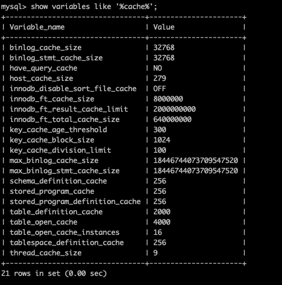

# MySQL服务端的系统变量操作

上回学习中，我们介绍了一些 MySQL 中的客户端命令行工具。今天，我们则回过来看一些服务端的操作，先从服务端的系统变量以及状态信息看起。

## 查看系统变量信息

对于系统变量信息来说，SHOW VARIABLES 这个命令相信大家不会陌生，这个命令就是用于在 mysql 客户端中查看系统变量的。如果直接使用这个命令，将会输出所有的变量信息，非常多，为了方便起见，一般我们会使用 SHOW VARIABLES LIKE 的方式查看。



既然是 LIKE 语句，那么 % 这个通配符也是完全支持的，所以上面我们测试的就是查的所有包含 cache 相关的系统变量信息。

接下来我们来学习一个命令行命令。

```sql
mysqld --verbose --help
```

它的作用是可以输出我们在客户端命令行中，就像使用 SHOW VARIABLES 命令所可以查看到的系统变量信息。除了这个命令之外，我们还可以使用 mysqladmin 来查询所有的系统变量信息。

```sql
mysqladmin variables
```

如果要像 SHOW VARIABLES LIKE '%log%'; 这样来过滤带有 log 关键字的信息，在命令行中就可以直接使用 grep 来实现。

```sql
mysqladmin variables | grep log
```

在这里需要注意的是，mysqladmin 查看系统变量信息返回的字段名称是以正常的下划线为分隔的，与 SHOW VARIABLES 返回的内容是一致的，而 mysqld 则是以中划线分隔字段名称的。

## 设置系统变量信息

变量变量，当然就是可以变化的量了，所以系统变量也是我们可以修改的值内容。并且很多相关的配置优化都是和这些变量有关的，比如说 max_connections 最大连接数之类的内容。

对于系统变量的修改，可以有两种方式，一种是服务启动时通过启动选项来指定变量参数，另一种则是在系统运行过程中在 mysql 客户端进行动态修改。这两部分的内容我们分开来看。

### 启动选项

在启动选项进行系统变量设置时，又可以分为两种方式，一种是在命令行启动时添加选项参数，如下面这种。

```sql
mysqld --max-connections=10
```

不过就像我们之前学习过的启动方式的文章中讲过的，一般情况下，我们很少会直接使用 mysqld 的方式来运行服务器程序。一般会通过 mysql.server 或者 systemctl 这一类的安全进程管理工具来启动数据库。因此，直接的命令行方式并不是很推荐。

相对来说，如果要修改这些系统变量的值，更加推荐的是直接使用 my.cnf 这个配置文件来进行配置。

```sql
[server]
max-connections=10
```

### 动态修改

除了在启动时设置变量之外，我们还可以在系统运行时直接设置一些系统变量，注意，是一些，或者说是大部分可以在系统运行时动态设置。

```sql
mysql> SET GLOBAL max_connections=20;
Query OK, 0 rows affected (0.00 sec)

mysql> show variables like '%max_connections%';
+------------------------+-------+
| Variable_name          | Value |
+------------------------+-------+
| max_connections        | 20    |
| mysqlx_max_connections | 100   |
+------------------------+-------+
2 rows in set (0.01 sec)
```

注意到我们设置的语法，在 SET 关键字后面多了一个 GLOBAL 关键字，它代表的是全局作用域，这部分内容我们将在下一小节说细说明。

有一些变量是完全只读的，甚至启动项和配置文件都无法修改，比如说 version 。

```sql
mysql> set GLOBAL version=10;
ERROR 1238 (HY000): Variable 'version' is a read only variable
```

### 作用域问题

在上面的设置语法中，我们会发现在 SET 关键字之后有一个 GLOBAL 关键字。其实完整设置系统变量的语法是这样的。

```sql
SET [GLOBAL|SESSION] 变量名=值;
```

GLOBAL 代表的是全局变量，也就是针对整个服务端运行环境都有效。而 SESSION 则是针对不同会话的。上面的 max_connections 变量是只有 GLOBAL 作用域的变量，所以在设置它的时候必须要加上 GLOBAL 。然而也有一些是全局和会话都包含的。

```sql
mysql> set autocommit=0;
Query OK, 0 rows affected (0.00 sec)

mysql> show variables like '%autocommit%';
+---------------+-------+
| Variable_name | Value |
+---------------+-------+
| autocommit    | OFF   |
+---------------+-------+
1 row in set (0.00 sec)
```

上面这个设置的是我们的事务是否自动提交的 autocommit 参数变量，在这个变量的设置中我们就没有使用 GLOBAL 和 SESSION 选项，它就是两种作用域环境都可以设置的变量。同样的，在 SHOW 语法中，其实也可以指定作用域范围。

```sql
mysql> show GLOBAL variables like '%autocommit%';
+---------------+-------+
| Variable_name | Value |
+---------------+-------+
| autocommit    | ON    |
+---------------+-------+
1 row in set (0.00 sec)

mysql> show SESSION variables like '%autocommit%';
+---------------+-------+
| Variable_name | Value |
+---------------+-------+
| autocommit    | OFF   |
+---------------+-------+
1 row in set (0.00 sec)
```

可以看出，在我们上面将这个变量关闭之后，只有 SESSION 作用域的内容是变成了 OFF ，也就是说，只有我当前这个客户端连接的 autocommit 是关闭的，你可以再新开一个客户端连接并查看 autocommit 属性，会发现默认新连上来的客户端还是 ON 的状态。其实从这里可以看出，SESSION 作用域是会继承自 GLOBAL 作用域的，并且如果是能够设置 SESSION 作用域的变量，默认情况下就是设置的 SESSION 作用域。

## 系统状态信息

除了系统变量之外，我们还会经常查看服务器的状态信息，这部分的内容不是我们可以修改的内容，因为它是在系统运行时生成的运行情况数据。对于许多监控软件，以及我们自己观察服务器来说，这些状态信息都非常重要，同样，它也有作用域的概念，所以语法是这样的。

```sql
SHOW [GLOBAL|SESSION] STATUS [LIKE '%xxx%']
```

其实整个语法和 SHOW VARIABLES 基本是一样的，只是把变量这个单词换成了 STATUS 而已。

```sql
mysql> SHOW STATUS LIKE '%thread%';
+------------------------------------------+-------+
| Variable_name                            | Value |
+------------------------------------------+-------+
| Delayed_insert_threads                   | 0     |
| Mysqlx_worker_threads                    | 2     |
| Mysqlx_worker_threads_active             | 0     |
| Performance_schema_thread_classes_lost   | 0     |
| Performance_schema_thread_instances_lost | 0     |
| Slow_launch_threads                      | 0     |
| Threads_cached                           | 0     |
| Threads_connected                        | 1     |
| Threads_created                          | 1     |
| Threads_running                          | 2     |
+------------------------------------------+-------+
10 rows in set (0.00 sec)
```

最主要的一点，就是要记住它和系统变量的区别，STATUS 状态信息的内容是不可以修改的哦！

## 总结

今天的内容比较简单，相信这两块的内容其实大家多多少少平时也都会接触到一些。对于 MySQL 的优化来说，选项参数以及配置文件中的配置参数相关的优化其实大部分都是在针对系统变量进行配置。当然，也有一部分配置选项并不是系统参数。但是核心的内容确实都和系统参数有着千丝万缕的联系。一个简单的入门，也是为以后的学习做个铺垫，免得将来在学习某些配置的时候连怎么设置和作用域都搞不清，基础永不过时。

参考文档：

[https://dev.mysql.com/doc/refman/8.0/en/server-configuration.html](https://dev.mysql.com/doc/refman/8.0/en/server-configuration.html)

