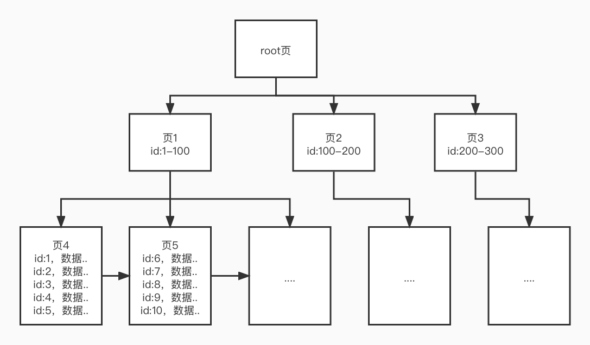
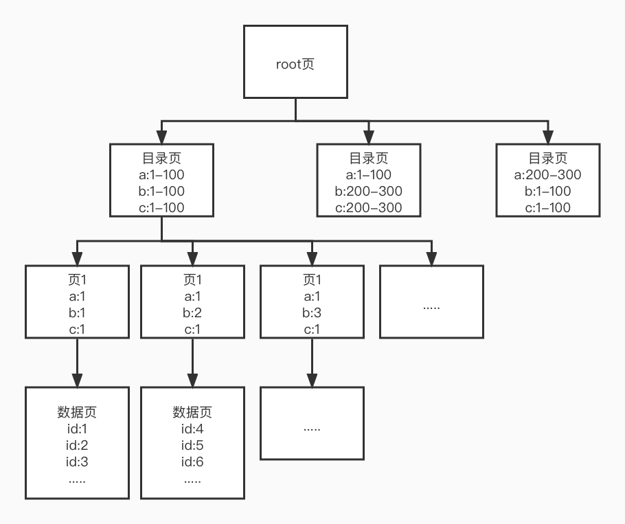

# MySQL索引与B+树的概念

要说到在数据库相关的知识中，最吸引人的是什么，估计 80% 以上的人都会脱口而出 索引 这个词。我们都知道，这玩意真的好用，非常方便，而且往往优化 MySQL 的第一步就是去建立索引。那么今天，我们就开始学习了解索引这一块的内容，首先当然还是与索引相关的概念。

## 索引

索引是什么意思？太多教程太多书都会讲到，最典型的例子，去图书馆找书。我们要在一个大型的图书管找一本书，怎么找呢？我们可以先问图书馆的工作人员，比如说找一本 MySQL 相关的书籍。他会告诉你在 电脑科技 相关的书架附近，然后你走到电脑科技区域，会发现有好几排书架，不过每个书架上又会写着 编程、操作系统、网络、办公软件、数据库 等标签。当然，有的书店不一定会把数据库这个分类单独放到一排书架上，所以你也可以到编程相关的书架下面去找。

好了，找到大范围的书架后，你就可以在书架前一本一本的看书名，最后找到你想要的书。

假设，我们假设一种情况，你去的是一个刚开业的书店，书籍还没有经过整理分类，这时候要找一本书，你就得一本一本地看过去。有什么想法？没错，这就是线性查找 O(n) 的时间复杂度。而像上面一样有分类区域，也有分类书架呢？至少是折半，甚至是 Log 级别，效率是不是一下就快了很多。

在数据库中，其实情况也是和上面类似的。一张没有任何索引的表中的数据，就像是胡乱摆放的书库，要找到一条数据你就需要一条一条的查找。数据少的时候问题不大，毕竟计算机的性能已经很强悍了，但是几百上千万甚至是上几十亿的数据，即使是最高配的计算机，也会逐渐产生性能瓶颈。而索引，就是根据指定的索引字段，建立相关的书架分类，让程序根据索引规则能够快速地查找到需要的数据。

生活中其实索引非常常见，我们说了书店，其实每本书的目录，你写的论文目录，公司的员工花名册，组织架构等等，都可以看作是索引。概念好理解，那么索引究竟是如何让我们的查找变快的呢？这就要说到它的数据结构了。

## B+树

但凡提到索引，必提 B+树 。之前我们在学习数据结构的时候，讲过树、二叉树，也提到过 B+树 ，但真正要讲这个东西，还是要放到 MySQL ，也就是数据库相关的知识中进行学习。B+树是由B树演化而来，而B树又是AVL平衡二叉树（二叉查找树）优化而来的。一切都源于我们之前学习过的数据结构与算法。

首先我们要明确的是概念是 页 这个关键词。对于索引的存储来说，都是存储在 页 这个结构中，它有页头，也有数据单元，但是，需要注意的一点是，在 InnoDB 这个存储格式中，只有主键索引最底层的页中会存储真实的数据信息。其它层次以及其它索引结构，最终存储的只是主键。因此，使用普通索引查到到的其实是主键，然后根据主键再去查找真实的主键索引中的数据。这个操作叫做 回表 。这个概念我们在之后讲覆盖索引的时候还会说到。

除了页之外，在页的上层还有段和簇（区）的概念，它们是页的上级节点。段的空间是无限的，底下是N多个簇，而一个簇里面有 64 个页。页在逻辑上和物理上都是连续的。再向上就是表空间以及物理文件，这些都不在我们的讨论范围内，有兴趣的同学可以自行查找相关的学习资料。

而在 MyISAM 存储格式中，主键索引和普通索引记录的都是数据位置，它的索引是和数据完全分开的，因此，任何索引都有回表操作。

索引页的格式就像下面的图一样。

我们有一个根节点，下面还有一层目录节点，一般来说目录节点会按顺序记录id范围，这个页在数据少的时候也是存放数据的，但是当数据填充满了之后，就会进行页分裂，将数据转而存储到下层页节点上，而当前页成为目录页也叫非数据页。这个目录页就变成了纯指针页，它只存放指向数据页的指针。在填充更多数据之后，就会出现新的一层。在最底层的是数据页，数据页一般存储 16k 的数据，按数据量来看一般最少2条数据。每个页都是和父子页以及兄弟页存在关联，其实内部就是链式存储的树结构。

当我们要查找一条数据时，比如我们查找 id 为 222 的数据，首先就是二分法快速定位到目录页，然后目录页中再二分法快速定位到数据页，最后在数据页中遍历获得真实的数据。索引查找到的是页，而不是具体的数据行，数据行是在页中遍历得来的。因此，索引查找的时间复杂度是 O(logn) + 页的 O(n)，只不过一个页只有 16k 的数据，所以页中的遍历查找非常快。而对于磁盘IO来说，两层的 B+ 树只需要两次IO。一般来说，三层的主键索引（聚集索引）在假设单行数据为 1k 的情况下，大概能存放 2000w 行左右的数据。所以一般 B+ 树的索引在2-3层的调试是比较常见的，最多四层也能容纳将近几十上百亿的数据量了。

关于页如何分裂，以及如何增加高度分层，原理就更为复杂了，但大体上的概念只要学过树相关概念的同学应该还是能够想明白的。主要就是类似于平衡二叉树的分裂，当元素达到页中元素上限时，将中间数据向上分裂。比如上限五个元素的五叉树，则： A、B、C、D、F，当有元素 E 插入时，会将 C 分裂到上层，形成 C 单独一层，通过 C 的指针指向下一层的 A、B、D、F 这样，并将 E 插入到 F 之前，D 之后，比 C 小的放在左子树，比 C 大的放在右子树。查找  B 元素时，根据 C 判断比 C 小，于是走左侧节点，找到 B 元素。大概原理是这样，但这一块已经大大超出我的能力范围了，所以有兴趣的同学可以自行查找更深入的资料哦。

上述内容就是一个主键索引的 B+树实现。注意，顺序很重要，不管是数字类型的索引还是字符串类型的索引，都会在 B+树 中进行排序，这个概念会影响到之后的 WHERE 条件优化以及 ORDER BY 相关的内容。毕竟它的查找是基于二分查找，而二分最重要的条件就是有序。之所以在某些情况下，ORDER BY 的速度也非常快，正是因为索引早就已经将数据排好了序。

普通索引的结构其实也是类似的，但是底层最后存储的不是真实数据，而是主键ID，这个我们就不单独说了，在这里我们再重点看的就是联合索引，也就是多个字段的索引是怎么建树的。

假设我们给 a、b、c 三个字段建立联合索引，那么它会一层一层的建立索引，也就是说，a 下面包含 b ，b 下面包含 c ，最后形成多键值组合排列的页节点。其实这也就是在数据库中最经常讲到的写 WHERE 语句要遵循 最左匹配 原则的原因。如果我们的查询条件能够按照顺序以 a->b->c 的形式查找，那么索引的利用率也可以达到最大，效率也是最好的。这种页节点很明显会占用更多的空间，因此，联合索引的 B+ 树的高度可能会比聚集索引要更高一些。

普通索引和联合索引最底层的数据页存储的都是主键id指针，同时在目录以及上层页也有存储这些字段自己的值，因此，如何只是查询索引相关的字段，就可以避免回表，比如 select a,b,c from t where a=1 and b=1 and c=1 。这个就是 覆盖索引 的概念，意思就是我们的索引正好覆盖了要查询的字段，同时它也是面试官经常会问的为什么不要使用 * 来查询的原因之一。而回表指的就是要到聚集索引中再查找一次，假设普通索引高度为3，聚集索引高度也为3，在普通索引中进行了3次查找，无法使用覆盖索引的话，就需要再去聚集索引进行3次查找，一共需要6次查找。当然，聚集索引的速度是非常快的。不过如果能做到覆盖，肯定还是尽量减少查找更好咯。

注意，覆盖索引默认就是包含主键的，因此在查询语句中出现主键字段是完全没问题的。

## 总结

今天的内容非常偏概念，但也非常有用，其实 B+树 的内容远不止我讲的这么简单，在页的基础上还有段的概念，还有页段的内部数据结构问题。这些内容可以大家有兴趣的可以参考更加详细的资料。

整体来说，其实有上面的内容我们就可以大概了解到数据库中的索引以及B+树是如何实现索引的。总之，索引以及相应的知识是我们学习 MySQL 绕不过去的一个坎，也是我们需要不断深入学习的内容，下一篇我们就来看看如何分析一条语句的索引情况。

参考文档：

《MySQL是怎样运行的》
