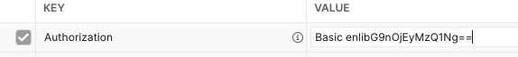

# Nginx学习：访问认证及过滤器模块

结束了 HTTP 核心模块的学习，我们就进入到了扩展模块，按文档顺序，我们先来了解的就是 访问限制 与 认证 相关的模块，此外，还有一个过滤模块。这几个模块还是非常有意思的，特别是过滤模块可以给返回的内容前后增加内容，非常像我们套模板时会分离出来的头尾模板一样。而认证类的则是 HTTP Basic 相关的内容，之前在学习 PHP 相关的小文章时也有过接触。总体来说，难度不大，赶紧玩起来吧。

今天所有的配置指令都可以配置在 http、server、location 模块下，遵循向上查找原则。

## 访问限制 Access 模块

ngx_http_access_module 模块，这个模块的功能和命令参数和 Apache 中的基本一样。通常 Apache 的配置中都会写上访问限制，Nginx 其实这一块用得少，先来看看配置的效果。

```shell
location /access/ {
  alias /usr/local/nginx/html/;
  allow 192.168.56.88;
  deny all;
}
```

`192.168.56.88` 是当前 Nginx 运行的虚拟机的 IP ，我的电脑主机的 IP 是 `192.168.56.1` ，这个配置的意思是禁止所有的访问，但允许 `192.168.56.88` 的访问。

直接从我的电脑主机访问 `http://192.168.56.88/access/` ，直接返回 403 错误。而在虚拟机上使用 curl 访问，就可以正常返回结果。这就是访问限制的作用。

访问限制也可以配置为 IPv6 地址，并且可以是 IP 段，也可以加上子网，比如官网给出的配置。

```shell
location / {
    deny  192.168.1.1;
    allow 192.168.1.0/24;
    allow 10.1.1.0/16;
    allow 2001:0db8::/32;
    deny  all;
}
```

这一段的意思就是禁止所有的 IP 访问，允许 `192.168.1.0`  及 `10.1.1.0` 和 `2001:0db8::` IP 段，但除了 `192.168.1.1` 。

需要注意的是，它是按从上到下的顺序进行匹配的，有一个符合了就返回。比如说上面我们的配置中，把 allow 和 deny 换个位置的话，那么当匹配到 deny all 时，所有的请求都会被打回，不会走到 allow 了。其实就和 Apache 一样，deny all 这种配置，一定要放到最后。

### allow

允许指定的网络地址访问。没有默认值。

```shell
allow address | CIDR | all;
```

### deny

拒绝指定的网络地址访问。没有默认值。

```shell
deny address | CIDR | all;
```

## HTTP 认证 AuthBasic 模块

还记得我们之前学习过的 **PHP的HTTP验证** [https://mp.weixin.qq.com/s/H8I1MSeqsuOn16lKXZ4Nrw](https://mp.weixin.qq.com/s/H8I1MSeqsuOn16lKXZ4Nrw) 这篇文章嘛？时间有点久了，不记得了也没关系，可以去复习下哦。当时，我们是通过 PHP 来实现的 HTTP 基础验证。其实，如果是固定的目录，那么这套东西都不需要用使用到 PHP 这种动态语言来实现，直接 Nginx 这边处理掉就好啦。

它的全名是 ngx_http_auth_basic_module 模块。要怎么配置呢？首先，我们需要生成一个 crpyt() 加密的密码，使用 openssl 命令就可以。

```shell
[root@localhost nginx]# openssl passwd 123456
5okRX5nWEJxew
```

然后，创建一个密码文件，我就在 Nginx 编译时指定的 /etc/nginx/ 目录下新建一个 conf 目录，然后放在这里面。

```shell
// /etc/nginx/conf
[root@localhost conf]vim htpasswd
zyblog:5okRX5nWEJxew
```

好了，帐号密码准备好了，直接去 Nginx 配置一个就行了。

```shell
location /authbasic/ {
  alias /usr/local/nginx/html/;
  auth_basic 'test';
  auth_basic_user_file conf/htpasswd;
}
```

一共就俩指令。一会再详细看它们的说明，先试试吧。

直接访问的话，会发现马上就返回了 401 错误。如果是这样的话，那就证明咱们配置的没问题。如果你是使用浏览器请求，那么会弹出一个用户名和密码的输入框，直接输入就好了。而如果是 Postman 测试的话，直接使用 Authorization 选择 Basic Auth 填上用户名和密码就行了。请求之后会发现多了一个请求头，像下图这样。



之前学习的时候我们就说过，这个 Basic Auth 是不安全的，Base64 就是一个编码，直接就能解码。`enlibG9nOjEyMzQ1Ng==` 解码后正是 `zyblog:123456` 。

接下来访问的话，会正常展示页面了。这就是整个 AuthBasic 模块配置的全部效果了，是不是非常简单方便。

### auth_basic

```shell
auth_basic string | off;
```

启使用“HTTP基本认证”协议的用户名密码验证。 指定的参数被用作 域 或者可以理解为就是起个名字。 参数 off 可以取消继承自上一个配置等级 auth_basic 指令的影响。

这个配置项其实是有点意思的，如果是个字符串，表明开启 AuthBasic 功能，这个字符串我们可以自己定义，如果是 off ，就相当于关闭。

假设在 server 模块中有个全局的 AuthBasic 配置，但我们想要某个访问 URI 不需要 AuthBasic 验证，就可以设置 auth_basic 为 off 。

```shell
auth_basic 'all';
auth_basic_user_file conf/htpasswd;
location /noauthbasic/{
  alias /usr/local/nginx/html/;
  auth_basic off;
}
```

这样，访问其它所有的页面路径时，都需要验证，但是只有 noauthbasic 相关的路径时，是不需要验证的。

### auth_basic_user_file

指定保存用户名和密码的文件。

```shell
auth_basic_user_file file;
```

没有默认值，文件就是一个文本文件。可以给相对路径，也可以给绝对路径。文件路径可以使用变量，文件内容的格式就是 `name：password` 这样的键值对。需要注意的就是密码是需要加密的。

另外，可以使用多个用户名和密码，每行代表一个用户。

## Request 验证模块

Request 验证模块是 1.5.4 版本之后所支持的。这个验证是什么意思呢？其实就是我们访问某个路径的时候，通过向另外一个 URI 发送一个请求，通过这个 URI 返回的结果来断定是否有权限，比如说子请求返回 200 系列的状态码，就表示有权限可以正常访问。而 401 或者 403 则会直接返回相应的无权限结果。除此之外的响应，都会返回 500 错误。

这个模块是需要单独添加编译的，在 configure 时添加 `--with-http_auth_request_module` 参数就可以使用了。一般它会配合 ngx_http_access_module、ngx_http_auth_basic_module、ngx_http_auth_jwt_module 以及在 HTTP 核心配置中学习过的 satisfy 配置指令来使用。访问限制的顺序是 acces、auth、auth_request，如果 satisfy 设置为 all ，则必须所有验证都通过，而如果设置 any 的话，只要有一个通过，后续就不会再进行限制了。

不过咱们学习的话，就简单的让子请求返回状态码就好啦。

```shell
location /authrequest1/ {
  alias /usr/local/nginx/html/;
  auth_request /authrequest/ok/;
}

location /authrequest2/ {
  alias /usr/local/nginx/html/;
  auth_request /authrequest/err/;
}

location /authrequest/ok/ {
   return 200;
}
location /authrequest/err/ {
   return 403;
}
```

访问 /authrequest1/ 和 /authrequest2/ 分别会发送子请求到 /authrequest/ok/ 和 /authrequest/err/ ，这两个子请求一个返回 200 ，一个返回 403 ，相应地，/authrequest1/  会正常返回页面，而 /authrequest2/ 则会显示 403 的错误页面。你也可以试试返回其它的状态码，看看会有什么效果。

请求验证可以帮助我们实现对资源的统一权限验证，这在微服务中非常有用，我们可以实现自己的权限认证服务，将所有的资源的请求都通过权限认证服务后再进行处理，提高了系统的安全性。但同时会增加请求的响应时间，因为此时每次请求都会发起两次http调用。好吧，说实话，这一段抄来的，但是确实说得没毛病，虽说我对微服务也是一知半解吧，但是感觉说得对。如果有有相关经验的小伙伴欢迎留言评论哦！

### auth_request

基于子请求的结果启用授权，并设置子请求将发送到的URI。

```shell
auth_request uri | off;
```

默认值是 off ，开启就是直接设置一个 URI 就好了。

### auth_request_set

在授权请求完成后，将请求变量设置为给定值。

```shell
auth_request_set $variable value;
```

没有默认值，它的值可以包含来自授权请求的变量，比如 $upstream_http_* 之类的。不过上面我没有测试，因为我也不知道咋测试。

## 过滤器 Addition 模块

这个过滤器模块听着名称很高大上吧？其实它就是可以针对响应内容，在响应内容的前后增加文本的一种过滤器。这里的文本指的其实是一个子请求返回的响应内容，也就是说，像上面的请求验证一样，它会发送一个子请求，但是这回不要状态码了，只要返回的响应内容。这个模块也是不直接包含在核心的 Nginx 基础源码中的，需要 configure 添加 `--with-http_addition_module` 进行编译安装。

先来看看效果吧。

```shell
location /additionbefore/ {
	alias /usr/local/nginx/html/;
}
location /additionafter/ {
	return 200 after;
}

location /addition/ {
  alias /usr/local/nginx/html/;
  add_before_body /additionbefore/aaa.html;
  add_after_body /additionafter/;
}


```

首先我们定义了两个路径，分别是 /additionbefore/ 表示在响应内容之前添加的文本和 /additionafter/ 表示在响应内容之后添加的文本。并且使用两种形式，一个是指定了目录别名，一会我们会用到指定目录下的文件，而另一个则是直接 return 回的文本。

接下来，在 /addition/ 中，分别使用 add_before_body 添加响应内容之前要添加的文本，使用 add_after_body 添加响应内容之后要添加的文本。

试试看吧，正常我们应该返回的 index.html 的内容中，前面多了 aaa.html 的内容，后面也多出了一段 after 字符。很有意思吧。给我个人的感觉，就像文章开头所说的，它非常像我们在套页面模板时，分出的 header.html 和 footer.html 这种东西。

### add_before_body

```shell
add_before_body uri;
```

在响应正文之前加入一段文字，nginx会发起一个子请求去获取这些文字。

### add_after_body

```shell
add_after_body uri;
```

在响应正文之后加入一段文字，nginx会发起一个子请求去获取这些文字。

### addition_types

指定生效的响应MIME类型，默认始终包含“`text/html`”。

```shell
addition_types mime-type ...;
```

它的默认值就是 text/html ，而且不管你设置什么值，它始终也会包含 text/html 。

这个配置是啥意思呢？我们前面的代码中没有演示。其实呀，它的意思就是，在默认情况下，只有 text/html 这种类型的响应可以使用 add_before_body 和 add_after_body 。比如下面这个配置，我们强制返回的响应 MIME 类型必须为 application/json 。types 相关的指令才刚学完没多久，大家没忘吧。

```shell
location /addition/json/ {
  types {}
  default_type application/json;
  add_before_body /additionbefore/aaa.html;
  add_after_body /additionafter/;
  #addition_types application/json;
  return 200 '[]';
}
```

如果不打开注释的内容，你会发现返回的结果是不会有前后添加的内容的。而打开注释，就会有前后添加的内容了。addition_types 的作用就在这里。

## 总结

说实话，今天学习的这些配置，平常真的用得不多。不过幸好在之前很多的学习中就接触过这些概念，所以理解起来也并不困难。一般来说，如果说我们线上的数据库必须要能够在外网访问，并且可以随时访问的话，可能大家都会考虑上个 phpMyAdmin 。而我则喜欢在 phpMyAdmin 的访问 location 上再加上一个 Basic Auth 验证。虽说可能作用不大，而且还是明文传输的吧，但是再配合上 https ，安全性还是略有保障的，至少不至于裸着就能被人访问到。

另外，在 Nginx 的商业版 1.11.3 版本之后还有 JWT 验证模块。不过商业版就不在我们的讨论范围内了，如果确实有 JWT 验证的需求，可以考虑 OpenResty 相关的实现。这个大家可以自己查阅下相关的资料哦，毕竟到目前为止，我也还没打算学 OpenResty 呢。

参考文档：

[http://nginx.org/en/docs/http/ngx_http_access_module.html](http://nginx.org/en/docs/http/ngx_http_access_module.html)

[http://nginx.org/en/docs/http/ngx_http_auth_basic_module.html](http://nginx.org/en/docs/http/ngx_http_auth_basic_module.html)

[http://nginx.org/en/docs/http/ngx_http_auth_request_module.html](http://nginx.org/en/docs/http/ngx_http_auth_request_module.html)

[http://nginx.org/en/docs/http/ngx_http_addition_module.html](http://nginx.org/en/docs/http/ngx_http_addition_module.html)

