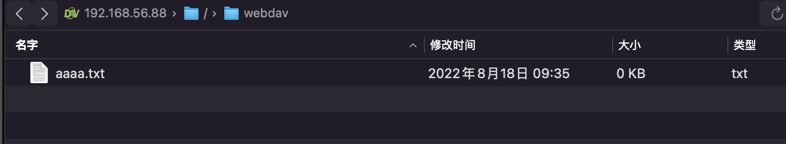
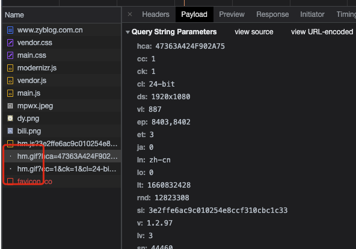
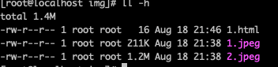
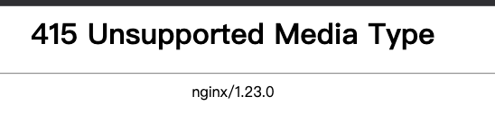

# Nginx学习：WebDav文件存储与图片媒体处理模块

今天的内容怎么说呢？有两个感觉非常有意思，另外一些就差点意思。有意思的是，咱们可以直接用 Nginx 的 Webdav 功能搭建一个网盘，另外也可以实现动态的图片处理。这两个功能吧，有其局限性，但也非常方便。另外的流媒体部分的内容，主要 FLV 和 MP4 这两种视频媒体格式的处理，说实话，没啥实际的内容，了解一下就好了。

## WebDav

关于 WebDav 是干嘛的，大家可以自己去百度一下。没学之前我也不知道这是个什么东西，我们学习，其实往往都是通过某一个点而延伸到其它方面的。比如说学习 Nginx ，一直强调的就是要有网络的基础。然后基于网络能干什么事呢？那可就太多了，Web 应用服务器只是 Nginx 其中的一个功能，而一个简单的基于 HTTP 的网盘，就只是它提供的一个核心功能中的小功能而已。

这个功能模块的命名是 ngx_http_dav_module ，它不是核心源码中的，所以是需要我们在编译的时候选装的。不过，在实际测试并且查询相关资料之后，发现原生的模块是有坑的，还需要再多将一个第三方模块才能更好地使用这个功能。在这里也不卖关子，先告诉大家要安装什么，怎么安装，然后再看每个指令，最后测试的时候再说到底为啥需要多装一个第三方模块。

首先我们要下载这个模块，直接 Github 去下载就好了，放在哪里都可以。

```shell
[root@localhost ~]# git clone https://github.com/arut/nginx-dav-ext-module.git
```

然后就是去源码包中进行编译安装，使用 `--add-module` 添加第三方模块。

```shell
[root@localhost nginx-1.23.0]# ./configure …………………… --with-http_dav_module --add-module=/root/nginx-dav-ext-module/
[root@localhost nginx-1.23.0]# make && make install
```

安装完成之后就可以使用了，我们先来看看 WebDav 模块中的配置指令有哪些，它们都可以配置在 http、server、location 模块下。

### create_full_put_path

允许创建所有需要的中间目录。

```shell
create_full_put_path on | off;
```

默认值是 off ，其实只要改成 on 的话，我们就可以自己创建新的文件夹，因为 WebDAV 规范只允许在已经存在的目录中创建文件。

### dav_access

为新创建的文件和目录设置访问权限。

```shell
dav_access users:permissions ...;
```

默认值是 user:rw 。意思就是用户可以有读写权限，这个其实和 Linux 的用户权限比较类似。不过一般我们操作的 WebDav 目录都会设置成和 Nginx 中的 user 配置指令一样的用户及用户组，比如我这里就是 www 用户和用户组，那么就是对于 www 用户来说的权限。如果指定了任何组或所有访问权限，则可以省略用户权限，比如直接设置 `group:rw all:r;` 就可以了。

### dav_methods

允许指定的 HTTP 和 WebDAV 方法。

```shell
dav_methods off | method ...;
```

默认值是 off ，表示拒绝所有的方法。这里的方法是什么意思呢？其实我们 HTTP 中的 Method 是一样的，但是 WebDav 的方法不是完全一样的。比如它支持配置的有：PUT、DELETE、MKCOL、COPY 和 MOVE。

从名字可以看出，PUT 是上传文件，它会被写入到临时文件中，然后文件被重命名。DELETE 就是删除，MKCOL 是创建文件夹，COPY 是复制，MOVE 就是移动啦。貌似和 RESTFul 有点像啊，一种方法代表一种意思。

从版本 0.8.9 开始，临时文件和持久存储可以放在不同的文件系统上。但是，请注意，在这种情况下，文件是跨两个文件系统复制的，而不是廉价的重命名操作。因此，建议对于任何给定位置，保存的文件和保存临时文件的目录（由 client_body_temp_path 指令设置）放在同一个文件系统上。 使用 PUT 方法创建文件时，可以通过在“Date”标头字段中传递修改日期来指定修改日期。

注意，要使用第三方模块的坑就在这里，一会我们就会说到。

### min_delete_depth

允许 DELETE 方法删除文件，前提是请求路径中的元素数量不少于指定数量。

```shell
min_delete_depth number;
```

默认值是 0 ，一般不太需要设置这个配置，为啥呢？假如，配置这个选项为 `min_delete_depth 4` 那么允许删除请求中的文件路径是这样的

```shell
/users/00/00/name
/users/00/00/name/pic.jpg
/users/00/00/page.html
```

而下面这种是不能删除的。

```shell
/users/00/00
```

是的，就是说只能删除几层目录。0 就表示一层就可以删，这是比较符合我们日常的习惯的。

### WebDav 测试

就四个配置指令，不多吧，但是我们在实际的配置中还会用到其它的一些配置。

```shell
location /webdav/ {
    root                  /usr/local/nginx/html;
    autoindex on;

    client_body_temp_path /tmp;

    dav_methods PUT DELETE MKCOL COPY MOVE;
    dav_ext_methods PROPFIND OPTIONS LOCK UNLOCK; # DAV扩展支持的请求方法

    create_full_put_path  on;
    dav_access            group:rw  all:r;

		auth_basic "webdav";
		auth_basic_user_file /etc/nginx/conf/htpasswd;

    #limit_except GET {
    #    allow 192.168.56.0/32;
    #    #deny  all;
    #}
}
```

上面的配置中，我们为 /webdav/ 这个目录设置一个 location ，注意，目录要创建好哦，要不和普通页面一样会一直 403 的。然后就是我们学过的 root、autoindex、client_body_temp_path ，不用多解释了吧，autoindex 上篇文章刚学，主要是为了展示我们用浏览器也可以看到文件变化。

接着，我们就配置了 dav_methods 和 dav_ext_methods 两个指令。dav_ext_methods 是啥？它正是我们所安装的第三方模块中带的配置指令。默认情况下，自带的 ngx_http_dav_module 模块中，dav_methods 只能设置上面说的那五个指令，但是在我的实际测试中，比如使用 Mac 访达的【前往】->【连接服务器】进行连接时，会发送下面这样一请求。

```shell
192.168.56.1 - - [17/Aug/2022:20:46:19 -0400] "OPTIONS /webdav/ HTTP/1.1" 405 157 "-" "WebDAVLib/1.3"
```

注意，它的请求方法是 OPTIONS ，不在自带的那五个方法之中。因此，我们需要扩展模块来实现对一些扩展方法的支持，否则，这个请求就会一直返回 405 状态，客户端自然也就连不上。

接下来，设置 create_full_put_path 为 on ，设置权限为 `group:rw  all:r;` ，基本就是常规的全给权限的操作了。

再往下，又是我们前面学过的访问认证的两个命令，使用的也是之前我们设置过的用户名和密码文件。

好了，使用 Mac 的话你就可以使用 Finder 的 【前往】->【连接服务器】来试试连接了，要输入用户名或密码的话直接输入 auth_basic 中有的用户名和密码就可以了。如果你是 Windows 电脑，也是一样在通过文件夹中的远程访问工具就可以打开了。

不过，使用这些操作系统原生的文件系统工具，你会发现一个问题，那就是我们没办法创建文件或目录，也没办法拖一个进去。这主要是因为它们不支持上面那五个完整的 WebDav 方法。所以我们需要去安装一些支持 WebDav 的工具，比如我在 Mac 的应用商店中找到的一个免费的 FE File Explorer 软件，直接安装后，选择创建一个新的 WebDav 连接，然后填入 URL 地址以及帐号密码就可以操作了。



好了。现在这个网盘已经可以使用了。不过大家也可以试一下，如果不用 auth_basic 会怎么样？注释掉那两行并重载 Nginx 的话，咱们其实还可以使用 Linux 的用户登录，比如我这里只有 root 用户，那么我们就可以用 root 的帐号和密码进行登录，一样的可以进行文件操作。

另外，在这个 location 中，还可以通过之前学过的 limit_except 指令来进行访问限制，这样如果真是的在外网暴露出来当做网盘的话，也可以更进一步地增加安全性。同时，还可以配置 https 来通过 https 进行连接传输。

不过话说回来，真正要弄一个自己个人的网盘的话，还是买个大的硬盘和一个好点的路由，直接插上吧，毕竟家里电脑搭一个还费更多的电呢~

## 空图片 empty_gif

空图片？这又是啥？其实呀，并不是一个完全的空图片，而是一个只有 1 个像素的，并且这个像素还是透明的一张 GIF 图片。

```shell
location /emptygif/ {
  empty_gif;
}
```

试试访问 /emptygif/ 或者这个路径下的任意子路径或文件，返回的都是一个啥也看不到的 GIF 图片，使用下载工具的还能下载下来，并且真的是一张图片。

那么，要这个东西干嘛呢？如果你接触过大数据技术的话，其中有一种埋点上报方式就是前端直接请求一个类似于这种形式的空图片，然后将埋点数据带到 GET 参数中。然后大数据相关的工具来分析 Nginx 的 access_log ，提取其中的 GET 参数进行数据分析。

有一个最典型的例子，就是百度统计。



看到没有，大家从百度统计中获取到的那段统计代码，会加载一个 hm.js 的远程 JS 文件并运行里面的代码。然后在这个文件中，会收集客户端浏览器的很多信息，并拼接成 GET 参数，最后再使用这些参数请求一下 hm.gif 这个 empty gif 图片。

这么做有什么好处呢？这是一种纯静态，不需要数据库，可以支撑超高并发量的收集数据的一种方式。虽说百度的这张图片返回的响应头显示的服务器是 Apache 吧，但用 Nginx 也是一样的。我们不需要后端程序，也不用将这一堆参数放到数据库，甚至连缓存都不用，就直接使用 Apache 或者 Nginx 自带的这种访问日志的功能，就可以收集到这些海量的请求数据了。要知道，普通单台 Nginx 的并发量最差最差的配置都是可以达到几万级别的。

### empty_gif

返回一个透明像素的GIF图片。

```shell
empty_gif;
```

没有配置值，也不需要配置值，只能配置在 location 下面。

## 图片过滤 ImageFilter

还记得之前我们在 PHP 的文章和视频中学过的 GD 库、ImageMagick 和 GMagick 这些内容嘛？如果不记得的小伙伴就去公众号或者我的博客搜索哈，也有对应的标签可以快速地找到。

没错，图片过滤模块就是可以像上面说那些 PHP 中的功能一样，方便快捷地对图片进行一些简单的处理。功能没有动态语言的强大，但是提供的配置指令说实话也够用了。它的全名是 ngx_http_image_filter_module ，需要独立安装，在 configure 中添加 --with-http_image_filter_module 就可以了。此外，它还需要操作系统中有 libgd 库的支持，因此，我们还需要安装 GD 库组件。

```shell
yum install gd gd-devel
```

这一个模块，我们根据配置指令的说明，同步地一个一个地测试。除了 image_filter 只能配置在 location 下之外，其它的都可以配置在 http、server、location 中。在此之前，我们还需要准备好一个 img 目录和图片文件。



原始的图片文件是这样的。


### image_filter

设置图像变换的操作。

```shell
image_filter off;
image_filter test;
image_filter size;
image_filter rotate 90 | 180 | 270;
image_filter resize width height;
image_filter crop width height;
```

好多配置选项呀，默认是 off 也就是关闭的。它决定了后面我们其它的指令是否可用，也就是说，如果是 off 状态，那么其它相关的配置指令也都不会起作用。

在这些配置参数中，test 和 size 是单独使用的，后面三个可以配合使用。这是啥意思？先看解释，最后再说。

- test 确保应答是 JPEG ，GIF 或 PNG 格式的图像。否则错误 415 (Unsupported Media Type) 将被返回。

```shell
location /img/ {
 #image_filter test;
}
```

如果正常访问上面的路径，我们可以打开 index.html ，本身这就是一个正常的 html 页面嘛。但是如果开启上面的注释，再次访问 index.html ，就会发现返回 415 错误了。




- size 以JSON格式返回图像信息。

```shell
location /img3/{
  alias /usr/local/nginx/html/img/;
  image_filter size;
}
```

访问 /img3/1.jpeg 和 /img3/2.jepg 会返回这样的内容。

```shell
http://192.168.56.88/img3/1.jpeg
{
    "img": {
        "width": 1920,
        "height": 1200,
        "type": "jpeg"
    }
}

// http://192.168.56.88/img3/2.jpeg
{
    "img": {
        "width": 4878,
        "height": 3215,
        "type": "jpeg"
    }
}
```


- rotate 将图像逆时针旋转指定角度，参数的值可以包含变量。可以单独使用，或与 resiz 和 crop 变换同时使用。
- resize width height 按比例缩小图像至指定大小。 如果想只指定其中一维，另一维可以指定为： - 。 如果有错误发生，服务器会返回 415 (Unsupported Media Type). 参数的值可以包含变量。 当与 rotate 参数同时使用时, 旋转发生在缩放之后。

```shell
location /img1/ {
  alias /usr/local/nginx/html/img/;
  image_filter resize 300 300;
  image_filter rotate 90;
  error_page 415  /emptygif/;
  error_page 404  /emptygif/;
}
```

我们直接测试 rotate 和 resize ，注意，rotate 是只能和 resize 或 crop 之一配合。它是旋转，另外两个都是改变大小。在这个配置中，我们会对图片进行等比例缩放，注意，并不是图片直接变成 300*300 而是根据长宽大小，选择合适的长或宽，缩放到长宽都不超 300 的界限。这两个值也可以设置成不一样的，以小的为准。看看图片的效果是啥样。


是不是有点意思了，有 ImageMagick 的感觉了吧。另外在这个路径的配置中，我们还加入了 error_page ，让 415 和 404 的错误都指向上一小节学习到的 empty_gif 模块中，这样就不会出现前面的 415 错误页面啦。

- crop width height 按比例以图像的最短边为准对图像大小进行缩小，然后裁剪另一边多出来的部分。 如果想只指定其中一维，另一维可以指定为： - 。 如果有错误发生，服务器会返回 415 (Unsupported Media Type). 参数的值可以包含变量。 当与 `rotate` 参数同时使用时, 旋转发生在裁剪之前。

  ```shell
  location /img2/ {
    alias /usr/local/nginx/html/img/;
    image_filter crop 500 300;
    #image_filter_jpeg_quality 95;
    #image_filter_sharpen 10;
  }
  ```

  注意，这个是裁剪了，指定的宽高是多少，裁剪出来的图片大小就是多少了。下面注释的指令我们马上就讲。

对于后面三个参数来说，如果你在有这三个参数的 location 中同时加入了 test 或者 size ，它们的缩放、旋转、裁剪效果马上就无效了。大家可以自己试试哦，这就是前面说的不兼容的问题。另外 crop 和 resize 放一起会是什么效果呢？会以最后设置的为准。

### image_filter_buffer

设置用来读图像的缓冲区的最大值。

```shell
image_filter_buffer size;
```

默认值是 1M ，访问我们上面第二张图片 2.jpeg ，它的大小超过 1M 了，正常情况下会返回 415 错误，这时我们就可以设置 image_filter_buffer ，调大之后就可以访问了，我们可以将它放在 http 或者 server 下面，这样我们上面测试的那些路径就都可以打开第二张图片了。

### image_filter_interlace

启用图像隔行扫描的。

```shell
image_filter_interlace on | off;
```

默认值是 off ，只对 JPG 图片有效果。这个其实我们原来也说过，就是 JPG 图片在网页呈现有两种方式，一个是一行一行的出现，一个是先模糊后清晰的。这个在 PhotoShop 导出 Web 格式图片时可以设置。不过我这里没装，所以也不多做演示了。直接配置针对我从网上找到的这两张图片也没啥效果。

### image_filter_jpeg_quality

设置变换后的JPEG图像的质量。

```shell
image_filter_jpeg_quality quality;
```

默认值是 75 ，在上面 crop 的设置中有注释，大家可以打开，设置成 1 看看效果就明白什么意思了。大家应该了解过，JPG 是压缩格式的图片，我们在 PhotoShop 导出时也可以对 JPG 格式图片设置压缩比，这个值越小，图片越小，但越不清楚。这个值越大，图片大小也越大，图片也越清楚。它只对 JPG 图片有效果，并且是 resize、rotate、crop 操作之后的 JPG 图片，其它格式无效。

### image_filter_sharpen

增加最终图像的清晰度。

```shell
image_filter_sharpen percent;
```

默认值是 0 ，也就是不做操作。其实就是图形工具中的锐化工具，同样可以在上面 crop 中打开注释进行测试，和 image_filter_jpeg_quality 的要求一样，不过可以不只是 JPG 图片。

### image_filter_transparency

定义当对PNG，或者GIF图像进行颜色变换时是否需要保留透明度。

```shell
image_filter_transparency on|off;
```

默认值是 on ，损失透明度有可能可以获得更高的图像质量，PNG图像中的alpha通道的透明度默认会一直被保留。我没有测试，大家可以自己试试哈。

### image_filter_webp_quality

设置转换后的 WebP 图像的所需质量。

```shell
image_filter_webp_quality quality;
```

和 image_filter_jpeg_quality 类似，只不过它针对的是 WebP 格式的图片。这种图片格式现在也比较流行了，可接受的值在 1 到 100 的范围内。较小的值通常意味着较低的图像质量和较少的数据传输。参数值可以包含变量。

### 一个好玩的小例子

最后，我们再来做一个小例子。很多云存储比如 阿里云的OSS、七牛云、UpYun 的存储功能中，都有一项是可以动态改变图片的大小，比如等比例缩放或裁剪等，只需要我们在请求图片的 URL 后面加上参数就可以，比如说七牛：http://xxxx/1.jpg?imageView2/1/w/200/h/200。大部分情况下，如果我们自己实现，可以借助 PHP 配合 ImageMagicK 来达到同样的效果。但是在学完上面的内容之后，大家是不是马上就想到了，通过 Nginx 也可以实现呀。

```shell
location /img4/ {
  alias /usr/local/nginx/html/img/;
  if ($arg_w = "") {
  	set $arg_w '-';
  }
  if ($arg_h = "") {
  	set $arg_h '-';
  }
  image_filter resize $arg_w $arg_h;
  image_filter_jpeg_quality 95;
}
```

直接将 resize 的值设置成变量就可以啦。现在访问 /img4/1.jepg ，然后加上参数 ?w=400&h=150 看看效果吧。是不是很有意思，像这样简单的处理，其实都不需要我们单独去安装 ImageMagicK 以及相应的 PHP 扩展了。

## FLV 文件

ngx_http_flv_module 模块，为Flash Video(FLV)文件 提供服务端伪流媒体支持。这个模块需要 --with-http_flv_module 编译安装，不是核心源码中的。

### FLV

为Flash Video(FLV)文件 提供服务端伪流媒体支持。

```shell
flv;
```

通过返回以请求偏移位置开始的文件内容，该模块专门处理在查询串中有 start 参数的请求, 和有预先设置到FLV头部的请求。只能在 location 中设置。

不知道咋测试，所以大家了解一下就好了。

## MP4 文件

和上面那个 FLV 的模块是一样的，全名是 ngx_http_mp4_module 模块。为H.264/AAC文件，主要是以 `.mp4`、`.m4v`、和`.m4a`为扩展名的文件， 提供伪流媒体服务端支持。

伪流媒体是与Flash播放器一起配合使用的。 播放器向服务端发送HTTP请求，请求中的查询串是以开始时间为参数的(以 `start`简单命名)，而服务端以流响应，这样流的开始 位置就能于请求中的时间相对应。 例如：

http://example.com/elephants_dream.mp4?start=238.88

这样就允许随意拖放，或者从节目的中途开始回放。

为了支持随机访问，H.264格式将元数据放到所谓的"moov atom"中。 "moov atom"是文件的一部分，放有整个文件的索引信息。

为了开启回放，播放器首先需要读取元数据。 这是通过发送一个特别的以`start=0`为 参数请求来完成的。 许多编码软件会将元数据插入到文件末尾， 这样做对伪流媒体来说是不好的： 元数据需要在文件开始时定位好，否则整个文件需要下载完才能开始播放。 如果文件组织的很好（将元数据放到文件开头），那么nginx仅仅返回文件的内容， 否则，nginx不得不读取文件并准备一个新的流，将元数据放在媒体数据前面， 这将导致一些CPU，内存，磁盘I/O开销。 所以一个比较好的主意是 为伪流媒体准备文件 ， 而不是让nginx处理请求时做。

对于匹配有非零 `start` 参数的请求，nginx从文件中读取元数据，从请求的偏移位置开始准备流数据 发送给客户端。 这与上面描述的情况有同样的开销。

如果匹配的请求没有包含 `start` 参数，就不会有额外开销，而文件仅仅是以静态资源被发送。 一些播放器也支持字节范围请求，所以就根本不需要这个模块。

这个模块默认是不安装的，需要通过 --with-http_mp4_module 来配置开启。

### mp4

配置开启该模块处理当前路径。

```shell
mp4;
```

只能定义在 location 当中。

### mp4_buffer_size

设置处理MP4文件的初始内存大小。

```shell
mp4_buffer_size size;
```

默认值是 512K 。

### mp4_max_buffer_size

在处理元数据时，可能必需较大的缓存。 它的大小不能超过 size 指定的值， 否则 Nginx 将会返回服务器错误。

```shell
mp4_max_buffer_size size;
```

默认值是 10M ，返回的是 500 错误，并记录日志，日志格式是这样的：

```shell
"/some/movie/file.mp4" mp4 moov atom is too large: 12583268, you may want to increase mp4_max_buffer_size"
```

## 总结

怎么样，WebDav 和  ImageFilter 功能都是非常有意思的吧。流媒体这一块的确实是不知道要怎么测试。因此，也就没有更加详细的介绍了。如果有了解的小伙伴也希望评论留言一起学习哦。

下篇文章开始，我们要学习一个非常重要的子模块，那就是 FastCGI 相关的模块配置。

参考文档：

[http://nginx.org/en/docs/http/ngx_http_dav_module.html](http://nginx.org/en/docs/http/ngx_http_dav_module.html)

[http://nginx.org/en/docs/http/ngx_http_empty_gif_module.html](http://nginx.org/en/docs/http/ngx_http_empty_gif_module.html)

[http://nginx.org/en/docs/http/ngx_http_image_filter_module.html](http://nginx.org/en/docs/http/ngx_http_image_filter_module.html)

[http://nginx.org/en/docs/http/ngx_http_flv_module.html](http://nginx.org/en/docs/http/ngx_http_flv_module.html)

[http://nginx.org/en/docs/http/ngx_http_mp4_module.html](http://nginx.org/en/docs/http/ngx_http_mp4_module.html)
