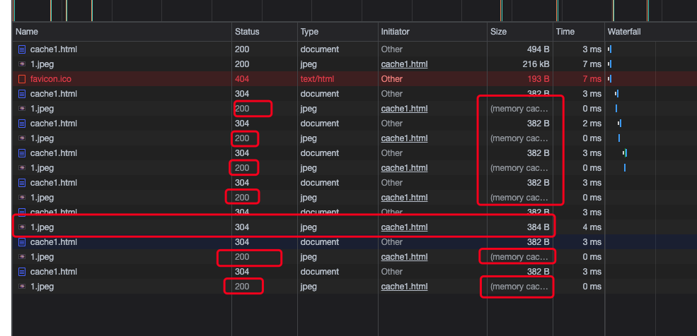

# Nginx学习：响应头与Map变量操作

响应头是非常重要的内容，浏览器或者客户端有很多东西可能都是根据响应头来进行判断操作的，比如说最典型的 Content-Type ，之前我们也演示过，直接设置一个空的 types 然后指定默认的数据类型的值，所有的请求浏览器都会直接下载。另外，我们现在在做前后分离的开发时，也经常会通过头信息来传递一些标志参数，那么自定义响应头的作用就更加重要了。另外一个 Map 部分则是 Nginx 中的一种变量设置方式，话不多说，直接开始吧。

今天学习的内容响应头部分都是可以设置在 http、server、location 中的，有特殊情况的我会单独说。而 Map 部分则都是只能在 http 中进行配置。

## 响应头

在 Nginx 中，响应头模块就是 ngx_http_headers_module 模块。总共就三个配置指令，其实并不复杂。而且相信期中两个指令大家都至少是见过的。除了可以添加自定义的响应头之外，在这个模块中还有一个非常重要的内容就是 HTTP 的 Expire 缓存设置。在最后，我们将会统一进行一个测试，先来看看响应头模块中的三个配置指令。

### add_header

如果响应代码等于 200、201 (1.3.10)、204、206、301、302、303、304、307 (1.1.16、1.0.13) 或 308 (1.13)，则将指定字段添加到响应标头。

```shell
add_header name value [always];
```

默认值没有，但是 Nginx 会默认帮我们添加一些响应头，比如说 Server 显示  Nginx 版本号的，还有 Content-Type 这个标准响应头。它可以参数值可以包含变量，最后的 always 表示忽略上面的那些状态码，任何响应都返回这个响应头。

我们可以定义多个响应头，如果当前的作用域中没有定义，那么会从上一级继承。

如果是空的内容，这个响应头不会返回。

### add_trailer

如果响应代码等于 200、201、206、301、302、303、307 或 308，则将指定字段添加到响应的末尾。

```shell
add_trailer name value [always];
```

它的用法和 add_header 是一样的，但是不好测，据说是用在分段响应上的。不过我们之前在 **Nginx学习：HTTP核心模块（十二）内嵌变量**[]() 中讲过一个 `$sent_trailer_[name]` 变量，大家还记得吧？它可以获取到响应尾所添加的内容，然后我们就可以输出到日志中。当时已经做过测试啦，这里就不再重写了。

### expires

如果响应代码等于 200、201 (1.3.10)、204、206、301、302、303、304、307 (1.1.1)，则启用或禁用添加或修改“Expires”和“Cache-Control”响应头字段。

```shell
expires [modified] time;
expires epoch | max | off;
```

默认值是 off ，也就是关闭的，任何响应都不会返回 Expire 和 Cache-Control 响应头。这个呀，其实就是 HTTP 中的 Expire 和 Cache-Control 的基础知识相关的配置。比如我们查看一些网站的请求时，会有一些静态资源比如 js 文件、图片之类的，会返回 200 响应，但是后面还会跟着一个 from memory cache 或者 from disk cache 。这种就是使用了 Expire 或 Cache-Control 缓存，在缓存有效时间之内，都会直接从本地读取缓存，不会发送请求。

和 Last-Modified 以及 Etag 的区别就是，这两个以文件的修改为主，真的会发一个请求到服务器，服务器判断没修改之后再返回 304 。而 Expire 和 Cache-Control 连请求都不会发，必须强制刷新或者让浏览器不使用缓存。而且直接请求 URL 看不到效果，需要是静态页面中通过 src 加载的内容才会走这个缓存。Expire 比较老一些，新的是 Cache-Control ，所以两个同时存在时会走 Cache-Control 。不过 Nginx 中这个配置指令会一起设置。

好了，点到为止，还不太清楚的小伙伴可以继续查阅相关资料哦。

正常来说，这个 time 是要过期的时间长度，比如 10 秒后过期写 10s 就好了。没错，是当前时间加上 expires 设置的时间。如果使用 modified ，则是当前访问路径的文件的修改时间加上 expires 的时间。注意，服务端和客户端的时间要一致，比如我之前测试时，服务端虚拟机的时间比我的电脑慢了3分钟，设置 10s 的缓存就一直都不会生效。

我们也可以通过 @ 符号指定一个时间。

```shell
expires @15h30m;
```

这样就是指定当天的 15 点 30 分过期。

expires 还会影响到 Cache-Control 的值。

- 如果设置一个负数的话，Cache-Control 会设置 no-cache ；
- 如果设置为非负数，包括 0 的话，Cache-Control 的 max-age 会等于这个数值；

而真正的 Expire 响应头，则是具体的 GMT 时间值，也就是当前时间加上 expires 指定后的具体时间。

设置为 epoch 参数，则表示永远不缓存，对应的头信息为 “Expires” 设置成 “Thu, 01 Jan 1970 00:00:01 GMT” 而 “Cache-Control” 会设置成 “no-cache” ；设置为 max 参数则表示永远不过期，“Expires” 设置成 “Thu, 31 Dec 2037 23:55:55 GMT” 而 “Cache-Control” 会设置成 10 年。

最后一个参数的值，可以是一个变量。

### 响应头测试

好了，就这三个配置指令，不多吧。但是，如你对 HTTP 的基础知识真的都不清楚的话，那就没别的办法了，先自己测试一下，明白是什么意思，然后赶紧去恶补一下吧。

我们先写个 location 方便测试。

```shell
location /headers/ {
	alias html/;

  add_header PPOP abc$uri;
  add_header GET_VALUE $arg_a;
  
  add_trailer op def$uri;
  access_log logs/params2.log vvv;

  expires 10s;
  add_header Cache-Control public;
}
```

通过 alias 还是指向了 html  这个根目录，主要是我比较懒，不想多建目录啦。然后 add_header 的大家自己测试一下吧，看看响应头会不会返回数据。注意第二个，我们是接收的 `$arg_[name]` 这种形式的变量参数哦，如果不传变量看看会不会有响应头返回回来。

然后就是 add_trailer 的测试，上回我们只是大概说了下，这回还是再简单的看一下。在 location 中，我们将访问日志 access_log 配置为一个新的日志目录文件了，并且指定了日志格式是 vvv 。然后我们需要再到 http 中添加一个配置。

```shell
// http 下
log_format vvv op_trailer=$sent_trailer_op;
```

这个配置指令后面我们学习日志模块时会详细地再学习，现在先这么配就好了。然后访问请求之后，就可以在日志文件中看到信息了。

```shell
// params2.log
………………
op_trailer=def/headers/index.html
………………
```

好了，最后的重点，就是对于 expires 的测试了。我们需要先创建一个静态文件，然后加载一张图片。注意，图片路径我也是走的上面配置的 headers 这个 location ，直接走 /img/ 目录是不行的哦，因为我们的 expires 是配置在这个 location 当中了。

```shell
// cache1.html
222111

```

然后开始请求访问，并多次刷新。我们测试的 10s ，需要注意测试机与当前主机的时间同步问题。另外，还添加了一个 Cache-Control 头设置为 public ，这个有啥用大家也可以自己查下哦，都是基础知识。不用设置它也可以。



注意看，第一次是 200 正常响应，然后中间几次也是 200 ，但后面有了一个 memory cache 的标志了。查看 Nginx 的 access_log ，也不会看到这些请求，说明真的是没有发请求。然后 10s 后，再请求一次，会发现返回了一个 304 ，这是 Last-Modified 在起作用。同时，Expire 也被更新了。之后的请求又开始 memory cache 了。

看到了吧，这就是静态资源的多级缓存。在架构设计中，缓存前推中最重要的就是 HTTP 的这两块缓存，是非常重要的理论知识，而且也是非常容易就通过配置能够实现的理论实践，大家可以赶紧应用在自己的项目中哦。好处嘛，减少流量带宽占用，毕竟现在流量费也挺贵的，好吧，你不担心流量费，但至少 access_log 文件还能小点是不是。

ps.去看看京东、淘宝、网易、新浪这些大网站是怎么设置过期时间的哦，大部分图片可能都是 max ，而 js、css 之类的则可能会比较短哦。

## Map变量

之前我们学过的都是 Nginx 提供的系统变量，这一次，我们要自己设置变量啦。在 Nginx 中，目前可知的设置变量的方法有三种，分别是 set 指令、map 指令和正则方式。正则就是匹配之后那个 `$1` 这种。

set 指令我们后面再说，今天先来看看 map 模块相关的指令。

### map

Map 模块 ngx_http_map_module ，它可以创建变量，但是，它的值是取决于另外一个变量的。什么意思呢？我们先来看看这个指令的介绍。

```shell
map string $variable { ... }
```

这参数有点怪呀，第一个 string 表明要进行判断的值。第二个参数就是我们要创建的变量名称。后面花括号中的内容是对于那个 string 的匹配结果。来看一个例子。

```shell
map $arg_a $a {
   default 0;
   aaa 1;
   ~.*aaa 2;
   aaa* 3;
   bbb 1;
   ccc 2;
}

server {
  listen 8088;
  root html;

  location / {
    if ($a = 1) {
    	return 200 aaa$a;
    }
    if ($a = 2) {
    	return 200 bbb$a;
    }
  return 200 $a;
}

```

注意，map 要放在 http 下面哦，不能在 server 或 location 中。

在 map 中，我们设置了第一个参数是 `$arg_[name]` 这个变量，这样我们就可以通过 GET 参数 a 来传递值。第二个参数是赋值之后的变量名。

花括号中的内容是匹配规则，可以看到 default 表示默认值，aaa 是普通匹配，~.*aaa 是正则匹配。意思就是，请求中有一个 GET 参数是 a ，并且参数的值是 aaa ，那么 `$a` 的结果就是 1 ；如果是 xaaa ，那么 `$a` 就是 2 ；如果是 aaa\* 结果值就是 3 ，注意，这个 \* 没有特别含义的，目前状态下是不能进行通配的；其它两个不用说了吧；如果不匹配，或者没有这个 GET 参数的话，返回 0 。

然后在下面的 location 中，如果 `$a` 的值是 1 ，那么返回的结果前面加上 aaa ，如果是 2，结果前面加上 bbb ，其它情况直接返回 `$a` 的值。

来测试一下吧。

```shell
[root@localhost ~]# curl http://127.0.0.1:8088/
0
[root@localhost ~]# curl http://127.0.0.1:8088/?a=aaa
aaa1
[root@localhost ~]# curl http://127.0.0.1:8088/?a=waaa
bbb2
[root@localhost ~]# curl http://127.0.0.1:8088/?a=ccc
bbb2
[root@localhost ~]# curl http://127.0.0.1:8088/?a=ddd
0
```

看出效果了吧，是不是感觉似曾相识？没错，不要怀疑自己，这就是编程语言中的 `switch` 。

第一个参数是一个 string ，你也可以写一个固定的字符串，但是那样就没意义了。因此，map 通常都会配合系统提供的变量来进行操作，比如官网的例子。

```shell
map $http_host $name {
    hostnames;

    default       0;

    example.com   1;
    *.example.com 1;
    example.org   2;
    *.example.org 2;
    .example.net  3;
    wap.*         4;
}

map $http_user_agent $mobile {
    default       0;
    "~Opera Mini" 1;
}
```

第一个例子是对 Host 请求头进行匹配，返回 `$name` 值。注意，这里的 \* 是可以通配的，因为这是针对主机名的匹配，其实走的是主机掩码，就是域名那一套，比如泛解析的掩码通配。可以加上一个 hostnames 参数，就可以实现对主机名的通配，这个 hostnames 需要放在最上面。

第二个例子可以用于判断浏览器类型，比如说现在最常用的判断是否移动端，或者判断是否是微信客户端，然后通过这个变量就可以配合 if 指令进行跳转，高大上吧！

花括号中，除了匹配规则、default 和 hostnames 之外 ，还有两个特殊的参数，include 和 volatile ，前者可以包含一个带有值的文件。可以有多个。后者可以表示该变量不可缓存。

另外，如果正则、hostnames、还有普通匹配同时匹配到了怎么办呢？那就是优先顺序的问题了嘛。

- 普通字符串值最高
- 前面带 \* 通配掩码的，比如：\*.example.com
- 后面带 \* 通配掩码的，比如：mail.\*
- 第一个匹配的正则表达式（在配置文件中的出现顺序）
- 默认 default 的值

### map_hash_bucket_size

设置映射变量哈希表的存储桶大小。默认值取决于处理器的缓存线大小。

```shell
map_hash_bucket_size size;
```

默认值根据系统情况而定，默认值是 32 或 64 或 128 。

### map_hash_max_size

设置映射变量哈希表的最大大小。

```shell
map_hash_max_size size;
```

默认值是 2048。

### 设置哈希表

之前很多内容中其实都提到过哈希表这个东西，今天就放到这里一起说明一下吧，因为 Map 模块后面的两个配置指令也和这个东西有关，以下是官方文档的解释。

为了快速处理静态的数据集合，诸如虚拟主机名、 map指令的值、 MIME类型和请求头的字段名，Nginx 使用了哈希表。 在 Nginx 启动和更新配置的过程中，它会尽可能为哈希表选择最小的容量， 同时使每个哈希桶的长度不超过设置的配置参数。这些桶用于保存键和对应的哈希值。 整个哈希表的容量以哈希桶的数量来定义。 Nginx不断调整哈希表直到哈希表容量超过配置的最大值。 大部分哈希表都有对应的指令，允许修改这些配置参数。 比如，针对虚拟主机名的哈希表，有server_names_hash_max_size 和 server_names_hash_bucket_size 两条指令。

哈希桶大小的参数会对齐到处理器缓存线长度的整数倍。 这将加速哈希表中的键查找，因为在现代的处理器上，这可以减少内存访问的次数。 如果哈希桶大小等于处理器的缓存线长度，那么在最坏情况下，键查找时的内存访问次数是两次—— 第一次是计算哈希桶的地址，第二次是在哈希桶内进行键查找。 因此，如果nginx提示需要增大哈希表容量或者哈希桶大小时，应优先增大前者。

说实话，我也不懂是啥意思，但看得出来：

- 一是数据结构方面的问题，哈希是空间换时间的一种策略，因此，占用的内存空间也不能无限大，会有一个限制
- 二是哈希表在 Nginx 启动时就把所有键值对确定了，之后不能再添加修改（开放地址法，键的数量大于可能的值的数量，不需要进行线性探测），而且尽量选择最小值，但是会通过哈希桶的数量来调整容量直到达到最大值
- 三是有计算机原理中内存对齐的概念，哈希表可以快速访问，通过对齐能够减少内存访问次数（CPU缓存）
- 四是如果 Nginx 日志中提示需要增大哈希表的话，优先调整 xxxx_bucket_size 之类的指令大小，也就是增大容量

其它的嘛？哥们实在是无能为力了 ，只能帮到这里了。希望各位大佬有时间并且不小心看到这篇文章的话，能够不吝赐教。

## 总结 

今天的内容中，add_header 确实是用过，但是其它的，说实话，真的从来没接触过。没错，你没看错，干了这么些年，直到现在也没完全搞清楚 HTTP 中缓存的这些东西。但是，通过学习今天的内容，并且在写文章时不断地查阅资料，这下真的算是彻底搞明白了 Expire 和 Last-Modified 这些东西到底是干嘛了。这下面试的时候总算不慌了，当然是前提别人得给 35+ 的老码农一个能面试的机会。Cry....

另外的 Map 模块，其实也从来都没用过，甚至之前都不知道有这个功能。毕竟在 Nginx 中，如果需要定义变量的话，set 指令真的很方便，不过通过了今天的学习，貌似 map 还是一个可以挖掘的宝藏功能哦，而且它真的非常像 switch 的作用，更加地灵活方便。

参考文档：

[http://nginx.org/en/docs/http/ngx_http_headers_module.html](http://nginx.org/en/docs/http/ngx_http_headers_module.html)

[http://nginx.org/en/docs/http/ngx_http_map_module.html](http://nginx.org/en/docs/http/ngx_http_map_module.html)

