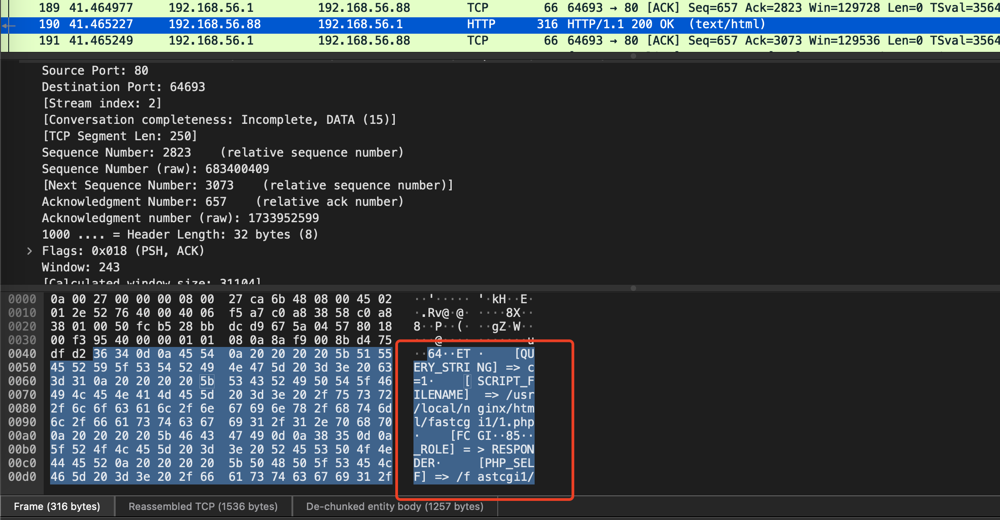
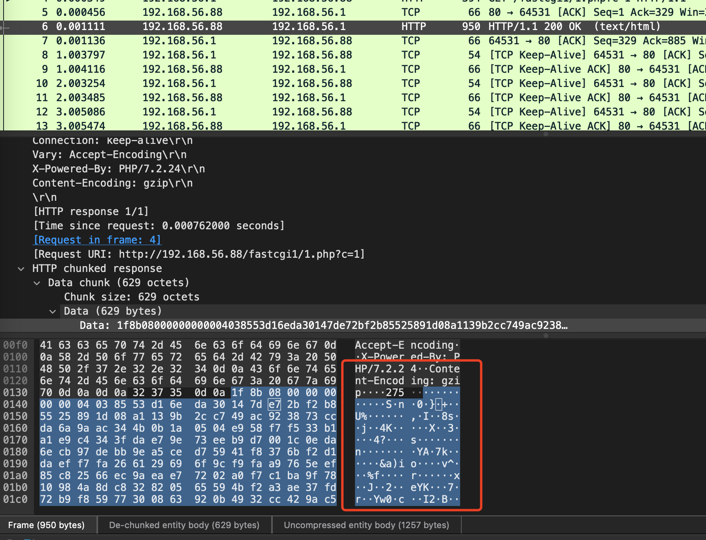

# Nginx学习：压缩模块Gzip

又是一个非常常见的模块，Gzip 现在也是事实上的 Web 应用压缩标准了。随便打开一个网站，在请求的响应头中都会看到 `Content-Encoding: gzip` 这样的内容，这就表明当前这个请求的页面或资源使用了 Gzip 压缩。

具体的压缩算法咱们就不多说了，反正文字类的，相同字符越多的压缩效果越好。这也是大部分压缩算法的特点。其它的，咱们就直接看配置吧。

今天学习的内容都是可以设置在 http、server、location 中的，有特殊情况的我会单独说。

## Gzip

Gzip 模块的全称是 ngx_http_gzip_module ，是包含在 Nginx 源码中的，不需要再独立的编译。它是一个使用 “gzip” 压缩算法压缩响应的过滤器，通常有助于将传输数据的大小减少一半甚至更多。需要注意的是，使用 SSL/TLS 协议时，压缩响应可能会受到 BREACH 攻击。我们先来看 Gzip 配置指令，然后下一小节再看一个综合测试。

### gzip

启用或禁用响应的 Gzip 压缩功能。

```shell
gzip on | off;
```

默认是 off 的，在 nginx.conf.default 中是有它的注释的。一般来说，我们会在一个服务器上直接在 http 模块中配置全部的站点是否都开启 Gzip ，当然，也有可能会针对某个站点单独在对应的 server 中开启。而在 location 中，往往是让某些路径或文件资源不开启 Gzip 。这是为啥呢？

要知道，压缩是 CPU 密集型的操作，要耗费 CPU 资源的。特别是对于特别大的文件和特别高的压缩率。因此，图片和视频或者非常大的文件其实并不是很适合去进行 Gzip 压缩的，并且 Gzip 压缩还会加上自己的压缩头，反而会让这类文件变得更大，比如说 JPG 文件。这种文件本来就是通过图形压缩算法压缩过的，再上一道 Gzip 其实意义不大，而且很可能还会变得比原来更大。

因此，最合适压缩的，还是普通的文本类型的响应，比如纯文本文件、html/css/js响应、xml、JSON数据等等。

### gzip_buffers

设置用于压缩响应的缓冲区的数量和大小。

```shell
gzip_buffers number size;
```

默认情况下，缓冲区大小等于一内存页。这是 4K 或 8K，具体取决于平台。

### gzip_comp_level

设置响应的 gzip 压缩级别。

```shell
gzip_comp_level level;
```

默认值是 1 ，可接受的值在 1 到 9 的范围内。数值越大，压缩比率越高，文件越小，但 CPU 耗费资源也越高。小数值就是反过来的。通常来说，要么不配置用 1 ，要么 3、4、5 左右即可。

和压缩比率对应的还有一个变量 `$gzip_ratio` ，这个变量没法直接 return 出来，只能记录到日志中，大家可以复用之前 的那个 vvv 日志的配置，然后添加上这个变量，看看每个请求具体实现的压缩比是多少，计算为原始响应大小和压缩响应大小之间的比率。

### gzip_disable

禁用对具有匹配任何指定正则表达式的“User-Agent”标头字段的请求的响应的 gzip 压缩。

```shell
gzip_disable regex ...;
```

特殊掩码“msie6” (0.7.12) 对应于正则表达式“MSIE [4-6]\.”，但运行速度更快。从 0.8.11 版开始，“MSIE 6.0; ... SV1”不包含在此掩码中。

其实就是针对指定的匹配到的 User-Agent 中的浏览器关键字段，不启用 Gzip 压缩。

### gzip_http_version

设置压缩响应所需的请求的最低 HTTP 版本。

```shell
gzip_http_version 1.0 | 1.1;
```

默认值是 1.1 ，这个基本没啥人改了，现在 1.1 已经很普遍了。

### gzip_min_length

设置将被压缩的响应的最小长度。

```shell
gzip_min_length length;
```

默认值是 20 ，就是不到这个长度的，就不压缩了。长度仅由 “Content-Length” 响应头字段确定。

### gzip_proxied

根据请求和响应启用或禁用代理请求的响应 gzip 压缩。

```shell
gzip_proxied off | expired | no-cache | no-store | private | no_last_modified | no_etag | auth | any ...;
```

默认值是 off ，请求被代理的结果是由“Via”请求头字段的存在决定的。该指令接受多个参数：

- off 禁用所有代理请求的压缩，忽略其他参数
- expired 如果响应标头包含带有禁用缓存值的“Expires”字段，则启用压缩
- no-cache 如果响应头包含带有“no-cache”参数的“Cache-Control”字段，则启用压缩
- no-store 如果响应头包含带有“no-store”参数的“Cache-Control”字段，则启用压缩
- private 如果响应头包含带有“private”参数的“Cache-Control”字段，则启用压缩
- no_last_modified 如果响应头不包含“Last-Modified”字段，则启用压缩
- no_etag 如果响应头不包含“ETag”字段，则启用压缩
- auth 如果请求标头包含“授权”字段，则启用压缩
- any 为所有代理请求启用压缩

官方的解释是 **仅将响应压缩到不会在代理服务器上缓存的请求是合理的** ，代理请求主要指的是一些高速缓存服务器或 CDN 网络，和 gzip_vary 指令类似。通过请求的 Via 请求头，判断当前的请求是不被代理转发过来的请求，如果有这个参数，那么 gzip_proxied 就会生效。

### gzip_types

对除了 “text/html” 之外，还启用对指定 MIME 类型的响应的 gzip 压缩。

```shell
gzip_types text/html;
```

特殊值 “*” 匹配任何 MIME 类型 (0.8.29)。 默认值 “text/html” 类型的响应总是被压缩的。

比如说，你想要压缩 JSON、XML 和 JPG 类型的资源，就可以这么配。

```shell
gzip_types application/json text/xml image/jpeg;
```

不用再加 text/html ，默认它就一直存在，写上了反而会报重复的错误。

### gzip_vary

如果指令 gzip、gzip_static 或 gunzip 处于活动状态，则启用或禁用插入 “Vary: Accept-Encoding” 响应头字段。

```shell
gzip_vary on | off;
```

默认值是 off 的，Vary 是 HTTP 中响应头的一个标识，主要是和缓存代理服务器响应有关，针对现在比较流行的一些云服务，比如高速缓存中间件或者 CDN 网络。如果开启的话，就会添加一个上面那样的响应头，告诉缓存代理服务器缓存两种版本的资源：压缩和非压缩的，这有助于避免一些公共代理不能正确地检测 Content-Encoding 标头的问题。

假设有两个客户，一个使用的旧浏览器不支持压缩，一个使用新的浏览器支持压缩，如果他们都请求同一个网页，那么取决于谁先请求，压缩或非压缩版本便存储在CDN上。这样问题就出现了，旧浏览器请求常规网页但获得缓存的压缩版本，而新浏览器会获得缓存的非压缩版本但尝试去“解压”它。无论哪种方式都是坏消息。解决方法是，源服务器回送“Vary: Accept-Encoding”。如果你的网站使用了这些中间件或者 CDN ，记得开启它哦。

## 综合测试

先来一个整体的配置，我们直接到 http 下面去配置，这样的话所有的站点所有的目录都可以启用 Gzip 了，比较方便。

```shell
// http 下
  gzip on;
  gzip_comp_level 1;
  gzip_min_length 16;
  gzip_types text/plain image/jpeg;
  gzip_vary on;
  #gzip_disable ~ Chrome;
  #gzip_proxied any;
```

下面两个注释我们后面再说，先看看效果，配置上述内容之后，访问所有的页面都会在响应头中返回 `Content-Encoding: gzip` 这个内容，这就表示 Gzip 压缩已经启用了。那么是真的吗？咱们用 WireShark 抓包试试。

首先是关闭 Gzip 状态下抓到的数据。



可以看到，数据是以原文展示的，说明就是返回的普通文本字符串。现在咱们看看打开 Gzip 的效果。



好嘛，直接变乱码了，这就说明 Gzip 确实是启用了。如果文件内容不多，可能在浏览器返回的 Length 中看不到太大的差别，那么我们就可以自己写一个大点的页面，或者之前使用 php 循环输出多点内容。gzip_vary 开启后，响应头会有 `Vary: Accept-Encoding` 这样的内容返回回来， gzip_types 大家也可以自己测测，不添加那两个，直接访问 JPG 图片或者 txt 文档看看有没有压缩。这两个比较直观就不解释了，咱们主要看看别的。

### 压缩级别

这里我直接使用之前的那个循环打印10000 次 `$_SERVER` 的 PHP 文件来操作。另外，我们也可以调整一下 gzip_comp_level 的级别，一起看下效果。


怎么样，效果还是很明显的吧，返回的大小直接从 14.7M 变成了最小  74.1k 。因为我们的循环内容都是一样的，所以压缩比率非常高。查看等级 1 在日志中记录的 `$gzip_ratio` 达到了 67.31 ，而 9 的比例为 185.65 。

### 大小限制

在上面的配置中，我们设置了一个 `gzip_min_length 16` ，表示小于 16 个字节的不会进行 Gzip 压缩，为啥是这个值呢？因为好测嘛，我们之前有个 a.txt 文件，里面的内容是 `this is a.txt.` 字符是 14 个，加上换行符正好 15 个字符。另外，记得还要配置 gzip_types ，把 text/plain 加上哦。

大家可以自己进行测试，直接访问 a.txt 是不会压缩的，修改 gzip_min_length 小于 16 之后，就会进行压缩了。

### gzip_disable 与 gzip_proxied

在上面的配置中，gzip_disable 我配置的就是过滤掉 Chrome 浏览器，大家可以自己试试打开注释后，Chrome 浏览器访问还有没有 Gzip 。另一个的测试也不麻烦，可以使用 Postman ，添加一个请求头 Via ，值随便写，然后就会发现所有页面或资源的 Gzip 都失效了。现在打开注释，Gzip 又开始生效了。注意，gzip_proxied 判断的条件就是请求头有没有 Via ，至于 Via 的值是什么并不重要，咱们只是测试嘛。这个其实是针对于当前系统是否为被反向代理的，比如 CDN 的回源，当 CDN 回源到我们本地服务器时，或者其它 Nginx 反向代理到当前服务器时，就会加上，Via 请求头，正常情况下 Gzip 就不会对这些请求进行压缩处理了。gzip_proxied 就是用来控制这部分内容的，之前测试，如果在有 Via 请求头的情况下设置为 private ，则响应内容不包含 ` Cache-Control private`，所有的 Gzip 都不生效，但是后期测好像又没用了，设置 `gzip_proxied private;` 就和设置成 any 的效果一样。好吧，不纠结了，这一块如果有了解的小伙伴欢迎留言指导。

## GunZip

其实一般情况下，有上面 Gzip 模块的内容就够用了。但是 Nginx 还提供了两个和 Gzip 相关的拓展模块。这两个模块都需要额外安装，不是在 Nginx 源码中的。第一个就是 ngx_http_gunzip_module 模块，GunZip 的作用是使用“Content-Encoding: gzip”为不支持“gzip”编码方法的客户端解压缩响应。当需要存储压缩数据以节省空间和降低 I/O 成本时，该模块将很有用。

说人话，就是客户端如果不支持 Gzip 压缩，那么开启了这个模块功能之后，就还是会把 Gzip 的压缩内容反解压回去再响应给客户端。其实现在这个模块已经没啥用了，毕竟基本上所有的客户端或浏览器都是支持 Gzip 解压的。但是，不排除有特殊需求吧。它是通过添加 --with-http_gunzip_module 参数在 configure 时来进行编译安装的，只有两个配置项。

### gunzip

为缺乏 gzip 支持的客户端启用或禁用 gzip 响应的解压缩。

```shell
gunzip on | off;
```

默认值是 off ，也就是关闭的。如果启用，则在确定客户端是否支持 gzip 时还会考虑以下指令：gzip_http_version、gzip_proxied 和 gzip_disable。要测试的话，其实可以使用 Postman ，将请求头中的 `Accept-Encoding：gzip` 去掉。这样，即使不动上面的那些配置，也就是保持 gzip 是开启的状态，返回的结果通过 WireShark 查看也是原文数据。大家可以测试一下哦。

### gunzip_buffers

设置用于解压缩响应的缓冲区的数量和大小。

```shell
gunzip_buffers number size;
```

默认情况下，缓冲区大小等于一内存页。这是 4K 或 8K，具体取决于平台。

## gzip_static

这个模块从名字上来看，好像是什么静态 Gzip 的意思，其实它是允许发送带有“.gz”文件扩展名的预压缩文件而不是常规文件。它的命名是 ngx_http_gzip_static_module 模块，也不是包含在 Nginx 核心源码中的，需要通过 --with-http_gzip_static_module 编译安装，只有一个配置项。

```shell
gzip_static on | off | always;
```

默认是 off ，启用（“on”）或禁用（“off”）检查预压缩文件的存在。还需要配合考虑了以下指令：gzip_http_version、gzip_proxied、gzip_disable 和 gzip_vary。

使用“always”值 (1.3.6)，gzip 压缩文件在所有情况下都使用，而不检查客户端是否支持它。如果磁盘上没有未压缩的文件或者使用了 ngx_http_gunzip_module，这将很有用。

可以使用 gzip 命令或任何其他兼容的命令来压缩文件。建议原文件和压缩文件的修改日期和时间一致。

网上关于这个模块的资料很少，但通过上面官方文档中的描述，大概可以猜测到，就是我们可以在命令行通过 gzip 命令工具或者通过其它动态程序提前压缩好文件，和原始文件保持相同的名称，只是后缀名变成 .gz 的。然后尽量让它们的修改日期和时间一致。这样如果是开启 Gzip 的情况下，Nginx 就会直接发送 .gz 的这个预压缩文件，而不用自己再压缩一遍，能够有效减少压缩所带来的 CPU 消耗。

那么我们就拿 a.txt 来测试一下，首先使用 gzip 压缩一下，生成了一个 a.txt.gz 文件。

```shell
[root@localhost html]# gzip a.txt
```

不加任何参数的话，原来的 a.txt 直接就被打包成了 a.txt.gz 文件，原始文件也不存在了。然后编译安装 ngx_http_gzip_static_module 模块，之后也在 http 模块下设置 `gzip_static on;` 。直接访问 a.txt ，还是可以直接返回正常的文件响应。

接下来，我们再创建一个 a.txt 文件，让文件的内容与之前的文件略有不同。然后在请求的时候加上 Via 头，这样请求就不会走 gzip 了。这样就可以测试出在没有 Via 头的情况下，使用 gzip_static 确实直接就是使用 a.txt.gz 文件，而使用了 Via 就会看到原始的 a.txt 文件了。大家一定要自己测试一下哦。

## 总结

关于 Gzip 的内容相信大家还是比较好懂的，因为接触过这个的同学可能非常多。不管你是做网站开发还是写接口，减少带宽流量，优化加载速度，通过 Gzip 都是非常方便的。其实大家应该看出来了，大部分情况下，其实我们只需要配置 `gzip` 和 `gzip_types` 就可以了，有需要的话可以再配一下压缩比率 `gzip_comp_level` ，有这三个足以应付 9 成以上的业务需求了。

另外需要注意就是对于图片、流媒体这些，建议不要用，不过大家还是要自己试试，有的时候确实有效，有的时候真的会变得更大，这个东西吧，自己不试试是不知道的。另外顺便提一个静态资源的优化点，图片资源尽量使用 JPG ，因为它本身就是压缩类型的，同样的图片会比 PNG 或 GIF 要小。

参考文档：

[http://nginx.org/en/docs/http/ngx_http_gzip_module.html](http://nginx.org/en/docs/http/ngx_http_gzip_module.html)

[http://nginx.org/en/docs/http/ngx_http_gunzip_module.html](http://nginx.org/en/docs/http/ngx_http_gunzip_module.html)

[http://nginx.org/en/docs/http/ngx_http_gzip_static_module.html](http://nginx.org/en/docs/http/ngx_http_gzip_static_module.html)


