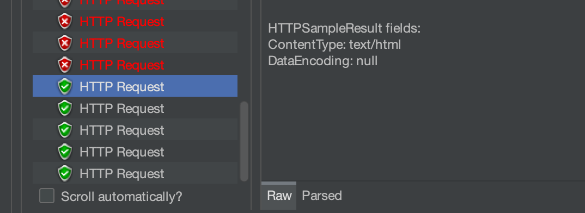
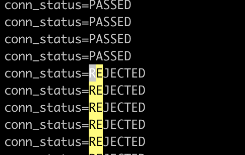

# Nginx学习：连接限制和请求限制

之前我们就已经学习过了一些和流利限制相关的配置指令，它们是 HTTP 核心配置中的内容，不记得的小伙伴可以回去看一下哦 **Nginx学习：HTTP核心模块（七）请求体与请求限流**[]() 。

当时就说过，那一套限制是针对流量的限制，主要就是为了带宽不被占满，或者是实现类似下载限速的能力。而对于请求数量以及连接数量的限制，就放到了今天的内容来学习。在官方文档中，这两个模块是独立模块，但是它们却又是包含在 Nginx 核心源码中的，因此，不需要独立再去编译安装。

今天所有的配置指令都可以在 http、server、location 中使用，仅有一两个指令是只能配置在 http 中的，我会单独说明。

## 请求限制

我们先来说请求限制，因为如果真的需要用到的话，请求限制的作用可能会比连接限制大，效果也更加明显。这个限制，其实就是根据一定的条件，比如说请求 IP ，或者 Host 名称，对传递过来的请求数量进行限制。例如针对同一个 IP ，1秒内只能有多少个请求可以被响应，多出的请求直接返回错误状态码。

在 PHP 的 Laravel 框架中，如果你使用 api 的路由，那么它也有一个默认的中间件就是类似这样限流的，默认的设置是 1分钟 60 个请求。这个中间件的实现原理大家可以自己去看一下哦，如果你跟过我之前的 Laravel 系列文章和视频的话，那么找到源码中的具体实现应该不难。提示一点，中间件代码位置在 vendor/laravel/framework/src/Illuminate/Routing/Middleware/ThrottleRequests.php 文件中。它的请求数量判断条件是：如果有登录认证，就按用户信息；如果没有登录认证，就根据请求域名结合IP地址一起。然后缓存到 Laravel 自带的缓存中。

应用程序中的请求限制肯定会更灵活一些，而如果是一些公共接口，不需要登录验证之类的，只简单的针对  IP 之类的条件来进行限制的话，就完全可以使用 Nginx 来实现。（当然，使用 OpenResty 的话，也可以实现非常复杂的请求限制）

另外很多公共开发接口，也会在文档中标明某些接口的访问限制，比如大家最常见的微信开发中的 45009 错误码，就是接口调用超出限制了。还有一些免费接口有限制，然后收费的就给你取消限制。当然，我不知道它们是具体使用什么技术来实现的，但今天咱们要讲的 Nginx ，确实也可以实现。

Nginx 中请求限制模块的全名是 ngx_http_limit_req_module ，使用的是 “漏桶” 算法来完成的。具体的原理就不解释了，大家可以找剖析 Nginx 源码的文章或者视频来学习。咱们还是以应用为主，先来看相关的配置指令，最后再进行测试吧。

### limit_req_zone

为请求限制的共享内存区域设置参数，该区域将保持各种键的状态。

```shell
limit_req_zone key zone=name:size rate=rate [sync];
```

默认没有配置，如果要使用请求限制，必须至少要有一个。整体和之前学过的 `fastcgi_cache_path` 一样，特别是 zone 这个参数，和它的 `keys_zone` 完全一致，是提前开辟内存为后续请求内容保存数据用的。特别是，状态存储当前过多请求的数量。键可以包含文本、变量及其组合。不考虑具有空键值的请求。

key 参数表示关键值，就是请求判断条件，大部分情况下可能就是用 IP 。rate 表示限制数量，默认单位是 r/s ，表示 1秒 几个请求。也可以换成 r/m 表示分钟内多少个请求。最后的可选的 sync 是商业版才有的，咱们开源版的没有，不讨论了。

它是只能放在 http 模块下的，不能放在 server 或 location 下面，但是可以设置多个。

```shell
limit_req_zone $binary_remote_addr zone=one:10m rate=1r/s;
```

上面这一段的意思就是，使用 `$binary_remote_addr` 这个变量作为 Key ，共享内存名称是 one ，空间有 10MB ，限制请求数是每秒1个请求。`$binary_remote_addr` 是二进制的固定 IP 表示，大小相对 `$remote_addr` 会小一些。之前在 **Nginx学习：HTTP核心模块（十二）内嵌变量**[]() 这里已经学习过啦。虽然我们今天全部的测试都是用的这个 IP ，但是，不仅是 IP 哦，你也可以保存一些 cooke 值之类的，通过变量 `$cookie_[name]`获取到，或者是请求头 `$http_[name]`，又或者是别的任何你觉得可以用于区分的变量，这样就可以区分用户，就能实现不同用户的限制功能了。

如果区域存储耗尽，则删除最近最少使用的状态。如果即使在此之后也无法创建新状态，则请求会因错误而终止。

### limit_req

设置共享内存区域和请求的最大突发大小。

```shell
limit_req zone=name [burst=number] [nodelay | delay=number];
```

如果请求速率超过为区域配置的速率，则它们的处理会延迟，以便以定义的速率处理请求。过多的请求会被延迟，直到它们的数量超过最大突发大小，在这种情况下，请求会因错误而终止。默认情况下，最大突发大小等于零。

看不懂上面的解释？不急，咱们一个一个参数来看。

- zone=name 明显就是要给一个我们在 http 中配置过的 limit_req_zone 的名称
- burst 表示突发不超过几个请求，这些突发请求会根据 delay 或 nodelay 进入延迟队列
- nodelay 如果有突发请求，也不进入延时队列
- delay 指定延时队列处理几个请求，要是不设置它或者 nodelay ，那么 burst 过来的请求都会进入延时队列

```shell
limit_req zone=one burst=5;
```

这一段就是说，使用上面我们配置过的那个 one ，然后突发配置 5 ，其实意思就是先处理 1 个请求，然后将 5 个请求放到队列里，每秒处理 1 个，剩下的其它请求直接返回错误状态码。

有了上面这两个配置其实大家就可以自己测试一下了，非常有意思的哦。不过需要使用一些压测工具，比如 ab 或 Jmeter ，我们先接着看完所有的配置，然后综合进行测试的时候也简单说下这两个测试工具。

### limit_req_dry_run

启用试运行模式。

```shell
limit_req_dry_run on | off;
```

默认是 off 的，如果是 on 的话，请求处理速率不受限制，但是在共享内存区域中，超出的请求数照常计算。没有测试，但有点像 Go 的 Gorm 框架中的 Dry 运行模式，就是假的运行一下这样。

### limit_req_log_level

当服务器由于速率超出或延迟请求处理而拒绝处理请求时，设置所需的日志记录级别。

```shell
limit_req_log_level info | notice | warn | error;
```

默认是 error 级别，也就是记录 error_log 日志时，将拦截的请求定为哪种错误级别。没有直接处理的，进延迟队列的延迟请求的记录级别比拒绝的低一分；例如，如果指定了“limit_req_log_level notice”，则会使用 info 级别记录延迟。这个一会我们也会测试到。

### limit_req_status

设置状态码以响应被拒绝的请求而返回。

```shell
limit_req_status code;
```

默认情况下，被拦截的请求都会返回 503 状态码，通过修改这个配置，可以返回指定的状态码。

### 变量 `$limit_req_status`

最后还有一个请求限制的变量，主要记录的是请求的拦截状态，包括这几种：PASSED`, `DELAYED`, `REJECTED`, `DELAYED_DRY_RUN,  REJECTED_DRY_RUN 。一会我们也会看到。

### 请求限制测试

好了，主要的内容就是上面那些。咱们也学习这么久 Nginx 了，因此指令也就不一一的来测了，直接整体的一起测吧。添加下面的配置。

```shell
# http 模块下
limit_req_zone $binary_remote_addr zone=one:10m rate=1r/s;
log_format limitlog 'status=$limit_req_status';

server {
  listen 8025;
  root html;
  limit_req zone=one burst=5;

  error_log logs/limit_req_err.log info;
	limit_req_log_level warn;
	
	access_log logs/limit_req_access.log limitlog;
}
```

为了方便测试，我们直接建了个 Server ，监听 8025 端口。然后最上面是需要在 http 模块下配置的内容，第一个是 limit_req_zone 也就是共享内存区的配置。另一个是一个日志格式化的配置，主要是打印一下  `limit_req_status` ，这个变量也是不能直接 return 的，可以记录在日志中查看。

limit_req_zone 的配置就是上面我们说过的那个配置。名字叫 one ，10MB 的空间，速度是每秒一个请求。然后在 8025 的 Server 中，我们指定 limit_req 的共享内存空间使用 one ，突发空间大小为 5 。然后使用 error_log 指定错误日志记录到一个专门的文件中，并且等级为 info 。日志的错误等级指定为 warn ，这样的话拦截的日志应该是 warn ，延迟处理的请求会是 notice ，一会我们来看看是不是这样。另一个 access_log 则使用上面 log_format 定义的那个日志格式，也记录到一个专门的日志文件中，主要用于查看一下 `$limit_req_status` 记录的结果。

配置挺简单吧？测试其实挺不好测的，大家要是手速可以快点刷新也可以，但是咱们程序员嘛，有压测工具还嘛还自己去点点点，节省体力就是科技进步的真谛。

首先拿 ab 工具试一下。不会的小伙伴自己查下资料哦。

```shell
➜  ~ ab -n 100 -c 100 http://192.168.56.88/
……………………
Complete requests:      100
Failed requests:        0
……………………

➜  ~ ab -n 100 -c 100 http://192.168.56.88:8025/
…………
Complete requests:      100
Failed requests:        94
…………
```

看出来差别了吧。第一个请求的是普通的 80 端口，第二个请求的是我们上面新建的 8025 端口的，很明显，8025 端口的请求只成功了 6 个，失败了 94 个。为啥是 6 个？通过的请求 1 个，突发处理的 5 个，一共 6 个。并且，在测试的时候会明显感觉到 8025 的 ab 测试会卡一下。这是为啥？因为我们指定了 1 秒只能处理一个请求，所以后面那 5 个延迟处理的请求也要 1 秒一个地去执行。

不直观啊，ab 只能看到一个大概的数量，我想知道是不是真的失败的请求都返回 508 了，确实是被拦截的，这要怎么处理呢？换个工具呗，上 Jmeter 。不会用的小伙伴也可以简单学习一下哈，建一个线程组 100 个线程，然后其它不用设置了。再建一个 HTTP 请求，填上请求地址。然后添加监听，只需要查看结果树和聚合报告就可以了。我们主要就是看查看结果树。

配置完成后，点击运行，就可以查看查看结果树的内容了，这里面可以清晰地看到，第一个请求正常响应了，之后的限制请求返回的正是 503 错误。


好吧，现在你可以尝试设置 `limit_req_status 508;` 然后清除那两个监听器的数据，再次运行，看看拦截的请求状态码是不是 508 了。

拉到最低下，每隔一秒又会有一个正常响应的请求，这就是突发之后放到延迟队列中的那五个请求。



看完请求的情况之后，我们再来看日志记录的情况，首先看看错误日志。在自定义的那个 error_log 中，错误日志会显示有 5 个 notice ，然后其它的是 warn 。正常的那个不会被记录到错误日志中啦。

```shell
// limit_req_err.log
2022/09/01 09:58:06 [notice] 4506#0: *7544 delaying request, excess: 0.999, by zone "one", client: 192.168.56.1, server: , request: "GET / HTTP/1.0", host: "192.168.56.88:8025"
2022/09/01 09:58:06 [notice] 4506#0: *7545 delaying request, excess: 1.999, by zone "one", client: 192.168.56.1, server: , request: "GET / HTTP/1.0", host: "192.168.56.88:8025"
2022/09/01 09:58:06 [notice] 4506#0: *7546 delaying request, excess: 2.999, by zone "one", client: 192.168.56.1, server: , request: "GET / HTTP/1.0", host: "192.168.56.88:8025"
2022/09/01 09:58:06 [notice] 4506#0: *7547 delaying request, excess: 3.999, by zone "one", client: 192.168.56.1, server: , request: "GET / HTTP/1.0", host: "192.168.56.88:8025"
2022/09/01 09:58:06 [notice] 4506#0: *7548 delaying request, excess: 4.999, by zone "one", client: 192.168.56.1, server: , request: "GET / HTTP/1.0", host: "192.168.56.88:8025"
2022/09/01 09:58:06 [warn] 4506#0: *7549 limiting requests, excess: 5.999 by zone "one", client: 192.168.56.1, server: , request: "GET / HTTP/1.0", host: "192.168.56.88:8025"
2022/09/01 09:58:06 [warn] 4506#0: *7550 limiting requests, excess: 5.999 by zone "one", client: 192.168.56.1, server: , request: "GET / HTTP/1.0", host: "192.168.56.88:8025"
……………………
```

好了，再来看普通的访问日志，这里可以看到正常的请求返回的 `$limit_req_status` 的结果是 PASSED 表示通过，拦截掉的是 REJECTED 表示拒绝，最后还有五个 DELAYED 表示延迟。

```shell
// limit_req_access.log
status=PASSED
status=REJECTED
………………
………………
status=REJECTED
status=REJECTED
status=DELAYED
status=DELAYED
status=DELAYED
status=DELAYED
status=DELAYED
```

这样一套测试下来，是不是一下就对上面的这些请求限制相关的配置指令有了一个清晰的认识了。

应该有不少小伙伴发现了，这个完全可以做秒杀之类功能的限制呀。在 Redis 相关的文章中，我们就说过秒杀可以通过队列并配合分布式锁之类的工具来实现。但是，如果不限制请求，依然会有大量的请求打到服务器以及动态程序上，如果中间的设计有问题，到了数据库层上更是有可能引起性能的急速下降。现在，通过 Nginx 的请求限制，是不是就可以只放行略大于库存量的请求就可以了，直接让 Nginx 就把大量请求拦截回去。想想就很激动啊，不过暂时没有项目可以实践。有机会的小伙伴一定要试试哦，肯定还要坑，但是不踩怎么能成长呢！

## 连接限制

连接限制说实话不如请求限制好理解，也没它好测试。为啥呢？这和它的定义也有关系：并非所有连接都被计算在内。只有当服务器正在处理一个请求并且已经读取了整个请求标头时，才计算一个连接。这样的话，对于我们这种简单的 Demo 来说，请求连接速度太快了。因此，咱们后面测试的时候就得加大并发量才能看到一点效果。

连接限制模块的全称是 ngx_http_limit_conn_module 模块，配置指令和上面的请求限制的完全一样，只有一些参数略有不同。因此，咱们就快速过一遍吧。后面还是会有一个小测试。

### limit_conn_zone

为共享内存区域设置参数，该区域将保持各种键的状态。

```shell
limit_conn_zone key zone=name:size;
```

和 limit_req_zone 的区别就是少了点参数吧。也是一样的，只能配置在 http 下面。

### limit_conn

为给定键值设置共享内存区域和最大允许连接数。

```shell
limit_conn zone number;
```

当超过此限制时，服务器将返回错误以响应请求。也是参数不一样，最后那个 number 就表示同时一时间有几个连接。

### limit_conn_dry_run

启用试运行模式。

```shell
limit_conn_dry_run off;
```

### limit_conn_log_level

为服务器限制连接数的情况设置所需的日志记录级别。

```shell
limit_conn_log_level info | notice | warn | error;
```

### limit_conn_status

设置状态码以响应被拒绝的请求而返回。

```shell
limit_conn_status code;
```

### 变量 `$limit_conn_status`

设置状态码以响应被拒绝的请求而返回。

### 连接限制测试

看出来了吧，配置的区别就是参数和名称的不同，请求的中间是 req ，而连接的中间是 conn 。

对于连接限制的测试，我们也直接使用上面 8025 的那个 Server ，单独加一个 location 就好了。同时记得要把 server 下的 limit_req 先给注释掉哦，要不请求限制就给拦截掉了。或者更好的是你自己重新写一套，再用一个端口或者定义一个 hostname 。这里我就偷下懒吧。

```shell
………………
limit_conn_zone $binary_remote_addr zone=addr:10m;
log_format limitconnlog 'conn_status=$limit_conn_status';

server {
  listen 8025;
  ………………
  
  #limit_req zone=one burst=5;
  
  location /limitconn/ {
    alias html/;
    access_log logs/limit_conn_access.log limitconnlog;
    
    limit_conn addr 1;
    limit_conn_status 509;
  }
}


```

连接限制不太好测，我们需要调大并发数量，如果是 ab 就调整为 `ab -n 10000 -c 200 http://192.168.56.88:8025/limitconn/` 。这个我就不演示了，直接来看 Jmeter 的设置。调大 Jmeter 线程数 200 ，循环次数 50 ，总请求数量也是 10000 了。然后要将查看结果树保存到文件，否则请求太多上面的就看不到了。

上面的配置中，我们还是记录了 access_log ，将 `$limit_conn_status` 保存了一下。然后 limit_conn_status 设置为 509 ，这样比较清晰。然后运行测试，查看运行完成之后的查看结果树保存的文件，里面就会有 509 相关的报错信息。


同样的，在 limit_conn_access.log 文件中，我们也能看到 PASSED 和 REJECTED 的内容。



## 总结

怎么样，网上大部分的文章和视频都只是简单地说一下各个配置指令，咱们这里的实际演示测试是不是更能让你印象深刻。当然，光看是没用的，还是要自己动手测起来。

就像前面一直说的，请求限制会用得更多一些，而连接限制通常来说比较少用。在一些对外的公共接口中，这种请求次数限制的功能很常见。而在我们日常的开发中，如果项目确实要应对非常大的流量，像是秒杀之类的应用，也可以尝试用上这套限制模块的功能，直接在 Nginx 层就拦截请求，大家也可以尝试一下。

参考文档：

[http://nginx.org/en/docs/http/ngx_http_limit_req_module.html](http://nginx.org/en/docs/http/ngx_http_limit_req_module.html)

[http://nginx.org/en/docs/http/ngx_http_limit_conn_module.html](http://nginx.org/en/docs/http/ngx_http_limit_conn_module.html)