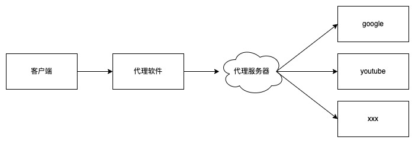
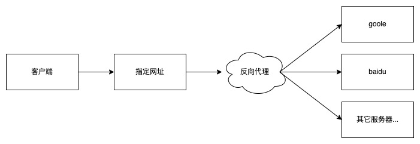
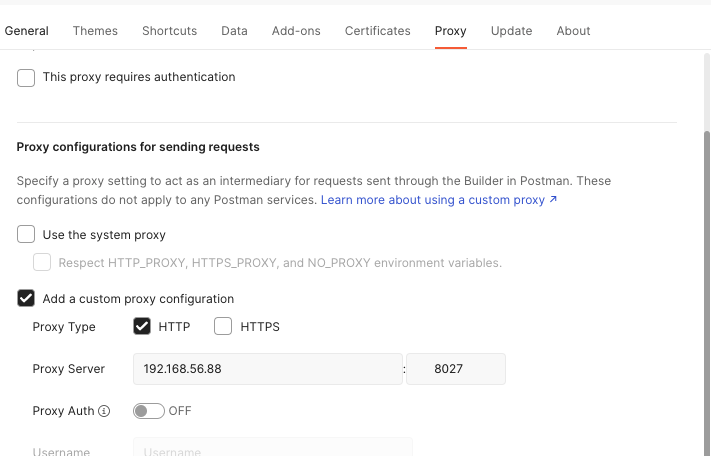

# Nginx学习：代理模块（一）基本配置与概念

来了来了它来了。要说 Nginx 最早最出名的名头是什么？相信不少老码农马上就会想到，最开始，Nginx 的名头就是一款性能最高的 反向代理  服务器。现在其实也是，但是这么说的人越来越少了。也就是说，其实 Nginx 最主要的功能就在于反向代理。如果是编程小白，刚刚从事编程相关工作，没有配置过负载集群，可能对这个概念还是比较陌生的。那么今天咱们就来先说说 代理、反向代理、正向代理 这些概念。

今天的内容只有一个配置指令，只能用在 location 中。

## 代理

代理是啥意思，之前我们老早就学过的设计模式系列的文章中，就讲过一个 代理模式 的应用。说实话，Nginx 中的代理模块其实也是代理模式思维的一个体现。还记得代理模式的定义吗？

> 为其它对象提供一种代理以控制对这个对象的访问

从编程语言的角度来说，就是我们要访问一个对象，但是可能由于种种原因不能直接访问它，这就要通过代理来实现访问。这个代理相当于是中间的一个媒介，可以帮我们做一些事情，也可以想像是我们和要使用的对象之间的桥梁。

当时我们也举了一个例子，现在也可以用这个例子，那就是买房子或者买保险，不管是房产中介还是保险销售，其实都可以称为代理人。他们用他们专业的知识帮我们解决问题，甚至买房或者租房都可以不用和房主产生交集，但真正在处理这个房产证的，其实还是房主（保险公司）。

这个就是代理，说起来很抽象是吧，大家都是码农，可以先通过代码去了解，小伙伴们可以回到 **PHP设计模式之代理模式**[https://mp.weixin.qq.com/s/0CvVMuP-_j-0sqRK_4kcZA](https://mp.weixin.qq.com/s/0CvVMuP-_j-0sqRK_4kcZA) 这篇文章中再重温一下哦。

## 正向代理与反向代理

好了，接下来是另外两个概念，正向代理与反向代理。

### 正向代理

这个太好解释了，码农们都喜欢用 Google 吧，因为一些众所周知的原因，我们没法访问，因此，大家也都会找一些工具方法来访问一些不可说的网站。在这种情况下，是需要下载一些软件，或者配置一些东西，让我们的浏览器通过代理，将请求先发送到一个外部服务器，然后由它再转发请求到目的站点，这个过程就是正向代理。另外，还有一些游戏加速器，以及我们做开发经常会用到的 Fiddler 以及 Charles 抓包工具，这些也都是正向代理软件。

简单来说，正向代理需要我们客户端去配置东西，或者使用软件，将请求发送到指定的地方。



比如说，我们现在通过浏览器请求 Google 的网址，代理软件拦截请求，然后发送到代理服务器。代理服务器接收到后，再将请求发送到真实的 Google 的服务器，处理完成后， Google 返回的响应发送回代理服务器，代理服务器再将请求返回给客户端。

这就是正向代理，另外还有一种透明代理，意思就是这个代理服务器像是透明的一样，只转发，不做别的事情，就和我们正常访问目标网址一样。

一句话，控制权在用户，安装启用了代理就走代理，不装不用不会走代理。

### 反向代理

说完正向的，反向的就好理解了，它和正向代理就是反过来的嘛。不需要我们在客户端配置或者下载什么软件，访问的地址还是原来那个，只不过服务器上将我们的请求又转发给了别的服务器。这个过程对于我们这些用户是无感知的。



反向代理不需要在客户端装软件，是由网站来控制用户看到的内容。假如我的网站，www.zyblog.com.cn ，通过反向代理到了 Google ，那么大家访问我的这个网址，实际上打开的会是 Google 的页面。但是说实话，中文搜索分词百度还是有优势的，哪天一高兴，我再将我的网站反向代理到 Baidu ，那么用户不需要换别的网址，还是继续访问 www.zyblog.com.cn ，看到的就会是百度的内容。

一句话，控制权在站长，不在用户，用户访问的地址不变，但是会显示什么，需要代理到哪里，是后端人员控制的。

再拿实际的业务来说，很多门户网站其实是会把一些频道外包的，比如说体育、健康频道，它们的记者和资源其实也是有限的。一些小的频道或者不是热门的频道就直接让第三方公司来做。这时候，有一种方案是直接使用二级域名指到合作公司的服务器上，而另一种方案，不改变域名，直接将某个路径，比如 /sports/ 这样的反向代理到合作公司指定的地址路径上就可以了。这是很常见的一种业务需求。

而大家做为码农，接触到的更多的业务需求，则是用于负载均衡以及后端程序的代理。负载均衡的问题我们后面讲服务器组的时候再说，先来说说后端程序的问题。

因为我是 Java/.NET 出身，工作一年之后才转的 PHP ，所以对前面两种语言还是略有了解。除了它们之外，现在的 Go 语言以及经典的 C/C++ 这些编译型语言，都是需要编译之后才能运行的。它们并不像 PHP 一样可以通过 FastCGI 直接运行。而且大部分情况下，它们运行后都会直接启动一个服务，比如说直接运行 jar 包或者直接运行 go 编译文件。这时，一般会启动一个端口，通过这个端口就可以访问服务。

通常来说，你要是直接在代码中把端口设置成 80 ，那么其实这些程序也可以对外服务的。但是，这些动态服务程序普遍对静态资源的处理都很差，而且，也不太灵活，比如说我在一台服务器上要启动多个应用，也没办法同时使用 80 端口。因此，大部分情况下，它们也会借助 Nginx 的反向代理来实现服务的部署。比如说，我们用 Java 启动了三个程序，分别使用 8080、8081、8082 三个端口，然后在 Nginx 中，直接反向代理，通过不同的 location 路径，使用统一的一个 80 端口对外服务就好了。

## proxy_pass

Nginx 中，代理模块是一个非常重要的模块，全称是 ngx_http_proxy_module ，是非常大也非常重要的一个模块。其实在之前讲 FastCGI 时就讲过，它也是个代理模块，只不过是通过  FastCGI 协议代理的。而 Proxy 模块则是通用代理，使用 http 或 https 协议就可以，在 HTTP 模块中的 Proxy 是七层负载的代理协议，Nginx 现在也有四层负载的 Stream 模块，它里面也有一个代理子模块，可以做四层负载均衡。

好了，点题一下，其实要配置一个反向代理，使用一个 proxy_pass 配置指令就可以了。就这么简单，我们先来看它的介绍，后面再进行演示。这个指令只能配置在 location 以及带条件判断的 location 和 limit_except 下面，一般来说，就是 location 为主啦。

这个配置指令的作用就是设置代理服务器的协议和地址以及位置应映射到的可选 URI。作为协议，可以指定“http”或“https”。地址可以指定为域名或 IP 地址，以及可选的端口：

```shell
proxy_pass http://localhost:8000/uri/;
```

或作为在单词“unix”之后指定并用冒号括起来的 UNIX 域套接字路径：

```shell
proxy_pass http://unix:/tmp/backend.socket:/uri/;
```

如果一个域名解析为多个地址，则所有这些地址都将以循环方式使用。此外，可以将地址指定为服务器组。

参数值可以包含变量。在这种情况下，如果将地址指定为域名，则在所描述的服务器组中搜索该名称，如果未找到，则使用解析器确定该名称。

注意，这里比较重要。请求 URI 被传递给服务器，如下所示：

- 如果 proxy_pass 指令是用一个 URI 指定的，那么当一个请求被传递到服务器时，与该位置匹配的规范化请求 URI 的部分将被指令中指定的 URI 替换：

  ```shell
  location /name/ {
      proxy_pass http://127.0.0.1/remote/;
  }
  ```

- 如果 proxy_pass 没有指定 URI，则请求 URI 以与处理原始请求时客户端发送的相同格式传递给服务器，或者在处理更改的 URI 时传递完整的规范化请求 URI：在版本 1.1.12 之前，如果指定 proxy_pass 时没有 URI，则在某些情况下可能会传递原始请求 URI 而不是更改后的 URI。

```shell
location /some/path/ {
    proxy_pass http://127.0.0.1;
}
```

在某些情况下，无法确定要替换的请求 URI 部分：

- 当使用正则表达式指定位置时，以及在命名位置内。在这些情况下，应指定不带 URI 的 proxy_pass。如果指定了 URI ，那么需要带正则参数的形式，并且 Get 参数会能问题，我们后面的测试会使用这种形式，需要手动传递 `$args` 变量。

- 当使用 rewrite 指令在代理位置内更改 URI 时，将使用相同的配置来处理请求（中断）：

  ```
  location /name/ {
      rewrite    /name/([^/]+) /users?name=$1 break;
      proxy_pass http://127.0.0.1;
  }
  ```

在这种情况下，指令中指定的 URI 将被忽略，并将完整更改的请求 URI 传递给服务器。

- 在 proxy_pass 中使用变量时：

  ```
  location /name/ {
      proxy_pass http://127.0.0.1$request_uri;
  }
  ```

  在这种情况下，如果在指令中指定了 URI，它将按原样传递给服务器，替换原始请求 URI。

WebSocket 代理需要特殊配置，并且从 1.3.13 版本开始支持。

上面的官方文档的内容中，最后关于 URI 的部分比较重要，需要详细看一下。接下来，我们就自己配置一下试试。

## 配置一个反向代理

首先，咱们配置一个 Server 吧，监听 8027 端口，然后反向代理到本机的 80 端口，这是最简单的配置，就是本机之间不同端口的配置。

```shell
server {
  listen 8027;
  access_log logs/27.log;
  
  root html;
  location / {
  	proxy_pass http://192.168.56.88/;
  }
}
```

或者，这样写也可以，反正是本机代理嘛。

```shell
proxy_pass http://127.0.0.1;
```

直接使用 localhost 也是可以的。你可以访问一个 PHP 页面，然后打印 `$_SERVER` 信息，可以看到 ` [SERVER_PORT] => 80` 这样的内容，PHP 接收到的端口号是 80 ，获得的是反向代理转发时请求的端口号。`REMOTE_ADDR` 信息也会跟着我们不同的设置产生变动。

### 反向代理到外网

将 proxy_pass 改成一个外网地址就可以了。

```shell
proxy_pass https://www.baidu.com/;
```

现在打开 http://192.168.56.88:8027/ 就会显示百度的首页。

### 负载均衡反向代理

上面测试了本机和外网，内网其它主机也是可以的，我们可以复制一台虚拟机，然后设置 IP 为 192.168.56.89 ，部署好 Nginx 应用，并且准备一个 index.html 和一个 1.php 文件。注意这两个文件要与 88 主机上的内容不同，这样才方便一会我们的测试。

先来试试直接代理到 89 上。

```shell
proxy_pass http://192.168.56.89;
```

访问之后可以正常打开 89 主机上相关的内容。然后我们就来测试下负载均衡，需要在 http 模块下配置一个 upstream 。

```shell
upstream proxy1 {
  server 192.168.56.88:80;
  server 192.168.56.89;
}
```

这个配置我们后面再学，现在你只要知道，它第一个参数是服务器组的名字，后面花括号内部的通过 server 指定多台服务器，形成一个服务器组。默认的均衡策略是轮询，也就是请求第一次走 88 的 80 端口，第二次再请求走 89 ，不写端口号默认也是 80 端口。

然后直接 proxy_pass 代理指向这个服务器组就好了。

```shell
proxy_pass http://proxy1;
```

现在再次访问，就会发现每次刷新，都会在 88 和 89 不同的页面之间切换。这就是最简单的负载均衡配置了。如果我们访问一个 88 存在，而 89 不存在的页面，那么就会一下正常，一下 404 。其它 500 之类的错误也是类似的，这里也可以解决掉错误页面出现的情况，后面学习代理模块的错误处理时会说。

### URI 和正则问题

上面的配置我们是在 / 这个全局 URI 下配置的。如果是指定 URI ，比如这样：

```shell
location /aaa/ {
	proxy_pass http://192.168.56.88;
}
```

那么实际请求的后端服务地址是 http://192.168.56.88/aaa/ ，Proxy 模块会自动拼接 URI 及请求 GET 参数。而如果我们在 proxy_pass 中指定了 URI ，则会直接使用 praxy_pass 的。

```shell
location /aaa/ {
	proxy_pass http://192.168.56.89/a/;
}
```

这个配置最终请求后端的地址是 http://192.168.56.89/a/ 。

而如果是正则，在上面的官方文档中也说明了，正则，同时在 proxy_pass 也指定了 URI 的话，因为无法确定需要转发的内容，所以无法正常配置。

```shell
location ~ /bbb(.*) {
  proxy_pass http://192.168.56.88/aaa/;
}
```

检查或者重载配置，会报出一个错误信息。

```shell
nginx: [emerg] "proxy_pass" cannot have URI part in location given by regular expression, or inside named location, or inside "if" statement, or inside "limit_except" block in /etc/nginx/article.http.d/27.conf:37
```

那么要怎么处理呢？上面文档也说了，必须要带正则参数。比如这样：

```shell
location ~ /bbb(.*) {
  proxy_pass http://192.168.56.88/aaa/?$1;
}
```

就可以正常通过了，如果只是普通正常，没有 (.*) 内容也没事，只要带上一个 $1 就行，没有括号匹配内容这个值就是空的。另外需要注意的是，这种形式代理转发过来的，不会带 GET 参数，因此，可以这么写：

```shell
location ~ /bbb(.*) {
  proxy_pass http://192.168.56.88/aaa/?$args&$1;
}
```

现在尝试访问 http://192.168.56.88:8027/bbb/sdf?lksj 这个路径，最终请求的代理服务器的路径是 http://192.168.56.88/aaa/?lksj&/sdf 这样的内容。

## 配置一个正向代理

说了半天反向代理，那么 Nginx 能做正向代理吗？既然都写在这里了，那肯定是可以的呀。

```shell
server {
  listen 8027;
  access_log logs/27.log;
  resolver 114.114.114.114;
  location / {
  	proxy_pass $scheme://$host$request_uri;
	}
}
```

首先需要配置一个 resolver 也就是 DNS 解析服务器的地址，咱们就通用的 114 就好了。这个指令之前在基础的 HTTP 核心模块的学习中就学过，当时也说过它是在做正向代理的时候需要用到的。原因嘛，因为正向代理，我们接收到的请求都是域名，需要有 DNS 解析到真实的 IP ，不像反向代理，是通过 Nginx 发送请求，这里请求是直接转发的，没有调用其它发送请求的函数。因此，需要有这个配置，如果不配置它的话，访问会报出 502 错误，日志中会有如下记录。

```shell
2022/09/06 10:58:21 [error] 1615#0: *130 no resolver defined to resolve www.baidu.com, client: 192.168.56.1, server: , request: "GET http://www.baidu.com/ HTTP/1.1", host: "www.baidu.com"
```

然后就是 proxy_pass 的配置。这里我们全部都是使用变量，因为我们要访问的是用户在客户端输入的网址，这些内容需要通过变量获取到。就像上面在概念中说的，正向代理要访问谁，是用户决定的，我们做代理时，要拿到用户请求的网址信息。

接下来，通过浏览器进行代理配置，所有浏览器都可以配置，这里我就直接拿 Postman 配置，在设置中打开下面的代理并填上代理服务器的 IP 地址和端口。



试着用配好代理的这个浏览器访问一下百度吧，正常打开是不是？但是，查看 88 服务器上 Nginx 的 access_log 日志，你会发现这是通过我们的 Nginx 代理请求的。

```shell
192.168.56.1 - - [15/Sep/2022:11:09:18 +0800] "GET http://www.baidu.com/ HTTP/1.1" 200 89726 "-" "PostmanRuntime/7.29.2" "-"
```

使用 WireShark 抓包也能看出来。

## 总结

今天的内容很多都是概念，包括代理、正向代理、反向代理，还接触到了一点负载均衡的概念。也说明了即使不用负载均衡，很多情况下我们也需要代理的原因。而真正学习到的配置指令就只有一个 proxy_pass 。是的，就这么简单，一个代理服务器就配置完成了。不过仅有这个还不够，整个代理模块还有很多其它的配置选项，我们在后面还会一一学习。不过大家不用太担心，因为我们已经学习过 FastCGI 了，整个 Nginx 只要是带 proxy 这个单词的，不管是 FastCGI、SCGI还是UWSGI ，还是我们现在要学的普通代理，大部分配置指令都是想通的。因此，后面的学习还是比较轻松愉快的。不过还是强调一下，SCGI、UWSGI 这两个模块我们就不单独讲了哦，一是太像了，二是咱们 PHP 码农大部分情况下用不到，主攻 FastCGI 和 Proxy 就可以啦。

参考文档：

[http://nginx.org/en/docs/http/ngx_http_proxy_module.html](http://nginx.org/en/docs/http/ngx_http_proxy_module.html)


