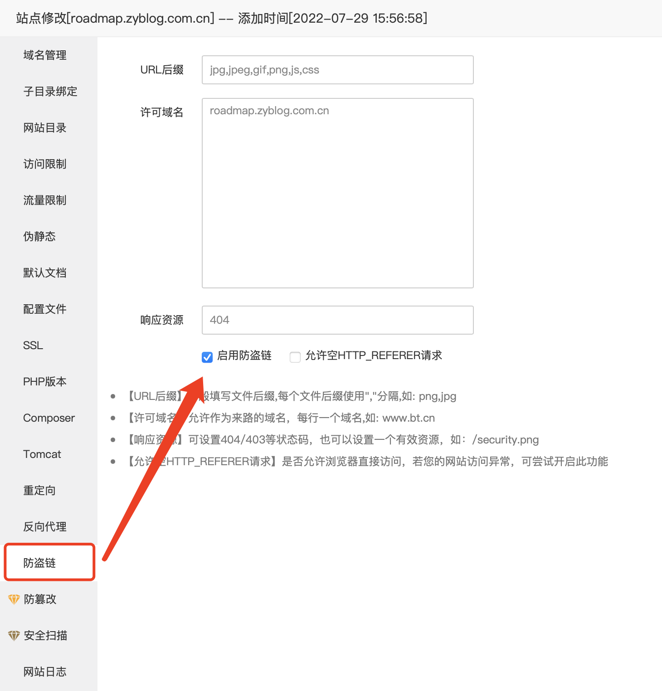

# Nginx学习：随机索引、真实IP处理与来源处理模块

完成了代理这个大模块的学习，我们继续其它 Nginx 中 HTTP 相关的模块学习。今天的内容都比较简单，不过最后的来源处理非常有用，可以帮我们解决外链问题。另外两个其实大家了解一下就好。

今天的内容，除了第一个随机索引的配置指令只能在 location 下使用外，其它的都可以在 http、server、location 中配置。

## 随机索引

之前学习过的 index 指令还记得吧，它是指定某一个具体的文件，然后按顺序从前向后匹配。当我们访问一个目录时，也就是 URI 以 / 结尾时，会按照这个 index 配置的内容去查找文件。而今天，我们要学习的则是另一个类似的指令，只不过它是随机在目录中拿出一个文件来当做默认页索引。

这个模块的命名是 ngx_http_random_index_module 用于处理以斜杠字符（'/'）结尾的请求，并在目录中选择一个随机文件作为索引文件。该模块在 ngx_http_index_module 模块之前处理，也就是说，它的优先级会比 index 高，同时存在的话会走 random_index 。

这个模块不是包含在 Nginx 核心源码中的，需要在编译的时候单独安装，直接加上 --with-http_random_index_module 就可以了。它只有一个配置指令。

### random_index

在指定位置启用或禁用模块处理。

```shell
random_index on | off;
```

只能配置在 location 模块下，默认值为 off 。

测试很简单，我们就这样简单配置一个就好了。

```shell
location /randomindex/ {
  alias html/;
  random_index on;
}
```

然后访问 /randomindex/ 地址，会发现每次刷新返回的页面都不一样。

## 真实IP处理

上篇文章中，我们在代理模块的最后其它部分，讲了 proxy_set_header 的一个非常重要的作用就是用于处理获取客户端真实 IP 的功能。同时也简单说了下在 PHP 框架中，都是怎么处理那两个请求头的。而今天，我们再看一个通过 Nginx 来处理真实 IP ，或者换句话说，让 Nginx 根据配置，从 X-Real-IP 或 X-Forwarded-For 从获取到真实 IP 并放入到 REMOTE_ADDR 中。

这个模块的全称是 ngx_http_realip_module 模块，它也不是在 Nginx 核心源码中的，同样需要在编译时加上 --with-http_realip_module 这个参数，作用就是用于将客户端地址和可选端口更改为在指定头字段中发送的那些。这个模块主要作用于被代理服务器上，也就是后端服务器上。

我们先来看看它的配置指令，后面再综合进行一下测试。

### set_real_ip_from

定义已知发送正确替换地址的可信地址。

```shell
set_real_ip_from address | CIDR | unix:;
```

没有默认值，如果指定了特殊值 unix:，则所有 UNIX 域套接字都将被信任。也可以使用主机名 (1.13.1) 指定可信地址。从版本 1.3.0 和 1.2.1 开始支持 IPv6 地址。

这个就是上篇文章中 TP6 源码里需要配置的那个 `$proxyServerIp`  的作用。之前也说过了，那两个头是可以伪造的，因此需要核对代理服务器的 IP 是否和我们设置的相同，相当于是一个白名单。这个配置指令可以配置多个，就像 TP 或者 Laravel 中会配置成数组一样。我们有可能会有多个代理，代理到同一个后端服务器，因此，就可能有多个可信任的代理服务器。

### real_ip_header

定义请求头字段，其值将用于替换客户端地址。

```shell
real_ip_header field | X-Real-IP | X-Forwarded-For | proxy_protocol;
```

默认值是 X-Real-IP ，包含可选端口的请求头字段值也用于替换客户端端口（1.11.0）。应根据 RFC 3986 指定地址和端口。proxy_protocol 参数 (1.5.12) 将客户端地址更改为来自 PROXY 协议标头的地址。 PROXY 协议必须事先通过在 listen 指令中设置 proxy_protocol 参数来启用。

就是根据哪个请求头参数来获取，在 Nginx 中通过指定的获取到了之后，会直接修改 REMOTE_ADDR 头的信息。

### real_ip_recursive

递归搜索真实 IP 。

```shell
real_ip_recursive on | off;
```

默认值是 off 。如果禁用递归搜索，则与受信任地址之一匹配的原始客户端地址 REMOTE_ADDR 将替换为由 real_ip_header 指令定义的请求标头字段中发送的最后一个地址。如果启用递归搜索，则与其中一个受信任地址匹配的原始客户端地址将替换为请求标头字段中发送的最后一个非受信任地址。

### 变量

这个模块中包含两个变量。

- `$realip_remote_addr` 保留原始客户端地址（1.9.7）
- `$realip_remote_port` 保留原始客户端端口（1.11.0）

### 真实IP测试

由于它是作用在被代理服务器上的，同时也为了测试效果的明显，我们在另一台虚机机 192.168.56.89 上新建一个 location 。

```shell
location ^~ /realip/ {
  alias html/;
  real_ip_recursive on;
  set_real_ip_from 192.168.56.88;
  #real_ip_header X-Forwarded-For;
  fastcgi_pass   unix:/var/sock/php-fpm/www.sock;
  fastcgi_index  index.php;
  fastcgi_param  SCRIPT_FILENAME  $request_filename;
  include        	fastcgi_params;
}
```

暂时先不用打开 real_ip_header 的注释，默认情况下使用的就是 X-Real-IP 。我们先看看它的效果。先在 192.168.56.88 上做一个反向代理。

```shell
location ^~ /realip/ {
  proxy_pass http://192.168.56.89/realip/;
  proxy_set_header X-Real-IP $remote_addr;
  proxy_set_header X-Forwarded-For $proxy_add_x_forwarded_for;
}
```

直接本机电脑上测试，会看到 89 上的 PHP 打印的 `$_SERVER` 里面，REMOTE_ADDR 变成了真实的 IP 192.168.56.1 ，而如果没有 set_real_ip_from 的配置，则会显示 192.168.56.88 。

接下来我们看看 X-Forwarded-For 效果的测试，这个在上篇文章中就简单说过，它会通过 `$proxy_add_x_forwarded_for` 变量不停累加记录代理经过的主机 IP 。当时没有细说，今天咱们就来看看到底是啥意思。

要测试这个，我们需要多层代理的效果，最简单的方式就是直接在客户端加上之前已经配置过的正向代理。这样就会经过一层正向、一层反向，最终到达 89 的目标地址。

先直接在有正向代理的情况下直接访问，会发现 REMOTE_ADDR 又变成了 192.168.56.88 。注意正向代理那里也要加上 proxy_set_header 。但即使加上了，最终的 REMOTE_ADDR 通过 X-Real-IP 取舍还是会出问题。对于多层代理，可以使用 X-Forwarded-For ，它代表历史 IP 记录，但可能伪造。因此在上篇文章中如果你深入的看了 TP6 或者 Laravel 的源码，就会发现它们在使用 X-Forwarded-For 或 X-Real-IP 时会验证 IP 格式。

然后仔细查看 `$_SERVER` ，会发现根据打印出来的内容，X-Forwarded-For 会显示这样的结果。

```shell
[HTTP_X_FORWARDED_FOR] => 192.168.56.1, 192.168.56.88
```

也就是说，客户端的真实 IP 在第一个。我们可以直接修改配置，也就是将上面注释的 real_ip_header 部分打开。

再次测试，REMOTE_ADDR 又会显示正常的真实客户端 IP 192.168.56.1 了。

这下理解为啥 Laravel 直接就是使用 X-Forwarded-For 做为默认的真实 IP 获取头了吧。这个对于多层代理来说更准确一些。

但是，一般来说不太会使用这个 Nginx 的真实IP模块来处理，主要是因为需要独立编译安装，另一个就是这一块的 IP 获取在动态语言中进行也没什么问题。还有一个最主要的原因就是现在框架都自带了，完全没必要再手动来配了，毕竟 Nginx 的配置灵活性还是差些。

## 来源处理

最后来看到的就是今天比较重要的内容，来源处理。为啥说它重要呢？因为它可以帮我们解决一个大问题，那就是防盗链。对于这个概念，可能有些同学都知道，因为云存储已经帮我们解决这个问题了。而如果是自己的小网站，或者是外包的小项目，可能不会去购买类似的云存储服务，就需要有类似的机制节约成本。

一般来说，我们访问图片、视频、js/css 这些静态资源文件，直接通过 URL 就可以访问。同样的，如果有别的网站爬取了你的文章，也可以直接就使用这些资源。但问题是，这些资源是在我们的服务器上，走我们自己的流量带宽的，直接给别人用了？这可是资源的极大浪费啊。

一种方案是图片这种加水印，给你用了你也得帮我做宣传。另一种就是不让用，要么打不开，要么显示另外一个错误图片。第二种就是防盗链。一般这种都是通过请求头中的 Referer 字段来处理的，这个字段的作用就是标明发起请求的来源是谁。比如我们自己的网站带的图片之类的资源，当它们发起请求时，浏览器就会带上 Referer 头，内容就是当前加载图片资源的网址。对于静态资源来说，一般我们不会通过 PHP 之类的动态语言来加载，因此，这一块更多的时候还是在 Nginx 或 Apache 上进行配置。

Nginx 中处理这个的就是 ngx_http_referer_module 模块，它用于阻止对“Referer”标头字段中具有无效值的请求的访问。需要注意的是，使用适当的“Referer”字段值来制作请求非常容易，因此该模块的预期目的不是彻底阻止此类请求，而是阻止常规浏览器发送的大量请求。还应该考虑到，即使对于有效请求，常规浏览器也可能不会发送“Referer”字段。

这个模块是包含在 Nginx 核心源码中的，不需要额外的编译安装。它的指令就三个，还有一个变量，主要核心的就只有一个指令，然后配合变量就可以实现来源判断。我们先看指令和变量的说明，最后再演示。

### referer_hash_bucket_size

设置有效引用者哈希表的桶大小。

```shell
referer_hash_bucket_size size;
```

默认值 64 ，一般不需要设置。

### referer_hash_max_size

设置有效引用者哈希表的最大大小。

```shell
referer_hash_max_size size;
```

默认值 2048 ，一般不需要设置。

### valid_referers

指定将导致嵌入的 `$invalid_referer` 变量设置为空字符串的“Referer”请求标头字段值。

```shell
valid_referers none | blocked | server_names | string ...;
```

如果匹配到了变量将设置为“1”。搜索匹配不区分大小写。参数值包括：

- none 请求标头中缺少“Referer”字段，就是没有 Referer 头，就不处理，保持为空
- blocked “Referer”字段存在于请求标头中，但其值已被防火墙或代理服务器删除，或者此类值是不以“http://”或“https://”开头的字符串
- server_names “Referer”请求标头字段包含服务器名称之一，就是按照当前 Server 模块中的 server_name 来匹配
- arbitrary string 定义服务器名称和可选的 URI 前缀，服务器名称的开头或结尾可以有一个“*”，检查时，“Referer”字段中的服务器端口被忽略，只能前后加 * ，比如 `*.zyblog.com.cn` 或者 `www.zybloc.*` 或者 `*.zyblog.*`
- regular expression 第一个符号应该是“~”。需要注意的是，表达式将与“http://”或“https://”之后的文本匹配

### 变量

`$invalid_referer` 默认空字符串，如果“Referer”请求头字段值没有被匹配上，设置为“1”

注意啊，注意啊，默认是空，匹配上了也是空，没有匹配上才变成 1 ，是反过来的。从名字意思也能看出来 ，invalid 表示无效的意思。valid 表示有效的意思，valid_referers 表示有效的请求头参数，有效的话就不改变这个无效变量的值，无效的话才会将这个无效变量设置为 1 。

### Referer 测试

上面的介绍看懂没，没懂也没关系，咱们直接来测试。先写一个 location ，然后加上 valid_referers 的配置。

```shell
//http
log_format validreferers 'invalid_referer=$invalid_referer';

// server
server{
	………………
  location /referer/ {
    alias html/;
    access_log logs/32.log validreferers;
    
    valid_referers www.zyblog.com.cn *.zyblog.net ~\.testzy.*\.com$;
    if ($invalid_referer) {
      return 404;
    }
    
  }
}
```

什么意思呢？意思就是：

- 来源域名是 www.zyblog.com.cn 
- 来源域名是任意开头的，但必须符合 .zyblog.net 规则的，如 aaa.zyblog.net、bbb.zyblog.net
- 来源域名中包含 .testzy. 并且以及 .com 结尾的，如 aaa.testzy.bbb.ccc.com、ddd.eee.testzy.com

符号上述三条规则的 Referer 请求头字段，不会改变 `$invalid_referer`  的值，保持为空，而如果没匹配上就将 `$invalid_referer` 设置为 1 。然后下面 if 判断 `$invalid_referer` 是否为空，如果不为空，返回 404 ，如果为空，就不处理正常显示。

再次强调，`$invalid_referer` 代表无效的意思，因此 if 条件是直接判断，不用取反。

好了，我们测试一下，直接访问，加上请求头。

```shell
curl -v --request GET 'http://192.168.56.88/referer/' --header 'Referer: http://www.zyblog.com.cn'
```

这个访问的结果是正常的。

```shell
…………
< HTTP/1.1 200 OK
…………
```

在日志中也能看到 `$invalid_referer` 的值是空的。

```shell
invalid_referer=
```

然后我们稍改一下，让它失败。

```shell
curl -v --request GET 'http://192.168.56.88/referer/' --header 'Referer: http://abc.zyblog.com.cn'
```

返回的响应中状态码就变成了 404 。

```shell
…………
< HTTP/1.1 404 Not Found
…………
```

接下来我们测试第二个规则的效果。

```shell
curl -v --request GET 'http://192.168.56.88/referer/' --header 'Referer: http://abc.zyblog.net'
```

结果正常，直接再测试第三个规则。

```shell
curl -v --request GET 'http://192.168.56.88/referer/' --header 'Referer: http://vvvv.testzy.oooo.dddd.com'
```

然后大家就自己随便玩吧，任意修改 Referer 字段，看看返回的结果是 200 还是 404 。

异常拦截的请求因为直接 return 了，所以 access_log 中没有记录到日志，大家可以把 return 注释掉，查看日志中失败的请求变量的变化情况。

```shell
invalid_referer=1
```

接下来，我们再测试下 none 的效果。

```shell
valid_referers  none www.zyblog.com.cn *.zyblog.net ~\.testzy.*\.com$;
```

直接访问，不出意外的话也是可以正常返回 200 的。

```shell
curl -v --request GET 'http://192.168.56.88/referer/'
```

最后再测试一下 blocked 效果。它可以让我们的 Referer 中不用添加协议 ，也就是 http:// 之类的内容。

```shell
valid_referers none blocked www.zyblog.com.cn *.zyblog.net ~\.testzy.*\.com$;
```

这些参数是可以叠加使用的。

```shell
curl -v --request GET 'http://192.168.56.88/referer/' --header 'Referer: vvvv.testzy.oooo.dddd.com'
```

最后还有个 server_names ，它代表的是当前 Server 模块下的 server_name 配置的内容，大家可以自己试下哦。

### 宝塔面板防盗链

现在比较流行的工具 宝塔面板 上，可以直接配置防盗链的设置，只需要填写一些简单的规则就可以了。



别忘了勾上下面的启用防盗链，后面那个空HTTP_REFERER请求就是 none 的作用。我们勾选完成后，生成的配置文件中就会有这样的一段代码。

```shell
#SECURITY-START 防盗链配置
location ~ .*\.(jpg|jpeg|gif|png|js|css)$ {
  expires      30d;
  access_log /dev/null;
  valid_referers roadmap.zyblog.com.cn;
  if ($invalid_referer){
  	return 404;
  }
}
#SECURITY-END
```

试试直接使用链接访问我这个网站上的静态文件，比如 `https://roadmap.zyblog.com.cn/resources/scripts/jquery-3.2.1.min.js` 这个 jquery 文件，看是不是会返回 404  错误。

如果要像像微信公众号文章里的图片一样，显示一个版权图片的话，要么直接 return 301 ，要么直接 rewrite 一个图片路径就好啦。

```shell
if ($invalid_referer) {
  #return 301 /img/1.jpeg;
  rewrite ^/ /img/1.jpeg;
}
```

很多云服务上的防盗链也需要有这些配置，主要就是文件后缀名和允许的域名，和我们在 Nginx 中的配置没差别。当然它们也都和面板工具一样，是图形化操作的，方便很多。

## 总结

今天的内容，前两个的出现频率不高，但是我们要知道 Nginx 是可以实现这些功能的。而最后一个防盗链的操作其实还是比较常见的，但是由于技术的发展，大部分公司使用云服务或者直接使用面板工具就不太需要我们自己配了。相信通过今天的学习，至少原理你应该明白一些了吧，要不就会像我之前一样，知道是干嘛，也知道要去后台配一下，但生成的代码却看不懂，也总是担心吊胆的去配。现在，放大自己的信心吧，有相关的需求咱们直接上。

参考文档：

[http://nginx.org/en/docs/http/ngx_http_random_index_module.html](http://nginx.org/en/docs/http/ngx_http_random_index_module.html)

[http://nginx.org/en/docs/http/ngx_http_realip_module.html](http://nginx.org/en/docs/http/ngx_http_realip_module.html)

[http://nginx.org/en/docs/http/ngx_http_referer_module.html](http://nginx.org/en/docs/http/ngx_http_referer_module.html)