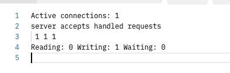
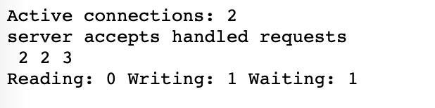
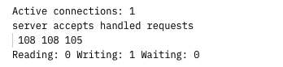
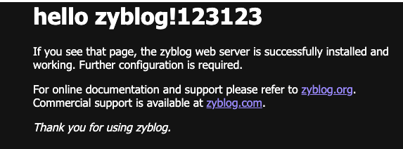

# Nginx学习：运行信息、响应修改及用户标识模块

今天的内容主要是讲三个模块，这三个模块分别可以查看当前 Nginx 的运行状态信息，可以修改返回响应的内容，以及最后一个可以通过 Nginx 生成一个对应客户端的唯一 UID 。这几个功能平时用过的同学可能不多，但是也都非常有意思，有兴趣的小伙伴可以尝试尝试哦。

除了第一个运行信息的配置外，其它配置指令都可以在 http、server、location 下进行配置。

## Nginx 运行信息

就像 Redis 中的 info 命令一样，Nginx 直接提供了一个配置指令，可以直接返回当前 Nginx 服务器的一些状态信息。它的名称是 ngx_http_stub_status_module 模块，作用就是提供对基本状态信息的访问。

这个模块不包含在 Nginx 核心模块中，需要通过 --with-http_stub_status_module 参数编译安装。它只有一个配置指令。

## stub_status

可以从指定位置访问基本状态信息。

```shell
stub_status;
```

只能在 server、location 下定义，不能在 http 下配置，在 1.7.5 之前的版本中，指令语法需要添加一个任意的参数，例如“stub_status on”。我们就简单来测试一下。

```shell
location /status/ {
    stub_status;
}
```

访问 URL 会返回下面这样的内容。



这些信息的含义是：

- Active connections，当前活动客户端连接数，包括等待连接数。
- accepts，接受的客户端连接总数。
- handled，处理的连接总数。通常，除非已达到某些资源限制（例如，worker_connections 限制），否则参数值与 accept 相同。
- requests，客户端请求的总数。
- Reading，nginx 正在读取请求标头的当前连接数。
- Writing，nginx 将响应写回客户端的当前连接数。
- Waiting，当前等待请求的空闲客户端连接数。

我们可以再开一个浏览器，随便访问一个页面，然后查看这些信息。



然后我们再来压测一下。

```shell
ab -c 10 -n 100 http://192.168.56.88:8035/
```

压测完成之后，再次查看。



通过这些测试，就可以看出几个变量的不同状态，requests 是每次刷新都会加 1 ，accepts 与 handled 是 TCP 连接的数量，和浏览器或者刷新次数关系不大。有活跃连接时 Active connections 会反映出来 。剩下的最底下三个不是很好看到效果，但当前在访问的请求总会有一个 Writing 。

很多监控软件可能会用到这些内容，可以直接通过这些数据收集到 Nginx 的运行信息，比如使用 Zabbix 就可以方便地将这些信息采集过去，实现全面的监控。

### 变量

这个模块支持以下嵌入式变量（1.3.14）：

- `$connections_active` 与 Active connections 相同
- `$connections_reading` 与 Reading 相同
- `$connections_writing` 与 Writing 相同
- `$connections_waiting` 与 Waiting 相同

可以将这些变量记录到日志中，比如：

```nginx
log_format stub_status 'connections_active=$connections_active connections_reading=$connections_reading connections_writing=$connections_writing connections_waiting=$connections_waiting';

server{
  ………………
  location /status/ {
    access_log logs/35.stub_status.log stub_status;
    stub_status;
  }
}
```

访问页面后获得的结果是：

```shell
// 35.sub_status.log
connections_active=1 connections_reading=0 connections_writing=0 connections_waiting=0
```

## 修改响应

这个模块主要是针对 Nginx 处理完成之后，获得的响应内容，然后在响应发出之前对这些响应内容进行修改。它的全名是 ngx_http_sub_module 模块，其实是一个过滤器，它通过将一个指定的字符串替换为另一个来修改响应。

这个模块也是需要独立编译安装的，通过 --with-http_sub_module 配置。我们先来看看它的配置项的说明，最后再一起进行测试。

### sub_filter

设置要替换的字符串和替换字符串。

```nginx
sub_filter string replacement;
```

忽略大小写匹配要替换的字符串。要替换的字符串 (1.9.4) 和替换字符串可以包含变量。可以在同一配置级别 (1.9.4) 上指定多个 sub_filter 指令。当且仅当当前级别上没有定义 sub_filter 指令时，这些指令才从先前的配置级别继承。

### sub_filter_last_modified

允许在替换期间保留原始响应中的“Last-Modified”标头字段，以促进响应缓存。

```nginx
sub_filter_last_modified on | off;
```

默认 off ，表示由于响应的内容在处理过程中被修改，头部字段被删除。

### sub_filter_once

指示是否查找每个字符串以替换一次或重复。

```nginx
sub_filter_once on | off;
```

默认 on 。注意，打开或者默认是只替换一次，也就是只替换第一个，而关闭则是符合条件的文本全部替换。

### sub_filter_types

除了“text/html”之外，还可以在具有指定 MIME 类型的响应中进行字符串替换。

```nginx
sub_filter_types mime-type ...;
```

默认值是 text/html ，只针对  html 响应内容进行替换。特殊值“*”匹配任何 MIME 类型 (0.8.29)。

### 修改响应测试

好了，我们来测试一下吧，先准备下面的测试配置。

```nginx
location  /sub1/ {
  alias html/;
  sub_filter nginx zyblog;
  sub_filter 'welcome to' hello;
  sub_filter_once off;

  #sub_filter_types *;
  #sub_filter this that;
  #return 200 'thisisreturn';
}
```

直接访问首页，所有的 "Welcome to Nginx" 都被换成了 "hello zyblog" 。不使用 sub_filter_once 或者 sub_filter_once 为 on 的话，就只有 title 标签中的第一个匹配到的被替换。



然后我们尝试打开 /sub1/a.txt ，并把 `sub_filter this that;` 这行的注释打开，你会发现并没有把文本内容中的 this 替换成 that ，开启 sub_filter_types 为 * 之后，a.txt 的内容就替换成功了。

最后还有一个测试，就是对 return 测试之后，我们会发现替换对于 return 指令也是有效果的。

接下来我们再测试一下代理的响应结果，直接用 FastCGI 测试一下就行。

```nginx
location ^~ /sub2/ {
  alias html/;

  sub_filter server Ss;

  fastcgi_pass unix:/var/sock/php-fpm/www.sock;
  fastcgi_index  index.php;
  fastcgi_param  SCRIPT_FILENAME  $request_filename;
  include        fastcgi_params;
}
```

访问一个 PHP 页面，直接输出 `print_r($_SERVER);` 就好了，我们会发现返回的响应中，第一个 SERVER_NAME 被替换成了 Ss_NAME 。

## UserID 客户端用户标识

这个功能是干嘛的？估计用过的同学真的不多了。它能够为一些 pc 站或者 h5 提供 userid 设置和分析功能，方便数据团队统计 uv 。这是什么意思？做过 App 的同学，一定知道，很多情况下为了统计用户，需要提供一个客户端唯一标识。比如说苹果的 uuid 或者 Android 生成的唯一设备标识。JS 前端也可以根据浏览器信息及设备信息生成这样一个 ID 。而 Nginx 的这个模块，则是从服务端生成。

它的全名是 ngx_http_userid_module 模块，用于设置适合客户端识别的 cookie 信息（一个 uid）。可以使用嵌入式变量 $uid_got 和 $uid_set 记录接收和设置的 cookie 。该模块与 Apache 的 mod_uid 模块兼容。

还是先来看它的配置信息，然后再进行测试。

### userid

启用或禁用设置 cookie 并记录收到的 cookie。

```nginx
userid on | v1 | log | off;
```

默认 off ，几个参数值的意思是：

- on 启用版本 2 cookie 的设置和接收到的 cookie 的记录
- v1 启用版本 1 cookie 的设置和接收到的 cookie 的记录
- 禁用 cookie 的设置，但启用接收到的 cookie 的记录
- 禁用 cookie 的设置和接收到的 cookie 的记录

### userid_domain

定义为其设置 cookie 的域。 

```nginx
userid_domain name | none;
```

默认值为 none ，表示禁用 cookie 的域设置。

### userid_expires

设置浏览器应保留 cookie 的时间。

```shell
userid_expires time | max | off;
```

默认值 off ，参数 max 将导致 cookie 在“2037 年 12 月 31 日 23:55:55 GMT”到期。参数 off 将导致 cookie 在浏览器会话结束时过期。

### userid_flags

为 Cookie 定义标志。

```shell
userid_flags off | flag ...;
```

如果该参数未关闭，则为 cookie 定义一个或多个附加标志：secure、httponly、samesite=strict、samesite=lax、samesite=none。

### userid_mark

如果该参数不关闭，则启用 cookie 标记机制并设置用作标记的字符。

```shell
userid_mark letter | digit | = | off;
```

默认值是 off 。此机制用于添加或更改 userid_p3p 和/或 cookie 过期时间，同时保留客户端标识符。标记可以是英文字母（区分大小写）、数字或“=”字符中的任何字母。

如果设置了标记，则将其与在 cookie 中传递的客户端标识符的 base64 表示中的第一个填充符号进行比较。如果它们不匹配，则使用指定的标记、到期时间和“P3P”标头重新发送 cookie。

### userid_name

设置 cookie 名称。

```shell
userid_name name;
```

默认值就是 uid 。

### userid_p3p

设置将与 cookie 一起发送的“P3P”标头字段的值。

```shell
userid_p3p string | none;
```

默认值是 none 。如果指令设置为特殊值 none，则不会在响应中发送“P3P”标头。

### userid_path

定义为其设置 cookie 的路径。

```shell
userid_path path;
```

### userid_service

如果标识符由多个服务器（服务）发布，则应为每个服务分配自己的编号，以确保客户端标识符是唯一的。

```shell
userid_service number;
```

对于版本 1 cookie，默认值为零。对于版本 2 cookie，默认值是由服务器 IP 地址的最后四个八位字节组成的数字。

### 变量

- `$uid_got` cookie 名称和接收到的客户端标识符。
- `$uid_reset` 如果变量设置为非“0”的非空字符串，则重置客户端标识符。特殊值“log”还导致将有关重置标识符的消息输出到 error_log。
- `$uid_set` cookie 名称和发送的客户端标识符。

### 标识测试

上面很多配置其实都是和 Cookie 相关的，我们就不演示了，直接简单地测试一下生成 userid 就好了。

```nginx
log_format userid 'uid_got=$uid_got uid_reset=$uid_reset uid_set=$uid_set';
server{
  # .....
  location /userid/ {
    alias html/;
    access_log logs/35.userid.log userid;
    
    userid on;
    userid_name uuid;
    set $uid_reset $arg_reset;
  }
}
```

这段配置中，我们打开了 userid ，然后将 cookie 名称设置为 uuid ，如果不设置的话，默认就是 uid 这个名称。然后根据请求传递过来的 reset 参数设置 `$uid_reset` 变量的值。

访问页面后，在响应头中会看到下面这样的内容。

```shell
Set-Cookie: uuid=wKg4WGMqcy5L3RLuAwMDAg==; path=/
```

现在明白是啥意思了吧。然后我们再次刷新页面，不会有新的 Cookie 响应回来了，接着给请求添加一个参数，比如：`/userid/?reset=1` ，就会发现又返回了 uuid 的 Cookie 信息。

然后查看日志，第一次请求是这样的。

```shell
// 35.userid.log
uid_got=uuid=5838A8C0CA692A638C123F2402030303 uid_reset= uid_set=-
```

使用 `$uid_reset` 之后，`$uid_set` 值也发生了变化。

```shell
// 35.userid.log
uid_got=uuid=5838A8C0CA692A638C123F2402030303 uid_reset=1 uid_set=uuid=5838A8C02E732A63EE12DD4B02030303
```

### 反解 UserID 的编码内容

大家有没有发现一个问题，上面实际 Cookie 返回的 ID 标识和日志中记录的是不一样的，一个是明显的 Base64 编码，另一个则不太清楚是什么编码。但其实我们也能想到，这个编码和 Base64 那个编码的结果是相对应的。那么，咱们就从 Base64 的编码结果入手，网上有使用 PHP 解码的资料，直接拿过来用。

```shell
<?php
$str = 'wKg4WGMqdEZMHhLsAwMJAg==';
$hash = unpack('N*', base64_decode(str_replace(' ',  '+', $str)));

print_r($hash);

$server_ip = long2ip($hash[1]);
$time = date('Y-m-d H:i:s', $hash[2]);
echo $server_ip,',',$time;

// 输出结果
Array
(
    [1] => 3232249944
    [2] => 1663726662
    [3] => 1277039340
    [4] => 50530562
)
192.168.56.88,2022-09-21 02:17:42
```

可以看出，解码之后再用 unpack() 进行二进制解码，就会获得一个数组。数组的第一个元素是服务器的 IP 地址，第二个参数是生成 userid 时的时间戳。那么第三第四个是什么内容呢？第一次，也是唯一一次，咱们去看一下 Nginx 的源码吧。

```c++
// nginx-1.23.0/src/http/modules/ngx_http_userid_filter_module.c 592-638行

if (conf->service == NGX_CONF_UNSET) {

  c = r->connection;

  if (ngx_connection_local_sockaddr(c, NULL, 0) != NGX_OK) {
    return NGX_ERROR;
  }

  switch (c->local_sockaddr->sa_family) {

      #if (NGX_HAVE_INET6)
    case AF_INET6:
      sin6 = (struct sockaddr_in6 *) c->local_sockaddr;

      p = (u_char *) &ctx->uid_set[0];

      *p++ = sin6->sin6_addr.s6_addr[12];
      *p++ = sin6->sin6_addr.s6_addr[13];
      *p++ = sin6->sin6_addr.s6_addr[14];
      *p = sin6->sin6_addr.s6_addr[15];

      break;
      #endif

      #if (NGX_HAVE_UNIX_DOMAIN)
    case AF_UNIX:
      ctx->uid_set[0] = 0;
      break;
      #endif
    default: /* AF_INET */
      sin = (struct sockaddr_in *) c->local_sockaddr;
      ctx->uid_set[0] = sin->sin_addr.s_addr;
      break;
  }

} else {
  ctx->uid_set[0] = htonl(conf->service);
}

ctx->uid_set[1] = htonl((uint32_t) ngx_time());
ctx->uid_set[2] = htonl(start_value);
ctx->uid_set[3] = htonl(sequencer_v2);
sequencer_v2 += 0x100;
if (sequencer_v2 < 0x03030302) {
  sequencer_v2 = 0x03030302;
}
```

注意，上面的源码我们看的是 v2 ，也就是 userid on 这种形式的 userid 生成形式，如果使用 v1 的话，则代码是在这段代码的上面，略有不同。从这段代码中我们可以再继续查找第 3 个和第 4 个元素是什么内容。

第3个，这里看到是 start_value 这个变量，继续查找这个变量是在哪里定义的。从源码中可以找到，它是在 ngx_http_userid_init_worker 函数中被赋值的，也是源码中最底下的函数。

```c++
start_value = (((uint32_t) tp.tv_usec / 20) << 16) | ngx_pid;
```

tp.tv_usec 是 Linux 运行的微秒计时器，通过 tp.tv_usec 的位移操作，并与 nix_pid 进行或运算，获得第三个元素的值。

第4个，变量名为 sequencer_v2 ，其实是个递增数字，从 0x03030302 开始，每次增加 0x100，上面解码的内容中，50530562 转 16进制后正是 3030902 这是我快速的刷新了 9 次之后的结果。注意这个元素并不是一直累加，而是根据上面三个参数，如果三个参数相同，才会增加。如果使用 v1 格式的话，则是从十进制数字 1 开始。

至于这个数组里面的内容又是如何与上面日志中的内容匹配上的呢？直接将我们打印出来的数组的第一个元素 3232249944 转换成十六进制，结果为 C0A83858 ，再和日志中 `$uid_set` 核对一下，看看找到规律了没？

## 总结

不容易啊，我们竟然去看了 Nginx 的源码，以我这从来没系统学过 C++ 的水平。还好，现代化的编程语言很多东西都是相通的，基础逻辑部分还是能够简单看明白的。但如果要说得更详细就真是力不从心了。

总体来说，运行信息这个模块配置还是很有用的，也能够集成到 Zabbix 等运维软件中。响应修改这个其实用得不多，毕竟大部分情况下我们会直接修改源码了。最后的用户标识模块，场景是有，但是相对客户端生成来说，可能并不是特别的灵活。但如果想要做到统一，比如说不管是苹果还是安卓，甚至是 H5 页面，都使用统一的 userid 的话，直接服务端生成 userid 肯定是最好的选择。

参考文档：

[http://nginx.org/en/docs/http/ngx_http_stub_status_module.html](http://nginx.org/en/docs/http/ngx_http_stub_status_module.html)

[http://nginx.org/en/docs/http/ngx_http_sub_module.html](http://nginx.org/en/docs/http/ngx_http_sub_module.html)

[http://nginx.org/en/docs/http/ngx_http_userid_module.html](http://nginx.org/en/docs/http/ngx_http_userid_module.html)

