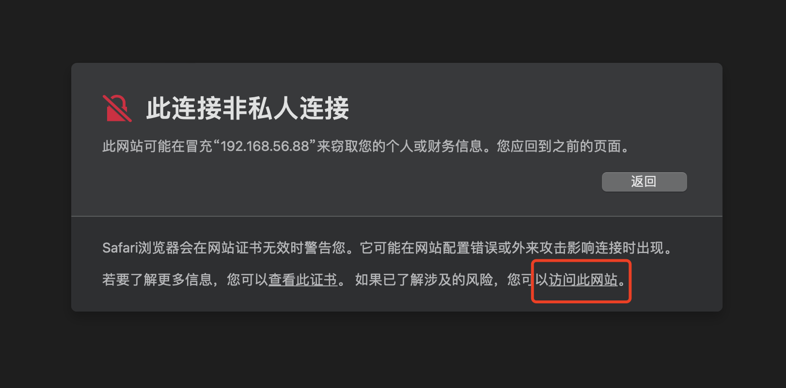
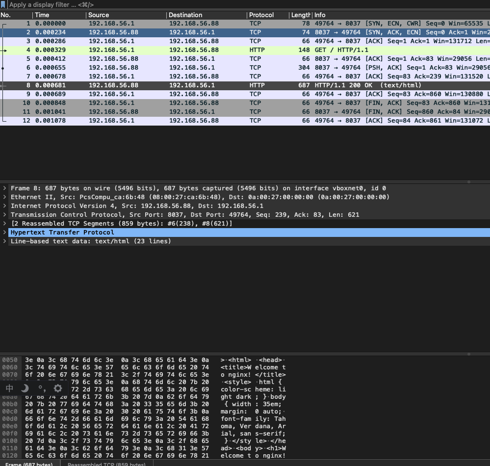
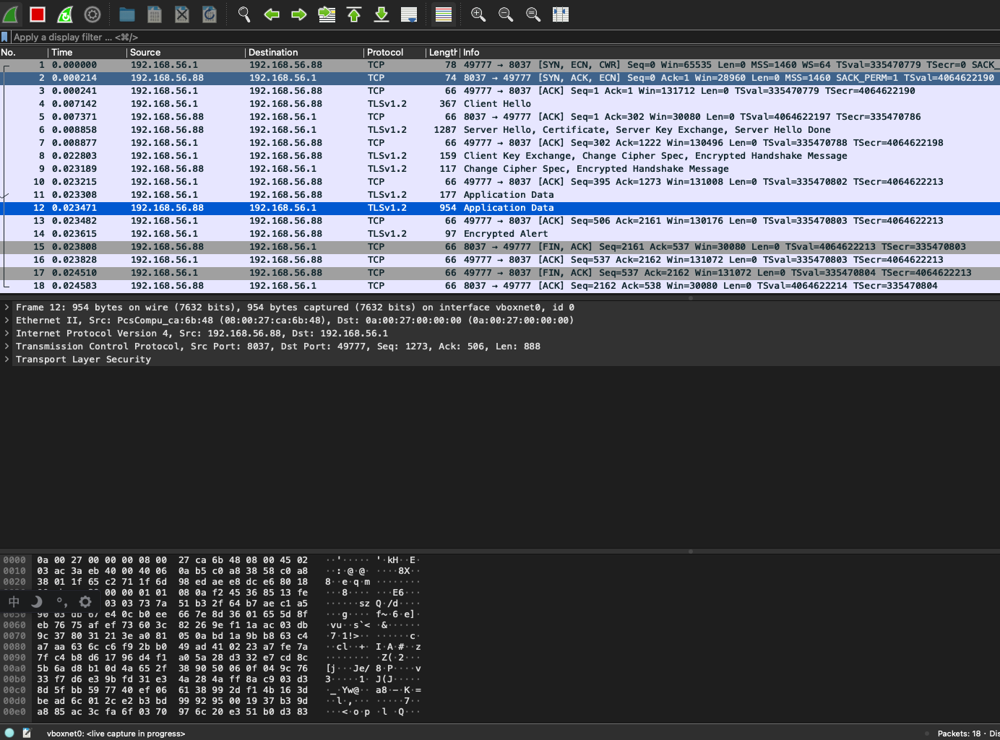

# Nginx学习：SSL模块（一）简单配置与指令介绍

又是一个重点模块，SSL 模块，其实就是我们常见的 HTTPS 所需要的配置模块。HTTPS 的重要性不用多说了吧，现在所有的 App、小程序 都强制要求是 HTTPS 的，即使是网站开发，百度也明确了对 HTTPS 的收录会更好。也就是说，HTTPS 已经成为了事实上的正式环境协议标准。

在 Nginx 中，使用 ngx_http_ssl_module 来配置 HTTPS 其实非常简单，不过首先要确认这个模块是否安装了，默认情况下，它是不会自动安装的，需要我们在编译时加上 --with-http_ssl_module 来进行安装。不过现在不管是面板工具还是各种安装教程，都会建议并直接安装上这个模块。

它的配置指令比较多，我们先来配置一套并测试一下，然后了解一下所有的配置指令。下篇文章再拿一套配置进行简单地分析。

先准备证书，这个证书如果要按正式的来说，我们应该去证书提供商那里买的，当然也有一些免费的。或者使用 宝塔面板 之类的工具也有提供免费的 Let's Encrypt 证书。在这里我们进行本地演示，就直接生成证书好了。

```shell
[root@localhost article.http.d]# openssl req -new -nodes -newkey rsa:2048 -keyout 37.key -out 37.csr
Generating a RSA private key
......................+++++
..............+++++
writing new private key to '37.key'
-----
You are about to be asked to enter information that will be incorporated
into your certificate request.
What you are about to enter is what is called a Distinguished Name or a DN.
There are quite a few fields but you can leave some blank
For some fields there will be a default value,
If you enter '.', the field will be left blank.
-----
Country Name (2 letter code) [XX]:
State or Province Name (full name) []:
Locality Name (eg, city) [Default City]:
Organization Name (eg, company) [Default Company Ltd]:
Organizational Unit Name (eg, section) []:
Common Name (eg, your name or your server's hostname) []:
Email Address []:

Please enter the following 'extra' attributes
to be sent with your certificate request
A challenge password []:
An optional company name []:

[root@localhost article.http.d]# openssl x509 -req -days 365 -in 37.csr -signkey 37.key -out 37.crt
Signature ok
subject=C = XX, L = Default City, O = Default Company Ltd
Getting Private key

[root@localhost article.http.d]# ll 37*
-rw-r--r-- 1 root root  172 Sep 22 09:13 37.conf
-rw-r--r-- 1 root root 1115 Sep 22 09:15 37.crt
-rw-r--r-- 1 root root  952 Sep 22 09:14 37.csr
-rw------- 1 root root 1704 Sep 22 09:08 37.key
```

使用 openssl 命令，生成的 csr 和 key 是我们需要的东西。如果你是从云服务商那里买的或者找的免费申请的，在收到邮件下载之后，获得的也是这两个文件。

然后我们就直接用它们进行配置吧。

```shell
server{
 listen 8037;
 listen 443 ssl;
 root html;

 ssl_certificate /etc/nginx/article.http.d/37.crt;
 ssl_certificate_key /etc/nginx/article.http.d/37.key;

}
```

上面这个配置，我们指定 listen 443 ，并加了 ssl 参数，表示这个端口使用 SSL 监听。然后通过两个配置指令指定证书，这里可以写绝对路径也可以写相对路径，如果是相对路径，就是找的 Nginx 运行 prefix 目录。

就这么简单，配完了。接下来访问一下 https://192.168.56.88/ 吧。



这是什么情况？为啥访问不了呢？其实呀，我们自己生成的证书是没有经过 CA 认证的，这个 CA 的概念就是一个中介信任机构。如果我们从网上买的证书，会经过一些指定的 CA 机构认证。浏览器也会通过这些 CA 机构来判断你的证书是不是合法的，如果没有 CA 认证，就说明这个证书的来源不明，可能不是正规的或者被篡改了。因此，浏览器的安全机制就会出现这样的提示。

我们只需要忽略并确认继续访问之后就可以直接打开了，但是浏览器地址栏上的 https 这几个字符会有个删除斜杠，表示这个链接是有问题的（或者有个小红锁之类的）。大家可以自己看看哦。

普通的 8037 端口还是可以通过 http 访问的，我们也可以在 listen 8037 后面加上 ssl 参数，让 8037 也走 HTTPS 。并且 WireShark 查看效果。

先来看看普通情况下的 WireShark 抓包情况。



数据是明文的。接下来，添加 ssl 参数 ` listen 8037 ssl;` ，重载配置后使用 https 进行访问。



很明显，连接建立时就出现 TLVS 连接了，结果也是乱码的加密信息了。

接下来我们再测试一下，使用普通的 http 协议是不是能访问带 ssl 的端口呢？抱歉，直接 400 错误了，错误信息也非常清楚。

```shell
// 访问普通 http://192.168.56.88:8037/
<html>
<head><title>400 The plain HTTP request was sent to HTTPS port</title></head>
<body>
<center><h1>400 Bad Request</h1></center>
<center>The plain HTTP request was sent to HTTPS port</center>
<hr><center>nginx/1.23.0</center>
</body>
</html>

```

如果去掉 ssl ，但是又直接使用 https 访问呢？会直接报出这样的错误信息。

```shell
// 访问 https://192.168.56.88:8037/
Error: write EPROTO 140347956612328:error:100000f7:SSL routines:OPENSSL_internal:WRONG_VERSION_NUMBER:../../../../src/third_party/boringssl/src/ssl/tls_record.cc:242:
```

好了，一套简单的 HTTPS 配置我们就完成了。

其实从上面也可以看出，最核心的就是三个配置指令，就可以完成整个 HTTPS 相关的配置。不过，整个 SSL 的配置远不止这些，虽说其它的可能并不常用吧，但不妨碍我们了解一下。大部分配置在官方文档中显示都只能在 http、server 下配置，但有些其实也可以配置在 location 里面。下面我们就一个一个先看看这些配置信息的介绍。

## 配置指令

### ssl

开启或关闭 ssl 。

```shell
ssl on | off;
```

默认 off ，该指令在版本 1.15.0 中已过时，应该使用 listen 指令的 ssl 参数。（新版本的就不要用这个啦~）

### ssl_buffer_size

设置用于发送数据的缓冲区大小。

```nginx
ssl_buffer_size size;
```

默认情况下，缓冲区大小为 16k，这对应于发送大响应时的最小开销。为了最小化第一个字节的时间，使用较小的值可能是有益的。一般不需要去设置这个。

### ssl_certificate

为给定的虚拟服务器指定带有 PEM 格式证书的文件。

```nginx
ssl_certificate file;
```

如果除了主证书之外还应指定中间证书，则应按以下顺序在同一文件中指定它们：首先是主证书，然后是中间证书。 PEM 格式的密钥可以放在同一个文件中。

从 1.11.0 版本开始，可以多次指定该指令以加载不同类型的证书，例如 RSA 和 ECDSA。只有 OpenSSL 1.0.2 或更高版本支持不同证书的单独证书链。对于旧版本，只能使用一个证书链。从 1.15.9 版本开始，在使用 OpenSSL 1.0.2 或更高版本时，可以在文件名中使用变量。请注意，使用变量意味着将为每次 SSL 握手加载证书，这可能会对性能产生负面影响。

可以指定值 data:$variable 来代替文件 (1.15.10)，它从变量加载证书而不使用中间文件。请注意，不恰当地使用此语法可能会产生安全隐患，例如将密钥数据写入错误日志。应该记住，由于最大互操作性的 HTTPS 协议限制，虚拟服务器应该侦听不同的 IP 地址。

### ssl_certificate_key

为给定的虚拟服务器指定具有 PEM 格式的密钥的文件。

```shell
ssl_certificate_key file;
```

可以指定值 engine:name:id 代替文件 (1.7.9)，该文件从 OpenSSL 引擎名称加载具有指定 id 的密钥。可以指定值 data:$variable 代替文件 (1.15.10)，该文件从变量加载密钥而不使用中间文件。请注意，不恰当地使用此语法可能会产生安全隐患，例如将密钥数据写入错误日志。

从版本 1.15.9 开始，在使用 OpenSSL 1.0.2 或更高版本时，可以在文件名中使用变量。

### ssl_ciphers

指定启用的加密算法。

```shell
ssl_ciphers HIGH:!aNULL:!MD5;
```

加密算法以 OpenSSL 库可以理解的格式指定。可以使用“openssl ciphers”命令查看完整列表。之前的 nginx 版本默认使用不同的加密算法。

### ssl_client_certificate

如果启用了 ssl_stapling，则指定一个带有 PEM 格式的可信 CA 证书的文件，用于验证客户端证书和 OCSP 响应。

```shell
ssl_client_certificate file;
```

证书列表将发送给客户。如果不需要，可以使用 ssl_trusted_certificate 指令。

### ssl_conf_command

设置任意 OpenSSL 配置命令。

```shell
ssl_conf_command name value;
```

使用 OpenSSL 1.0.2 或更高版本时支持该指令。可以在同一级别上指定多个 ssl_conf_command 指令，当且仅当当前级别上没有定义 ssl_conf_command 指令时，这些指令才从先前的配置级别继承。请注意，直接配置 OpenSSL 可能会导致意外行为。

### ssl_crl

指定用于验证客户端证书的 PEM 格式的已撤销证书 (CRL) 文件。

```shell
ssl_crl file;
```

### ssl_dhparam

为 DHE 密码指定具有 DH 参数的文件。

```nginx
ssl_dhparam file;
```

默认情况下未设置任何参数，因此不会使用 DHE 密码。在 1.11.0 版本之前，默认使用内置参数。

### ssl_early_data

启用或禁用 TLS 1.3 早期数据。

```shell
ssl_early_data on | off;
```

默认值是 off ，在早期数据中发送的请求会受到重放攻击。为了防止在应用层受到此类攻击，应使用 `$ssl_early_data` 变量。使用 OpenSSL 1.1.1 或更高版本 (1.15.4) 和 BoringSSL 时支持该指令。

### ssl_ecdh_curve

指定 ECDHE 密码的曲线。

```shell
ssl_ecdh_curve curve;
```

默认值是 auto ，使用 OpenSSL 1.0.2 或更高版本时，可以指定多条曲线 (1.11.0)，特殊值 auto (1.11.0) 指示 nginx 在使用 OpenSSL 1.0.2 或更高版本或使用旧版本的 prime256v1 时使用内置于 OpenSSL 库中的列表。

在 1.11.0 版本之前，默认使用 prime256v1 曲线。当使用 OpenSSL 1.0.2 或更高版本时，该指令设置服务器支持的曲线列表。因此，为了使 ECDSA 证书发挥作用，重要的是包含证书中使用的曲线。

### ssl_ocsp

启用客户端证书链的 OCSP 验证。

```shell
ssl_ocsp on | off | leaf;
```

默认值是 off ，叶参数仅启用客户端证书的验证。使 OCSP 验证正常工作，应将 ssl_verify_client 指令设置为 on 或可选。要解析 OCSP 响应程序主机名，还应指定解析器指令。

### ssl_ocsp_cache

为 OCSP 验证设置存储客户端证书状态的缓存的名称和大小。

```shell
ssl_ocsp_cache off | [shared:name:size];
```

默认值是 off ，缓存在所有工作进程之间共享。同名缓存可用于多个虚拟服务器。off 参数禁止使用缓存。

### ssl_ocsp_responder

覆盖“授权信息访问”证书扩展中指定的 OCSP 响应者的 URL，以验证客户端证书。

```shell
ssl_ocsp_responder url;
```

仅支持“http://”OCSP 响应。

### ssl_password_file

指定一个包含密钥密码短语的文件，其中每个密码短语在单独的行中指定。

```shell
ssl_password_file file;
```

加载密钥时会依次尝试密码短语。

### ssl_prefer_server_ciphers

指定在使用 SSLv3 和 TLS 协议时，服务器加密算法应优先于客户端加密算法。

```shell
ssl_prefer_server_ciphers on | off;
```

默认值 off 。

### ssl_protocols

启用指定的协议。

```shell
ssl_protocols [SSLv2] [SSLv3] [TLSv1] [TLSv1.1] [TLSv1.2] [TLSv1.3];
```

默认值是 TLSv1 TLSv1.1 TLSv1.2 ，TLSv1.1 和 TLSv1.2 参数（1.1.13、1.0.12）仅在使用 OpenSSL 1.0.1 或更高版本时有效。TLSv1.3 参数 (1.13.0) 仅在使用 OpenSSL 1.1.1 或更高版本时有效。

### ssl_reject_handshake

如果启用，服务器块中的 SSL 握手将被拒绝。

```shell
ssl_reject_handshake on | off;
```

默认 off 。

### ssl_session_cache

设置存储会话参数的缓存的类型和大小。

```shell
ssl_session_cache off | none | [builtin[:size]] [shared:name:size];
```

它的参数意义是：

- off 严格禁止使用会话缓存：nginx 明确告诉客户端会话可能不会被重用。
- none 温和地禁止使用会话缓存：nginx 告诉客户端会话可以被重用，但实际上并没有将会话参数存储在缓存中。
- builtin OpenSSL 中内置的缓存；仅由一个工作进程使用。缓存大小在会话中指定。如果未给出大小，则等于 20480 个会话。使用内置缓存会导致内存碎片。
- shared 所有工作进程之间共享的缓存。缓存大小以字节为单位指定；一兆字节可以存储大约 4000 个会话。每个共享缓存都应该有一个任意名称。同名缓存可用于多个虚拟服务器。

两种缓存类型可以同时使用，例如：

```shell
ssl_session_cache builtin:1000 shared:SSL:10m;
```

但是只使用没有内置缓存的共享缓存应该更有效。

### ssl_session_ticket_key

使用用于加密和解密 TLS 会话票证的密钥设置文件。

```shell
ssl_session_ticket_key file;
```

如果必须在多个服务器之间共享相同的密钥，则该指令是必需的。默认情况下，使用随机生成的密钥。

如果指定了多个密钥，则仅第一个密钥用于加密 TLS 会话票证。这允许配置密钥轮换，例如：

```shell
ssl_session_ticket_key current.key;
ssl_session_ticket_key previous.key;
```

该文件必须包含 80 或 48 字节的随机数据，根据文件大小，使用 AES256（对于 80 字节密钥，1.11.8）或 AES128（对于 48 字节密钥）进行加密。

### ssl_session_tickets

通过 TLS 会话票证启用或禁用会话恢复。

```shell
ssl_session_tickets on | off;
```

默认 on 。

### ssl_session_timeout

指定客户端可以重用会话参数的时间。

```shell
ssl_session_timeout time;
```

默认 5m 。

### ssl_stapling

启用或禁用服务器对 OCSP 响应的装订。

```shell
ssl_stapling on | off;
```

默认 off ，要使 OCSP 装订工作，应该知道服务器证书颁发者的证书。如果 ssl_certificate 文件不包含中间证书，则服务器证书颁发者的证书应存在于 ssl_trusted_certificate 文件中。对于 OCSP 响应程序主机名的解析，还应指定解析器指令。

### ssl_stapling_file

设置后，将从指定文件中获取装订的 OCSP 响应，而不是查询服务器证书中指定的 OCSP 响应者。

```shell
ssl_stapling_file file;
```

该文件应采用“openssl ocsp”命令生成的 DER 格式。

### ssl_stapling_responder

覆盖“授权信息访问”证书扩展中指定的 OCSP 响应者的 URL。

```shell
ssl_stapling_responder url;
```

仅支持“http://”OCSP 响应。

### ssl_stapling_verify

启用或禁用服务器对 OCSP 响应的验证。

```shell
ssl_stapling_verify on | off;
```

默认值 off ，为了使验证工作，服务器证书颁发者的证书、根证书和所有中间证书应使用 ssl_trusted_certificate 指令配置为受信任的。

### ssl_trusted_certificate

如果启用了 ssl_stapling，则指定一个带有 PEM 格式的可信 CA 证书的文件，用于验证客户端证书和 OCSP 响应。

```shell
ssl_trusted_certificate file;
```

与 ssl_client_certificate 设置的证书相反，这些证书的列表不会发送给客户端。

### ssl_verify_client

启用客户端证书的验证。验证结果存储在 `$ssl_client_verify` 变量中。

```shell
ssl_verify_client on | off | optional | optional_no_ca;
```

默认值 off 。可选 optional 参数 (0.8.7+) 请求客户端证书并验证证书是否存在。

optional_no_ca 参数（1.3.8、1.2.5）请求客户端证书，但不要求它由受信任的 CA 证书签名。这适用于 nginx 外部的服务执行实际证书验证的情况。证书的内容可通过 `$ssl_client_cert `变量访问。

### ssl_verify_depth

在客户端证书链中设置验证深度。

```shell
ssl_verify_depth number;
```

默认 1 。

## 总结

上面的配置是不是很多看着都很懵圈啊？如果是的话，那么咱们水平其实差不多，很多我也不知道是啥意思。但是就像前面说的，本着了解的态度来学习嘛。当然，最核心的那三个，也就是最上面我们配置的那三个还是需要了解的。还好，一个是要在 listen 后面跟上一个 ssl 参数，表示开启这个端口的 SSL 访问。另外两个就是指定密钥文件的地址。这三个配置说实话，真不复杂，也非常好记。

下篇文章我们将继续 SSL 的学习，主要是继续介绍 SSL 模块的错误状态码、变量信息以及分析一下宝塔生成的 SSL 配置是什么内容。

参考文档：

[http://nginx.org/en/docs/http/ngx_http_ssl_module.html#ssl_conf_command](http://nginx.org/en/docs/http/ngx_http_ssl_module.html#ssl_conf_command)


