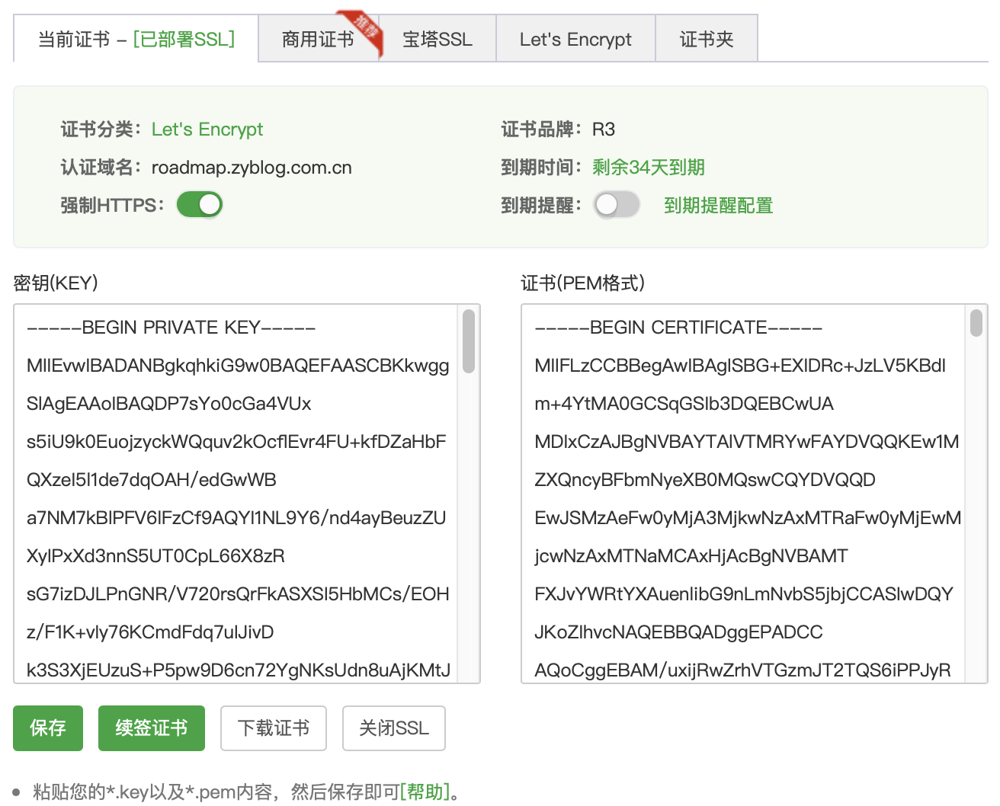

# Nginx学习：SSL模块（二）错误状态码、变量及宝塔配置分析

继续我们的 SSL 模块的学习。上回其实我们已经搭建起了一个 HTTPS 服务器了，只用了三个配置，其中一个是 listen 的参数，另外两个是指定密钥文件的地址，一个是 crt 文件，一个是 key 文件。今天我们将学习到的是 SSL 中的错误状态码、变量相关的内容，以及最后会看一下在宝塔中配置 SSL 之后，它生成的配置指令是什么样的。

今天的内容不多，但最后的宝塔配置分析还是值得一看的。毕竟要解决的就是大家知其然，也要知其所以然的问题。而先前的我，正是不知其所以然。因此，很多时候，用工具可以配，但是配了之后不敢动，生怕出现什么问题。因为配出来的内容完全不懂是在干嘛呀。咱们今天，主力先解决这个问题。

## 错误状态码

首先就是错误状态码，在 Nginx 的 SSL 模块中，支持几个非标准错误代码，可用于使用 error_page 指令进行重定向：

- 495 客户端证书验证过程中发生错误。
- 496 客户未出示所需的证书。
- 497 已向 HTTPS 端口发送常规请求。

重定向发生在请求被完全解析并且变量（例如 `$request_uri`、`$uri`、`$args` 等）可用之后。这三个状态码大家了解一下，如果遇到了返回这三个状态码信息的时候，千万别慌，赶紧看看 SSL 的配置是否有问题。

## SSL 相关变量

SSL 模块中提供的变量非常多，可以说是仅次于 HTTP 核心模块提供的变量数量了。这些变量内容也是大家了解一下即可。

- `$ssl_alpn_protocol` 返回 ALPN 在 SSL 握手期间选择的协议，否则返回空字符串 (1.21.4)。
- `$ssl_cipher` 返回用于已建立 SSL 连接的加密算法的名称。
- `$ssl_ciphers` 返回客户端 (1.11.7) 支持的加密算法列表。已知密码按名称列出，未知密码以十六进制显示。只有在使用 OpenSSL 1.0.2 或更高版本时才完全支持该变量。对于旧版本，该变量仅可用于新会话并且仅列出已知密码。
- `$ssl_client_escaped_cert` 为已建立的 SSL 连接 (1.13.5) 返回 PEM 格式（urlencoded）的客户端证书。
- `$ssl_client_cert` 为已建立的 SSL 连接返回 PEM 格式的客户端证书，除第一行之外的每一行都以制表符开头；这旨在用于 proxy_set_header 指令。该变量已弃用，应改为使用 `$ssl_client_escaped_cert` 变量。
- `$ssl_client_fingerprint` 返回已建立 SSL 连接 (1.7.1) 的客户端证书的 SHA1 指纹。
- `$ssl_client_i_dn` 根据 RFC 2253 (1.11.6) 返回已建立 SSL 连接的客户端证书的“颁发者 DN”字符串。
- `$ssl_client_i_dn_legacy` 返回已建立 SSL 连接的客户端证书的“颁发者 DN”字符串，在 1.11.6 版本之前，变量名称是 `$ssl_client_i_dn`。
- `$ssl_client_raw_cert` 为已建立的 SSL 连接返回 PEM 格式的客户端证书。
- `$ssl_client_s_dn` 根据 RFC 2253 (1.11.6) 返回已建立 SSL 连接的客户端证书的“主题 DN”字符串。
- `$ssl_client_s_dn_legacy` 返回已建立 SSL 连接的客户端证书的“主题 DN”字符串，在 1.11.6 版本之前，变量名称是 `$ssl_client_s_dn` 。
- `$ssl_client_serial` 返回已建立 SSL 连接的客户端证书的序列号。
- `$ssl_client_v_end` 返回客户端证书的结束日期（1.11.7）。
- `$ssl_client_v_remain` 返回客户端证书到期前的天数（1.11.7）。
- `$ssl_client_v_start` 返回客户端证书的开始日期（1.11.7）。
- `$ssl_client_verify` 如果证书不存在，则返回客户端证书验证的结果：“SUCCESS”、“FAILED:reason”和“NONE”，在 1.11.7 版本之前，“FAILED”结果不包含原因字符串。
- `$ssl_curve` 返回用于 SSL 握手密钥交换过程 (1.21.5) 的协商曲线。已知曲线按名称列出，未知曲线以十六进制显示。仅当使用 OpenSSL 3.0 或更高版本时才支持该变量。对于旧版本，变量值将是一个空字符串。
- `$ssl_curves` 回客户端 (1.11.7) 支持的曲线列表。已知曲线按名称列出，未知曲线以十六进制显示。仅当使用 OpenSSL 1.0.2 或更高版本时才支持该变量。对于旧版本，变量值将是一个空字符串。该变量仅适用于新会话。
- `$ssl_early_data` 如果使用 TLS 1.3 早期数据并且握手未完成，则返回“1”，否则返回“”（1.15.3）。
- `$ssl_protocol` 返回已建立的 SSL 连接的协议。
- `$ssl_server_name` 返回通过 SNI (1.7.0) 请求的服务器名称。
- `$ssl_session_id` 返回已建立 SSL 连接的会话标识符。
- `$ssl_session_reused` 如果 SSL 会话被重用，则返回“r”，或否则返回“.”（1.5.11）。

我们可以通过记录记录访问日志来查看这些变量的设置情况，比如像下面这样配置。

```shell
log_format ssl 'ssl_alpn_protocol=$ssl_alpn_protocol ssl_cipher=$ssl_cipher ssl_ciphers=$ssl_ciphers'
                'ssl_client_escaped_cert=$ssl_client_escaped_cert ssl_client_cert=$ssl_client_cert ssl_client_fingerprint=$ssl_client_fingerprint'
                'ssl_client_i_dn=$ssl_client_i_dn ssl_client_i_dn_legacy=$ssl_client_i_dn_legacy ssl_client_raw_cert=$ssl_client_raw_cert'
                'ssl_client_s_dn=$ssl_client_s_dn ssl_client_s_dn_legacy=$ssl_client_s_dn_legacy ssl_client_serial=$ssl_client_serial'
                'ssl_client_v_end=$ssl_client_v_end ssl_client_v_remain=$ssl_client_v_remain ssl_client_v_start=$ssl_client_v_start'
                'ssl_client_verify=$ssl_client_verify ssl_curve=$ssl_curve ssl_curves=$ssl_curves'
                'ssl_early_data=$ssl_early_data ssl_protocol=$ssl_protocol ssl_server_name=$ssl_server_name'
                'ssl_session_id=$ssl_session_id ssl_session_reused=$ssl_session_reused';

server{
	 ………………
	 access_log logs/37.log ssl;
}
```

配置成功后，访问 https 页面，日志中就会记录下面这些内容。

```shell
ssl_alpn_protocol=- ssl_cipher=ECDHE-RSA-AES128-GCM-SHA256 ssl_ciphers=TLS_AES_128_GCM_SHA256:TLS_AES_256_GCM_SHA384:TLS_CHACHA20_POLY1305_SHA256:ECDHE-RSA-AES128-GCM-SHA256:ECDHE-ECDSA-AES128-GCM-SHA256:ECDHE-RSA-AES256-GCM-SHA384:ECDHE-ECDSA-AES256-GCM-SHA384:ECDHE-ECDSA-CHACHA20-POLY1305:ECDHE-RSA-CHACHA20-POLY1305:ECDHE-ECDSA-AES128-SHA:ECDHE-RSA-AES128-SHA:ECDHE-ECDSA-AES256-SHA:ECDHE-RSA-AES256-SHA:AES128-GCM-SHA256:AES256-GCM-SHA384:AES128-SHA:AES256-SHA:DES-CBC3-SHAssl_client_escaped_cert=- ssl_client_cert=- ssl_client_fingerprint=-ssl_client_i_dn=- ssl_client_i_dn_legacy=- ssl_client_raw_cert=-ssl_client_s_dn=- ssl_client_s_dn_legacy=- ssl_client_serial=-ssl_client_v_end=- ssl_client_v_remain=- ssl_client_v_start=-ssl_client_verify=NONE ssl_curve=- ssl_curves=X25519:prime256v1:secp384r1ssl_early_data=- ssl_protocol=TLSv1.2 ssl_server_name=-ssl_session_id=- ssl_session_reused=.
```

好吧，不得不说，这一堆变量也是看得我一脸懵逼。除了 ssl_protocol 是协议版本，ssl_cipher 是加密算法之外 ，其它的很多都不知道是干嘛的。但是呢，就像之前在学习 PHP 加解密相关的文章时也说过。本身加解密就是一块非常大的而且非常深的内容，如果只是为了日常应用，那么了解到这个程度也就够了。大家如果一点都不了解的话，可以去我的 PHP 文章学习一下哦。

**PHP加解密** [http://www.zyblog.com.cn/t/加解密](http://www.zyblog.com.cn/t/加解密)

## 宝塔 SSL 配置

最后，我们就来看看宝塔面板配置出来的 SSL 配置是啥样的。在宝塔中，大家可以使用免费的 Let's Encrypt 证书。这个证书是免费的，但是要经常续签。一般云服务上的免费证书都是一年，收费则是可选年份的，而这个基本是 40 来天。它的续签宝塔也会自动在定时任务中加上。因此，这个就相当于是彻底免费的一套证书。不过，和很多免费证书一样，它做不了泛域名，也就是 *.zyblog.com.cn 这样对整个域名的证书。只能每个子域名选择性地签发。

在配置好 Let's Encrypt 并自动签发成功后，SSL 页面就会显示成这样。



如果你是自己通过阿里云、腾讯云或者其它任何机构购买的证书，那么也需要将拿到的证书中的内容复制过来，左边是 .key 文件的内容，右边是 .pem 文件的内容。直接复制粘贴进来就可以用了。自己购买的证书要保管好哦。

接下来看看配置文件中生成的 SSL 部分内容。

```shell
#SSL-START SSL相关配置，请勿删除或修改下一行带注释的404规则
#error_page 404/404.html;
#HTTP_TO_HTTPS_START
if ($server_port !~ 443){
	rewrite ^(/.*)$ https://$host$1 permanent;
}
#HTTP_TO_HTTPS_END
ssl_certificate    /www/server/panel/vhost/cert/roadmap.zyblog.com.cn/fullchain.pem;
ssl_certificate_key    /www/server/panel/vhost/cert/roadmap.zyblog.com.cn/privkey.pem;
ssl_protocols TLSv1.1 TLSv1.2 TLSv1.3;
ssl_ciphers EECDH+CHACHA20:EECDH+CHACHA20-draft:EECDH+AES128:RSA+AES128:EECDH+AES256:RSA+AES256:EECDH+3DES:RSA+3DES:!MD5;
ssl_prefer_server_ciphers on;
ssl_session_cache shared:SSL:10m;
ssl_session_timeout 10m;
add_header Strict-Transport-Security "max-age=31536000";
error_page 497  https://$host$request_uri;

#SSL-END
```

不能删除或修改带注释的 404 规则这个，我也不明白是啥意思，有懂得小伙伴可以留言哦。

HTTP_TO_HTTPS_START 注释部分的判断，其实就是上图中，我开启了 强制HTTPS 才会生成的内容。也就如果我们访问当前 server 时，使用的不是 443 端口，就强制跳到 443 端口。这样就能保证访问的一直是 HTTPS 页面。这个配置也是比较常用的。

ssl_certificate 和 ssl_certificate_key 不多解释了。

ssl_protocols 在上篇文章中不知道大家注意过没，它的默认值是 TLSv1 TLSv1.1 TLSv1.2 ，这里的配置去掉了 TLSv1 ，加上了 TLSv1.3 。很明显，这是抛弃了老版本，加上了新版本嘛。

ssl_ciphers 指定可用的加密算法，这个配置和上面的 `$ssl_cipher` 以及 `$ssl_ciphers` 也有关系。主要就是在建立 TLS 连接时，具体要使用的加密算法范围。主要其实是要和客户端浏览器做兼容，不过这里添加的算法并不多。因此需要开启下面那个配置项。更多的我也不清楚了，有了解的小伙伴一定要在评论区不吝赐教哦。

开启 ssl_prefer_server_ciphers ，让服务器加密算法为主要算法来进行加密。

设置 ssl_session_cache ，指定所有工作进程之间共享的缓存空间名称为 SSL ，有 10m 大小。使用 SSL Session 可以减少 TLS 的反复验证，1M 的缓存可以缓存 4000 个连接，因此，10M 可以达到 40000 个连接。对于一般网站来说，完全够用了。是非常有用的性能提升手段，推荐配置。

设置 ssl_session_timeout 指定客户端可以重用会话参数的时间，也就是上面那个缓存的过期时间，这里设置的是 10 分钟。

添加 Strict-Transport-Security 响应头，用于告诉浏览器，这个网站应该只使用 HTTPS 而不是使用 HTTP 进行访问。设置的内容是一个以秒为单位的时间戳，表示的是过期的时候，31536000 表示的时间是一年（31536000/60/60/24=365）。过了这个时间之后，浏览器就会认为这个地址又可以使用 HTTP 访问了。前提是，如果这一年它没再打开过这个网站，否则咱们的响应每次都会返回这个时间嘛，日期也会一直向后拖。对于经常访问的站点来说，这个过期时间就相当于是永久了。

最后，有个 error_page 配置，当错误状态码为 497 ，使用 HTTP 访问 HTTPS 页面时，会报出这个状态码错误。然后 errpr_page 直接指向 https 协议的当前访问页面。其实这也是一种强制 HTTPS 访问的效果。

## 总结

好了，今天的内容不多吧？而且我们在整个 SSL 模块中也没有做过多的测试，就是最开始配置的那个最简单的 SSL 服务。说实话，这一块的很多配置我真的没用过，也完全不知道是啥意思。甚至在今天的学习之前，我也并不清楚 ssl_ciphers、ssl_session_cache 到底是干嘛用的。真的只知道 ssl 、ssl_certificate、ssl_certificate_key 这三个配置。

好吧，话说回来，大部分情况下，其实有这些就已经足够了。还是那句话，当你在需要的时候，能够隐约想起之前好像在哪儿看过，这玩意 Nginx 有现成的配置就行了。然后再去查文档、查资料进行深入的了解，这才是我们软件开发（踩坑）的正确姿势嘛！

参考文档：[http://nginx.org/en/docs/http/ngx_http_ssl_module.html#ssl_conf_command](http://nginx.org/en/docs/http/ngx_http_ssl_module.html#ssl_conf_command)

