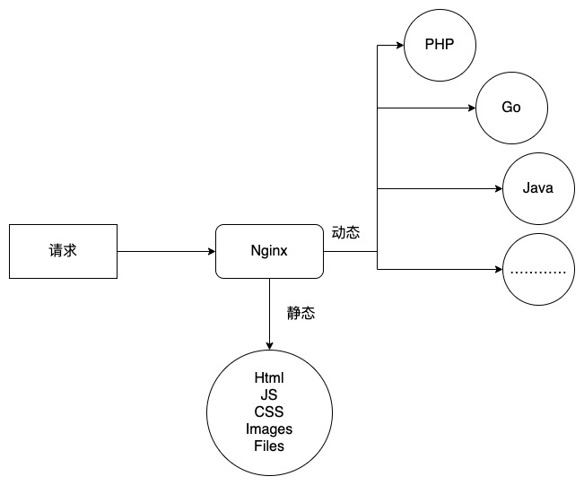

# Nginx学习：动静分离与日志分割

放轻松放轻松，最后两篇文章学习的内容是比较轻松的。首先，我们来看看 Nginx 动静分离的概念，然后再看看怎么为 Nginx 做日志分割。内容都很简单，完全不需要有任何的压力。

## 动静分离

动静分离，听着高大上吧，而且也是面试中比较喜欢问的问题。简单来说，就是动态请求走后端的动态程序，静态资源，比如说图片、CSS、JS、文件以及普通的静态 html ，走静态资源就可以了。就像下面这张图一样。



大部分 PHPer 可能就疑惑了，咱们 PHP 在 Nginx 中的配置不就这样的嘛。

```nginx
server {
  listen       80;
  server_name  localhost;
  location / {
    root   html;
    index  index.html index.htm;
  }

  location ~ \.php$ {
    root           html;
    fastcgi_pass   127.0.0.1:9000;
    fastcgi_index  index.php;
    fastcgi_param  SCRIPT_FILENAME  /scripts$fastcgi_script_name;
    include        fastcgi_params;
  }

  error_page   500 502 503 504  /50x.html;
  location = /50x.html {
    root   html;
  }
}
```

这是我们之前使用的，最最经典的，也是默认 Nginx 配置文件中所提供的基础配置。这里其实就已经实现了动静分离。动态的针对 PHP 文件的请求，使用 FastCGI 进行处理。实际上，FastCGI 也是个代理，这个之前我们就说过了。而静态资源，直接就是通过 root 配置指令去找 html 目录中的内容。

没错，静态分离对我们 PHPer 来说并不稀奇。但是对于一些编译型语言来说，比如 Java 或者 Go ，它们会将资源打包，然后生成一个 Jar 或者可执行文件。通过 Nginx 的反向代理来实现动态程序的运行。但这时，其实静态资源也是在一起打包的，虽然不是直接编译进可执行文件中，但是有时候修改一点静态资源的内容，也会需要重启后端服务。这就是典型的没有做分离。

因此，一般情况下我们可以这样配。

```nginx
server{
  
  listen 8040;
   
  location / {
    proxy_pass http://192.168.56.88:8080/;
  }
  
  location ~ .*\.(jpg|jpeg|if|png|js|css)$ {
    root html/static;
    access_log off;
  }

}
```

假设 proxy_pass 代理的是一个 Java 程序，那么我们就可以在根请求中指定代理到 Java ，而静态资源后缀的，则单独再指定一个 location ，并且指定好 root 地址。

当然，更多的情况下，现在大部分公司都直接买云存储了，这就是更分离了，连服务器都分开了。如果不用云存储，也可以再单独建一个 server 并绑定一个静态资源域名。比如我的博客的图片链接配置：

```nginx
server
{
    listen 80;
		listen 443 ssl http2;
    server_name img1.zyblog.com.cn;
    index index.php index.html index.htm default.php default.htm default.html;
    root /www/wwwroot/zyblog/storage/img;
    ……………………
}
```

后台存储上传的图片时，直接保存到 /www/wwwroot/zyblog/storage/img 目录，然后只存储相对路径，比如 /article/1.jpg ，然后在程序中拼接上域名，最终形成 http://img1.zyblog.com.cn/article/1.jpg 这样的 URL 地址。

这样做有什么好处呢？当我们需要迁移存储时，比如上云或者下云，只需要在动态程序中修改域名配置就行了。而为什么不让动态程序来处理静态资源呢？要知道，动态程序是需要走加载、展示的过程的，而 Nginx 则直接对静态资源做了很多优化，比如 sendfile 。效率要比直接使用动态后端语言高出很多。并且，在做集群时，我们也可以直接分离静态资源服务器，将所有的静态资源统一存放管理。反正，好处多多，唯一的问题就是，要做好这些资源的目录管理和数据调取时的存储管理，否则可能就会比较乱哦。

## 日志分割

另一个非常常见的面试题，同时也是非常常用的操作，就是对 Nginx 的日志进行分割。这是什么意思？其实呀，就是我们的访问日志或者错误日志，经年累月的积累，会变得非常多，单个文件也会非常大。通常我们都会按天对这些日志进行分割，分割之后又会压缩备份或者直接发送走用于处理分析。

Nginx 默认没有日志分割的功能，但是它可以重载配置文件，也可以重开日志句柄，有这两个功能，其实就为我们进行日志分割提供了基础了。那么我们就写一个简单的 shell 脚本来实现吧。

```shell
#/bin/sh

cd /usr/local/nginx/logs/;

mv access.log access.log_bak;


nginx -s reload;
#nginx -s reopen;
#kill -HUP `cat /usr/local/nginx/logs/nginx.pid`;
#kill -USR1 `cat /usr/local/nginx/logs/nginx.pid`;

```

很简单吧？进入日志目录，给日志文件改个名字，然后重载 reload 或者重开 reopen ，就行了。下面三个注释的功能是等价的，使用 -s 参数其实就是封装好的 kill 命令嘛。这个在最早的文章中我们都已经说过了。

将文件保存为 .sh 命名的文件，然后通过 chmod 加上执行权限，运行一下吧。

查看日志目录，发现确实老的日志被改名了，并且新的日志也生成了。

```shell
[root@localhost ~]# ll /usr/local/nginx/logs/ | grep access.log*
-rw-r--r-- 1 root root        0 Sep 26 09:01 access.log
-rw-r--r-- 1 root root  5693634 Sep 23 10:53 access.log_bak
```

再请求两次，就会发现新的请求信息还是记录到新的 access.log 文件中了。

```shell
[root@localhost ~]# ll /usr/local/nginx/logs/ | grep access.log*
-rw-r--r-- 1 root root      112 Sep 26 09:02 access.log
-rw-r--r-- 1 root root  5693634 Sep 23 10:53 access.log_bak
```

如果想要压缩一下，直接在 mv 代码行后面加上 gzip 操作就好了。

```shell
gzip access.log_bak;
```

修改脚本并运行之后，就可以看到之前的 access.log_bak 被压缩成 .gz 文件了。

```shell
[root@localhost ~]# ll /usr/local/nginx/logs/ | grep .*gz
-rw-r--r-- 1 root root      148 Sep 26 09:05 access.log_bak.gz
```

接下来，我们再尝试加上日期时间，这样的话，每次分割的日志都是按日期命名了。修改 mv 部分就好。

```shell
d=`date +'%Y%m%d'`;
mv access.log "access_"$d".log";
```

试试效果吧，看看是不是按日期出现备份文件了。

```shell
[root@localhost ~]# ll /usr/local/nginx/logs/ | grep access_
-rw-r--r-- 1 www  root        0 Sep 26 09:15 access_20220926.log
```

当然，我们的测试代码非常简单，不过对于自己的小项目或者公司的小应用完全没问题了。后续的步骤就是直接把这个脚本加入到 crontab 里面就好了。简单的 shell 相信也不会让各位大佬犯难的，我们还可以移动到指定的备份目录，或者流量特别大的网站直接按小时、分钟进行备份，这些都没问题。

对于 宝塔 这种面板工具来说，在它的计划任务功能中，直接就提供了日志分割的功能。而且这个功能也比较强大，可以按单独的站点，也可以全部都分割，还可以保留多少份备份。这些功能的代码实现其实都在 /www/server/panel/script/logsBackup 这个文件中的 split_log 函数里面。它全部是由 Python 实现的，还是比较容易看懂的。宝塔使用的就是 mv+reload 方式，大家可以自己分析一下哦。

## 总结

说了很简单吧，也不算水了一篇，但确实也不是很硬。不过对于很多新手来说，这两个东西还是比较常见的，或者说比较有用的基础知识。下次面试的时候可不要再发懵了哦，动静分离就是让 Nginx 自己来处理静态资源，动态请求才走代理让后端动态语言程序来运行。而日志分割实际上就是给文件改名，然后再 reload 或 reopen 一下，效果都一样。而且咱们还知道宝塔直接用得就是 mv+reload 模式。
