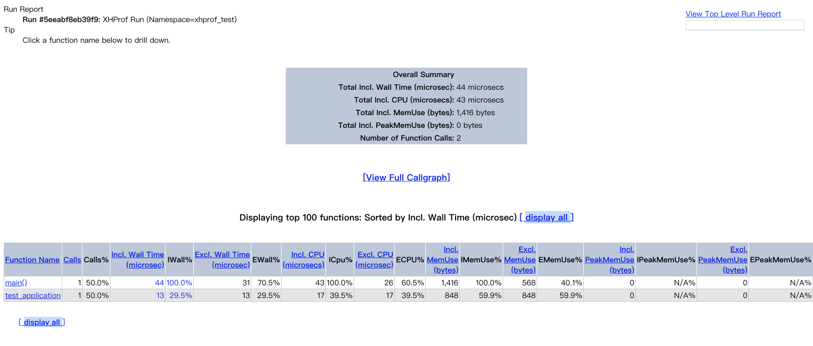

# 简单学习PHP中的层次性能分析器

在 PHP 中，我们需要进行调试的时候，一般都会使用 memory_get_usage() 看下内存的使用情况。但如果想看当前的脚本 CPU 的占用情况就没有什么现成的函数了。不过，PHP 也为我们提供了一个扩展：XHProf ，这是由 FaceBook 开源的一个扩展，它可以帮我们看到当前脚本运行时的一些性能情况。

## 什么是 XHProf

*XHProf 是一个轻量级的分层性能测量分析器。 在数据收集阶段，它跟踪调用次数与测量数据，展示程序动态调用的弧线图。 它在报告、后期处理阶段计算了独占的性能度量，例如运行经过的时间、CPU 计算时间和内存开销。 函数性能报告可以由调用者和被调用者终止。 在数据搜集阶段 XHProf 通过调用图的循环来检测递归函数，通过赋予唯一的深度名称来避免递归调用的循环。*

简单来说，XHProf 就是能为我们收集很多程序去得时的系统状态，并且它自带一套在线图表工具，能够为我们提供详尽的图表信息。

## 安装

直接在 PECL 下载安装扩展包即可。和其它的扩展安装并没有什么两样，这个扩展一直在更新维护状态中，所以对于 PHP7 版本都是完美支持的。

## 命令行使用

```php
xhprof_enable(XHPROF_FLAGS_NO_BUILTINS | XHPROF_FLAGS_CPU | XHPROF_FLAGS_MEMORY);

//xhprof_enable( XHPROF_FLAGS_CPU | XHPROF_FLAGS_MEMORY);

//xhprof_enable( XHPROF_FLAGS_MEMORY);

//xhprof_enable();

for ($i = 0; $i <= 1000; $i++) {
    $a = $i * $i;
}

function test_application(){
    for ($i = 0; $i <= 1000; $i++) {
            $a = $i * $i;
    }
}

test_application();


$xhprof_data = xhprof_disable();

print_r($xhprof_data);

// Array
// (
//     [main()==>test_application] => Array
//         (
//             [ct] => 1
//             [wt] => 16
//             [cpu] => 21
//             [mu] => 848
//             [pmu] => 0
//         )

//     [main()] => Array
//         (
//             [ct] => 1
//             [wt] => 115
//             [cpu] => 115
//             [mu] => 1416
//             [pmu] => 0
//         )

// )
```

使用 xhprof_enable() 启用分析器，它的参数是几个常量，大概的意思就是显示 CPU 信息、内存信息等，如果没有参数的话则只会返回 ct 、 wt 这两个参数。

调用 xhprof_disable() 结束分析并返回分析结果，返回值的内容包括 main 主函数的运行情况，也就是我们当前页面测试代码的情况。还有调用的函数 test_application() 函数的性能情况。具体内容为：

- ct：调用次数
- wt：等待运行时长，毫秒
- cpu：cpu 运行时长，毫秒
- mu：内存使用，字节
- pmu：内存使用峰值

没错，就是这么简单的内容。通过两个函数的调用我们就能看到当前脚本程序的运行状态，占用了多少内存、耗费了多少 cpu 时长。当然，更方便的是，它还可以通过 web 页面显示更为详细的信息。

## web 查看结果报告

首先，我们需要做一些准备工作。一是要安装一个 graphviz 用于图形绘制，二是修改 php.ini 文件的结果存放目录，三是拷贝源码中的分析器代码并修改一下我们之前的测试代码。

```shell
yum install graphviz
```

CentOS 系统中我们直接使用 yum 就可以安装 graphviz 。然后我们在 php.ini 文件中为 xhprof 指定一下输出目录。

```php
xhprof.output_dir=/tmp
```

接下来，我们需要将源码文件中的 xhporf_html 目录和 xhporf_lib 目录拷贝出来放到项目文件下。然后修改代码来保存性能分析的结果。

```php
// ..... 上面的代码
$xhprof_data = xhprof_disable();

require 'xhprof_lib/utils/xhprof_lib.php';
require 'xhprof_lib/utils/xhprof_runs.php';

$xhprofRuns = new XHProfRuns_Default();
$runId = $xhprofRuns->save_run($xhprof_data, 'xhprof_test');

echo 'http://192.168.56.102/index.php?run=' . $runId . '&source=xhprof_test';

```

然后我们需要在 xhporf_html 搭起服务器，在这里我就用简单的 php -S 命令运行起来。

```shell
cd xhprof_html/
php -S 0.0.0.0:80
```

最后用上面输出的链接来访问这个页面，就可以看到相关的信息了。



## 总结

今天的测试代码只是简单的学习入门了一下 xhporf 的使用。其实这个扩展以及这套分析工具是可以集成到我们真实项目的框架中的。这样，在测试环境我们就可以很好地监控当前程序的运行状态。不过，还是不太建议放在正式环境中使用，毕竟 Debug 或者这种性能分析的东西都不要对外，在正式环境，我们可以在命令行进行分析调优。

测试代码：

[https://github.com/zhangyue0503/dev-blog/blob/master/php/202006/source/%E7%AE%80%E5%8D%95%E5%AD%A6%E4%B9%A0PHP%E4%B8%AD%E7%9A%84%E5%B1%82%E6%AC%A1%E6%80%A7%E8%83%BD%E5%88%86%E6%9E%90%E5%99%A8.php](https://github.com/zhangyue0503/dev-blog/blob/master/php/202006/source/%E7%AE%80%E5%8D%95%E5%AD%A6%E4%B9%A0PHP%E4%B8%AD%E7%9A%84%E5%B1%82%E6%AC%A1%E6%80%A7%E8%83%BD%E5%88%86%E6%9E%90%E5%99%A8.php)

参考文档：

[https://www.php.net/manual/zh/book.xhprof.php](https://www.php.net/manual/zh/book.xhprof.php)

[https://segmentfault.com/a/1190000003509917](https://segmentfault.com/a/1190000003509917)
