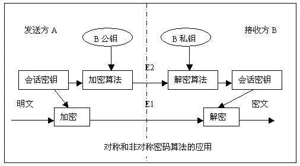

# PHP的OpenSSL加密扩展学习（一）：对称加密

我们已经学过不少 PHP 中加密扩展相关的内容了。而今天开始，我们要学习的则是重点中的重点，那就是 OpenSSL 加密扩展的使用。为什么说它是重点中的重点呢？一是 OpenSSL 是目前 PHP 甚至是整个开发圈中的数据加密事实标准，包括 HTTPS/SSL 在内的加密都是它的实际应用，二是 OpenSSL 提供了对称和非对称加密的形式，也就是我们日常中最普遍的两种加密方式，这都是我们需要掌握的内容。

那么，它和 Hash 类的加密有什么不同吗？Hash 类的加密是单向的不可逆转的加密，加密后的内容是 16进制 的 Hash 串，我们只能通过彩虹表去反推明文内容，所以只要加上盐值或者多套两层加密，就非常难逆向破解出来了。因此，Hash 加密通常会用于用户的密码保存上，即使数据库泄露了用户密码也依然是安全的。而 OpenSSL 这种类型的对称/非对称加密则是可以通过某个关键字或者证书来进行正向加密和逆向解密的，原文都是可以得到的。下面我们就来具体说说对称和非对称加密的问题。

## 什么是对称和非对称加密

对称加密，通常是通过一个 key（密钥） 来对原文进行加密。也就是说，不管是服务端还是客户端或是其它的任何对端，在两端通信时，它们传输的加密内容都必须要使用相同的 key 来进行加/解密操作。两端都必须同时保存这样一个 key 。估计大家也想到了，现在不管是 web 开发还是 app 开发，代码都是可以反编译查看到源码的。如果使用对称加密的话，key 是很容易被获取到的。不过，对称加密的好处是速度非常快，不消耗资源。

非对称加密则是两端持有不同的 key 。就像我们平常见到的最多的 https 证书，就是分别有 公钥 和 私钥 这两个概念。一般我们会使用 公钥 进行加密，然后使用 私钥 进行解密，通常 公钥 都是公开并发送给对方的，而私钥是保存在自己这里的。也就是说，对方向我们发送数据的时候，使用我们给它的公钥将数据进行加密，数据在传输过程中就非常安全，因为中间并没有别人有可以解密这段数据的私钥，直到我们接收到数据后使用自己的私钥进行解密后就得到了原文数据。由于两边的密钥内容并不相同，所以相对于对称加密来说，非对称加密的安全性要高了很多。虽然说非对称加密的算法和复杂度都比对称加密提升了好几个档次，但相对于对称加密的优势，在非对称加密中，速度和性能也就成了它的瓶颈，特别是数据量大的情况下。另外，非对称加密的数学原理是 大数难分解 问题，也就是越大的数越难进行因子分解，如果某个算法能在短时间内破解这个问题的话，那么恭喜你，现代加密算法的基础天花板就被你捅破了。

对称加密常用的算法有：AES 、DES 、3DES 、 IDEA 、 RC2 、 RC5 等，比较常用的是 AES 和 DES 。

非对称加密常用的算法有：RSA 、Elgamal 、ECC 等，RSA 非常常用和普遍，SSL 和一些证书算法都是基于 RSA 。

## 为了系统安全我们应该怎么办？

那么，我们有没有折衷的方式来使用这两种加密能力呢？当然有了，并且也是非常经典的一种技术：数字信封。

其实意思非常简单，就是利用这两种加密方式各自的优点。非对称加密的安全性高，但速度慢，而且数据量越大速度越慢，那么我们就用它来加密对称加密的 key ，通常这个 key 不会很大。然后实际的数据实体使用这个对称加密的 key 来进行对称加密提升速度。这样，我们发送给客户端时，就包括两个内容，一个是非对称加密进行加密的 key ，一个使用对称加密进行加密的数据内容。客户端拿到信息后，首先使用非对称加密的密钥解码出对称加密的 key ，然后再使用这个 key 来解密最终的数据内容。是不是说得很晕？我们通过一张图来看看，或许大家就一目了然了。



其中，公钥和私钥就不用多解释了。会话密钥就是我们的对称加密算法的密钥 key 。结合上面对数字信封传输过程的解释，大家应该就能看懂了吧。

## OpenSSL 扩展的对称加密

好了，介绍这么多理论知识，接下来还是回归正题了，我们在 PHP 中如何实现对称和非对称加密呢？非常简单，使用 OpenSSL 扩展就可以了。这个扩展也是随 PHP 源码一起发布的，编译安装的时候加上 --with-openssl 就可以了。当然，它也是需要系统环境中安装 OpenSSL 软件的，在各类操作系统中基本都已经直接有了，如果没有的话就自己安装一下即可。最简单的，在操作系统命令行看看有没有 openssl 命令就可以看出当前系统有没有安装 OpenSSL 相关的软件。

```shell
[root@localhost ~]# openssl version
OpenSSL 1.1.1 FIPS  11 Sep 2018
```

今天，我们主要学习的还是比较简单的对称加密相关的函数。

### 对称加/解密实现

```php
$data = '测试对称加密';
$key = '加密用的key';
$algorithm =  'DES-EDE-CFB';


$ivlen = openssl_cipher_iv_length($algorithm);
$iv = openssl_random_pseudo_bytes($ivlen);


$password = openssl_encrypt($data, $algorithm, $key, 0, $iv);
echo $password, PHP_EOL;
// 4PvOc75QkIJ184/RULdOTeO8

echo openssl_decrypt($password, $algorithm, $key, 0, $iv), PHP_EOL;
// 测试对称加密

// Warning: openssl_encrypt(): Using an empty Initialization Vector (iv) is potentially insecure and not recommended
```

openssl_encrypt() 就是加密数据，它需要原文、算法和密钥三个参数，后面的参数是可选的，但是现在是推荐自己来定义 iv （向量） 参数，所以如果没有 iv 参数的话，会报一个警告信息。我们使用 openssl_cipher_iv_length() 来获取当前算法需要的 iv 长度，然后使用 openssl_random_pseudo_bytes() 函数来生成一个随机的符合算法长度的 iv 内容。

中间那个 0 的参数是指定标记的按位或值，它有两个可选常量：OPENSSL_RAW_DATA 和 OPENSSL_ZERO_PADDING ，如果设置为 OPENSSL_RAW_DATA 加密后的数据将按照原样返回（二进制乱码内容），如果设置为 OPENSSL_ZERO_PADDING ，加密后的数据将返回为 base64 之后的内容。

openssl_decrypt() 用于对数据进行解密，需要的参数基本和加密函数一致，只是原文数据换成了加密数据。

在对称加密中，我们还有一种  AEAD 密码模式（GCM 或 CCM） ，在使用这种模式的算法时，我们需要多一参数。

```php
$algorithm =  'aes-128-gcm';
$password = openssl_encrypt($data, $algorithm, $key, 0, $iv, $tags);
echo $password, PHP_EOL;
// dPYsR+sdP56rQ99CNxciah+N

echo openssl_decrypt($password, $algorithm, $key, 0, $iv, $tags), PHP_EOL;
// 测试对称加密
```

这个 $tags 是一个引用类型的参数，也就是加密后会赋值到这个变量中，解密的时候也需要相同的这个验证标签。

从加密解密的过程来看，如果我们要将这些信息保存在数据库中，或者进行传输解密时，我们至少要保存或传输这几个字段，加密使用的 iv ，加密使用的算法，以及 AEAD 模式的话加密所使用的验证标签，否则数据无法解密。

### 对称加密算法查询

```php
print_r(openssl_get_cipher_methods());

// Array
// (
//     [0] => AES-128-CBC
//     [1] => AES-128-CBC-HMAC-SHA1
//     [2] => AES-128-CFB
//     [3] => AES-128-CFB1
//     [4] => AES-128-CFB8
//     [5] => AES-128-CTR
//     [6] => AES-128-ECB
//     [7] => AES-128-OFB
//     [8] => AES-128-XTS
//     [9] => AES-192-CBC
//     [10] => AES-192-CFB
//     [11] => AES-192-CFB1
//     [12] => AES-192-CFB8
//     ……
// )
```

在上面加/解密测试中所选取的算法就是从这个函数中找出来的，这个函数就是显示当前环境下所有支持的算法列表。

## 总结

这篇文章的内容有比较多的理论相关的知识，大家还是要多多地消化。使用 OpenSSL 实现加/解密的功能其实还是比较简单的，毕竟东西都已经帮我们封装好了，我们只需要按照文档来调用函数就可以了。学习，还是要理论结合实际，当然，更重要的是自己多动手！

测试代码：

参考文档：

[https://www.php.net/manual/zh/function.openssl-encrypt.php](https://www.php.net/manual/zh/function.openssl-encrypt.php)

[https://www.php.net/manual/zh/function.openssl-decrypt.php](https://www.php.net/manual/zh/function.openssl-decrypt.php)