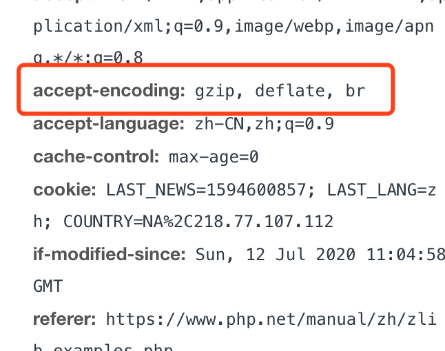

# PHP的zlib压缩工具扩展包学习

总算到了我们压缩相关扩展的最后一篇文章了，最后我们要学习的也是 Linux 下非常常用的一种压缩格式：.gz 的压缩扩展。作为 PHP 的自带扩展，就像 zip 一样，zlib 扩展是随着 PHP 的安装包一起发布的，所以我们在编译的时候直接加上 --with-zlib 就可以了，如果无法找到对应的软件包的话，使用 yum 安装相应的软件包即可。

## 创建压缩包

```php
// 创建压缩包
$zp = gzopen('./gztest.gz', "w9");

gzwrite($zp, "Only test, test, test, test, test, test!\n");

gzclose($zp);
```

压缩包的创建非常地简单，不过 PHP 的这个扩展中，只能使用 gzwrite() 来创建这种字符串类型的压缩包，无法直接将某些目录或者文件进行打包。

创建压缩包成功后，我们就可以通过系统的 tar 命令来解压或者查看文件了。

## 读取压缩包内容

```php
// 读取压缩包
$zp = gzopen('./gztest.gz', "r");

echo gzread($zp, 3);

gzpassthru($zp); // 输出 gz 文件指针中的所有剩余数据
// Only test, test, test, test, test, test!
echo PHP_EOL;


gzpassthru($zp);
//

gzrewind($zp); // 将 gz 指针的游标返回到最开始的位置
gzpassthru($zp);
// Only test, test, test, test, test, test!
echo PHP_EOL;

gzclose($zp);
```

读取操作其实也非常简单，直接使用 gzpassthru() 就可以输出当前压缩包里面的内容，并且是直接打印出来。当然，它也是以类似于文件指针的形式进行输出的，所以如果我们输出过一次之后，就必须要使用 gzrewind() 将指针的游标还原到句柄最开始的位置。

对于 zlib 的压缩包来说，我们还有很多其它的方式可以进行文件内容的读取。

```php
// 读取压缩包二
$gz = gzopen('./gztest.gz', 'r');
while (!gzeof($gz)) {
  echo gzgetc($gz);
}
gzclose($gz);
// Only test, test, test, test, test, test!
echo PHP_EOL;

// 读取压缩包三
echo readgzfile("./gztest.gz");
// Only test, test, test, test, test, test!
echo PHP_EOL;

// 读取压缩包四
print_r(gzfile("./gztest.gz"));
// Array
// (
//     [0] => Only test, test, test, test, test, test!
// )
echo PHP_EOL;
```

这里一口气就提供了三种读取的方式。首先当然还是我们最熟悉的文件操作形式的读取，使用的是 zlib 为我们提供的 gzeof() 和 gzgetc() 函数。除了 gzgetc() 之外，也提供了包括 gzgets() 和 gzgetss() ，分别是按行和按 HTML 格式行的读取。其次，我们可以使用 readgzfile() 来直接读取整个压缩文件的内容，连 gzopen() 都可以省了，与它类似的是 gzfile() 函数，这个函数与 readgzfile() 的区别就是它读取的内容是以数组形式返回的，对于多文件的压缩包更有用。

## gzip 压缩类型

既然 zlib 所压缩的格式是 .gz 类型，而且还只能做字符串形式的压缩，那么不少小伙伴肯定有疑问了，它和 gzip 有什么关系呢？其实，zlib 除了是可以做为压缩打包工具之外，也可以做为 gzip 工具应用到我们的服务器中。当然，现在大多数情况下我们只需要开启 Nginx 或者 Apache 的 gzip 压缩功能就可以了，不需要我们再到 PHP 中进行处理了。不过做为一名合格的 PHP 程序员，相关的操作函数我们还是需要学习的，说不定哪天就用上了呢。

```php
// 压缩类型及相关操作
// gzcompress 默认使用ZLIB_ENCODING_DEFLATE编码，使用zlib压缩格式，实际上是用 deflate 压缩数据，然后加上 zlib 头和 CRC 校验
$compressed = gzcompress('Compress me', 9);
echo $compressed;
// x�s��-(J-.V�M�?
echo PHP_EOL;

echo gzuncompress($compressed);
// Compress me
echo PHP_EOL;

// gzencode 默认使用ZLIB_ENCODING_GZIP编码，使用gzip压缩格式，实际上是使用defalte 算法压缩数据，然后加上文件头和adler32校验
$compressed = gzencode('Compress me', 9);
echo $compressed;
// s��-(J-.V�M�jM4
echo PHP_EOL;

echo gzdecode($compressed);
// Compress me
echo PHP_EOL;

// gzdeflate 默认使用ZLIB_ENCODING_RAW编码方式，使用deflate数据压缩算法，实际上是先用 LZ77 压缩，然后用霍夫曼编码压缩
$compressed = gzdeflate('Compress me', 9);
echo $compressed;
// s��-(J-.V�M
echo PHP_EOL;

echo gzinflate($compressed);
// Compress me
echo PHP_EOL;
```

其实注释中已经写得很清晰了，不止是 PHP ，Nginx 也是会提供这三种编码格式的，而且我们从浏览器中就可以看出当前访问的网站使用的是哪种压缩编码格式。比如我们访问 PHP 的官方网站所返回的内容：



从性能的维度看：deflate 好于 gzip 好于 zlib，而从文本文件默认压缩率压缩后体积的维度看：deflate 好于 zlib 好于 gzip 。也就是说，deflate 格式不管在性能还是压缩率来说都是现在比较好的选择。当然，这样好的格式对于 CPU 的硬件性能的影响就不清楚了，毕竟我们没有大型的功能页面来进行测试，起码对于普通的网站页面来说，已经绰绰有余了。

另外，就像其它的压缩工具一样，能够对于字符串进行编码的工具我们都可以扩展一个应用场景，那就是数据的加密能力，这个在前面 Bzip2 、 LZF 相关的这些文章已经说过了，就不再多说了。

最后，我们还有一个通用的函数通过预定义的常量直接可以操作这三种类型的编码及解码。

```php
// 通用压缩函数
$compressed = zlib_encode('Compress me', ZLIB_ENCODING_GZIP, 9);
echo $compressed;
// ZLIB_ENCODING_RAW：s��-(J-.V�M
// ZLIB_ENCODING_DEFLATE：x�s��-(J-.V�M�?
// ZLIB_ENCODING_GZIP：s��-(J-.V�M�jM4
echo PHP_EOL;

echo zlib_get_coding_type();
echo PHP_EOL;

echo zlib_decode($compressed);
// Compress me
echo PHP_EOL;
```

zlib_encode() 函数的第二个参数就是需要指定一个编码的类型，这里 zlib 扩展已经为我们准备好了 ZLIB_ENCODING_RAW 、 ZLIB_ENCODING_DEFLATE 、 ZLIB_ENCODING_GZIP 这三个类型的常量。而解压 zlib_decode() 则不需要再进行指定了，它会直接根据文件头自动选择相应的编码格式对内容进行解码。

## 增量压缩操作函数

在 PHP7 中，zlib 扩展为我们增加一种可以增量压缩编码的操作函数，就是可以在不使用对象句柄的情况下，使用函数直接增加内容。

```php
// PHP7 新增的增量压缩操作函数
$deflateContext = deflate_init(ZLIB_ENCODING_GZIP);
$compressed = deflate_add($deflateContext, "数据压缩", ZLIB_NO_FLUSH);
$compressed .= deflate_add($deflateContext, "，更多数据", ZLIB_NO_FLUSH);
$compressed .= deflate_add($deflateContext, "，继续添加更多数据！", ZLIB_FINISH); // ZLIB_FINISH 终止
echo $compressed, PHP_EOL;
// {6uó�uO����Y�~Oϳ�[�.��
// �>߽���϶�~ڵU�h�9

$inflateContext = inflate_init(ZLIB_ENCODING_GZIP);
$uncompressed = inflate_add($inflateContext, $compressed, ZLIB_NO_FLUSH);
$uncompressed .= inflate_add($inflateContext, NULL, ZLIB_FINISH);
echo $uncompressed;
// 数据压缩，更多数据，继续添加更多数据！
```

就像例子中展示的那样，deflate_add() 用于增量的添加内容到编码文件中，当标志为 ZLIB_FINISH 时结束操作的写入。deflate_init() 和 inflate_init() 分别是编码和反编码对应的初始化操作。

## 总结

关于压缩解压相关的扩展我们已经介绍了 Bzip2 、 LZF 、 Phar 、 rar 、 zip 和 zlib 这些官方的扩展，在实际的生产中我们其实会比较常用到的是 zip 和 zlib ，当然，对于其它的格式也有了一定的学习了解，剩下的就是我们自己在用到的时候再次的深度研究了。这一个系列的内容让我对这些压缩格式也有了更一步的了解，希望大家也能从中获益。

测试代码：

[https://github.com/zhangyue0503/dev-blog/blob/master/php/202007/source/PHP%E7%9A%84zlib%E5%8E%8B%E7%BC%A9%E5%B7%A5%E5%85%B7%E6%89%A9%E5%B1%95%E5%8C%85%E5%AD%A6%E4%B9%A0.php](https://github.com/zhangyue0503/dev-blog/blob/master/php/202007/source/PHP%E7%9A%84zlib%E5%8E%8B%E7%BC%A9%E5%B7%A5%E5%85%B7%E6%89%A9%E5%B1%95%E5%8C%85%E5%AD%A6%E4%B9%A0.php)

参考文档：

[https://www.php.net/manual/zh/book.zlib.php](https://www.php.net/manual/zh/book.zlib.php)

[https://www.php.cn/php-weizijiaocheng-377246.html](https://www.php.cn/php-weizijiaocheng-377246.html)