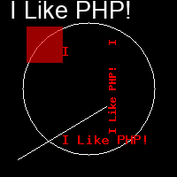
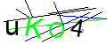

# 一起学习PHP中GD库的使用（二）

在日常的开发过程中，GD 库最常用的功能就是帮我们对图片进行一些处理，当然，除了处理已有的图片之外，它也可以直接来画图，就像我们最常见的图片验证码。今天的内容主要就是和画图有关，所以最后我们也会做一个非常简单的图片验证码的例子。

## 创建图片并指定颜色

首先，我们要先创建一个图片的画布。就和 PhotoShop 一样，任何的绘图都要在一张画布下进行。

```php
// 创建一个 200X200 的图像
$img = imagecreatetruecolor(200, 200);
// 分配颜色
$white = imagecolorallocate($img, 255, 255, 255);
$black = imagecolorallocate($img, 0, 0, 0);
$red = imagecolorallocate($img, 255, 0, 0);

// 带透明通道的颜色
$alphaRed = imagecolorclosestalpha($img, 255, 0, 0, 50);
```

imagecreatetruecolor() 函数就是用于创建一个真彩色图片，它和 imagecreate() 的区别就在于 imagecreate() 创建的是一张基于调色板的图片。它们为画布填充颜色的流程不一样，imagecreate() 不需要使用 imagefill() 进行填充背景色，直接使用 imagecolorallocate() 就会以第一次调用的 imagecolorallocate() 的颜色进行填充。它们返回的图片文件句柄都是后期操作所需要的句柄对象。

imagecolorallocate() 就是为图片分配颜色，这里我们定义了几种颜色，另外还使用 imagecolorclosestalpha() 定义了一个带通道的也就是还透明效果的颜色，它的最后一个参数就是 0-100 的透明度设置。

## 填充背景色

接下来，由于我们使用的是 imagecreatetruecolor() ，所以我们要对画布进行背景色的填充。

```php
// 填充背景色
imagefill($img, 0, 0, $black);
```

## 弧线、直线、矩形

不管是画线还是画弧线，都只是一些简单的函数调用即可。

```php
// 画一个白色的圆
imagearc($img, 100, 100, 150, 150, 0, 360, $white);

// 画一条线段
imageline($img, 20, 180, 120, 120, $white);

// 填充一个带透明的矩形
imagefilledrectangle($img, 30, 30, 70, 70, $alphaRed);
```

imagearc() 函数本身是用于画弧线的，第二和第三个参数用于指定圆心的位置，第四第五个参数指定圆的宽度和高度，第六、第七个参数指定弧线的起始位置（以角度指定），最后一个参数就是指定的颜色。通过给定的从 0 到 360 度的角度，我们就画了一个圆形出来。如果不是指定的完整的 360 度，就会是一条弧线。

直线线段的函数 imageline() 的参数就比较简单了，第二第三个参数是起始点的坐标，第四第五个参数是结束点的坐标，两个坐标点一连就绘制出了一条线段。

imagefilledrectangle() 是填充的方式绘制一个矩形，也就是说我们绘制的矩形是在内部填充了颜色的，而不是线条的描边。它的参数坐标和线段是一样的，并且我们填充是上面定义的带透明效果的颜色。

当然，我们能够直接绘制的图形和线条还有很多。需要注意的是，带 fill 关键字的基本都是填充图形，而不带 fill 的就是形状线段。比如如果要一个矩形框的话，我们可以使用 imagerectangle() 来进行绘制。同理，如果要画一个扇形块的话，我们也可以直接使用 imagefillarc() 。更多的图形和线段大家可以参考文档，内容比较多，这里就不多罗列了，今天我们主要的功能是生成一张验证码，只要有一个线段来做为干扰因素就可以啦。

## 写字

直接在图片中写字也很简单。

```php
$string = "I Like PHP!";

// 水平写一个字符
imagechar($img, 5, 70, 50, $string, $red);
// 垂直写一个字符
imagecharup($img, 3, 120, 50, $string, $red);

// 水平写字符串
imagestring($img, 5, 70, 150, $string, $red);
// 垂直写字符串
imagestringup($img, 3, 120, 150, $string, $red);
```

imagechar() 是只写一个字符，imagecharup() 是垂直地写。imagestring() 则是写字符串，而 imagestringup() 也就是垂直地写字符串啦。它们第二个参数都是字体的大小，第三和第四个参数是开始写字的坐标起始位置。不过，使用这些函数对图片进行内容书写的话，最主要的一个问题就是不能指定字体，这样在默认情况下中文是没办法输出的。所以，我们一般会用另一个函数来为图片加上文字。

```php
// 用 TrueType 字体向图像写入文本
$font = '../font/arial.ttf';
imagettftext($img, 20, 0, 11, 21, $white, $font, $string);
```

imagettftext() 函数，能够通过指定的字体来向图片添加文字内容，有了字体文件的支持，写上去的文字也好看了很多。更主要的是，它还能方便地调整文字大小和倾斜角度。第二个参数就是指定文字的大小，第三个参数就是可以指定文字的倾斜角度，也就是我们可以旋转文字。

## 生成图片

最后，当然就是要生成并输出图片啦！

```php
// 将图像输出到浏览器
header("Content-type: image/png");
imagepng($img);
// 释放内存
imagedestroy($img);
```

我们的测试代码是直接将图片输出到浏览器，所以需要指定一个文件输出的 header 头。使用 imagepng() 就能生成一张 PNG 格式的图片，它还有第二个参数，如果给定了第二个参数，那么图片就会直接以文件形式保存到参数指定的路径中。如果不给定这个参数的话，就会像 phpinfo() 一样直接输出到输出缓冲区中，也就是直接打印内容了。最后，我们再使用 imagedestroy() 释放掉图片句柄解除图片文件的内存占用。

除了 imagepng() 之外，还有 imagejpeg() 、 imagegif() 等等一系列的图片生成函数，大家可以自己查阅文档学习了解。

说了这么多，我们上面这一堆东西画出来的是个啥？



## 小例子：简单的验证码图片

最后的小例子就是一开头我们说过的，一个非常简单的图片验证码的生成。当然，现在的验证码功能其实非常复杂了，各种形式的验证码都有，主要还是为了系统的安全着想。同样在 Composer 中也有很多现成的验证码组件供我们使用，其实我们并不需要自己去实现这样的验证码功能的，但学习嘛，总是要接触一下了解一下的，而且如果是一些很小的小项目的话，完全就可以自己手写一个来练习了。

```php
$img = imagecreatetruecolor(120, 50);
imagefill($img, 0, 0, imagecolorallocate($img, 255, 255, 255));

$colors = [
    imagecolorallocate($img, 0, 0, 0),
    imagecolorallocate($img, 255, 0, 0),
    imagecolorallocate($img, 0, 255, 0),
    imagecolorallocate($img, 0, 0, 255),
];

$chars = array_merge(range(0, 9), range('a', 'z'), range('A', 'Z'));

for ($i = 0; $i < 10; $i++) {
    imageline(
        $img,
        random_int(0, 120),
        random_int(0, 50),
        random_int(0, 120),
        random_int(0, 50),
        $colors[array_rand($colors)]
    );
}
$font = '../font/arial.ttf';
for ($i = 0; $i < 4; $i++) {
    $char = $chars[array_rand($chars)];
    $fontSize = random_int(18, 24);
    $c = random_int(-20, 20);
    $x = $i * 26;
    if ($x == 0) {
        $x = 5;
    }
    imagettftext(
        $img, 
        $fontSize, 
        $c, 
        $x, 
        40, 
        $colors[array_rand($colors)], 
        $font, 
        $char
    );
}
header("Content-type: image/png");
imagepng($img);
imagedestroy($img);
```

代码就不多做解释了，随机取一些字符，并且随机生成一些线段，其它的就是我们上面文章中介绍过的函数的使用了。最后生成的图片就是这个样子的：



## 总结

不管之前有没有自己写过这种验证码的小工具，今天的内容相信都是一次系统的学习和回顾，因为我们是按着顺序从创建一张图片画布，到绘制线条和图形，再到添加文字，最后生成图片这一系列的步骤走下来的。以后不管是面试还是自己做小工具的时候，记住这条线，然后参考文档就可以啦。毕竟这些函数的参数都还是挺长挺乱的，除非天天用，要不可真记不住。

测试代码：

参考文档：

[https://www.php.net/manual/zh/book.image.php](https://www.php.net/manual/zh/book.image.php)