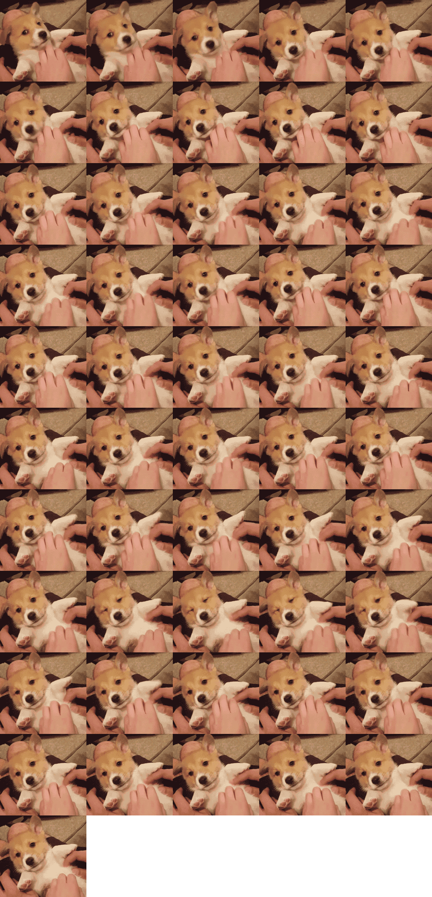

# 使用ImageMagick操作gif图

上篇文章我们已经学习了 GraphicsMagick 中的许多函数，也说过 GraphicsMagick 是 ImageMagick 的一个分支，所以他们很多的函数都是一样的使用方式和效果，相似的内容我们也就不再多说了，感兴趣的朋友可以直接查阅官方文档。

这篇文章我们要学习的是一个具体的案例，也是我在实际业务开发中所接触过的一个案例。具体的效果就是对于微信小游戏和小程序来说，不能直接地使用动态 Gif 图片，一张 Gif 图片在小游戏或小程序中是不会动的。所以在我们公司的游戏开发中，需要一张将整个 Gif 动图的每一帧拆出来的图片拼成一张精灵图交给前端，由他们来使用 JS+CSS 的能力动态地循环我们拆帧后的图片，从而形成动图的效果。

业务需求就是这么个情况，当然，最后的解决方案也正是使用了 ImageMagick 来实现的。话不多说，我们直接先看代码。

## GIF 图拆帧

原始的图片是这样的一张动图：


```php
$imgPath = '../img/4.gif';
$imagick = new \Imagick($imgPath);
$imagick = $imagick->coalesceImages();
$imageCount = $imagick->count();
echo 'image count：', $imageCount, PHP_EOL; // image count：51

$imgAttrs = [
    'width'       => $imagick->getImageWidth(),
    'height'      => $imagick->getImageHeight(),
    'frame_count' => $imageCount,
];
$column = 5;
if ($imageCount < $column) {
    $column = $imageCount;
}

$row = ceil($imageCount / $column);

$spImgWidth = $imgAttrs['width'] * $column;
$spImgHeight = $imgAttrs['height'] * $row;

 // 创建图片
$spImg = new \Imagick();
$spImg->setSize($spImgWidth, $spImgHeight);
$spImg->newImage($spImgWidth, $spImgHeight, new \ImagickPixel('#ffffff00'));
$spImg->setImageFormat('png');

$i = 0;
$h = 0;
$cursor = 0;
do {
    if ($i == $column) {
        $i = 0;
        $h++;
    }
    if($cursor == 0){ // 保存第一帧图片
        $imagick->writeImage($imgPath . '.first.png');
    }
    // 保存全部的图片帧到一张 png 图片中
    $spImg->compositeImage($imagick, \Imagick::COMPOSITE_DEFAULT, $i * $imgAttrs['width'], $h * $imgAttrs['height']);
    $i++;
    $cursor++;
} while ($imagick->nextImage());
$spImg->writeImage($imgPath . '.png');
```

实例化 Imagick 对象就不用多说了，我们首先调用的是 coalesceImages() 这个方法。它的作用是返回合成后的 Imagick 对象。通过这个方法，我们就获得了整个 GIF 图里面的全部每一帧图片的信息。这时，使用 count() 方法，就可以获得图片中的所有图片帧的个数。比如我们测试的这张图片就有 51 帧。

然后计算精灵图的行和列以及相应需要的宽高，比如我们以 5 列为基准，也就是一行放五张拆帧出来的图片，这样一共需要 11 行才放得下最后生成的精灵图。同理，宽高也是以拆出来的图片宽高乘以相应的列和行数。

接着，根据计算出来的宽高生成一张新的图片，作为精灵图的背景图，使用 newImage() 函数设置图片宽高及背景透明。使用 setImageFormat() 方法设置图片的格式为 PNG 格式，使用 PNG 主要是为了透明，其实按我们这样紧密排列的图片来说，不用透明也可以，但某些应用中比如网站前端需要的精灵图可能不同的图片之前是需要一定间隔的，所以一般会使用透明的底图。

然后就是一个循环，也就是循环那 51 张拆帧出来的图片，使用 nextImage() 不断地获取原始 GIF 图中的下一帧图片，并将他们组合保存在上面新建的背景图片中，每一帧的图片位置也是通过单帧图片的宽高与行列情况计算出来的。在这段代码中，我们还保存了第一帧的图片，当然，这也是业务需要，你可以随时保存任何一张每帧的图片。

最后，使用 writeImage() 保存图片。输出的图片就是下面的这个样子：



## 组合成动态 GIF 图

以上的业务功能是我在开发中实际使用过的功能，当然，除了可以对 GIF 图进行拆帧之外，我们也可以将多张图片组合成一个动态的 GIF 图。

```php
$gifImagek = new Imagick();
$gifImagek->setFormat('GIF');

for($i=1;$i<=5;$i++){
    $img = new Imagick('../img/3'.$i.'.jpeg');
    $img->setImageDelay(100);
    $gifImagek->addImage($img);
}

$gifImagek->writeImages("../img/5.gif", true);
$gifImagek->writeImages("../img/52.gif", false);
```

这段代码就比较简单了，依然还是创建一个图片，并且指定格式为 GIF 图片。然后循环添加图片，这里我们使用的是上篇文章中 GraphicsMagick 中操作过的那些图片。setImageDelay() 用于设置图片显示间隔，这里我们设置的是 100 毫秒，然后再使用 addImage() 将图片添加到我们新创建的 GIF 图画布中。

最后保存图片的时候，需要使用 writeImages() 进行保存，它的作用是保存这种连续的多张图片。它的第二个参数是指定是否将图片保存到一张图片中，如果是 false 的话，就类似于拆帧的效果，不过会将图片一张一张的分开保存，比如 52-1.gif 、 52-2.gif 这样。

最后生成的动图就是这样的：


## 总结

今天的内容有意思吧，不是那些烂大街的缩放、加水印、验证码之类的功能，而是比较好玩的对于 GIF 图的操作。说实话，在业务开发中类似的业务场景还是很多的，就像自动生成精灵图这种功能就完全可以使用 ImageMagick 来实现，而且都是 ImageMagick 扩展中自带的函数就可以搞定了，非常方便。

测试代码：

[https://github.com/zhangyue0503/dev-blog/blob/master/php/202012/source/5.使用ImageMagick操作gif图.php](https://github.com/zhangyue0503/dev-blog/blob/master/php/202012/source/5.使用ImageMagick操作gif图.php)

参考文档：

[https://www.php.net/manual/zh/book.imagick.php](https://www.php.net/manual/zh/book.imagick.php)