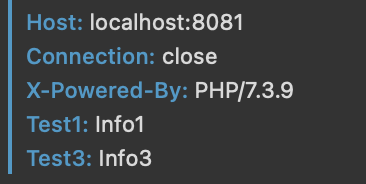
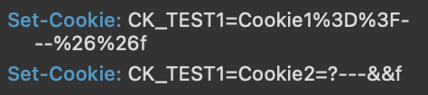

# PHP中的网络组件相关函数

作为一门以 WEB 开发为主战场的编程语言来说，PHP 即使是在目前这个大环境下，依然也是 WEB 领域的头号玩家。我们在网络相关的功能中也提供了许多方便好用的函数组件，而且它们都是不需要安装扩展就能够使用的。今天，我们就来学习了解一下。

## 获取服务器相关信息

首先就是获取一些服务器相关信息的能力。主要包括 DNS 以及 IP 相关的功能函数的使用。

### 主机 DNS 信息

```php
var_dump(checkdnsrr("www.baidu.com", "A")); // bool(true)

var_dump(checkdnsrr("max.baidu.com", "A")); // bool(false)

var_dump(checkdnsrr("mail.baidu.com")); // bool(true)
```

通过这个 checkdnsrr() 函数，我们可以获取某个域名的解析情况。它的第二个参数默认是 MX ，也就是邮件域名的解析，当然我们也可以指定 A 、TXT 这些解析内容。返回的就是是否有这个解析，也就是 true 或者 false 的结果。

```php
$mxhosts = [];
getmxrr("baidu.com", $mxhosts);
var_dump($mxhosts);
// array(5) {
//     [0]=>
//     string(15) "mx.n.shifen.com"
//     [1]=>
//     string(14) "mx50.baidu.com"
//     [2]=>
//     string(13) "mx1.baidu.com"
//     [3]=>
//     string(14) "jpmx.baidu.com"
//     [4]=>
//     string(19) "mx.maillb.baidu.com"
//   }

var_dump(dns_get_record("baidu.com"));
// array(5) {
//     [0]=>
//     array(6) {
//       ["host"]=>
//       string(9) "baidu.com"
//       ["class"]=>
//       string(2) "IN"
//       ["ttl"]=>
//       int(4502)
//       ["type"]=>
//       string(2) "MX"
// …………………………
// …………………………
// …………………………
// …………………………
```

通过 getmxrr() 函数，可以获得这个域名下面的所有 MX 解析记录情况。dns_get_record() 则是获取域名的解析信息数组，它的内容会更加的详细清晰一些。

### 主机 IP 信息

一般要查看某个域名的解析对应 IP ，我们可以通过系统的 PING 命令来实现，而在 PHP 中，也有对应的函数可以获得某个域名指向的主机 IP 信息。

```php
var_dump(gethostbyname("www.baidu.com")); // string(15) "183.232.231.174"
var_dump(gethostbyaddr("183.232.231.174")); // string(9) "localhost"

var_dump(gethostbynamel("www.baidu.com"));
// array(2) {
//     [0]=>
//     string(15) "183.232.231.174"
//     [1]=>
//     string(15) "183.232.231.172"
//   }
```

gethostbyname() 是根据域名可以获得域名指向的主机的 IP 地址，当然对于百度来说，这个可能它的一个分发的站点。而 gethostbyaddr() 则是根据 IP 地址获得域名信息，这个功能相对来说没那么好用，比如我这里返回的都是 localhost 。

gethostbynamel() 函数获取到的是对应域名的所有指向的 IP 地址，可以看到返回的是两个 IP 地址。

另外，我们也可以获得本机的主机名。

```php
var_dump(gethostname()); // string(27) "zhangyuedeMacBook-Pro.local"
```

这个函数是不需要任何参数的，直接返回的就是当前运行脚本的本机信息。

### IP 地址转换

对于 IP 地址转换来说，也就是将 IP 地址转换成十进制的数字类型。

```php
var_dump(ip2long('127.0.0.1')); // int(2130706433)
var_dump(long2ip(2130706433)); // string(9) "127.0.0.1"
```

ip2long() 是从 IP 地址转换为长整型，而 long2ip() 就是反过来，从长整型转换为 IP 地址格式。

## 协议端口相关信息

首先我们来看一下协议编号。

```php
var_dump(getprotobyname("tcp")); // int(6)
var_dump(getprotobynumber(6)); // string(3) "tcp"
```

getprotobyname() 用于根据协议名来获取协议的编号，而 getprotobynumber() 也是它的反函数，从协议编号获得协议名称。

```php
$services = array('http', 'ftp', 'ssh', 'telnet', 'imap',
'smtp', 'nicname', 'gopher', 'finger', 'pop3', 'www');

foreach ($services as $service) {
    $port = getservbyname($service, 'tcp');
    echo $service . ": " . $port, PHP_EOL;
}
// http: 80
// ftp: 21
// ssh: 22
// telnet: 23
// imap: 143
// smtp: 25
// nicname: 43
// gopher: 70
// finger: 79
// pop3: 110
// www: 80

var_dump(getservbyport(80, 'tcp')); // string(4) "http"
```

同样地，getservbyname() 是根据协议的名称获取它的默认端口号，而 getservbyport() 则是根据端口号和网络层协议名称来获得应用层的协议信息。这两个函数都是和应用层的这些服务器软件默认端口号相关的。

## 返回数据信息

接下来，我们来看一些和请求响应数据有关的函数。要使用这些函数的话，就需要启动应用服务了，也就是我们需要使用浏览器来访问了。这里，我们就简单地使用 php -S 来直接启动简易服务器进行测试。

### 状态码设置

这里的状态码主要指的就是响应的状态码。默认情况下，我们正常输出就是 200 ，在这里，我们将状态码改为 404 。

```php
// 获取当前状态码，并设置新的状态码
var_dump(http_response_code(404)); //  int(200)

//获取新的状态码
var_dump(http_response_code()); //  int(404)
```

当然，这样的修改并不会影响我们的输出，但是在浏览器中查看请求的时候，对应的这个请求就会变红了，因为状态码是有问题的 404 状态码了。http_response_code() 的返回值是当前的状态码，如果给了参数的话，就会设置成新的状态码。

### 头信息设置

头信息设置的函数 header() 相信大家还是比较常用的。比如现在做前后端分离的应用时，使用 CROS 来解决跨域问题的时候多少都会用到这个函数。所以它不是我们今天学习的重点，我们今天要了解的东西是另外一些和头信息相关的函数。

```php
header("Test1: Info1");
header("Test2: Info2");
header("Test3: Info3");

header_remove("Test2");

var_dump(headers_list());
// array(3) {
//     [0]=>
//     string(23) "X-Powered-By: PHP/7.3.9"
//     [1]=>
//     string(12) "Test1: Info1"
//     [2]=>
//     string(12) "Test3: Info3"
//   }
```

使用 header() 函数设置了头信息之后，如果不想要了，那么我们可以通过 header_remove() 来删除之前定义的头信息内容。而 headers_list() 则会显示我们或者 PHP 程序中额外添加的头信息内容，比如 X-Powered-By 这个信息是默认情况下 php -S 这个简单服务器命令自带的一个头信息。



### 两种不同的 Cookie 函数

cookie 相关操作的函数其实也不用多介绍，但是其实是有两种设置 cookie 的函数的。

```php
setcookie("CK_TEST1", "Cookie1=?---&&f");
setrawcookie("CK_TEST1", "Cookie2=?---&&f");
```

知道它们两个的区别吗？就像下图所示的一样，setcookie() 会默认对数据内容进行 urlencode() 编码，而 setrawcookie() 就像它的名称一样，设置的数据是原始的形式。



## 总结

在官方文档中的网络相关的扩展函数就是这些了，当然，还有一个大头我们没有介绍，那就是 socket 相关的内容。这方面的内容我们将在后面专门学习 socket 相关的系列文章中再进行详细的学习说明。

测试代码：

参考文档：

[https://www.php.net/manual/zh/book.network.php](https://www.php.net/manual/zh/book.network.php)
