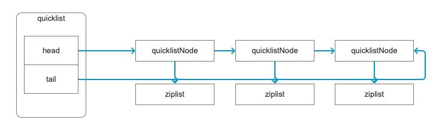

# Redis进阶：内存优化

在基础学习的最后一篇，我们了解到了 Redis 的底层数据类型可以通过 OBJECT ENCODING 来进行查看。也了解过一些关于这些底层数据类型的知识。今天，我们就来更加深入的学习一下这些底层的数据类型，并据此来了解在 Redis 中是如何通过这些数据类型进行内存优化的。

## 内存压缩与底层数据类型编码

在上篇文章里，我们已经看到了如果超过一定的限制，那么它的底层数据存储类型就会发生变化。当时我们给的例子是 Hash 类型由 ziplist 变成 hashtable ，今天我们再来详细的看一下。首先是字符串类型。

```shell
127.0.0.1:6379> MSET a 123 b 123a
OK
127.0.0.1:6379> OBJECT ENCODING a
"int"
127.0.0.1:6379> OBJECT ENCODING b
"embstr"
127.0.0.1:6379> SET c 11111111111111111111111111111111111111111111
OK
127.0.0.1:6379> OBJECT ENCODING c
"embstr"
127.0.0.1:6379> set c 111111111111111111111111111111111111111111111
OK
127.0.0.1:6379> OBJECT ENCODING c
"raw"
```

在字符串这种传统的键值对上，如果是纯数字类型，那么底层会使用 int ，而如果是字符串的话，那么在一定条件下会是 embstr，超过条件之后变成 raw 。具体的条件是什么呢？

- int：存储 8 个字节的长整型（long，2^63-1，9223372036854775807，19位以内）。
- embstr：代表 embstr 格式的 SDS（Simple Dynamic String 简单动态字符串），存储小于 44 个字节的字符串，只分配一次内存空间（因为 Redis Object 和 SDS 是连续的）
- raw：存储大于 44 个字节的字符串（3.2 版本之前是 39 个字节），需要分配两次内存空间（分别为 Redis Object 和 SDS 分配空间）。

为什么是 44 呢？因为一个 RedisObject 对象，或者说是 C 中的结构体，占用的内存是 64 字节，除去其它内容，比如说名称、类型、指针字段外，还剩下的就是 44 字节的空余空间。为了不浪费这些空间，就直接把它利用上了，好处就是速度更快，不用新开辟的内存空间。而 int 类型，则是在长度一定的范围内，直接使用 *ptr 那个指针字段去存 int 数据，同样的，也不需要开辟新的内存空间，直接在 RedisObject 中就完成存储了。

字符串类型的还比较好理解吧，之前也说过，List 类型的数据现在已经完全是使用 quicklist 了，它的底层实际上是 ziplist 加上 linkedlist 的混合链表。所以 List 类型怎么测试都是 quicklist 。

```shell
127.0.0.1:6379> FLUSHALL
OK
127.0.0.1:6379>  LPUSH a 1 1 1 1 1 1 1 1 1 1 1 1 1 1 1 1 1 1 1 1 1 1 1 1 1 1 1 1 1 1 1 1 1 1 1 1 1 1 1 1 1 1 1 1 1 1 1 1 1 1 1 1 1 1 1 1 1 1 1 1 1 1 1 1 1 1 1 1 1 1 1 1 1 1 1 1 1 1 1 1 1 1 1 1 1 1 1 1 1 1 1 1 1 1 1 1 1 1 1 1 1 1 1 1 1 1 1 1 1 1 1 1 1 1 1 1 1 1 1 1 1 1 1 1 1 1 1 1 1 1 1 1 1 1 1 1 1 1 1 1 1 1 1 1 1 1 1 1 1 1 1 1 1 1 1 1 1 1 1 1 1 1 1 1 1 1 1 1 1 1 1 1 1 1 1 1 1 1 1 1 1 1 1 1 1 1 1 1 1 1 1 1 1 1 1 1 1 1 1 1 1 1 1 1 1 1 1 1 1 1 1 1 1 1 1 1 1 1 1 1 1 1 1 1 1 1 1 1 1 1 1 1 1 1 1 1 1 1 1 1 1 1 1 1 1 1 1 1 1 1 1 1 1 1 1 1 1 1 1 1 1 1 1 1 1 1 1 1 1 1 1 1 1 1 1 1 1 1 1 1 1 1 1 1 1 1 1 1 1 1 1 1 1 1 1 1 1 1 1 1 1 1 1 1 1 1 1 1 1 1 1 1 1 1 1 1 1 1 1 1 1 1 1 1 1 1 1 1 1 1 1 1 1 1 1 1 1 1 1 1 1 1 1 1 1 1 1 1 1 1 1 1 1 1 1 1 1 1 1 1 1 1 1 1 1 1 1 1 1 1 1 1 1 1 1 1 1 1 1 1 1 1 1 1 1 1 1 1 1 1 1 1 1 1 1 1 1 1 1 1 1 1 1 1 1 1 1 1 1 1 1 1 1 1 1 1 1 1 1 1 1 1 1 1 1 1 1 1 1 1 1 1 1 1 1 1 1 1 1 1 1 1 1 1 1 1 1 1 1 1 1 1 1 1 1 1 1 1 1 1 1 1 1 1 1 1 1 1 1 1 1 1 1 1 1 1 1 1 1 1 1 1 1 1 1 1 1 1 1 1 11 1 1 1 1 1 1 1 1 1 1 1 1 1 1 1 1 1 1 1 1 1 1 1 1 1 1 1 1 1 1 1 1 1 1 1 1 1 1 1 1 1 1 1 1 1 1 1 1 1 1 1 1 1
(integer) 544
127.0.0.1:6379> OBJECT ENCODING a
"quicklist"
127.0.0.1:6379> LPUSH a 111111111111111111111111111111111111111111111111111111111111111111111111111111111111111111111111111111111111111111111111111111111111111111111111111111111111111111111111111111111111111111111111111111111111111111111111111111111111111111111111111111111111111111111111111111111111111111111111111111111111111111111111111111111111111111111111111111111111111111111111111111111111111111111111111111111111111111111111111111111111111111111111111111111111111111111111111111111111111111111111111111111111111111111111111111111
(integer) 545
127.0.0.1:6379> OBJECT ENCODING a
"quicklist"
```

quicklist 实际上是一个双向链表，每个链表节点又指向了一个 ziplist 压缩链表，实际的数据结构就像下面这个图一样。



好了，接下来我们再来看 Hash 类型。之前我们已经看到过，它的底层会是 ziplist 和 hashtable 两种类型，上回我们测试的是将一个字段修改为很长的内容，然后它的底层数据结构就变成了 hashtable 。这回我们换一种方式，添加一定数量的字段，让它也变成 hashtable 。

```shell
127.0.0.1:6379> hmset b f1 111 f2 222
OK
127.0.0.1:6379> OBJECT ENCODING b
"ziplist"
```

首先还是简单的建立一个 Hash 类型，目前是 ziplist 类型。然后使用编程语言循环添加字段，这里我使用的是 Go 语言。

```go
rdb := redis.NewClient(&redis.Options{
  Addr:     "localhost:6379",
  Password: "",
  DB:       0,
})

fmap := make(map[string]interface{})
for i := 1; i <= 513; i++ {
  fmap["f"+strconv.Itoa(i)] = i
}

err := rdb.HMSet("b", fmap)
```

上面添加了 513 个字段，也就是 field ，然后再次查看它的编码类型，就会变成 hashtable 。

```shell
127.0.0.1:6379> OBJECT ENCODING b
"hashtable"
```

之前我们测试的字段给的值非常多，这回我们精确一些，给一个65个字符长度的字段，看看它会不会也变成 hashtable 。

```shell
127.0.0.1:6379> HMSET c f1 11111111111111111111111111111111111111111111111111111111111111111
OK
127.0.0.1:6379> OBJECT ENCODING c
"hashtable"
```

看出来了吧，貌似是有一定规则的，当 Hash 中的字段数超过 512 个或者单个字段的值长度超过 64 字节，这个 Hash 类型的数据就会变成 hashtable 类型。

其实呀，这些规则是可以设置的，就在 redis.conf 中。

```shell
// redis.conf
hash-max-ziplist-entries 512
hash-max-ziplist-value 64
zset-max-ziplist-entries 128
zset-max-ziplist-value 64
set-max-intset-entries 512
```

默认情况下，就是上面这些值，很明显 Sortset Set 也受影响，那么 Set 也是这样的嘛？要是你现在马上就动手去试的话，那就是上回的文章没有仔细看哦。上次我们测试的那个 e 就是一个 Set 类型，注意到直接使用 OBJECT ENCODING 去获取它的编码类型时返回的是啥嘛？直接就是 hashtable 呀。不过如果 Set 内部的数据可以用整型表示的话，那么它将优化为 intset 这种类型。

```shell
127.0.0.1:6379> sadd e 1 2 3
(integer) 3
127.0.0.1:6379> object encoding e
"intset"
```

具体的数据类型所使用的数据结构需要研究 Redis 源码，C/C++ 开发的咱们也就不挑战了，但是说回来，全是 数据结构 与 算法 的典型应用。基础就是神，YYDS 。

### Sorted Set 的跳表

Set 是直接使用的 hashtable ，但是 Sorted Set 则又有不同。为啥呢？因为加了分值后，本身它的数据结构就变复杂了，对应的，它的一些命令，比如说 zadd 的时间复杂度也会提高，因为我们需要插入即有序。zadd 的时间复杂度是 O(logN) ，而普通的 sadd 则只有 O(1) 。

因此，对于 Sorted Set 来说，一是也有数据压缩，也就是使用了 ziplist 的格式；二是在数据量变大之后，会改成跳表 skiplist 来进行存储。

```shell
127.0.0.1:6379> zadd b 1 a1 2 b2222222222222222222222222222222222222
(integer) 1
127.0.0.1:6379> OBJECT encoding b
"ziplist"
127.0.0.1:6379> zadd b 1 a1 2 b2222222222222222222222222222222222222222222222222222222222222222
(integer) 1
127.0.0.1:6379> OBJECT encoding b
"skiplist"
```

看到内容的变化了吧，跳表又是个什么鬼？其实它是有点类似于 MySQL 中 B+树 索引的一种存储形式，就像下图这样。


看出来了吧，按照顺序将数据分级提取形成区间，然后查询的时候先从最上层找，看数值是否在范围内，就像 MySQL 索引一样一层一层的向下查找，从而达到近似 折半查找 的效率。第0层是我们的基础数据，分别向上建立1和2两个跳表，假如查找 7 ，那么我们需要遍历的顺序为 1->6->7 ，而如果是原始第0层的话，则需要从1遍历到7。查找数据就像不停的跳跃一样，一步步的跳到我们需要的数据上。总体来说，它就是链表和折半（二分）查找的组合应用。不记得什么是 折半查找 ？快去复习 []() 吧。

想要更深入了解底层数据结构的存储相关知识的，可以去最下方参考链接中的第二条链接看看大神是怎么带你读 Redis 源码的。

## 使用 Hash 高效存储数据

对于 Redis 来说，小的散列表，就是说散列中的数据少，就可以使用到 ziplist ，这种数据类型可以非常节约内存。比如说，我们要保存一些简单的用户信息，比如说像下面这样。

```shell
set info:123  {id:123, name:"xxx"}
```

其中，info: 表示前缀，123 是用户的 id ，{id:123, name:"xxx"} 是具体的内容。非常像是我们用  Redis 来保存的用户 Session 信息是吧。具体的内容，也就是这个结构化的 JSON 字符串不超过 hash-max-ziplist-value 设置的值，那么我们就可以通过 Hash 来优化这种普通的 String 存储。先来看看直接使用 String 存储会占用多少内存。

```go
rdb := redis.NewClient(&redis.Options{
  Addr:     "localhost:6379",
  Password: "",
  DB:       0,
})

rdb.FlushDB()

for i := 1; i < 100000; i++ {
  rdb.Set("info:"+strconv.Itoa(i), "val", -1)
}

infos, _ := rdb.Info("memory").Result()
fmt.Printf("%s", infos)

➜  go_test go run main.go 
keys count: 99999
# Memory
used_memory:10188848
used_memory_human:9.72M
.....
```

为了便于测试，在测试代码中我们直接保存的都是 val 这个值，然后直接打印了 DBSIZE 和 INFO 中的信息，可以后到目前 99999 个用户的情况下占用了 9.72M 的内存。接下来我们用 Hash 优化下，先看效果，最后说代码。

```go
func hash_get_key(key string) (k, f string) {
	s := strings.Split(key, ":")
	if len(s[1]) > 2 {
		return s[0] + ":" + s[1][0:len(s[1])-2], s[1][len(s[1])-2:]
	} else {
		return s[0] + ":", s[1]
	}
}

func main() {
  rdb := redis.NewClient(&redis.Options{
    Addr:     "localhost:6379",
    Password: "",
    DB:       0,
  })

  rdb.FlushDB()

  for i := 1; i < 100000; i++ {
    k, f := hash_get_key("info:" + strconv.Itoa(i))
    rdb.HSet(k, f, "val")
  }

  infos, _ := rdb.Info("memory").Result()
  fmt.Printf("%s", infos)
}

➜  go_test go run main.go 
keys count: 1000
# Memory
used_memory:2044736
used_memory_human:1.95M
```

看到没，占用的内存变成了 1.95M ，具体是怎么做的呢？

首先通过 hash_get_key() 函数，将 info:123 这种格式进行拆分，拆分规则就是：如果冒号后的数字小于2，Hash 名为 info: ，数字为 field ；如果数字大于2，保留后面两个做为 field ，前面的和 info: 一起变为键名，比如 info:123 变成 info:1 和 23 ，info:32323 变成 info:323 和 23 。

然后我们可以这样获得数据的值。

```shell
127.0.0.1:6379> HMGET info:323 23
1) "val"
```

是不是感觉很高大上，节省了很多内存，但是，注意，但是来了。这玩意不是太实用，毕竟我们也要牺牲掉顶级 Key 的一些功能支持，比如过期或者淘汰算法，而且同时也增加了业务代码的复杂度。当然，这种用法也有好处，那就是一个线性的数组通常更容易被 CPU 的缓存命中，也就是说，比内存缓存还要快。另外就是非常明显的，超级节省内存，前提是你的 Redis 环境所能使用的内存真的非常有限，那么这种用法就非常合适。

## 其它内存注意事项

还有其它的一些内存相关的注意事项，大家可以了解一下，全是理论的东西，万一面试的时候被问到了呢。

### 位级别和字节级别的操作

这个在基础文章中就已经解释过了，就是 Bitmap 和 HyperLogLog 的灵活应用。使用 SETBIT 、GETBIT 之类的命令可以方便地进行统计计数，非常节约内存。

除此之外呢？咱们还可以利用 GETRANGE 和 SETRANGE 来将某一个 String 类型当成是一个线性数组用于保存信息。还是上面那个 info 的例子。

```shell
127.0.0.1:6379> setrange info 0 {id:1}
(integer) 6
127.0.0.1:6379> setrange info 10 {id:2}
(integer) 16
127.0.0.1:6379> setrange info 1000 {id:100}
(integer) 1008
127.0.0.1:6379> getrange info 1000 1009
"{id:100}"
```

假设我们规定一个用户的信息不超过 10 个字符，当然，正式的业务环境下应该不止这么点，这个可以根据具体情况确定具体的长度，这个例子咱们就以 10 个字符为基准。然后就相当于每 10 个字符是一个用户的信息，那么我们就可以用 （id-1）\*10 来确定它的起始位置，然后 （id-1）\*10+9 做为它的终止位置。比如我们再添加一个 id 为 99 的。

```shell
127.0.0.1:6379> setrange info 990 {id:99}
(integer) 1008
127.0.0.1:6379> getrange info 990 999
"{id:99}\x00\x00\x00"
```

看出来效果了吧，同样可以在一个 Key 中保存很多的用户数据。

好吧，也是花活，咱不屑玩。但是，保不准有没有面试官看到一块然后来为难你哦，至少有个印象就好了。

### 内存分配

在 redis.conf 中，有一个 maxmemory 设置，表示的是 Redis 可以使用的最大内存容量限制。默认情况下，它是注释掉的，在客户端使用 CONFIG GET 查看的话也是一个 0 值。这种情况表示的是它没有限制，也就是你当前的系统中多少内存，就会使用掉多少内存。如果是 32位 的系统，那么最大只能使用到 4G 以内的内存。

不设置这个配置属性的话，Redis 一直会向操作系统申请内存，直到操作系统的内存被耗尽。当然，Redis 也会回收内存，只是说在极端情况下，比如之前我的项目中，队列处理出现了问题的时候，每秒几千并发的队列用不了一会就会把 8G 的内存干光，如果没有这个设置，则会直接拖垮整台服务器。不过还好，现在大部分情况下大家在线上正式环境会单独使用一台服务器当做缓存服务器只给 Redis 用，或者直接使用云服务。话说回来，官方是建议设置这个值的，具体原因和怎么设置，咱们一条一条来看。

- 当某些缓存被删除后Redis并不是总是立即将内存归还给操作系统。这并不是redis所特有的，而是函数malloc()的特性。例如你缓存了5G的数据，然后删除了2G数据，从操作系统看，redis可能仍然占用了5G的内存（这个内存叫RSS,后面会用到这个概念），即使redis已经明确声明只使用了3G的空间。这是因为redis使用的底层内存分配器不会这么简单的就把内存归还给操作系统，可能是因为已经删除的key和没有删除的key在同一个页面（page）,这样就不能把完整的一页归还给操作系统。
- 上面的一点意味着，你应该基于你可能会用到的 **最大内存** 来指定redis的最大内存。如果你的程序时不时的需要10G内存，即便在大多数情况是使用5G内存，你也需要指定最大内存为10G。
- 内存分配器是智能的，可以复用用户已经释放的内存。所以当使用的内存从5G降低到3G时，你可以重新添加更多的key，而不需要再向操作系统申请内存。分配器将复用之前已经释放的2G内存。
- 因为这些，当redis的peak内存高于平时的内存使用时，碎片所占可用内存的比例就会波动很大。当前使用的内存除以实际使用的物理内存（RSS）就是fragmentation；因为RSS就是peak memory，所以当大部分key被释放的时候，此时内存的`mem_used / RSS`就比较高。

上面的四点来自官方文档。第一点的意思就是即使有回收机制，但咱们也是按页回收的，没法摆脱整个内存机制的限制，所以有的 Key 就算删了内存还会占着。第二点，指定 maxmemory 的话尽量往最大使用率上去考虑。第三点，内部有机制可以复用之前申请过的内存，不会频繁申请。第四点，内存碎片的存在会让实际使用的内存和占用的内存比例变大，也就是说，真正使用到的内存没有你看到的那么多，查看 INFO 命令中返回的 used_memory_peak 相关数据可以看到内存消耗的峰值数据。

## 总结

进入进阶学习的第一篇，怎么样，是不是隐约有八股文的味道了。不管是八股，还是真材实学，掌握到自己的手里才是最重要的。如果实在无法理解，当成八股来背也未尝不可。

本身 Redis 就是一个内存数据库，因此在内存这一块它也是做了非常多的文章的。很多东西其实 Redis 系统就已经帮我们处理好了，我们并不需要太关心，比如说底层的数据编码类型。但是呢，能够知道它们并且在合适的时机利用上这些不同类型的优势的，才是真正从新手蜕变为大佬的重要一步。

后面还有一块关于内存非常重要的地方，就是 Redis 的内存淘汰机制，或者说是通用的淘汰算法，这一块也是非常重要的内容，我们将在后期再说。接下来，我们先学习一个非常简单的应用方面的内容，那就是 Redis 的管道机制。

参考文档：

[https://redis.io/docs/reference/optimization/memory-optimization/](https://redis.io/docs/reference/optimization/memory-optimization/)

redis底层设计与源码分析：[https://www.bilibili.com/video/BV1Jq4y1p7Rw](https://www.bilibili.com/video/BV1Jq4y1p7Rw)