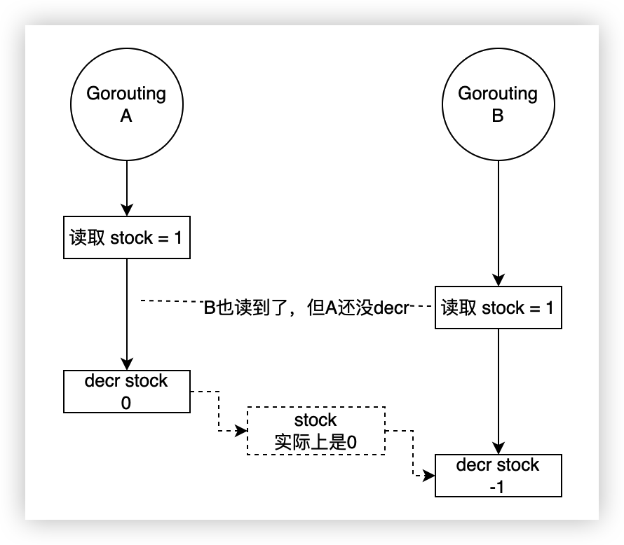

# Redis进阶：分布式锁实现

锁这个概念，不知道大家掌握的怎么样。我是先通过 Java ，知道在编程语言中是如何使用锁的。一般 Java 的例子会是操作一个相同的文件，但其实我们知道，不管是文件，还是数据库中的一条数据，只要是多个进程或者线程共享的，需要共同操作的数据，都会因为异步读写而带来一些问题，这些问题最终的解决方案往往就是通过锁。

MySQL 中，有表锁、行锁、读写锁、意向锁、间隙锁等等，而在 Redis 中，其实并没有完全的锁的概念，因为它是单线程执行命令的，本身就不会出现多线程同时操作同一数据的问题。因此，使用 Redis 非常适合来做分布式锁。那么，分布式锁又是啥意思呢？

单进程单线程，或者只在一台主机上，其实我们有很多种锁的解决方案。但是如果跨进程、跨主机了，不借助外力去实现锁就非常麻烦了。在同一个程序中，我们直接使用程序代码提供的锁就可以了，比如 Go 中的 sync.Mutex ，而如果不在同一个进程中，显然这个锁是没法让另一个进程也锁上的。这时，我们可以用类似于 pid 文件这样的概念，就是上锁的时候创建一个文件，这个文件即使是空的也行。其它进程如果发现有这样一个文件，那么就表示有别的程序已经上锁了。这是非常简单地解决同一台机器下多个进程之间锁的方案。而如果跨多台机器的多台实例，那么大部分情况下我们都会使用一些第三方的存储。MySQL 可以做分布式锁吗？可以的，加锁的时候插入一条数据，解锁的时候删除。Redis 可以吗？可以，而且更方便，那么咱们就来好好聊聊 Redis 的分布式锁。另外，Zookeeper 也是现在非常流行的分布式锁方案的一种外部存储实现。

## 普通的线程（协程）锁

这里我们先来看一下在一个普通的程序中，如何对多个线（协）程加锁，今天的内容为了方便起见，我使用的是 Go 语言，如果是 PHP 的话，Swoole 中也有类似的锁，大家可以自己尝试。

先看问题，假设做一个秒杀场景，最典型的问题就是超卖问题，意思就是多协程或者分布式多实例的情况下同时操作库存字段，有可能让库存变成负的，也就是出现了超卖的情形。

```go
var (
	c chan struct{}
	r *redis.Client
)

func main() {
  // 连接 Redis
	r = redis.NewClient(&redis.Options{
		Addr: "127.0.0.1:6379",
	})
	r.Del("stock")   // 先清理之前的数据，为了方便测试

	chanCount := 5 // 协程数量
	c = make(chan struct{}, chanCount) // channel

	for i := chanCount; i > 0; i-- {
    // 五个协程
		go func() {
			for { // 不停地处理
				stock, err := r.Get("stock").Int()
				if err != nil { // 如果出错或者 Redis 中不存在 stock 就等着
					continue
				}
				if stock <= 0 { // 如果 stock 小于等于 0 就退出循环
					break
				}
				r.Decr("stock") // 扣减库存
			}
			c <- struct{}{} // channel 增加内容
		}()
	}
	
  // 等待 5 个 channel 处理完成
	for i := chanCount; i > 0; i-- {
		<-c
	}
}
```

代码不多解释了，如果没有学过 Go ，但学过 Swoole 的话，应该大体也能看懂，如果都不会，额，赶紧去学一下吧。接下来，我们往 Redis 中添加数据，比如增加 10000 个库存。

```shell
127.0.0.1:6379> set stock 10000
OK
```

程序那边很快就会执行完成，这时我们再来看看库存还有多少。

```shell
127.0.0.1:6379> get stock
"-1"
```

不对呀，明明我们判断了 `如果 stock 小于等于 0 就退出循环` 这个条件，为啥会出现 -1 ？这就是多线（协）程会出现的典型问题了。有的时候还不一定只会是 -1 ，还会出现 -2 、-3 等等状况。如果在真实的业务场景中，只是超卖了这么几个倒还好说，但秒杀场景下往往是超大的流量和超大的并发，万一超卖了几百上千件的话.....看甲方爸爸怎么收拾你。



我就简单地画了两个协程可能出现的问题，如果你学过 Java ，了解多线程的话，把 Goroutine 看成是 Thread 也是可以的。对于同一个程序来说，这个问题好处理，加个锁就好了。

```go
var (
	c chan struct{}
	r *redis.Client
	l sync.Mutex  // Go语言的锁
)

func main(){
  ……………………
  
  go func() {
			for {
				l.Lock()   // 加锁
				stock, err := r.Get("stock").Int()
				if err != nil {
					l.Unlock() // 有问题，释放锁
					continue
				}
				if stock <= 0 {
					l.Unlock() // 条件不满足了，释放锁，并结束循环
					break
				}
				r.Decr("stock")
				l.Unlock() // 完成操作，解锁
			}
			c <- struct{}{}
		}()
  ……………………
}

```

标准处理流程，不解释了，现在在单应用实例的情况下其实就已经没有太大问题了，你可以自己试试，把 stock 的数量再加大，或者再多加几个协程也都是没问题的。如果想提高性能，可以再换成读写锁，这里就不演示了。接下来，我们通过运行多个应用实例，模拟分布式状态下，又会出现什么问题。

```shel
// 命令行1
go run main.go
// 命令行2
go run main.go
…………
// 命令行5
go run main.go

// Redis
127.0.0.1:6379> set stock 100000
OK

// 程序处理完成后再查看 Redis
127.0.0.1:6379> get stock
"-1"
```

我去，怎么又超卖了？

## 分布式锁

实际上根源和上一张图的原因是类似的，进程内部的锁只能保证当前这个进程内的线（协）程上锁，其它的进程或者真正的分布式放在其它的主机上，这玩意肯定不起效果了。这时往往就需要借助第三方来实现分布式的锁了。

在 Redis 中，我们已经知道它的命令执行就是单线程的，所以这一块我们不用太操心，因此我们只需要一个高大上的，而且是非常简单的，在第一课就提到过的命令就可以实现分布式锁，它就是 SETNX 命令。

```shell
  SETNX key value
  summary: Set the value of a key, only if the key does not exist
  since: 1.0.0
  group: string
```

这个命令的意思是，如果键存在，就无法设置它。既然这样的话，那么我们上锁的时候去 `SETNX` 一下，如果成功了，就表明当前的进程拿到了锁，如果失败了，就等待（继续抢锁）。操作执行完成之后，直接 `DEL` 设置的那个值就好了，这不就实现了一个分布式锁嘛。话不多说，继续改造代码。

```go
……………………
l.Lock()
b := r.SetNX("lock", 1, 0) // 设置一个 SETNX 锁
if b.Err() != nil || !b.Val() { // 设置失败或者没有值的话，释放协程锁，并 continue 继续抢锁
  l.Unlock()
  continue
}

stock, err := r.Get("stock").Int()
if err != nil {
  r.Del("lock")  // 现在也要释放分布式锁了
  l.Unlock()
	continue
}
if stock <= 0 {
  r.Del("lock") // 现在也要释放分布式锁了
  l.Unlock()
	break
}
r.Decr("stock")
l.Unlock()
r.Del("lock") // 现在也要释放分布式锁了

……………………
```


就加了这么几行代码，其实分布式锁的大体轮廓就已经出来了。测试一下吧，现在处理 10 万条库存的话即使 5 个进程，每个进程有 5 个协程，速度也会变得非常慢了。这是为啥呢？其实任何锁的操作，都是在做一件事，把并行变成串行，让同时操作变成顺序操作。目的就是用速度换正确性，或者说是牺牲效率换一致性。

也就是说，一步一步的加锁过来，我们的程序在处理高并发的业务的能力也在一步步的下降，如果再说锁的性能优化，那又是各种长篇大论了，也不是我们今天讨论的范围。但是还是给大家提供一些思路，比如读写锁，实际的业务开发中，往往不像我们这样测试的这么极端，还会有别的操作，比如可能先读到数据，进行一些其它处理，最后才写，这时就可以上读写锁来提高性能，即在写锁之前，读锁获取到的内容还是可以进行其它操作的。

好了，话题拉回来，今天我们还是着重解决最核心的分布式锁的问题，性能问题将来有机会再探讨。现在这个分布锁的应用就 OK 了？完全没问题了？不不不，还有几个问题值得我们考虑一下。

- 如果一个进程卡死了，没法释放锁了咋办？
- 如果一个进程可能某些原因确实要执行一段时间，如何释放锁比较合适？
- 有没有可能某一个进程释放了另一个进程的锁？

这三个问题也是面试时非常常见的问题，解决的思路其实也并不复杂。

- 进程卡死了没法释放锁：`SETNX` 的时候加个过期时间呗
- 进程确实可能执行时间长：增加续命功能，就是快到期前如果锁还没释放，就给它加长点时间
- 别的进程释放了我的锁：给设置的 Value 指定一个明确的内容，可以是客户端ID或者进程机器ID之类的

### 设置一个过期时间

这个不用多解释了吧，这里我直接设置了 30 秒，就算进程挂掉了，30 秒后这个锁也会自动释放。

```go
………………
b := r.SetNX("lock", 1, 30*time.Second)
………………
```

### 续命

这个问题不是太好测，我们可以先把过期时间调短点，比如上面的 30 秒换成 10 秒。然后进行续命操作。

```go
………………
b := r.SetNX("lock", 1, 10*time.Second)
………………

var t *time.Timer
go func() {
  t = time.AfterFunc(10*time.Second/3, func() {
    fmt.Println("续命1次")
    r.Expire("lock", 10*time.Second)
  })
}()
rand.Seed(time.Now().UnixNano())
randomNum := rand.Intn(15) // 生成0~9的随机数
time.Sleep(time.Duration(randomNum) * time.Second) // 随机模拟耗时操作

stock, err := r.Get("stock").Int()
if err != nil {
  r.Del("lock")
  l.Unlock()
  continue
}
………………
// 注意下面所有删锁的地方也要停掉定时器
r.Del("lock")
t.Stop()
………………
```

这里我们为什么要新开一个协程呢？主要就是不影响主协程的任务处理，让新的协程在定时器的时间到达之后进行续命，其实也就是增加操作的时间。然后我们就开两个进程进行测试，由于暂停时间是随机的，所以我们也少给点数据，就上 10 个库存好了。

```go
// 进程一
  goprogromtourbook go run main.go
续命1次
8
续命1次
7
续命1次
4
1
续命1次
0
续命1次
续命1次
续命1次

// 进程二
➜  goprogromtourbook go run main.go
续命1次
9
续命1次
6
续命1次
5
3
2
续命1次
续命1次
续命1次
续命1次
续命1次
```

其实不用我多说，你也会发现问题，那就是万一某个操作一直卡住了，锁还是无法释放啊，所以，正式情况下，我们还要考虑续命次数，一般来说续个2、3次，还不行的话可以认为当前这个操作是有问题的，应该采取别的方案，比如报错抛异常之类的。

### 只删自己的锁（误删锁问题）

考虑一个场景，比如 A 、B 两个进程都是耗时任务，A 上锁了，过期了（不考虑多次续命抛出异常强制结束的情况），锁被自动释放了，B 又过来上锁了，正在处理的过程中 A 那边突然炸尸了，结束任务把锁又释放了，这时不就是 A 把 B 的锁释放了嘛，然后其它进程 C、D、XXX 都来抢锁，马上就进入混乱状态了。

好解决吗？说难也难，说不难也不难。说不难是因为我们可以使用 value 值啊，设置一个标识当前进程状态的内容就可以了，删除的时候只有匹配上了才能删自己的。

```go
go func(index int) {
			lockId := strconv.Itoa(os.Getpid()) + ":" + strconv.Itoa(index)  // 简单做个标识
			…………………………
				if r.Get("lock").Val() == lockId {   // 要判断是自己的，才进行下面的解锁操作
					r.Del("lock")
					t.Stop()
					l.Unlock()
				}
			…………………………
}(i)
```

说难吧，就是这个标识的唯一性以及这个思想的转变，我们的测试其实不是很好测出释放了别人锁的情况，但如果是一个合格的架构师，应该是要去考虑这一块的内容的，而且这个也是非常容易想到的可能出 BUG 的一个点。

## 完整代码

其实啊，上面这堆东西大部分是面试才用得到，为啥这么说呢？真正的高并发大流量的系统，百分之90以上全是 Java 了，而 Java 中的 Redisson 包中，有非常完整的这套分布式锁方案，完全不用自己写。不知道 Go 和 PHP 有没有现成的类似于 Redisson 的包，如果有了解的小伙伴，评论区留下地址，我们一起去学习哦。

下面就把稍微优化过后的一整套完整的代码放上来，大家可以自己运行测试一下哦。具体解释记得之后看视频。

```go
var (
	c     chan struct{}
	r     *redis.Client
	l     sync.Mutex
	cLock CLock
)

func main() {

	r = redis.NewClient(&redis.Options{
		Addr: "127.0.0.1:6379",
	})
	r.Del("stock", "lock", "verify")

	chanCount := 5
	c = make(chan struct{}, chanCount)

	for i := chanCount; i > 0; i-- {
		// 协程处理
		go decr(i)
	}

	for i := chanCount; i > 0; i-- {
		<-c
	}
}

func decr(i int) {
	// 初始化锁对象
	cLock = CLock{key: "lock", expire: 3 * time.Second}

	// 解锁操作函数
	allUnLock := func() {
		l.Unlock()
		cLock.UnLock()
	}

	// 异常处理
	defer func() {
		if err := recover(); err != nil {
			// 发生异常，解锁
			l.Unlock()
			allUnLock()
		}
	}()

	for {
		l.Lock() // 原生锁
		// 一致性
		lockId := strconv.Itoa(os.Getpid()) + ":" + strconv.Itoa(i)
		cLock.Lock(lockId) // 分布式锁

		// 续命
		go func() {
			cLock.lifeTimer = time.AfterFunc(cLock.expire-cLock.expire/3, cLock.Life)
		}()

		// 模拟耗时操作
		rand.Seed(time.Now().UnixNano())
		randomNum := rand.Intn(6)
		time.Sleep(time.Duration(randomNum) * time.Second)

		stock, err := r.Get("stock").Int()
		if err != nil {
			allUnLock()
			continue
		}

		if stock <= 0 {
			allUnLock()
			c <- struct{}{}
			break
		}

		r.Decr("stock")

		// 数据如果有重复操作，提示出来，并停止当前进程
		if res, _ := r.SAdd("verify", r.Get("stock").Val()).Result(); err != nil || res == 0 {
			allUnLock()
			fmt.Println("数据有重复: ", r.Get("stock").Val())
			os.Exit(1)
		}
		// 打印操作的是谁
		fmt.Println(lockId, "操作:", r.Get("stock").Val())

		allUnLock()
	}
}

type CLock struct {
	key       string        // 锁的 Key
	expire    time.Duration // 超时时间
	life      int           // 续命次数
	lifeTimer *time.Timer   // 续命定时器
	lockId    string        // 锁的值
}

func (cLock *CLock) Lock(id string) {
	for {
		b := r.SetNX(cLock.key, id, cLock.expire)
		if b.Err() != nil {
			fmt.Println(b.Err().Error())
			continue
		}
		if b.Val() {
			break
		}
	}
	cLock.life = 0
	cLock.lockId = id
	if cLock.lifeTimer != nil {
		cLock.lifeTimer.Stop()
	}
}

func (cLock *CLock) UnLock() {
	getId := r.Get(cLock.key).Val()
	if getId == cLock.lockId {
		r.Del(cLock.key)
		if cLock.lifeTimer != nil {
			cLock.lifeTimer.Stop()
		}
	}
}

func (cLock *CLock) Life() {
	if cLock.lockId != "" {
		if cLock.life < 3 {
			getId := r.Get(cLock.key).Val()
			if getId == cLock.lockId {
				r.Expire(cLock.key, cLock.expire)
				cLock.life++
				// cLock.lifeTimer.Stop()
				cLock.lifeTimer = time.AfterFunc(cLock.expire-cLock.expire/3, cLock.Life)
				fmt.Println(cLock.lockId, "续命", cLock.life, "次")
			}
		} else {
			panic("续命超次数")
		}
	}
}
```

上述代码并不是完全的真正可用的分布式锁代码，只是我们根据分布式锁的概念去写的，并没有进行详细的测试，所以可能还是会有很多的 BUG 和问题，不推荐直接复制走了就放到线上去使用哦。

## 红锁 RedLock

红锁这个概念啊，其实和 Zookeeper 还有点关系，另外还要和存储架构中的 CAP 原理扯上关系。CAP 表示的就是一致性、可用性和分区性，当分区性存在的时候时候，CA 无法两全。啥意思？一旦有分区，可用和一致就没办法一起达到，毕竟只要有分区，就一定会有延迟，不管延迟的大小，它一定是客观存在的。想要高可用，那就尽量减少分布数量，或者仅从一台主机获取结果就认为结果是确定的。而想要一致性，也就是所有主机的数据都确定或者超过半数以上的主机确认，这条数据才真正的确定是当前的值，这样可用性就差了，为啥？要一条一条的每台机器都确认嘛。

正常来说，Redis 的分布式锁是 AP 式的，而 Zookeeper 的分布式锁是 CP 式的。一般 Zookeeper 都是三台机器起步，同一把锁必须有两台主机确认锁上了，它才会返回真的锁上了。而在 Redis 中其实没有这样的机制，即使是 Cluster 也是把 Key 做 Hash 放到不同的机器上去了。这也是 Redis 的特点所决定的，它本身就是一个高可用的快速缓存系统嘛。

不过各位大佬们不甘心，于是就出现了 RedLock 这个概念。其实就是多台 Redis ，通过程序代码控制，比如配置三台 Redis 主机，上锁的时候必须有两台上锁成功了才表示成功。

同样，Java 的 Redisson 中也有现成的解决方案，对于我们来说，知道有这么个东西就好了。自己想要去实现的话，最好还是看看分析一下 Redisson 的源码，然后去依照它的写，就像上面的我们实现的分布式锁也是一样，实验性质的，和 Java 中已经成熟的工程化的代码还是有很大区别的。毕竟它们会考虑更多的问题，而我们可能有很多会想不到。

在 PHP 中，其实通过 packagist.org 还是能搜到不少的 RedLock 相关的组件的，只不过我并没有试过，有没有好用的大家有用到的朋友可以给点意见哈。

## 总结 

今天的内容有点长，但其实主要是代码粘的多点。再次强调，我们最后的分布式锁的代码只是测试性质的，看了很多讲 Redis 的教程中各位老师基本都会用 Java 来实现一个简单的分布式锁，因此我这个其实也大部分是根据分布式锁的概念用 Go 代替 Java 写了一遍，有会 Swoole 的小伙伴也可以尝试改造成 Swoole 版本的哦。但是，就像他们的课程最后都会引到 Redisson 上一样，确实自己写的会有很多地方欠缺考虑，专业开源稳定的一些软件包才是真正应用在业务开发中的首选。如果真的想用，其实不太需要考虑续命之类的问题，这一块要完美实现真的很绕的，只要超时没执行完就中断好了。这样一个简单的分布式锁其实也足够应对不小的流量和大部分的需求了。要知道，能力越大责任越大，有时候如果我们无法考虑的完美，那么干脆换个角度看能不能不要这个特性，通过其它更简单的方式来弥补。

可惜的是，在 PHP 和 Go 领域，貌似还没发现有类似 Redisson 这样的非常出名的 Redis 分布式扩展，去搜索一下也能找到一些，至于好不好用我也不清楚。还是那句话，平常用不到啊，大家加油冲向大厂啊，努力找大神带带啊，要不这些玩意学起来真 TNND 的费劲。

测试代码：

[https://github.com/zhangyue0503/dev-blog/blob/master/redis/2022/source/25.go](https://github.com/zhangyue0503/dev-blog/blob/master/redis/2022/source/25.go)

