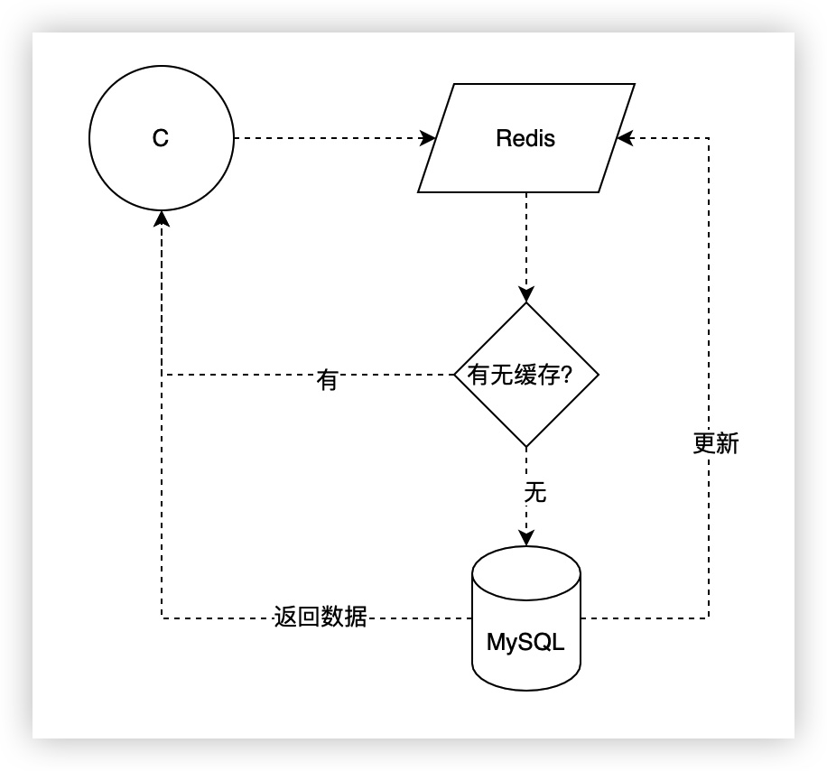
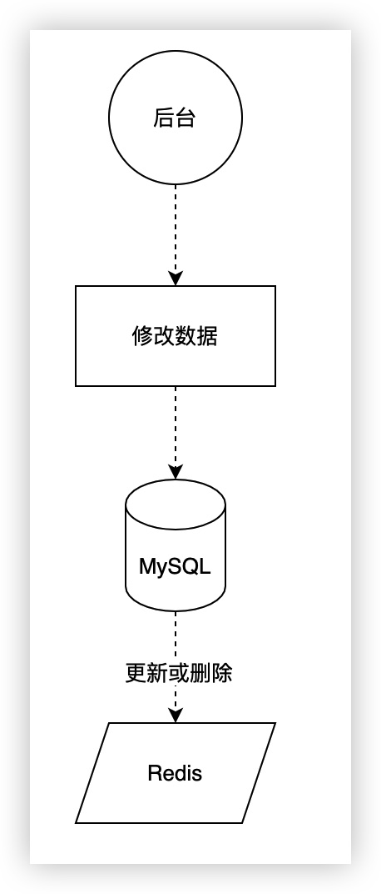

# Redis进阶：缓存穿透、击穿与雪崩

其实啊，这个内容本来不打算写了，网上讲这一块的内容实在是太多了。不过呢，本着学习还是要全面的原则，而且还要让自己多多巩固复习的原则，咱还是来写一道吧。

同样的，这三个问题也是面试中的经典问题，而且是面向整个缓存机制的，不仅是 Redis 的问题，即使你用 Memcached 、ETCD、或者 SWOOLE 中的 TABLE 之类的，也会有这样的问题。

## 缓存场景

大部分情况下，我们的缓存过程可能是这样的。



请求过来后先看 Redis 中有没有数据，有的话直接返回数据，没有的话去 MySQL 查询，然后 MySQL 返回数据并同时更新 Redis 中缓存的数据。

在后台操作数据时，我们也需要更新数据，大概的流程如下图。



这是最简单的两种缓存操作形式，相信也是大部分同学在实际的业务开发中所使用的缓存方案。这种方案也只做只读缓存。写缓存是发生在读未得到数据后出现的，后台操作只是删除掉缓存，全部交由前端来更新缓存。另外还有读写缓存，其中又包括同步直写和异步回写两种，分别是更新缓存时同时更新数据库，以及先更新缓存再异步更新数据库。读写缓存会有缓存系统崩溃导致数据库写入失败的风险，但在某些场景下还是很重要的，比如强事务性缓存、对数据库依赖不高的缓存业务等。

好了，穿透、击穿、雪崩的问题恰恰就是发生在这些更新删除的中间步骤和环节之中，说白了，就是缓存和数据库不一致或者在准备一致的过程中，会出现的问题。当然，也是在高并发大流量的场景下才容易出现，所以其实很多小伙伴也只是听说过，但实际的业务场景中说实话，真的处理过类似问题的不多，包括我在内。别急，没吃过猪肉至少咱也得想办法去看猪跑是不是，管它三七二十一，问题原因和解决方案不说完美，但面试的时候至少要能答个八九不离十，大不了硬背嘛。

## 缓存穿透

缓存穿透可能会相对常见一点，因为它和并发量关系不大，只是说在高并发场景下会更明显，但实际上，这个问题可能很多情况下是一直存在的。

穿透的意思就是从缓存层直接穿过去到达数据库了，说白了，Redis 中没有缓存的数据。而且注意了，它和击穿的最大不同是，数据库中也没有这条数据。

比如说，我们的用户表只有 10000 条数据，而对方一直请求 100001 这个 id 的数据，那么这个请求会一直落到 MySQL 上去进行一次查询。

正常情况下，查不到数据我们就不会缓存，比如像下面这样。

```php
$uid = $request->param("id", 0);
$info = Db::find($uid);
if ($info){
  $redis->set("user:".$uid, json_encode($info));
}
```

很明显，没有查到的数据不会缓存，对方只需要一直请求这些查不到数据的信息，然后加大请求量，就会给数据库带来不小的压力。

解决方案？最简单的方式，空数据也缓存一下。

```php

$uid = $request->param("id", 0);
$info = $redis->get("user:" . $uid);
if (!$info) {
  $info = Db::find($uid);
  if ($info) {
    $redis->set("user:" . $uid, json_encode($info));
  } else {
    $redis->set("user:" . $uid, "noone", 2 * 60);
  }
} else {
  if ($info == "noone") {
    // 返回错误信息
  }
}
```

我们给一个 noone 或者一个空的结构化数据都可以，要注意的是可以给一个较短的过期时间，避免真的有数据了之后还查不到。当然，后台在操作数据的时候也应该对应的删除或者更新这条缓存 Key 。

不过这个方案有不好的地方。一是浪费内存空间，二是万一更新失败，数据会出现问题。因此，更高大上的解决方案是 **布隆过滤器** 关于这个东西，之前在讲 Bitmap 时就顺带讲了一句，如果是像用户 ID 这样纯数字的，确实直接可以用 Bitmap 来实现，否则的话，就要考虑 Redis 的布隆过滤器插件或者我们自己手动准备一个了。这一块大家可以再查找更详细的资料，毕竟我也没实际使用过。

## 缓存击穿

缓存击穿，看着和穿透好像有点关系吧？但其实它和雪崩有点关系，和穿透的关系不大。击穿指的是热点数据过期，在缓存更新或者删除的空档，大量请求到达数据库，从而发生数据库被击穿的情况。

同样地，大流量高并发的场景下才会见到。另外，还有一点，就是 Redis 中的数据没了，但数据库里是有数据的。只是在两边数据未同步的那个间隙产生出来的问题。

一般来说，大家经常会访问的数据被称为热点数据，然后在秒杀、抢优惠券这类的大流量高并发场景下，突然一个热点缓存过期或者更新了，就很容易出现击穿问题。非热点数据由于访问频次不高，所以击穿问题即使出现，后果也不会太严重。

那么怎么应对呢？

- 双缓存：另起一个缓存实例或者另加一个 Key ，保存的数据全部是不过期的。操作数据时也先更新第一层缓存，然后再更新第二层缓存。读取的时候，第一层缓存失效后先读第二层缓存，同时去数据库查询新数据并更新。可能出现数据不一致。
- 后台更新缓存，而不是删除缓存让前台去更新。非热点数据可能会占用更多的内存。对应读写缓存中的同步直写方式，需要注意事务关系，也就是数据库操作或缓存操作某一个失败后的处理。
- 热点数据别过期，业务上控制也尽量别更新。
- 锁：缓存失效前台在获取的时候上锁，更新完成后释放锁，锁内部还需要再查一次缓存中是否已经有数据，会造成其它请求等待。性能降低。

各种方案各种优势和弊端，如何取舍只能根据业务情况具体分析了。

## 缓存雪崩

雪崩了啊，山崩地裂的感觉。很明显，同一时间内大量缓存同时过期。这个时候如果都失效的是非热点数据还好，但如果其中夹杂着热点数据，那其实就是发生了大规模的击穿。大量击穿换个名词，就变成了缓存雪崩。

既然知道问题原因了，那么解决方案也呼之欲出了。

- 最简单的方式，所有过期时间加上随机因子，比如正常是缓存 2 小时的，加个随机数 1-300秒，就变成了 2 小时 1 秒至 5 分钟内随机过期。
- 后台更新缓存，和上面击穿的一样。
- 热点数据别过期。
- 锁。
- 服务熔断、降级、请求限流。

## 总结

其实了解了概念，这些内容的解决方案都不是特别复杂的。另外，这三个问题都有一个特点，那就是在大流量高并发的场景，因为 MySQL 抗不住了才会出现问题。因此，小流量低并发的系统比如后台的管理系统之类的，其实并不太需要考虑这些问题。另外，这三个问题都是缓存和数据库的数据出现了不一致，也就是数据双写出现了问题，因此，它们的终极解决方案都是加锁，将并行变成串行，而加锁就会降低并发性。两难啊，就像文章中说到的，怎么抉择，看大家自己的业务情况按需选择吧。