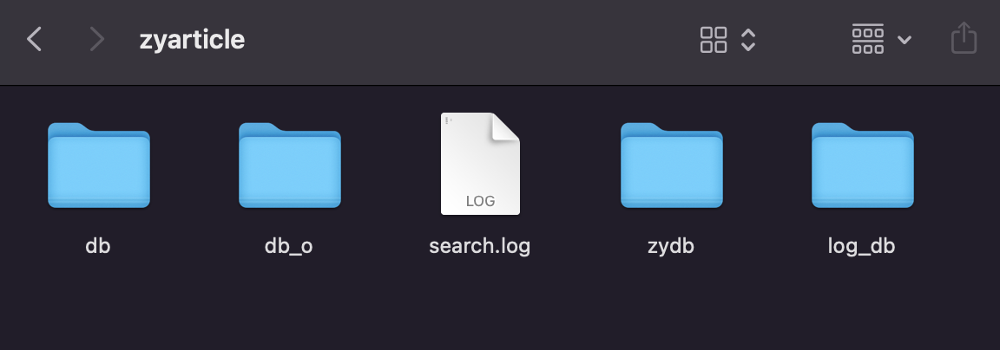

# 搜索技巧（四）搜索日志库及热门、推荐、纠错功能

前面我们已经学习了基本的搜索功能以及非常重要的相关度排序的算法。对于大家日常基本的使用来说，其实有之前的内容就已经非常足够了，但是，一个好的工具，总会有一些意外惊喜的，比如说我们今天要学习的内容。

大家在使用搜索引擎时，往往搜索引擎还会提醒一些相关的热门搜索词。同时在搜索引擎的输入框打字的时候，也会有下拉框给出一些提示词。最后，如果我们打错字了，很多搜索引擎也会提供一些“您是不是想搜索xxxx”这样的提示。这些功能，就是我们马上要学习的内容，XS 都是自带这些功能的。

## 热门词

使用热门词功能，就是直接使用一个 getHotQuery() 方法就可以了。

```php
print_r($search->getHotQuery());
// Array
// (
//     [敏捷] => 44
//     [算法] => 6
//     [数据结构与算法] => 21
//     [数据库] => 2
//     [项目] => 2
//     [最强] => 1
// )
```

返回的数组中，前面的键是热门词，后面的值是这个词被搜索的次数。

**注意，如果你查询不到热门词，可能是系统还没有生成，我们今天的讲的所有内容都是基于一个叫“搜索日志”的功能来实现的，这个功能是在搜索引擎使用过一段时间之后才会有的，后面我们会细讲。或者使用第10讲中的 flushLogging() 刷新一下日志库。**

这个方法在默认情况下是返回 6 条数据，它也有一个默认的排序类型，是按热门词的总量进行排序的。我们也可以通过参数来修改。第一个参数是数量，上限为 50 条；第二个参数是排序方式，包括三种：total总量、lastnum上周、currnum本周。

```php
print_r($search->getHotQuery(4, 'latnum'));
// Array
// (
//     [敏捷] => 44
//     [算法] => 6
//     [数据结构与算法] => 21
//     [数据库] => 2
// )

print_r($search->getHotQuery(3, 'currnum'));
// Array
// (
//     [数据结构与算法] => 21
//     [数据库] => 2
//     [项目] => 2
// )
```

看出来返回的内容不同了吧。可以看出，有上周和本周的差别，就说明在底层存储的时候会有一个时间相关的字段，这个我们后面讲搜索日志库的时候再详细说。

## 相关词

相关词，就是根据我们搜索的内容，返回与之相关的一些其它搜索词项或者短语。比如说我们经常测试的“数据结构与算法”以及“算法”这两个词。它们的相关性就非常高。

```php
$search->setQuery('算法');
print_r($search->getRelatedQuery());
// Array
// (
//     [0] => 数据结构与算法
// )
```

这里使用的就是 getRelatedQuery() 这样一个方法。这个方法也有两个参数，第一个参数是可以直接指定要查询的关键词，第二个则是返回的数量 。

```php
print_r($search->getRelatedQuery('编程', 10));
// Array
// (
//     [0] => 编程语言
//     [1] => 网络编程
// )
```

用法也非常简单，没啥多说的。

在搜索结束后，可以在页面上提示还有其它的相关搜索，方便用户找到更精确或者更有用的搜索关键词。

## 建议及纠错

这两个功能其实有点像，我们先来看纠错的功能。使用拼音输入法的小伙伴可能会经常因为同音不同字的问题而导致在快速打字的时候出现一些错别字。这个纠错功能就是为我们提供一些纠错的选项。

```php
$search->setQuery('蒜法')->search();
$corrected = $search->getCorrectedQuery();
if (count($corrected) !== 0)
{
  echo "您是不是要找：\n";
  foreach ($corrected as $word)
  {
    echo $word . "\n";
  }
}
// 您是不是要找：
// 算法
```

说实话，这个蒜字的差距有点大了。正常情况下的拼音输入法，直接打“suanfa”应该是不会出现这样的词组的。好吧，就当是一个极端例子，但是大家也可以看出，返回的数组中是有正确的“算法”这个词的。这个 getCorrectedQuery() 方法只有一个参数，就是可以传入一个搜索词，然后就返回对应纠错结果的数组。

```php
print_r($search->getCorrectedQuery('sf'));
// Array
// (
//     [0] => 算法
// )
print_r($search->getCorrectedQuery('suanfa'));
// Array
// (
//     [0] => 算法
// )
print_r($search->getCorrectedQuery('pmp'));
// Array
// (
//     [0] => php
// )
print_r($search->getCorrectedQuery('pmp 蒜法'));
// Array
// (
//     [0] => php算法
// )
```

上面的例子，最大的惊喜是什么不知道大家有没有发现。我们直接使用的是拼音在搜索哦，返回的是拼音相对应的搜索词。另外，之前我们在测试中还搜索过“PHP”这个词，但没有搜索过"PMP"，其实“PMP”不算是一个错词，但因为我们之前没有搜索过，所以它会纠偏为我们之前正常搜索过并且有结果的“PHP”这个词。这一点也是大家需要注意的。

最后，“pmp 蒜法” 这个错得没边的搜索词，返回的纠正结果是“php算法”，总体来说还算是比较满意的。

### 建议词

除了纠正之外，还有一个建议词的功能，我的感觉其实是和纠正有点像，但它应该还是以提示为主，比如我们只输入一个“单字” 的话。还记得最早的时候我们在纠结为啥单字无法搜索的问题吗？这里其实也是一个解决方案。

```php
print_r($search->getExpandedQuery('s'));
// Array
// (
//     [0] => 算法
//     [1] => 数据结构与算法
//     [2] => 数据库
// )
print_r($search->getExpandedQuery('sf'));
// Array
// (
//     [0] => 算法
// )
print_r($search->getExpandedQuery('算'));
// Array
// (
//     [0] => 算法
// )

print_r($search->getExpandedQuery('最'));
// Array
// (
//     [0] => 最强
//     [1] => 最好
// )

```

看出来效果了没，它也可以做到拼音检索的效果，同时，如果是单字，也会返回包含这个单字的词组。但是要注意的是，“数据结构与算法”这个短语没有出来哦，只返回了“算法”这个单独词项。所以说，它还是有一定局限性的。

如果是需要完全的拼音搜索功能，那么我们就可以通过代码来实现，比如先判断如果搜索词是全英文的，通过 getExpandedQuery() 看看能不能找到相应的建议词。如果能找到的话，再使用这些建议词，组合成查询语句进行模糊查询。比如前面的 “s” ，将返回结果数合成 “算法 数据结构与算法 数据库”这样空格分开的搜索语句。然后再配合 setFuzzy()  进行模糊查询。就能实现仅仅一个单字母实现的拼音+英文模糊查询效果了。是不是感觉还是有点强大的呀。

纠正功能是在搜索结果过少，或者完全没有结果时，可以针对当前的搜索内容进行一个提醒纠正。而建议词，更多情况下可以提供给 autocomplete 这类的组件中使用，就是我们前面说过的那种搜索提醒下拉框。

## 搜索日志

前面就提到过了，上面那三个功能，全部依靠的其实是一个搜索日志功能。而这个功能，又是建立在 XS 本身的搜索引擎之上的一个特殊的搜索库。有点晕吧，这个怎么理解呢？还记得我们很早前学过的同一个项目多个库的功能吧，就是那个 setDb() 方法，XSIndex 和  XSSearch 都有这个方法。我们可以让一个项目，在物理环境上实现多个库。而搜索日志，其实也是针对当前项目的一个特殊的、单独的库。

之前学习 XSIndex 的时候，就学过一个 flushLogging() 方法，不知道大家还有没有印象。它就是用来刷新搜索日志库的。如果你使用上面的那些功能查不到东西，那么可以试着先调用一下 XSIndex 的这个方法。然后在数据目录，也会出现一个叫 log_db 的库目录。



然后，使用上面的那些方法就可以查询到相应的内容了。也就说，在默认情况下，一个新的搜索项目，会在积累到一定量的搜索关键词之后，才会生成 log_db 库。这应该也是有一个缓冲区，而直接调用 flushLogging() 就会直接让缓冲区的数据落盘，其实就是生成 log_db 库，或者 log_db 库存在的话就直接更新数据。

我们可以直接切换到这个库并查询一下里面的内容。

```php
$docs = $search->setDb(XSSearch::LOG_DB)->setLimit(1000)->search();
foreach($docs as $d){
  echo $d->content, PHP_EOL;
}
```

我这里直接打印的是搜索日志库中数据的 content 字段，但其实它还有别的字段。其实，它的数据结构是和我们的 ini 项目配置是一样的。并且会将关键词存储到 body 类型的字段中。比如我们切换到 demo 示例的话，直接打印 docs 的内容是：

```php
$xs2 = new XS('demo');
$search = $xs2->search;
$docs = $search->setDb(XSSearch::LOG_DB)->setLimit(1000)->search();
print_r($docs);
// …………
// [0] => XSDocument Object
//     (
//         [_data:XSDocument:private] => Array
//             (
//                 [chrono] => �
//                 [4] => �
//                 [5] => �
//                 [6] => 2022-W48
//                 [message] => demo
//             )
// …………
```

到这里，也顺便提醒一下各位大佬，自定义 db 库的时候，不要起 log_db 这个名字哈，要不就和这边冲突了。至于中间的 5、4、6 这些是什么？我也不知道，没有更多的详细资料可以研究学习了，目前版本的测试中会返回 lastnum、currnum、currtag ，可能就是它们的常量表达吧。总体的原理，相信大家应该清楚了，那就是上面的那一堆功能，还是基于搜索以及搜索引擎的功能来实现的，并没有什么别的黑科技。但是这部分内容都封装在服务端了，咱们能了解的也只有这些了。

更深入的一些操作功能，其实大家可以看看 SDK 提供的 Logger.php 这个工具的源码。下面，我们就来先看看它的使用方式吧。

## Logger 工具操作

热门词、相关词、建议和纠正的功能在 Quest.php 查询工具中也可以直接使用，具体的内容大家可以在官方文档或者在源码中查看。Logger.php 工具其实更重要的是可以对 log_db 搜索日志库进行一些操作。我们先来看看这个工具的基本使用。

```shell
> php ./vendor/hightman/xunsearch/util/Logger.php ./config/5-zyarticle-test1.ini
序  搜索热门关键词(total)                    次数      
--------------------------------------------------------
 1. 敏捷                                     44
 2. 算法                                     6
 3. 数据结构与算法                           21
 4. 数据库                                   2
 5. 项目                                     2
 6. 最强                                     1
```

只有项目配置的情况下，默认是返回热门词。在 Logger.php 工具中，只有查询热门词的功能。但其实这个功能返回的就是整个 log_db 库中的所有内容。通过热门词列表，我们就可以了解到当前整个 log_db 库中的词组情况。

好了，不想要的词可以直接 `--del` 删除掉，

```shell
> php ./vendor/hightman/xunsearch/util/Logger.php ./config/5-zyarticle-test1.ini --del=最强
成功删除 最强!
刷新已提交的日志索引 ... 成功
> php ./vendor/hightman/xunsearch/util/Logger.php ./config/5-zyarticle-test1.ini
序  搜索热门关键词(total)                    次数
--------------------------------------------------------
 1. 敏捷                                     44
 2. 算法                                     6
 3. 数据结构与算法                           21
 4. 数据库                                   2
 5. 项目                                     2
```

删除功能也可以批量，关键词用逗号连接就好了。有删除，那么也会有添加，使用 `--put` 参数就可以了。

```shell
> php ./vendor/hightman/xunsearch/util/Logger.php ./config/5-zyarticle-test1.ini --put=设计模式:100,信管师:10
开始增加/更新搜索词 ...
新增 设计模式 次数：100
新增 信管师 次数：10
强制刷新未处理的日志记录 ... 成功
注意：后台更新需要一些时间，并不是实时完成！
> php ./vendor/hightman/xunsearch/util/Logger.php ./config/5-zyarticle-test1.ini
序  搜索热门关键词(total)                    次数
--------------------------------------------------------
 1. 敏捷                                     44
 2. 设计模式                                 100
 3. 信管师                                   10
 4. 数据结构与算法                           24
 5. 算法                                     8
 6. 数据库                                   2
 7. 项目                                     2
 8. 设计                                     2
 9. php                                      8
```

添加的格式是“关键词:搜索次数”，多个关键词逗号分隔。上面我们添加的“设计模式”直接指定了搜索次数为100次，“信管师”的搜索次数为10次，入库后直接就是按我们输入的次数保存的。这个次数，并不一定是排序的最终依据，可以看到在默认 total 的情况下，热门词返回的结果“敏捷”这个44次反而是排第一位的。这里的具体排名算法没啥资料，不清楚是怎么弄的。如果再次运行会怎么样呢？如果关键词存在，次数会累加，这个大家自己试试试，我们在下面的文件导入中会进行重复导入的尝试，效果都是一样的。

好了，已经说出来了就直接看吧，文件导入就是准备好下面这样的文件。

```shell
# 14.txt
科学
数学	12
物理	10
化学
生物
```

按行分隔，关键词后面接制表符，就是“\t”（tab键），后面紧跟着搜索次数。注意，一定要是“\t”分隔符号，不能是四个空格什么的。默认没有次数的话就是 1 次。接着，使用 `--import` 进行导入就可以了。

```shell
> php ./vendor/hightman/xunsearch/util/Logger.php ./config/5-zyarticle-test1.ini --import=14.txt
开始导入搜索日志文件 ...
新增 科学 次数：1
新增 数学 次数：12
新增 物理 次数：10
新增 化学 次数：1
新增 生物 次数：1
强制刷新未处理的日志记录 ... 成功
注意：后台更新需要一些时间，并不是实时完成！
```

咱们再运行一次。

```shell
> php ./vendor/hightman/xunsearch/util/Logger.php ./config/5-zyarticle-test1.ini --import=14.txt
开始导入搜索日志文件 ...
更新 科学 的次数：1 + 1
更新 数学 的次数：12 + 12
更新 物理 的次数：10 + 10
更新 化学 的次数：1 + 1
更新 生物 的次数：1 + 1
强制刷新未处理的日志记录 ... 成功
注意：后台更新需要一些时间，并不是实时完成！
```

看到累加效果了吧。然后查询一下看看。

```shell
php ./vendor/hightman/xunsearch/util/Logger.php ./config/5-zyarticle-test1.ini --limit=50     
序  搜索热门关键词(total)                    次数      
--------------------------------------------------------
 1. 敏捷                                     44
 2. 物理                                     30
 3. 数学                                     36
 4. 设计模式                                 100
 5. 算法                                     8
 6. 信管师                                   10
 7. 数据结构与算法                           24
 8. 化学                                     3
 9. 生物                                     3
10. 科学                                     3
…………………………
```

结果就是多次的累加，我这里是运行了 3 次，次数结果就是三次累加的结果。

最后，就是清空搜索日志库，其实它就是通过 XSIndex ，使用 setDb() 切换到 log_db 之后，执行 clean() 方法。这个没啥多说的，但是需要注意的是，清空之后，热门、相关、纠错及建议这些功能全部都用不了了。

```shell
> php ./vendor/hightman/xunsearch/util/Logger.php ./config/5-zyarticle-test1.ini --clean   
清空已有搜索日志数据 ...
> php ./vendor/hightman/xunsearch/util/Logger.php ./config/5-zyarticle-test1.ini --limit=50
暂无相关热门搜索记录。
```

### PHP代码中添加搜索日志数据

在 PHP 代码中，也可以通过 addSearchLog() 这个方法来添加相应的关键词到搜索日志库。

```php
$search->addSearchLog("大学",20);
$search->addSearchLog("中学");
$search->addSearchLog("小学");
$search->addSearchLog("大学");

$xs->index->flushLogging();

print_r($search->getHotQuery());
```

参数不用过多解释了，前面的还是词项，后面的是自定义的搜索次数，默认值就是 1 。多次执行也是会进行累加。

## 总结

今天的内容，使用其实都非常简单，但是官方文档更简单，所以很多原理也搞不清楚。我们其实也能看出来 ，官网上也有说明，那就是这些功能全是基于 log_db 这个库的，大家可以根据这个库的内容进行更深入的或实验更有趣的查询分析。这个库有它自己的一套 scheme 。

```php
// vendor/hightman/xunsearch/lib/XSFieldScheme.class.php
public static function logger()
{
  if (self::$_logger === null) {
    $scheme = new self;
    $scheme->addField('id', array('type' => 'id'));
    $scheme->addField('pinyin');
    $scheme->addField('partial');
    $scheme->addField('total', array('type' => 'numeric', 'index' => 'self'));
    $scheme->addField('lastnum', array('type' => 'numeric', 'index' => 'self'));
    $scheme->addField('currnum', array('type' => 'numeric', 'index' => 'self'));
    $scheme->addField('currtag', array('type' => 'string'));
    $scheme->addField('body', array('type' => 'body'));
    self::$_logger = $scheme;
  }
  return self::$_logger;
}
```

仅从猜测角度来看， pinyin 字段用于 pinyin 纠错、建议，total、lastnum、currnum应该是标识符类型（查询源码中能看到指定“total:1”这样的条件语句，查询结果中是各种数字，但不是时间戳），currtag 是一个当前标记，这些就是前面的 4、5、6什么的，剩下的就是一个 body 用于关键词记录。

我们前面直接 setDb() 打印出来的内容中，有些情况下可能会是 4、5、6 那样的，其实是因为 ini 文件中的字段配置无法匹配。可以使用 XS 对象的 setScheme() 方法来切换为 log_db 库的 scheme 配置。这也是从源码中找到的。

```php
$xs2 = new XS('demo');
$xs2->setScheme(XSFieldScheme::logger());
$search = $xs2->search;
$docs = $search->setDb(XSSearch::LOG_DB)->setLimit(1000)->search();
print_r($docs);
// …………
// [0] => XSDocument Object
//     (
//         [_data:XSDocument:private] => Array
//             (
//                 [total] => �
//                 [lastnum] => �
//                 [currnum] => �
//                 [currtag] => 2022-W48
//                 [body] => xunsearch
//             )
// …………
```

还是看不到 pinyin 和 partial 的内容，乱码字段可以转换一下 UTF8 编码，可以参考 Logger.php 工具文件中的源码。希望有大佬对这一块有了解的能够在评论区留言指导。

好吧，总结一下，今天学习的功能好玩，也很实用。大致的原理其实也是通过搜索引擎的各种功能来实现的，更具体的查询功能，比如拼音、建议、纠正这些的匹配，一是找不到字段，二是貌似还是能够直接在服务端来进行处理的，所以没法进入更加深入的了解（getHotQuery() 和 getRelatedQuery() 是直接通过普通查询 log_db 库实现的，这一块源码大家可以看看）。

最后，下篇文章，我们就要对 XSSearch 的学习进行收尾了，还有一些其它的方法及属性，我们再简单了解一下就好了。

测试代码：

[https://github.com/zhangyue0503/dev-blog/blob/master/xunsearch/source/14.php](https://github.com/zhangyue0503/dev-blog/blob/master/xunsearch/source/14.php)

参考文档：

[http://www.xunsearch.com/doc/php/guide/search.hot](http://www.xunsearch.com/doc/php/guide/search.hot)

[http://www.xunsearch.com/doc/php/guide/search.rel](http://www.xunsearch.com/doc/php/guide/search.rel)

[http://www.xunsearch.com/doc/php/guide/search.fix](http://www.xunsearch.com/doc/php/guide/search.fix)

[http://www.xunsearch.com/doc/php/api/XSSearch](http://www.xunsearch.com/doc/php/api/XSSearch)

