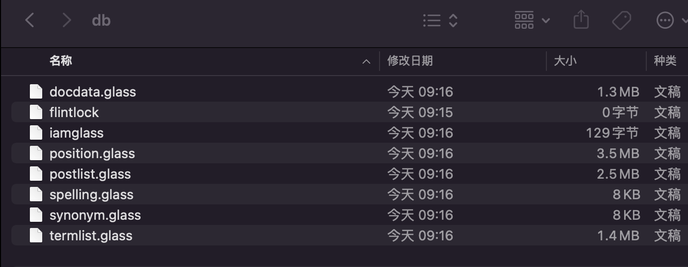
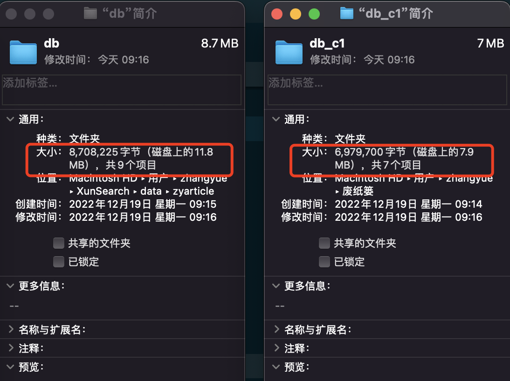

# 扩展（一）Xapian官方文档学习

关于 XS ，以及基础的搜索引擎相关知识的学习完成之后，今天，我们再来看一下  Xapian 官方文档中一些比较有意思的地方。包括它的官网文档上写得一些比较有意思的地方、关于 Xapian 数据库各种文件格式的说明，以及几个 Xapian 工具的使用。不得不说的是，这一部分内容，可能还是全网唯一的。

## 文档拾遗

Xapian 的介绍就不多说了，本来我想单独搭建 Xapian 和 SCWS 的，也就是想手动搭起一套 Xapian + SCWS 的运行环境。但是，没成功！另外，我也想直接使用 Python 的客户端来直接连接 Xapian 查询我们之前测试的数据，不过文档也没看明白，而且我的 Python 水平确实也只是能看懂判断和循环的水平，所以这一块也简单试了下就放弃了。

因此，今天的内容基本就是复制过来的。但后面的工具是直接现成可以使用的，所以我还是测试了一下。好了，先来看一下文档这块还有什么比较有意思的东西吧。

### 几个小知识点

首先，默认 Xapian 生成的文档 id 有 32 或 64 位之分，根据系统来的，不过即使是 32 位也有40亿，一直递增，被删除的不会被重复使用。这个就是我们从服务端读取时返回的元数据中的那个 id 信息。它是真实的、默认的递增唯一 id 。这个之前我们就已经见到过，也说过这个事了。

然后就是并发问题。Xapian 支持并发读，但不能并发写。Xapian 在写操作时有锁，它的修改是原子性的。总体来说，Xapian 是一种单写多读模型，在任何时刻，只允许一个对象修改数据库，但可以有多个连接对象同时读数据库。

接下来是索引词长度的问题，也就是建立倒排索引的那个词项最大的长度，默认情况下是 254 字节，而文档内容的大大小则可以存储超过 100MB 的文档。在 Xapian 官方文档上，有提到 wildcard 功能，也就是之前我们也说过的，ES 中也有的 wildcard（模糊查询）功能。就是真正的和 MySQL 的 Like 功能完全一样的能力。但是这个功能是默认不启用的，因为它会导致性能问题，就像我们说过的，在 ES 中这个功能也是不推荐的，因为它不走索引，是全表扫描，和 MySQL 里的概念完全一样。所以即使是 ES 这样的分布式大数据搜索引擎，也不推荐使用。在 XS 提供的 SDK 中，也有 XS_CMD_PARSE_FLAG_WILDCARD 这个 XSCommand 常量。但是没有任何代码使用到它。

### Xapian 文件格式

之前我们已经说过在一个索引项目中，可以有多个库。而具体的数据信息，就是在这个库中。对应到操作系统上，其实就是在 XS 指定的数据目录下的索引项目目录之下的数据库目录中。比如我们一直使用的是默认的 data 目录，那它就是在 /usr/local/xunsearch/data 。在本地测试使用 Docker 时，我们也将它挂载出来了。

那么我们就进入到 data/demo/db 目录下看看。其实就是我们的 demo 索引项目的默认库。



有这么一堆文档，而且大部分都是以 .glass 结尾的。其实这就是 Xapain 的 Glass 数据格式文件。它是在 1.4 版本以后成为 Xapain 的默认格式的。这个格式就像是 MySQL 中的 InnoDB 或者 MongoDB 中的 WiredTiger 一样。关于 Xapian 的性能问题，这里有篇文章 [https://zhuanlan.zhihu.com/p/445437466](https://zhuanlan.zhihu.com/p/445437466) 大家可以了解一下。大概数据指标如下 。

> 在32核心机器上，单实例，1500万新闻网页的索引可以有1800的QPS，平均检索时间17ms左右。如果单机8个实例，ssd硬盘，1.2亿新闻网页，QPS可以有900。

关于性能方面我也不测了，大家可以自己试试，只要走到倒排索引上，也就是分词上，性能肯定是吊打 MySQL 的 Like 的。会爬虫或者手里有大量测试数据的同学，可以试试哦。

好了，我们再来看一下每个文件具体的作用。

- docdata.glass 文档数据
- postlist.glass 索引数据（按每个单词索引的文档列表信息，应该就是最核心的倒排索引文件）
- synonym.glass 同义词库
- termlist.glass 单词数据（所有单词数据）
- position.glass 位置（单词出现在文档中的位置）
- spelling.glass 拼写检查/建议
- flintlock 用于写锁
- Iamglass 应该是存放一些未使用的文件块信息（文档上只提到了一下下）

上面这些说明，真的没啥资料，有些在文档上都没说。所以要是我这里写错了，并且有对这一块比较了解的同学发现了的话，欢迎评论区留言指正哦。

当索引项目建立之后，postlist、termlist 文件马上就有了，而另外几个则是有数据，也就是索引添加数据之后才会创建的。

### 备份策略

XS 的文档中没有讲备份的问题，Xapian 的官方文档中，也只是简单讲了一下备份策略。

- 直接备份整个索引项目目录，数据量大的时候，注意要停止写入然后再备份。
- 使用磁盘或者系统级快照。
- 增量备份不推荐，也没有相关的功能实现。

反正我在 Xapian 的官方文档上看到的就是这三条。最简单的就是第一种，我们可以这样来测试。先把 zyarticle 这个文件目录复制一份。然后 clean 掉之前的数据，这样我们就查不到东西了。然后直接使用复制出来的目录里面的数据文件覆盖，或者删除原来的数据文件夹，重命名复制出来的文件就可以了。假如有报错的话，可以重启下服务，就可以正常使用了。具体过程视频的时候再演示一下吧，这里就不多说了。

## 数据库检查与压缩

下面是两个小工具，可以对我们的索引项目里的数据库进行检查及优化。所有的 Xapian 工具都和 XS 以及 SCWS 工具在一起。也就是在你的安装目录下的 bin 目录中。比如在我的虚拟机中就是 /usr/local/xunsearch/bin 这个目录。

### 数据库检查

第一个工具是一个数据库检查工具，可以用来检查当前数据库的状态，并且好像还有修复的功能。使用的是 `xapian-check` 这个工具，后面的参数直接跟上索引项目的数据库目录就好了。注意，是库目录哦，不是整个索引项目目录。包括后面的压缩工具，主从同步工具，全是针对索引项目下面单独的库来操作的哦。

```shell
> bin/xapian-check /usr/local/xunsearch/data/zyarticle/db
docdata:
blocksize=8K items=3 firstunused=1 revision=1 levels=0 root=0
B-tree checked okay
docdata table structure checked OK

termlist:
blocksize=8K items=6 firstunused=1 revision=1 levels=0 root=0
B-tree checked okay
termlist table structure checked OK

postlist:
blocksize=8K items=30 firstunused=1 revision=1 levels=0 root=0
B-tree checked okay
postlist table structure checked OK

position:
blocksize=8K items=18 firstunused=1 revision=1 levels=0 root=0
B-tree checked okay
position table structure checked OK

spelling:
blocksize=8K items=0 firstunused=1 revision=1 levels=0 root=0
B-tree checked okay
spelling table: Full structure check not implemented, checking readability
spelling table structure checked OK

synonym:
blocksize=8K items=0 firstunused=1 revision=1 levels=0 root=0
B-tree checked okay
synonym table: Full structure check not implemented, checking readability
synonym table structure checked OK

No errors found
```

从返回的结果可以看出，咱们是 `No errors found` 的，也就是没啥错误信息。更多的内容也没啥资料了，如果你踫到了数据库文件损坏之类的问题，可以拿这个工具试试哦。

### 数据库压缩

Xapian 数据库通常在每个块中都有一些空闲空间，以允许将新信息有效地放入数据库。然而，数据库越小，搜索速度就越快，因此，如果预计不会有更多的修改，最好压缩数据库。这个其实有点像 MySQL 里面的 optimize ，就是整理表碎片，优化表空间的效果。使用的是 `xapian-compact` 这个工具。

```shell
> bin/xapian-compact /usr/local/xunsearch/data/zyarticle/db /usr/local/xunsearch/data/zyarticle/db_c1
postlist: Reduced by 49% 1184K (2408K -> 1224K)
docdata: Reduced by 3% 48K (1264K -> 1216K)
termlist: Reduced by 31% 440K (1376K -> 936K)
position: Size unchanged (3440K)
spelling: Reduced by 100% 8K (8K -> 0K)
synonym: Reduced by 100% 8K (8K -> 0K)
```

它有两个参数，第一个是指定要压缩的库目录，第二个是输出到哪个库目录。输出的目录可以是不存在的，比如上面我们就是把默认的 db 数据库压缩并输出到 db_c1 这个数据库目录。然后来看一下这两个数据库的大小。



我这300来篇文章的效果不是特别明显，但也少了有将近4MB的空间大小。然后我们可以直接指定使用 db_c1 这个库。

```shell
php ./vendor/hightman/xunsearch/util/Quest.php ./config/zyarticle.ini -d db_c1 ''
……………………
```

可以看到，db_c1 是可以查询到数据的。直接将 db_c1 改名为 db 库来就可以将主库替换成压缩之后的数据库了。压缩之后的数据库还可以继续添加操作索引数据，但是它也有问题。由于需要重新组织数据库以腾出空间，未来的修改可能需要更长的时间。然而，修改仍然是可能的，如果进行了许多修改，数据库将逐渐开发出空闲空间。这一句是官网翻译出来的原话，其实也就是说，压缩库会让修改变慢，经常修改添加数据也会产生新的空闲空间。因此，要不要用，怎么用，还是看大家的业务情况来进行最终的定夺吧，没有好不好，只有合适不合适。

## 主从同步服务

在最早学习索引配置时，我们就讲过，通过配置文件中配置多台服务器，就可以实现索引数据的同步写或者多台轮询的读。先不说读的问题，轮询读取多台服务器在大部分场景下就已经够用了。而写入数据，其实在 SDK 中是针对每个服务器都单独去进行一次写操作的。这个其实就是在业务层面上实现的一种多写操作。但是，不管是 MySQL ，还是我们之前学过的 Redis ，都是可以直接实现在服务端上直接配置主从来实现主从同步的。业务代码只需要向主库写一份数据就可以了。剩下的同步是 MySQL 或者 Redis 自己来实现的。

是的，既然都说到这个份上了，那么也就是说，Xapian 也是可以这样配置出主从服务器的，我们只需要向一台主库去写数据，其它从库直接同步主库的数据就可以了。在这里，我们需要用到两个工具 `xapian-replicate-server` 和 `xapian-replicate` 。

先来做准备，我们就搭建一主一从两台服务器，然后主库写，从库读。

```ini
project.name = demo
project.default_charset = utf-8

server.index = 192.168.56.101:8383
server.search = 192.168.56.201:8384  #注意这里是 201 
……………………
……………………
```

写一个配置文件，索引服务器和检索服务器是分开的，比如上面我的索引服务器是 101 ，检索服务器是 201 。剩下的字段配置还是直接使用的 demo 的默认配置就好了。

然后我们查询一下，看看当前搜索是不是走的 201 ，201 是没有数据的哦，是我们新安装好的一个 XS 环境。101 是之前我们测试过的，已经添加过第一篇文章中那三条测试数据的库。

```shell
> php ./vendor/hightman/xunsearch/util/Quest.php ./config/demo4_replicate.ini  ''
在 0 条数据中，大约有 0 条包含  ，第 0-0 条，用时：0.0010 秒。
```

好了，现在基础准备工作完成了。先到主库中，也就是我这里的 101 这台服务器上，使用 `xapian-replicate-server` 工具开启一个复制服务。

```shell
# 192.168.56.101
[root@localhost xunsearch]# /usr/local/xunsearch/bin/xapian-replicate-server --port 8585 --interface 0.0.0.0 /usr/local/xunsearch/data/demo
```

`xapian-replicate-server` 工具的参数大家可以直接通过 `-h` 来看一下，或者不加任何参数运行也是会显示出所有的参数帮助信息。最主要就是 `--port` 端口号、`--interface` 监听服务器信息，以及最后的索引项目目录。运行之后，`xapian-replicate-server` 就会挂载起来一直运行，它也是一个常驻服务。从库需要通过指定端口连接这个服务，从而实现数据的同步复制。

接下来，我们就到从库中使用 `xapian-replicate` 来复制主库的数据。

```shell
# 192.168.56.201
[root@localhost xunsearch]# /usr/local/xunsearch/bin/xapian-replicate --host=192.168.56.101 --port=8585 -m db /usr/local/xunsearch/data/demo/db -v
Connecting to 192.168.56.101:8585
Getting update for /usr/local/xunsearch/data/demo/db from db
Update complete: 1 copies, 0 changesets, new live database
```

`xapian-replicate` 的参数其实和 `xapian-replicate-server` 是对应的，`--host` 是主库的 IP 地址或主机名，`--port` 是主库开放的端口。`-m` 是我们要从主库复制的数据库名称。注意，划重点哦，`xapian-replicate-server` 指定的目录针对的是某个索引项目，而 `xapian-replicate` 的复制是针对具体的库目录。

最后的目录路径，就是从库本地的数据库目录路径。`-v` 参数是一个调试参数，可以看到具体的同步信息。

当我们第一次运行的时候，就会全量同步一次，下面的 `Update complete` 中会显示有 1 次 copies 。现在可以查询一下我们的从库试试效果了。

```shell
> php ./vendor/hightman/xunsearch/util/Quest.php ./config/demo4_replicate.ini  ''
在 2 条数据中，大约有 2 条包含  ，第 1-2 条，用时：0.0013 秒。

1. 测试第二篇 #2# [100%,0.00]
这里是第二篇文章的内容 
Chrono:1314336160  

2. 项目测试第三篇 #3# [100%,0.00]
俗话说，无三不成礼，所以就有了第三篇 
Chrono:1314336168  
```

有数据了吧。接下来我们试一下修改一条数据。

```shell
> php ./vendor/hightman/xunsearch/util/Indexer.php ./config/demo4_replicate.ini --sourc
e=csv 
初始化数据源 ... csv 
WARNING: input file not specified, read data from <STDIN>
开始批量导入数据 (请直接输入数据) ...
3,123,445,222
INFO: reach end of file or error occured, total lines: 1
完成索引导入：成功 1 条，失败 0 条
刷新索引提交 ...
```

稍等一下，从库的同步是固定时间间隔范围内进行一次同步的，这个时间间隔可以通过 `xapian-replicate` 中的参数来修改，大家可以自己看一下帮助信息哦。到时间再次同步之后从库这边会显示这样的信息。

```shell
Connecting to 192.168.56.101:8585
Getting update for /usr/local/xunsearch/data/demo/db from db
Update complete: 1 copies, 0 changesets, no changes to live database
```

好了，再次进行查询。

```php
> php ./vendor/hightman/xunsearch/util/Quest.php ./config/demo4_replicate.ini  ''
在 2 条数据中，大约有 2 条包含  ，第 1-2 条，用时：0.0016 秒。

1. 测试第二篇 #2# [100%,0.00]
这里是第二篇文章的内容 
Chrono:1314336160  

2. 123 #3# [100%,0.00]
445 
Chrono:222  
```

看来咱们的主从效果是正常实现了哦。

## 总结

其实呀，今天这些内容有点偏运维了，上面的小知识点也比较底层了，所以大家了解一下就好。在日常的使用中，如果有需要，那么咱们 XS 确实是有这些功能的。比如说备份、主从这两块。主从本身也可以做为一种备份手段。另外还有就是主从的两个工具都是命令行直接挂起的，我们日常需要使用的话还是需要 nohub 一下的。

好了，Xapian 官方文档是全英文了，靠着翻译软件看了半天也就找到这些东西比较有用了。剩下的如果各位大佬有兴趣，还可以继续探索哦，反正整个 Xapian 和 XS 以及 SCWS 全是开源的。但是，这一整套东西除了 XS 的 SDK 之外，全是 C/C++ 实现的，咱们学习起来还是有点费劲的。那么有完全 PHP 开发的搜索引擎和分词工具吗？

还真有，下篇，也是搜索引擎系列的最后一篇，咱们就来学习一套完全由 PHP 实现的搜索引擎解决方案。

参考文档：

[https://getting-started-with-xapian.readthedocs.io/en/latest/](https://getting-started-with-xapian.readthedocs.io/en/latest/)


