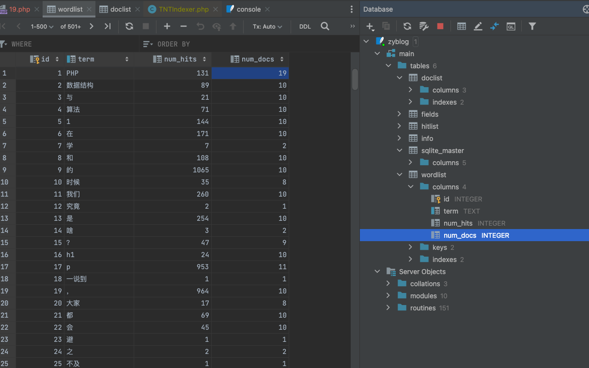
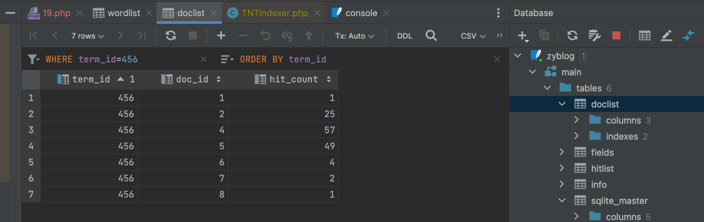
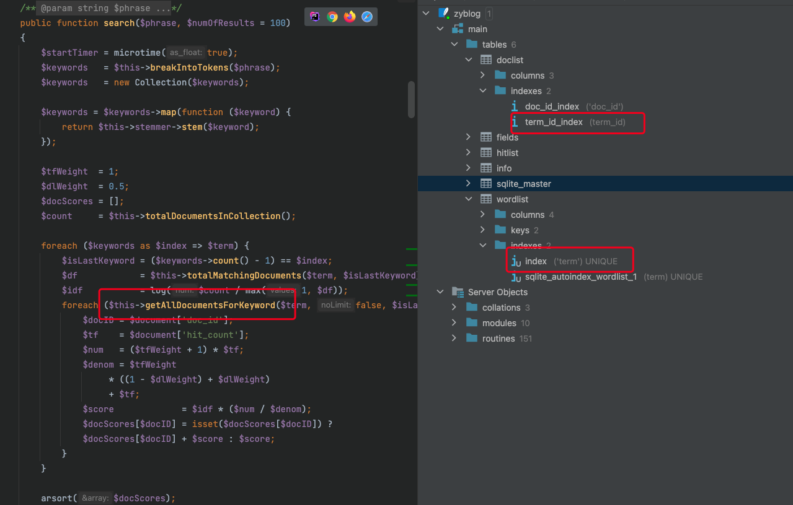
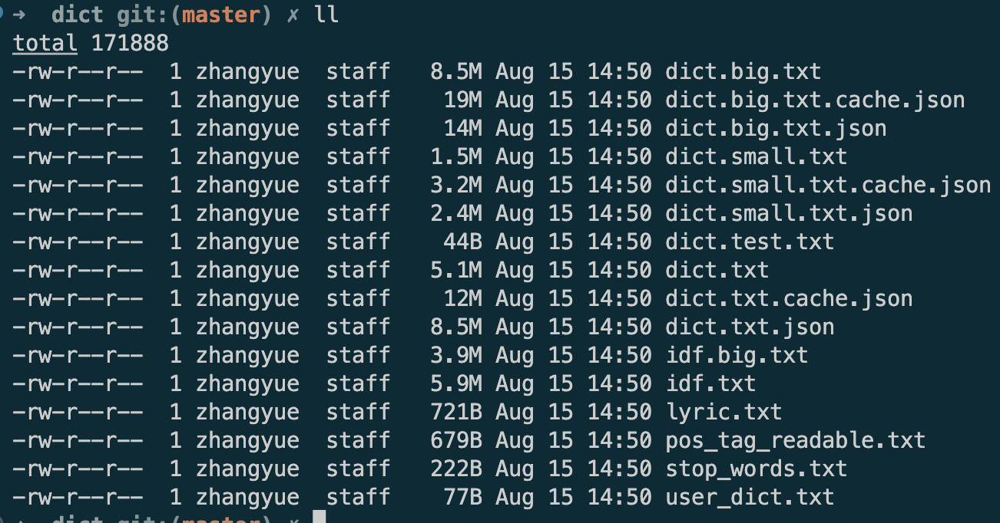
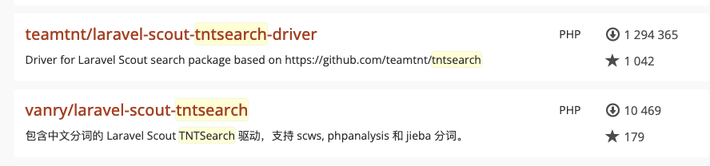

# 扩展（二）TNTSearch和JiebaPHP方案

搜索引擎系列的最后一篇了。既然是最后一篇，那么我们也轻松一点，直接来看一套非常有意思的纯 PHP 实现的搜索引擎及分词方案吧。这一套方案由两个组件组成，一个叫 TNTSearch ，另一个则是大名鼎鼎的结巴分词的 PHP 版本。它们都是纯 PHP 实现的，非常轻量级的搜索引擎和分词工具，最主要的是，如果各位大佬有兴趣，可以深入学习它们的源码。之前就一直在强调，所有的原理都是相通的，通过对这两个组件的学习，其实就能清楚 Xapian 和 SCWS 也就是 XS 整个系统是怎么运行的。甚至也可以说，就能了解到 ES 和 IK 是大致是怎么运行的了。

## TNTSearch 与 Jieba-php 集成

这两个工具包都是开源的，直接在 GitHub 就可以下载。文档也都在它们的 Readme 文件里。

[https://github.com/teamtnt/tntsearch](https://github.com/teamtnt/tntsearch)

[https://github.com/fukuball/jieba-php](https://github.com/fukuball/jieba-php)

对于我们 PHP 的使用来说，直接 composer 安装就好了，方便得很。

```shell
composer require teamtnt/tntsearch
composer require fukuball/jieba-php:dev-master
```

安装完成之后就开始写代码啦，非常非常简单，保证分分钟之内搭起你的搜索引擎应用。

```php
require_once 'vendor/autoload.php';

use TeamTNT\TNTSearch\TNTSearch;
use TeamTNT\TNTSearch\Support\AbstractTokenizer;
use TeamTNT\TNTSearch\Support\TokenizerInterface;

// 自定义分词器
class JiebaTokenizer extends AbstractTokenizer implements TokenizerInterface
{
    public function tokenize($text,$stopwords='') {
      	// 默认的结巴分词使用，之前我们就用过了
        ini_set("memory_limit", "-1");
        \Fukuball\Jieba\Jieba::init();
        \Fukuball\Jieba\Finalseg::init();
        return \Fukuball\Jieba\Jieba::cut($text);;
    }
}

// 实例化 TNTSearch 对象
$tnt = new TNTSearch;
// tnt 对象加载配置信息
$tnt->loadConfig([
    'driver'    => 'mysql', // 驱动方式
    'host'      => 'localhost',
    'database'  => 'zyblog',
    'username'  => 'root',
    'password'  => '123456',
    'storage'   => './',   // 数据存储路径
    'tokenizer' => JiebaTokenizer::class, // 分词器
    'stemmer'   => \TeamTNT\TNTSearch\Stemmer\PorterStemmer::class//optional，没查到这玩意是干嘛的，官网例子上带的，先复制过来吧
]);
```

上面这些就是我们的基础配置代码了，是不是简单到没朋友。不需要配置文件，直接在代码中配置即可。注释也都写清楚了，所以也就不多做解释啦！

### 索引操作

有了上面的配置之后，我们就可以开始来操作索引了。在这里要先换一个概念，那就是 TNTSearch 是有点类似于 Sphinx 这样的搜索引擎。也就说，它的数据来源是针对数据库的，或者说让数据库来做为数据源是比较方便的。

因此，它建立索引的方式也和 Sphinx 很像，直接连 MySQL 去查表建索引。

```php
$indexer = $tnt->createIndex('zyblog');  // 创建索引
$indexer->query('SELECT * FROM zy_articles_xs_test where status = 1 limit 10;'); // 查询语句
$indexer->run(); // 执行索引操作
```

这样我们就初始化了一个索引项目，并且使用指定数据库中的数据填充到这个索引项目中了。

```shell
> php 19.php 
Total rows 10
```

执行完成后会返回插入成功的数量信息。这里我们插入了 10 条数据，是因为 TNTSearch 建立索引的速度一般般哦，并不是很快。也有可能是我并没有深入的学习，也不知道有没有别的什么更快的方式。反正如果是全部的我那300多篇文章的话，是要跑半天的。

除了这样全量的操作索引数据外，也可以进行单条或多条数据的增、删、改，这些操作非常简单，而且就和写 SQL 语句一样，非常简单，大家可以自己去 GitHub 上看下文档哈，我就不具体演示了，下面就主要再看看怎么查询数据。

### 检索数据

在搜索这一块，也非常简单，选择好要操作的索引，然后直接一个 search() 方法就可以了。

```php
$tnt->selectIndex("zyblog");
$res = $tnt->search("链表", 10);
print_r($res);
// Array
// (
//     [ids] => Array
//         (
//             [0] => 4
//             [1] => 5
//             [2] => 2
//             [3] => 6
//             [4] => 7
//             [5] => 1
//             [6] => 8
//         )

//     [hits] => 7
//     [docScores] => Array
//         (
//             [4] => 0.70105075187958
//             [5] => 0.69908289011992
//             [2] => 0.68591335372833
//             [6] => 0.57067991030197
//             [7] => 0.47556659191831
//             [1] => 0.35667494393873
//             [8] => 0.35667494393873
//         )

//     [execution_time] => 533.8249 ms
// )
```

search() 方法的第一个参数是查询语句，第二个参数是返回数量，默认这个数量值是 100 。返回这么多数据？你再看看它返回的内容就知道为啥能返回这么多数据了。

TNTSearch 的搜索结果，返回的也是和 Sphinx 非常像的，它们都只是返回索引的 ID 信息。也就说，它们在底层可能连文档信息都不会存，只是存词项与文档 ID 之间的关系以及这些词项与文档的评分情况。

TNTSearch 也是实现的 BM25 评分算法。可以看到返回结果的顺序不是按 ID 排序的，现在 docScores 也有各文档的关键词评分结果。

这种搜索引擎的使用方式，就是通过检索返回的主键 ID ，再去数据库进行主键查询获取完整的数据。因为主键在数据库中有着非常好的查询性能，因此，即使上亿的量，使用主键也是非常快的。

用过 Sphinx 的小伙伴对这种查询方式一定不会陌生，而如果你之前没用过 Sphinx 也没关系，试试 TNTSearch ，如果未来有可能用到 Sphinx 了，也会马上就能上手了。

## 看看源码

是不是感觉打开了一扇新世界的大门呀。要说 XS ，其实是和 ES 比较像的，它们会直接存储并返回元数据信息，也就是我们具体的文档字段内容。而 TNTSearch 和 Sphinx 这种则是另一种形式的，只返回主键 ID ，而且它们都和关系型数据的关系比较好，一般直接通过非常类似操作 SQL 语句一样的方式来操作索引。

这就是工具多样性的一个体现了。但是基础原理上，它们还是一样的倒排索引引擎。根本上还是一家人。

由于是完全的 PHP 实现，其实 TNTSearch 的源码就很容易让大家看明白了。即使我没有深入的学习，但也大致了解到它是如果实现倒排索引的。TNTSearch 的倒排索引库是使用 SQLite 实现的（对应 XS 中的那些 .glass 文件，就是上节课学的）。

### TNTSearch 倒排索引实现

在 TNTSearch 的 loadConfig 中，我们有一个字段是 storage ，设置的是 "./" ，也就是将数据保存在当前相对路径下。因此，你在我们的测试目录下，就会看到运行之后会生成一个叫做 zyblog 的 sqlite 文件。这个文件名也就是我们创建索引时使用 createIndex() 时传递的参数名，它正是我们的索引名。这个 SQLite 库也就是针对这个索引项目的库。直接使用 PHPStorm 就可以查看这个 SQLite 数据库里面的内容。



当然，你用命令行也可以看，前提是本地已经安装了 SQLite 工具。

```shell
> sqlite3 zyblog
SQLite version 3.37.0 2021-12-09 01:34:53
Enter ".help" for usage hints.
sqlite> select * from wordlist limit 10;
1|PHP|131|19
2|数据结构|89|10
3|与|21|10
4|算法|71|10
5|1|144|10
6|在|171|10
7|学|7|2
8|和|108|10
9|的|1065|10
10|时候|35|8
```

是不是有点意思啊，从表名我们就能看到，它的表名和之前在 XS 中学习过的那些 .glass 文件名是很像的。wordlist 应该是分词表、doclist 应该是文档表。那么我们就来尝试一下，先在 wordlist 表中找到“链表”这个词。就是我们在上面进行检索查询时测试的那个关键词。


对应的词项表id是 456 。接下来，到 doclist 文档表中查找词项id（term_id）为 456 的数据。



看看是不是我们前面检索出来结果那几条。doc_id 对应的就是文档的 id 主键，hit_count 代表的是关键词在文档中出现的次数 TF 。这个字段和 wordlist 表中的其它字段一起做为 BM25 算法的 TF 和 IDF ，进行最终的评分计算。这一块的计算代码也是直接在 PHP 源码中的，大家可以自己找找哦。

好了，对照一下之前我们学习倒排索引原理时的那张图，看看它的实现是不是和我们讲述的概念是一模一样的。现在，你是不是能够彻底地了解到底什么是倒排索引了吧。毕竟真实的例子和源码就摆在你眼前了。

接下来，我们再看一下，它在搜索时通过这两张表的查询，完成了数据的检索。但为什么能非常快呢？这其实还是靠得数据的索引。



同样还是之前在倒排索引的原理时就讲过，分词之后的词项表，大部分还是通过B+树这样的存储方式来实现快速查找的。这里还需要过多解释吗？在 wordlist 中，对 term 这个字段，也就是分词词项建了个索引。然后在 doclist 中，又对 term_id 建立了索引。因此，在直接的检索过程中，这两块都是走了数据库索引的，速度是完全有保障的。

怎么样，怎么样，之前在理论中讲的东西不是侃大山吧，看到真实的实现了吧，而且是咱们各位 PHPer 们都能看懂的，PHP+SQLite 的实现。最后再归结回去，不管 XS、ES、Sphinx或者其它，只要是搜索引擎应用或中间件，最终的原理都是和这一套是类似的，但具体的实现形式以及功能和语言各有不同。

### 结巴的词库

说了半天引擎，分词的内容咱们也看一眼。结巴分词在 Python 领域是一哥，同时也是现在非常流行的一套分词组件。它有 PHP 的版本，也是全 PHP 实现的，简单实用。之前我们其实都已经在 XS 中用过了，另外关于分词的概念之前在 SWCS 中也讲过一些了，这里我们就是看下结巴的词库在哪里。一般来说，结巴如果是通过 composer 安装的话，那么它的默认词库是 /vendor/fukuball/jieba-php/src/dict 目录中。



额，没啥可解释的了吧。dict.xxxx.txt 是系统的默认词库，而且全是 txt 格式的，另外还有 json 格式的，大家可以直接用文本工具打开看看。user_dict.txt 肯定是我们的自定义词库啦，stop_words.txt 是停用词库。和 SCWS 以及 IK 的命名都是非常接近甚至一样的。

另外还要说一点，正是由于结巴使用的是 txt 格式词库，虽说看着大小不大，但在程序加载及运行过程中，结巴对于内存的需求非常大。所以在使用结巴时，我都会给代码前加上一行。

```php
ini_set("memory_limit", "-1");
```

也就是不限制内存使用，否则可能报出内存溢出的错误。这也是结巴 PHP 版本比较让人诟病的一点。也许也有其它的解决方案或者参数方法可以使用，反正我是没有继续深入研究了，有兴趣的小伙伴可以继续深入学习。

## 框架集成

在 Laravel 的官方组件中，也有自带的一套全文检索组件，叫做 Laravel Scout 。不知道小伙伴们用过没有，反正我是没用过，为啥呢？它自带的驱动，也就是官方指定的搜索引擎完全就没听过，可能在老外那边比较流行吧。

当然，通过在 packagist 中搜索，也能找到直接集成 TNTSearch 到 Laravel Scout 的组件。而且还有我们国内的大佬，直接把各种中文分词器都集成好了。



另外，XS、ES 与 Laravel Scout 集成的也有，只不过 XS 的 Star 就很少了，用得人不多，ES 相对来说还可以。

这个东西，怎么说呢，还是看大家的需求吧。Larvel Scout 和 Laravel 的 ORM 绑定比较深，对于 TNTSearch 和 Sphinx 这类的搜索引擎还是非常好用的，但是相对于 ES 和 XS 这类，其实它们本身就有自己非常完善的 Scheme 机制，能够非常灵活地处理数据格式，用不用框架 Model 形式的，还是大家自己权衡吧。

## 总结

说是介绍 TNTSearch 和 JiebaPHP ，但结果我们又借着它俩重温了一下搜索引擎和倒排索引的原理。好嘛，这波其实真不亏。关于这两个组件的内容，有兴趣的同学可以再深入源码进行学习。对于日常使用来说，小型项目，像是官网啊、小型文章CMS站啊，使用这一套方案完全没问题，而且非常简单，说实话，我在从来没用过的情况下，按官方文档的例子，总共也没超过 10 分钟就跑起来了上面的例子，真的是太方便了。

好了，整个搜索引擎系列的学习就到此为止了。你有什么收获？有什么感悟？或者有什么想说的？欢迎在任何一篇文章或者视频下面留言。接下来的旅程是什么呢？咱们拭目以待。

测试代码：

[https://github.com/zhangyue0503/dev-blog/blob/master/xunsearch/source/19.php](https://github.com/zhangyue0503/dev-blog/blob/master/xunsearch/source/19.php)
