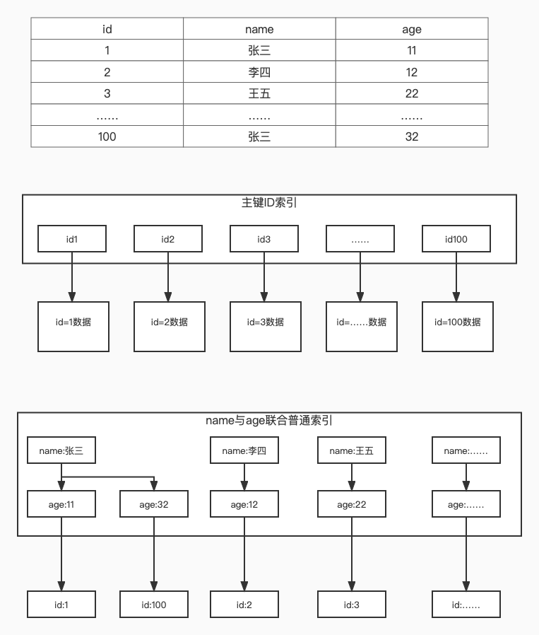
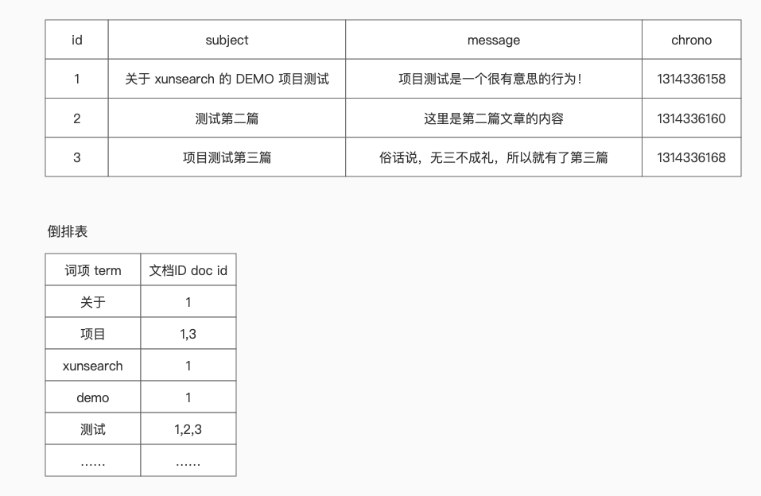
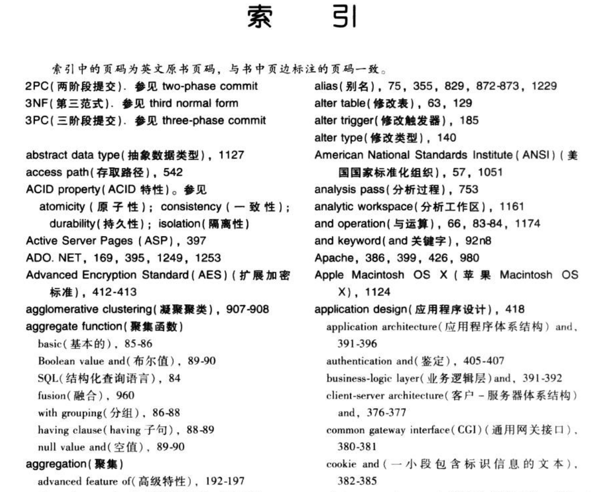

# 全文检索、文档、倒排索引与分词

今天还是概念性的内容，但是这些概念却是整个搜索引擎中最重要的概念。可以说，所有的搜索引擎就是实现了类似的概念才能称之为搜索引擎。而且今天的内容其实都是相关联的，所以不要以为标题上有四个名词就感觉好像内容很多一样，其实它们都是联系紧密的，一环套一环的。

## 全文检索

先来看看啥叫 全文检索 。

> 全文检索是指计算机索引程序通过扫描文章中的每一个词，对每一个词建立一个索引，指明该词在文章中出现的次数和位置，当用户查询时，检索程序就根据事先建立的索引进行查找，并将查找的结果反馈给用户的检索方式。这个过程类似于通过字典中的检索字表查字的过程。全文搜索搜索引擎数据库中的数据。

又是百科上的定义。但是，不管是 XS 还是 ES ，我们有时也都会叫它们为 **全文检索引擎** 。现在知道了吧，搜索引擎组件，最核心的功能其实就在于全文检索的能力。而在全文检索的过程中，最核心的又是索引的建立，在上面概念中那句：通过字典中的检索字表查字的过程。就是对于索引这个概念的一般性描述。

在学习 ES 的过程中，会提到两个概念，我觉得这两个概念也是非常重要的。那就是 精确值 和 全文本 。

- 精确值：那些不需要建立索引、不需要分词的确定值，比如说 ID、时间、数字，也就是我们在 MySQL 中不会用到 Like 的字段。
- 全文本：需要分词，需要对内容建立索引的值，比如文章标题、关键字、内容、描述等，一般都是 Text 类型，是我们搜索时主要面对的内容，也是我们在 MySQL 中需要进行 Like 查询的字段。

有了这两个概念之后，以后我们在建立索引时，就可以根据字段的不同情况，来决定字段是否应该分词建索引。如果不管任何字段都建立索引的话，会导致索引巨大，带来额外的存储及性能开销。

在全文检索中，还有两个概念，那就是 按字检索 和 按词检索 。

对于英文来说，搜索分词其实并不困难。因为英文在书写时天生就有空格分隔。即使是一些简写，比如 I'm ，也可以直接划分为整个词，或者做成 I am 的替换词或近意词。但中文就不一样了。就像这一段话，你觉得要怎么切分呢？能切出来多少词呢？用程序怎么实现？

这就是中文分词的难点。如果说 按字检索 ，就会导致索引巨大。每一个字，每一个字和后面的句子的连接，都要建立索引。比如“我爱北京天安门”，如果按字分词检索，需要切分成：

- 我
- 爱
- 北
- 京
- 天
- 安
- 门

看着还好是吧？但是换成一整篇文章呢？再换成上百万篇文章呢？

那么按词分词检索呢？我们就可以把上面那句话切分成：

- 我爱
- 北京
- 天安门

先不说查询，至少存储空间就能节约不少吧。后面我们马上就会详细地说分词这件事。

### 文档

文档在搜索引擎中，就是实际的存储的数据单元。说直白点，就是我们在 MySQL 的那一行数据，将一行数据放到搜索引擎中，就是一篇文档。只不过这个文档是结构化的，有结构属性的，有字段名和值，可以被查询检索出来的数据。在搜索引擎中，文档是一个重要的概念，我们增、删、改、查操作的都是文档。而文档在进行上述操作时，又会关联到索引的建立。

在 XS 中，使用 PHP SDK 时，专门的 XSDocument 是贯穿我们学习始终的一个对象。同样地，在 ES 中，所有数据只有一个 type 类型，就是 _doc 类型。这个不用多解释了吧，doc 就是文档的意思。

或者再换句话说，我们上面所说的全文检索引擎，以及我们这个系列要学习的搜索引擎，这两个概念，最终都会落在 **文档搜索引擎** 这个概念上。因为不管字段属性如何，我们其实一直都是在搜索文档。

## 倒排索引

到我们的重点概念咯，这也是常见的面试题。那就是啥是倒排索引？

要理解倒排索引（反向索引），我们就先要了解一下正排索引（正向索引）是啥。这个其实不用多说了吧，普通关系型数据库的索引都是正排索引嘛。我们为某个字段建立索引，然后形成一颗 B+树 。大概长这样。

典型的一个 MySQL InnoDB B+树索引图，数据有三个字段，id、name、age ，然后 id 上有主键索引，name 和 age 做了联合索引。在关系型数据库中，索引上存储的是字段具体的值，然后索引根据这些值排序。这样在搜索查找时就可以利用类似于二分查找的方式快速找到与查找值匹配的索引项目。如果是普通索引，则会找到最终的主键 ID ，进而再使用主键 ID 通过主键索引（聚集索引）返表查询出实际的数据。

这一套内容大家在学习数据库相关知识的时候应该都会看到，这个不是我们的重点内容，毕竟咱们现在是要讲搜索引擎呀。那么搜索引擎里的倒排索引是啥意思呢？还是看图来说。

不得不说，倒排索引的图还好画一些。在这个图中，我们假设全文本字段为 subject 和 message ，那么我们就需要对这两个字段中的内容进行分词，根据分词结果形成一个倒排表。各位大佬一眼就明白了吧，每个词项对应记录的就是这个词所在的文档的 ID 。当然，实际上的倒排索引内容可能不止这两个字段，还会包括关键字在文档中的位置等信息。这里就是简单地以最核心的单词和文档的关系来讲解。

是的，这就是倒排索引。其实最终，它获得的结果和 B+树 的普通索引是类似的，最终都是保存着一份主键 ID ，但 B+树 索引的值是整个表行字段的值，最终记录是在所有分枝之后的一个叶子节点上，而且只有一个值。而倒排索引保存的值是一个一个的词项，相同词项只会有一份，最终记录是一组 ID 。

要说一个比较实际点的例子的话，请唱出《孤勇者》的三句歌词和请说出歌词中包含包含“我爱你”的三首歌名，这种“根据题目查找内容”和“根据关键字查找题目”的形式其实是完全相反的，分别代表的就是正排索引（整个字段建立索引，就像是个题目）和倒排索引（将内容分成单词变成一个字典，通过字典查找内容和题目）。（极客时间：检索核心技术20讲，关于倒排索引的解释）

如果数据非常多，而且也都是大篇文章，那么其实这个词项列表的内容也不少。这时候，大部分搜索引擎其实会在词项上再次运用 B+树 ，也就是通过二分法能够快速定位词项。这样，就可以最快（最理想状态下）通过 O(logn) + O(1) 的速度定位到包含某一个词的全部文档 ID 。

如果我们同时搜索多个关键词，则会在获得所有关键词对应的文档 ID 后，再进行归并或多路归并排序的方法遍历两个单词中所有的文档 ID 所对应的内容，从而达到 O(m+n) 的速度，这里的 m 和 n 指的是单词对应文档 ID 列表，而不是正排索引中的全文档搜索的 n 。因此，它的效率还是可以接受的。（极客时间：检索核心技术20讲及百度查询相关资料）具体的算法原理已经不是我能达到的水平的，各位感兴趣的大佬们还是自己再查找资料进行深入的学习吧。

那么如果是传统关系型数据库的 Like 呢？首先，如果是大型的文章内容，索引会非常大，空间极度浪费。其次，如果是前后都模糊，也就是 `like '%项目%'` 这种，索引会失效。因为我们要需要逐个文字比较，然后再逐个文档匹配，性能可想而知。

再换个角度用生活中的例子来理解，最典型的就是图书目录。我们最常见的那个图书目录，就是根据章节标题的一个正排索引。而有的书，特别是一些专业型的大型经典图书，就是特别厚的那种。往往在这些书的最后还会有一些词汇表，有的词汇表不仅有词汇的解释，还有这些词汇在哪些章节出现过，甚至是具体的页号。这种带章节号或者页号的词汇表就是倒排索引。比如下面这本计算机经典黑皮书《数据库系统概念》中最后的索引部分的内容。加微信或者公众号，可以找我要到很多电子书哦，其中就包括这本书。

好了，从倒排索引这里，我们可以看到 分词 真的是对倒排索引非常重要的一个概念，那么我们就再来理解一下什么叫分词。

### 分词

顾名思义，分词，就是将一句话，一个段落或者一整篇文章中的单词分解出来。对应到我们的数据中，其实就是将文档中，需要全文本分析的字段内容进行分词处理，然后将获取到的分词加入到倒排索引表。

前面我们就说过，英文分词会相对来说简单一些，中文分词要复杂一些。因此，我们平常不管是使用 ES ，还是 Solr、Sphinx 之类的搜索引擎，都需要同时配置一个中文分词器。现在最流行的，一个是 Jieba ，Python 领域非常出名也是现在整个开发领域都比较流行的分词器。另一个是 IK ，这个是最经典的配合 ES 的分词器，当然，Jieba 也有 ES 的插件。

虽说这两个现在很流行，很出名，但咱们的 XS 所使用的 SCWS ，则是还没有它们的时候就已经存在的，通过 C/C++ 开发的一款优秀分词器。最早，甚至 ES 还没发布的时候，大概 2011 年左右（ES最早是2010年发布的）。我所在的公司使用 Solr 作为搜索引擎，而当时配合 Solr 的分词器就是 SCWS 。

还有更早的，我刚毕业时做过一年 C# ，也就是 ASP.NET 开发，大概是  2009 年。当时的公司使用的是 Lucene.NET 配合 Pangu 分词。

可以看到，不管你是用什么搜索引擎，要在中文世界里使用，分词器都是必不可少的。同时，分词器也不是你理解的就是切分个单词就完了，它还要考虑词性，比如动、名、形容词。这些词性又会影响到词频和逆文档词频分数以及是否索引。再比如助词、语气词：嗯、啊、哈，这些，大部分分词工具直接就会给过滤掉，因为它们对于语义搜索没啥用。

怎么又来一堆名词了？还能不能愉快的玩耍了？

别急别急，这些内容我们后面就可以贯穿在与之相关的内容中一起学习了。现在先有个大概的了解就好了。

所幸，上面的那些分词器，Jieba、IK，以及我们主要要学习的 SCWS ，在形式、功能上都非常相似。就和搜索引擎一样，不管是 ES 还是 XS ，最终都是要实现全文检索的，也要做倒排索引的。因此，学完 XS 的分词以及 SCWS 的分词相关内容后，再看 Jieba 或者 IK 都能很快上手的。

另外，在扩展部分，我们会简单地学习使用 TNTSearch + PHP JIEBA ，到时就会告诉大家，语言实现都是其次的，核心的概念原理才是最重要的，PHP 一样可以实现完整的、纯 PHP 的 搜索引擎+分词 系统，从而实现纯 PHP 的搜索引擎解决方案。

学到这里，不得不提一句。码农们都喜欢抬G贬B。这里的 G 和 B 就不用多做解释了吧，其实 Baidu 的中文搜索很强的，李彦宏大佬“超链分析”相关的论文也对 G 站 PR（PageRank）有重要的影响。中文分词与语义处理，从技术角度和搜索结果来说，Baidu 确实是比 G 站强的。只不过满屏广告影响用户体验，而且码农们喜欢直接复制英文报错信息去 G 站搜索，获得的内容更全面（你懂得），从而让大家觉得 G 站更好。

那么 Baidu 这些大公司，使用的分词器、搜索框架，是我们常见的这些吗？这个我也不知道，但我知道核心原理和概念与我们今天学习到的这些内容都不会相差太远。假如有幸有 Baidu 的大佬看到这篇文章，或者你对这一块有更深入的了解，也欢迎评论区留言赐教哦！

## 与关系型数据库的对比

最后，我们再来根据今天的知识，将学到的内容与关系型数据库中的相关名词做一个对比，方便大家的记忆。

| 关系型数据库      | XS                                   | ES                       |
| ----------------- | ------------------------------------ | ------------------------ |
| 表 Table          | 索引 Index                           | 索引 Index               |
| 行 Row            | 文档 Document                        | 文档 Document            |
| 列 Column         | 字段 Field                           | 字段 Field               |
| 表结构 Schema     | 索引配置 ini 文件，XSFieldScheme对象 | 字段映射 mapping         |
| 查询语言 SQL 语法 | 无（只能通过 SDK）                   | DSL+RESTFul+Json语法     |
| 索引 B+Tree       | B+Tree、倒排索引                     | B+Tree、倒排索引、分布式 |

## 总结

通过今天的学习，相信大家就能够理解为啥上篇文章中使用“项”这个单字无法搜索到结果了吧。不管是 XS 的 SCWS 还是 ES 的 IK ，都不会将“项”作为一个单词拆分出来加入到倒排表中。如果要实现可以索引这个单字的话，那么就需要做成单字倒排索引。试想百万级的文章量，每个文章又是少则几百、多则几万字的内容，那么这个索引量有多恐怖。

当然，如果你只是一些内容很少的，重复度很高的电商产品、订单搜索、内部管理系统OA、HR、项目管理系统之类的，倒是可以尝试单字索引。但通常来说，并不推荐。还是那句话，掌握搜索引擎的概念，我们是做分词语义搜索的，不是 Like 。

具体的分词算法不是我们学习的主要内容，而且这部分内容也非常高级和复杂，包括 NPL 其实也是在加上了 AI 相关的技术之后做得更强大的语义分词以及语法词法分析，也就是说，我们要学习到的以及常用的这些开源分词器，大部分都只是基于普通算法+字典组合的分词器，可以算是 NPL 中的一小部分内容。有兴趣的小伙伴可以自行查阅和学习更深入的资料。

今天的内容是基于自己的学习与理解，参考资料非常多就不一一列举了，如有纰漏希望您能抽出宝贵时间随时批评指正。

下篇文章开始，我们正式进入 XS 的系统与开发学习。