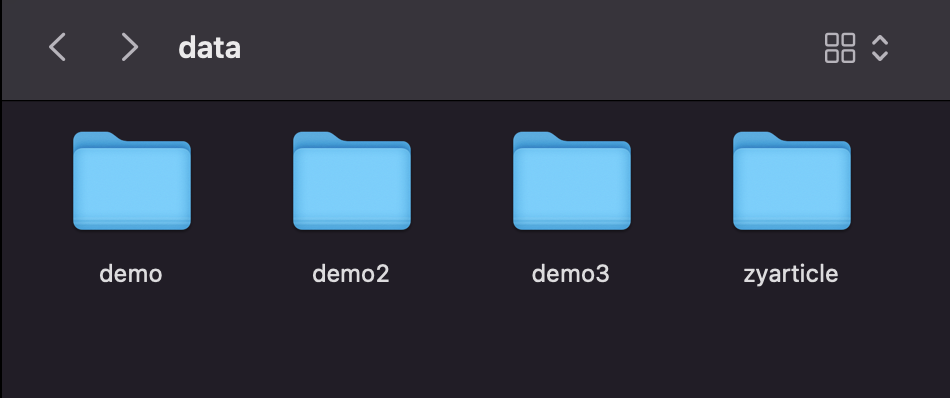
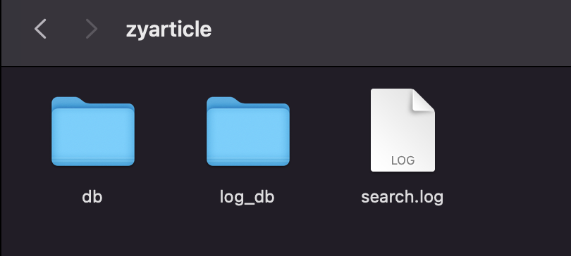
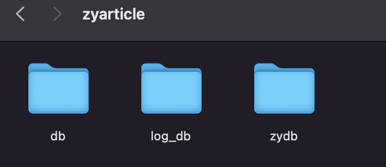

# XS 索引管理（一）切换索引库与文档对象

不管任何搜索引擎，最核心的部分，往往都只有两个，一是建立索引，二是搜索数据。不过对于中文这种复杂的语言体系，分词也是另一块核心内容。从今天开始，我们就先来学习第一块的内容，就是对于索引的操作。

之前的文章中，我们已经学习过在 XS 中如何通过配置文件来配置索引项目。但这只是索引操作的第一步，因为我们还需要对配置好的索引项目插入数据，随之而来的还有修改、删除之类的操作。这些都是通过 PHP SDK 来动态操作的。不过今天的文章还不是直接学习操作数据，我们先来看看两个非常重要的部分，一是索引的物理存储相关的内容，另一个则是索引中存储的数据文档对象的了解。

## 再谈索引

通过之前的学习，相信大家对搜索引擎的概念已经不陌生了。其实就像上篇文章最后所说，通过之前的学习，日常普通的 XS 使用已经完全没什么问题了。剩下的还有什么呢？那就是更加精进的深入了解。

首先，我们要再次学习在程序代码，也就是 PHP 中对索引的操作，其实最核心的就是对于索引文档的增、删、改、查。我们每一次的检索数据，每一次的添加、修改、删除都是在对索引文件的修改。其中查询是非常重要的一部分，而增、删、改索引文档则会在后续的文章中讲解。

XS 的每个搜索项目的索引数据是分开存放的，就是配置文件中 `project.name` 配置的项目名称。根据不同的项目名称，会在你的数据目录，也就是 XS 安装路径下的 data 目录中生成不同的项目文件夹。



这就是我之前测试过的内容，demo 大家一定不陌生了。而 zyarticle 则是在讲索引配置时我们建立的新的索引项目。每个项目文件夹内又包含两个主要索引数据库。



- db 文件夹，默认的主索引数据库，我们检索数据都放在这个文件夹里面。注意，在 XS 中，每个索引项目也是可以有多个数据库的，类似于 Redis 中那 16 个库的概念。但在 XS 中，是可以自己指定多个索引数据库的。后面我们还会细说。
- log_db 文件夹，搜索日志数据库，主要存放搜索日志相关的内容，用于实现相关搜索、搜索建议、拼音搜索等。
- search.log 文件，我这里是空的，官方文档也没写是干嘛的...

### 索引对象

在之前的学习中，我们会先实例化一个 XS 对象，然后再通过 XS 对象获取一个 XSIndex 对象。

```php
$xs = new XS("./config/5-zyarticle-test1.ini");
$index = $xs->index;
var_dump($index);
// object(XSIndex)#10 (9) {
//     ["_buf":"XSIndex":private]=>
//     string(0) ""
//     ["_bufSize":"XSIndex":private]=>
//     int(0)
//     ["_rebuild":"XSIndex":private]=>
//     bool(false)
//     ["xs"]=>
// ……………………
```

这个对象中的内容很多，需要大家自己去查看一下。我们先学习主要的索引管理功能，在索引管理的最后，会把所有 XSIndex 对象中剩余的公共变量、方法全部展示或尝试调用一下看看效果。

接下来回到咱们主要需要学习的 XSIndex 对象中。在这个对象里面，最核心的其实就是针对索引里面的数据文档的操作，后面我们会一一学习到。

### 切换索引库

默认情况下，一个 XS 项目只会使用一个 db 库，也就是将数据存放在 db 那个数据库文件夹之下。就像 MySQL ，在数据变多的时候，我们都会考虑分库分表，而在 XS 中，使用不同的索引库，也可以实现这样的效果。最核心的作用，就是将大量的数据拆分，或者，如果你学习过 ES ，这就是 ES 中的分片。只不过 ES 是纯分布式的分片，而 XS ，只是在物理层面将数据分到了不同的文件夹中保存，并没有别的分布式分片聚合机制（只能在单机上）。如果想要将 XS 改造成分布式的，我的建议是 no ，费这劲，直接用 ES 不香？

就像我们之前一直强调的，根据业务来选用不同的工具，达不到那个量级，XS 就已经足够了。而且单索引百万级问题是不大的，再加上这样分库的话。反正我还没试过，将来如果有机会，咱们看看 XS 的极限在哪里吧。

好了，说了一堆，还是来看看在代码中如何更换索引库。

```php
$xs->index->setDb('zydb');

$doc = new XSDocument([
  'id'=>100002,
  'title'=> '尝试索引库zydb',
  'content'=>'尝试索引库zydb',
  'tags'=>'aa,bb,cc',
  'category_name'=>'索引库',
  'pub_time'=>date('Ymd'),
]);
$xs->index->add($doc);
```

通过索引对象的 `setDb()` 方法，就可以切换当前索引对象操作的索引库。接着我们插入一条数据。然后看程序数据目录。



多了一个 zydb 文件夹了吧。接下来我们尝试查询检索一下新添加的这条数据。

```php
print_r($xs->search->search('id:100002'));
// Array
// (
// )
```

嗯？没有数据？各位大佬们应该看出来了，XSIndex 对象切换了索引库，那么相应地，XSSearch 对象也应该要切换索引库呀。

```php
print_r($xs->search->setDb('zydb')->search(''));
```

不出意外的话，使用 `setDb()` 切换后，这个索引库中只有一条数据。这可不行呀，咱们是需要检索所有的数据，也就是说，不管底层分多少物理库，但是外部搜索的时候，所有内容应该是一起返回的嘛。

```php
print_r($xs->search->addDb('zydb')->setSort('pub_time',false)->search(''));
```

使用 `addDb()` 方法，看看是不是你想要的结果哦。

## 文档对象

不管是增删改，还是查询，最终我们操作的、获取的，其实都是一个 XSDocument 对象。在学习其它的索引操作之前，我们先来学习一下 XSDocument 对象，并且看看这个对象里面都有啥。

之前其实在很多测试代码中，我们就已经使用过 XSDocument 对象了。

```php
 $doc = new XSDocument([
   'id'=>123123,
   'title'=>'这是标题呀',
 ]);
```

为 XSDocument 设置的字段，可以通过很多方式去访问和设置。

```php
echo $doc->id,",", $doc['title'], PHP_EOL; // 123123,这是标题呀

$doc['title'] = "没错，就是标题";
echo $doc->title, PHP_EOL; // 没错，就是标题
```

可以通过属性的方式，也可以通过数组下标的方式。属性方式是最基本的父类中继承来的魔术方法的效果。而数组下标的方式，还记得嘛？我们之前学习过的哦。不记得的小伙伴可以回去看一下哦 **PHP的SPL扩展库（二）对象数组与数组迭代器**[https://mp.weixin.qq.com/s/T2dgXtDY8rVOImV3vutWmw](https://mp.weixin.qq.com/s/T2dgXtDY8rVOImV3vutWmw) 。

除了这两种方式外，还有函数的方式来操作数据。

```php
$doc->setField('title','标题换回去吧！');
echo $doc->f('title'), PHP_EOL; // 标题换回去吧！

$doc->setFields([
  'title'=>'再来一次',
  'content'=>'这下有内容了',
]);
print_r($doc->getFields());
// Array
// (
//     [id] => 123123
//     [title] => 再来一次
//     [content] => 这下有内容了
// )
```

其实从数据的角度来看，XSDocument 就是一个 Model 模型对象。它的重点确实就是在针对数据进行操作。接下来，我们再看一下这个对象中还有什么内容。

```php
print_r($doc);
// XSDocument Object
// (
//     [_data:XSDocument:private] => Array
//         (
//             [id] => 123123
//             [title] => 再来一次
//             [content] => 这下有内容了
//         )

//     [_terms:XSDocument:private] => 
//     [_texts:XSDocument:private] => 
//     [_charset:XSDocument:private] => 
//     [_meta:XSDocument:private] => 
// )
```

我们自己定义的属性在 `$_data` 这个私有数组属性中。似乎除了我们自己定义的属性没有别的东西了。那么我们再来看看通过搜索返回的 XSDocument 对象是什么样子的。

```php
$searchDoc = $xs->search->setLimit(1)->search('');
print_r($searchDoc);
// Array
// (
//     [0] => XSDocument Object
//         (
//             [_data:XSDocument:private] => Array
//                 (
//                     [id] => 1
//                     [title] => 【PHP数据结构与算法1】在学数据结构和算法的时候我们究竟学的是啥？
//                     [category_name] => PHP
//                     [tags] => 数据结构,算法
//                     [pub_time] => 20220723
//                     [content] => 在学数据结构和算法的时候我们究竟学的是啥？一说到数据结构与算法，大家都会避之不及。这本来是一门专业基础课，但是大部分人都并没有学好，更不用说我这种半路出家的码农了。说实话，还是很羡慕科班出身的程序员，...
//                 )

//             [_terms:XSDocument:private] => 
//             [_texts:XSDocument:private] => 
//             [_charset:XSDocument:private] => UTF-8
//             [_meta:XSDocument:private] => Array
//                 (
//                     [docid] => 1
//                     [rank] => 1
//                     [ccount] => 0
//                     [percent] => 100
//                     [weight] => 0
//                 )

//         )

// )
```

明显内容多了一些，我们先来关注一下 `$_meta` 这个属性，它表示的是我们的文档，在 Xapian 中的元数据信息。也就是说，只有写入到了服务端的文档对象，才会拥有这些元数据信息。这里比较重点的是，有一个 `docid` ，这个是服务端生成的一个 id ，我们之前已经说过，你在文档中那个 id 属性字段添加的 id 信息，不是唯一的，不是唯一索引。而这个元数据中的 docid ，才是服务端自动生成的唯一的全局 id 索引。另外就是 rank 和 weight ，分别代表分数和权重。对于元数据来说，也可以直接通过像调用方法一样的方式来获取元数据的信息。

```php
echo $searchDoc[0]->percent(); // 100 percent 表示的百分比值
```

### 数据编码

在上面打印的属性中能够看到，服务端返回的数据 `$_charset` 的属性是 UTF8 类型的编码。这也是我们的默认编码类型，可以通过 XSDocument 对象来设置文档的字符编码类型。

```php
$doc2 = new XSDocument(['id'=>800001,'title'=>'测试250',], 'GBK');
print_r($doc2->getCharset()); // GBK
$doc2->setCharset('gb2312');
print_r($doc2->getCharset()); // GB2312

$xs->index->add($doc2);

// 等一会再看下数据
print_r($xs->search->search('id:800001'));
// ………………
// [_data:XSDocument:private] => Array
// (
//     [id] => 800001
//     [title] => 娴?璇?250
//     [content] => 
// )
// [_charset:XSDocument:private] => UTF-8
// ………………
```

设置到最后，我们把数据发送到服务器，然后再查看插入之后的数据，就会看到服务端是 UTF-8 ，但我们发送过去的文档中的字段内容是 GB2312 的，所以产生了乱码。

这一块说实话，现在没事别动了，全部都使用 UTF8 已经是业界的标准了。

### 数据提交Hook

XSDocument 对象还为我们提供了两个勾子函数。分别是在文档被提交到服务器之前和之后会调用。但是它们的使用是需要自己实现一个类来继承 XSDocument 的。

```php
class ZyDoc extends XSDocument{
  public function afterSubmit($index)
  {
    parent::afterSubmit($index);
    echo 'after，数据被提交到服务端了哦！！！',PHP_EOL;
  }
  public function beforeSubmit(XSIndex $index)
  {
    parent::beforeSubmit($index);
    echo 'before，数据还没有被到服务端哦！！！',PHP_EOL;
  }
}
```

然后我们就需要使用自定义的这个类来创建文档对象进行提交操作了。

```php
$zydoc = new ZyDoc();
$zydoc['id'] = 800002;
$zydoc->title = 'ZyDoc来测一下';
$xs->index->add($zydoc);
// before，数据还没有被到服务端哦！！！
// after，数据被提交到服务端了哦！！！
```

注意，官方文档对于这两个函数好像有一点写错了。就是官方文档上写得是最好在这两个勾子函数上调用 `parent:afterSave()` 或 `parent:beforeSave()` ，但是搜遍源码也没发现这两个方法，感觉应该是写错了。

勾子函数有什么作用呢？我们可以在数据提交前和提前后进行一些操作。比如说数据库中的数据如果做了是否已经在搜索引擎中被索引了的判断字段，那就可以在操作完成之后通过 `afterSubmit()` 来对数据库中的数据进行更新。

### 附加文本索引与附加词法索引

这两个功能是我发现的非常有意思的两个功能，它们在官方的功能文档中没有详细的说明，但是在 API 文档中是标明了的。大家先来看看这两个功能是什么意思。

```php
$doc3 = new XSDocument(['title'=>'最后的测试了','content'=>'主要试一下附加索引词和附加索引文本','id'=>800008]);
$doc3->addIndex('title', '奇怪的知识又增加了');
$doc3->addTerm('title', '说话');
$doc3->addTerm('title', '之间');
$doc3->addTerm('title', '小日子过得不错的RB人');
$doc3->addTerm('title', '日子');

$doc3->addIndex('content', "我爱北京天安门");
$doc3->addTerm('content', "印度");
$doc3->addTerm('content', "印度喜欢吃咖喱");
```

addIndex() 方法是添加附加的文本索引的，addTerm() 是用于添加附加的词法索引的，这个词法的英文是 term 。记住这个单词，因为 ES 中也有跟它相关的知识点，后面我们也会详细说明这个。

添加完附加文本和附加词法索引之后，我们还可以通过 getAddIndex() 和 getAddTerms() 查看它们。

```php
print_r($doc3->getAddIndex('title')); // 奇怪的知识又增加了
print_r($doc3->getAddTerms('title'));
// Array
// (
//     [说话] => 1
//     [之间] => 1
//     [小日子过得不错的RB人] => 1
//     [日子] => 1
// )

print_r($doc3->getAddIndex('content')); // 我爱北京天安门
print_r($doc3->getAddTerms('content'));
// Array
// (
//     [印度] => 1
// 		 [印度喜欢吃咖喱] => 1
// )
```

从输出的结果来看，文本是一段字符串，而词法是数组。现在还是搞不清楚它们是干嘛的吧，别急，我们先提交，然后再搜索一下。

```php
// $xs->index->add($doc3);
// 等一会再开始查询
var_dump($xs->search->search('id:800008')[0]);
// object(XSDocument)#13 (5) {
//     ["_data":"XSDocument":private]=>
//     array(3) {
//       ["id"]=>
//       string(6) "800005"
//       ["title"]=>
//       string(18) "最后的测试了"
//       ["content"]=>
//       string(51) "主要试一下附加索引词和附加索引文本"
//     }
//     ["_terms":"XSDocument":private]=>
//     NULL
//     ["_texts":"XSDocument":private]=>
//     NULL
//     ["_charset":"XSDocument":private]=>
//     string(5) "UTF-8"
//     ["_meta":"XSDocument":private]=>
//     array(5) {
//       ["docid"]=>
//       int(348)
//       ["rank"]=>
//       int(1)
//       ["ccount"]=>
//       int(0)
//       ["percent"]=>
//       int(100)
//       ["weight"]=>
//       float(0)
//     }
//   }
```

奇怪了，我们前面添加的那一堆东西呢？而且最主要的是，原始的 title 和 content 字段也没啥变化呀。注意，“附加”是很重要的两个关键词。为了方便测试，咱们下面用 SDK 中的查询工具快速测试一下。

```shell
# 查不到
> php vendor/hightman/xunsearch/util/Quest.php --show-query ./config/5-zyarticle-test1.ini "说话"  
> php vendor/hightman/xunsearch/util/Quest.php --show-query ./config/5-zyarticle-test1.ini "奇怪的知识"

# 可以查到
> php vendor/hightman/xunsearch/util/Quest.php --show-query ./config/5-zyarticle-test1.ini "title:说话"
> php vendor/hightman/xunsearch/util/Quest.php --show-query ./config/5-zyarticle-test1.ini "title:奇怪的知识"

# 可以查到
> php vendor/hightman/xunsearch/util/Quest.php --show-query ./config/5-zyarticle-test1.ini "印度"
> php vendor/hightman/xunsearch/util/Quest.php --show-query ./config/5-zyarticle-test1.ini "我爱北京天安门"
```

看出来效果了吧，我们的 title 和 content 中，是没有附加的那些内容的。但是现在，我们却可以通过附加的文本或者关键词搜索到。这个就是附加索引的作用，是不是感觉比较有意思。同时，这里还有一点也需要我们注意，那就是 title 中的内容，如果不使用指定字段名的字段搜索方式是查不到的。这是因为在源代码中，混合区索引 vno 是 255 ，both 索引在附加索引相关的代码中缺少混合区标签判断，只有是完全的混合区的字段 index=mixed 的才会索引到混合区，而 title 的 index 正好就是 both 类型，所以它无法通过混合检索的方式查询到。但是 content 的类型是 body ，是可以被混合检索到的。源代码在 `vendor/hightman/xunsearch/lib/XSIndex.class.php` 的 update() 方法中，分别查看注释 *process add text* 和 *process add terms* 部分的内容。

接着咱们再来说一个问题，那就是词法分析的问题。从上面的例子中，其实大家就可以看出来，附加词法索引其实就相当于是附加了一堆我们自定义的分词结果关键词。简单的词还好说，但是比较长的词，比如“印度喜欢吃咖喱”和“小日子过得不错的RB人”这种，其实是可以又拆分成很多词的，但因为是我们指定的附加词法，所以就会当成一个词被建立倒排索引。那么，它们能被搜索到吗？

```php
# 查不到
> php vendor/hightman/xunsearch/util/Quest.php --show-query ./config/5-zyarticle-test1.ini "小日子过得不错的RB人"
> php vendor/hightman/xunsearch/util/Quest.php --show-query ./config/5-zyarticle-test1.ini "title:小日子过得不错的RB人"
> php vendor/hightman/xunsearch/util/Quest.php --show-query ./config/5-zyarticle-test1.ini "印度喜欢吃咖喱" 
```

为啥查不到？其实这还是搜索引擎对于分词的一个容易让大家误解的误区。

比如查询时，我们输入“印度喜欢吃咖喱”默认会被切分为 (印度@1 AND 喜欢@2 AND 吃@3 AND 咖喱@4) ，中间的 AND 逻辑表示这些词都要有。但在倒排索引库中，只有“印度”和“印度喜欢吃咖喱”这两个关键词，无法匹配成功。那么有什么解决方案呢？一是改变分词逻辑，将 AND 换成 OR ，这样因为有一个分词是“印度”，所以就可以搜到这篇文章了，后面我们在学习搜索相关技巧的时候会讲到 setFuzzy() 这个方法，就可以实现。

另外还有一种方式，就是在搜索的时候，也指定一个不主动分词的自定义词项，使用 addQueryTerm() 方法。

```php
print_r($xs->search->setFuzzy()->search('印度喜欢吃咖喱'));  // 能查到
print_r($xs->search->addQueryTerm('content', '印度喜欢吃咖喱')->search('')); // 能查到
```

使用 setFuzzy() ，会将搜索关键词中任意一个关键词存在的文档都查询出来，所以有的时候可能不精确，是一种模糊查询。而 addQueryTerm() 相对来说会更精确一些。此外，还有一个地方需要注意，我们来看下面的查询。

```php
print_r($xs->search->addQueryTerm('title', '小日子过得不错的RB人')->search('')); // 查不到
print_r($xs->search->addQueryTerm('title', '小日子过得不错的rb人')->search('')); // 能查到
```

啥玩意？为啥第一个查不到？我们原文中添加的就是大写的 “RB” 啊，怎么现在要用小写的才能查到了？玩人呢？

别上火，更别以为这是 BUG ，因为这个问题在 ES 中也有，包括前面的 term 词法分析这里的问题，也是 ES 中的一个知识点。也就是说，这是搜索引擎工具都有的一个特点，当作为单词建立倒排索引时，所有的英文会转成小写，这样就可以实现统一查询，不会因为大小写问题在导致倒排索引中建立多个同一个单词的索引浪费空间。之所以在这里我们必须要用小写的，是因为我们是使用的 addQueryTerm() 方法指定了一个分词关键字，而不是通过在 search() 方法的参数字符串。通过 search() 方法或者 setQuery() 方法指定的查询字符串是会分词的，在分词之后 “RB” 也会被转换成小写，所以默认的分词匹配是没问题的。

再次强调，如果还有疑惑的，可以去搜一些 ES 相关的教学视频或文章，在 Terms 或 Keyword 相关的知识讲解中肯定也会演示类似的例子。 

## 总结

嗯，说了是索引管理的部分了，为啥讲的好像又不是这一块的内容呢？今天的内容其实是索引管理的一些基础，前面就说过了，第一部分是关于索引文件分库的内容，其实也就是在物理上对于索引库的一种分库分表概念。有了这个功能，其实就能够最大限度上提高 XS 的可用数据量。第二部分的文档对象的介绍，则是后续 XSIndex 和 XSSearch 两个对象学习的基础中的基础。在文章中也说了，不管是增删改，还是搜索查询，要操作和要返回的对象，全是这个 XSDocument 对象。因此，我们也得早早掌握好这个对象的内容。

好了，下一篇文章我们将继续学习索引管理部分的内容，而且是真正的开始针对索引的增删改操作了。

测试代码：

[https://github.com/zhangyue0503/dev-blog/blob/master/xunsearch/source/8.php](https://github.com/zhangyue0503/dev-blog/blob/master/xunsearch/source/8.php)

参考文档：

[http://www.xunsearch.com/doc/php/guide/index.overview](http://www.xunsearch.com/doc/php/guide/index.overview)

[http://www.xunsearch.com/doc/php/guide/class.document](http://www.xunsearch.com/doc/php/guide/class.document)

[http://www.xunsearch.com/doc/php/api/XSDocument](http://www.xunsearch.com/doc/php/api/XSDocument)


