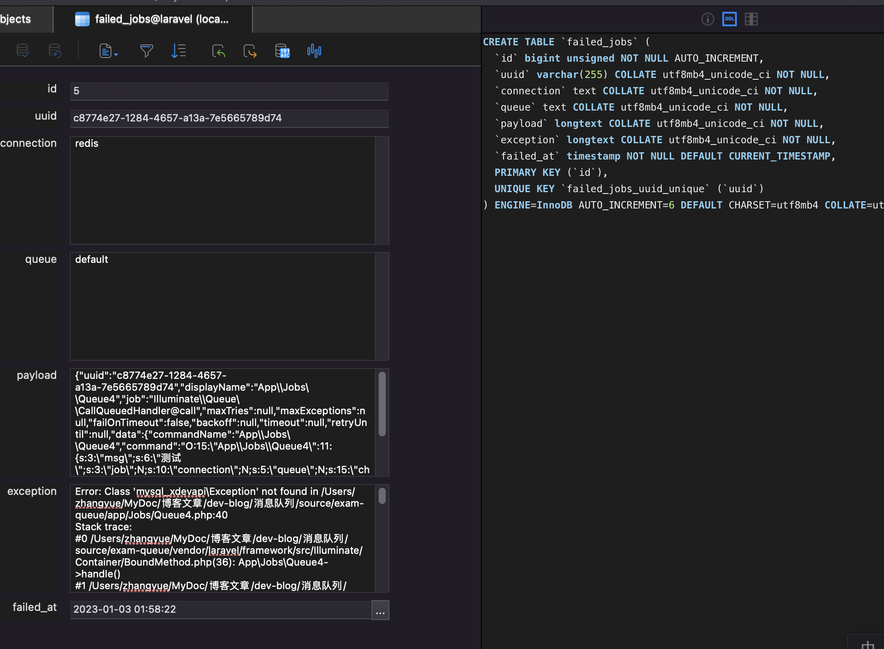

# 异常消息处理

上节课我们已经学习到了消息的持久化和确认相关的内容。但是，光有这些还不行，如果我们的消费者出现问题了，无法确认，或者直接报错产生异常了，这些消息要怎么处理呢？直接丢弃？这就是丢消息了呀。再次处理？一直继续报错怎么办？这条消息就永远都在不停报错的死循环中了。

通常，消息队列系统都会提供一套对于异常消息的处理机制，比如 RabbitMQ 的死信队列。

## RabbitMQ死信队列

死信队列，其实就是在满足一定规则的前提下，将消息发送到指定的一个交换机队列中。这些规则包括：

- 使用者使用basic.reject或basic.nack（重新排队参数设置为false）对消息进行否定确认。
- 消息过期，根据队列的消息 TTL 过期时间而定。
- 消息被丢弃，因为队列超过了长度限制。

前面两个好测试，最后一个要修改 RabbitMQ 的配置稍微麻烦点，那么咱们就用前面两个来测。

首先，要定义一个用于接收死信消息的交换机和队列，我们顺便也直接做一个客户端消费者，专门读取死信队列里的消息。这个就相当于是正规队列消费者处理出现问题之后，再由这个消费者来做善后。

```php
// 5.rq.c.deadletter.php
// ……………………
// 建立连接
$connection = new AMQPStreamConnection('localhost', 5672, 'guest', 'guest');
$channel = $connection->channel(); // 获取频道

// 死信队列及交换机
$channel->exchange_declare('dead_letter', 'direct', false,true,false); // 定义交换机
$channel->queue_declare('dead_letter_queue', false, true); // 定义队列
$channel->queue_bind('dead_letter_queue', 'dead_letter'); // 队列绑定交换机


echo "等待死信队列消息，或者使用 Ctrl+C 退出程序。", PHP_EOL;

// 定义接收数据的回调函数
$callback = function ($msg) {
    echo '死信队列接收到数据： ', $msg->body, PHP_EOL;
};

// 消费队列，获取到数据将调用 callback 回调函数
$channel->basic_consume('dead_letter_queue', '', false, true, false, false, $callback);

while ($channel->is_open()) {
    $channel->wait();
}
```

交换机名字和队列名字自己起就好了。前面已经说过了，这个消费者获取到的死信队列数据都是正常消费有问题的，那么善后工作咱们就可以将这些数据记录日志或者记录到数据库，顺便发邮件、发短信提醒，或者做任何你想做的通知及记录工作。出于测试的目的，咱们就是简单打印了一下。

```shell
> php 5.rq.c.deadletter.php
等待死信队列消息，或者使用 Ctrl+C 退出程序。
```

启动之后就等着死信数据的到来吧。接下来，我们要修改一下正常的队列，增加一些参数。

```php
// 5.rq.c.php
// ……………………
$channel->queue_declare('hello', false, true, false, false, false, new AMQPTable([
    'x-message-ttl'=>10000, // 10秒过期
    'x-dead-letter-exchange'=>'dead_letter', // 死信到某个交换机
    'x-dead-letter-routing-key'=>'', // 死信路由
]));

// ……………………

$callback = function ($msg) {
    echo '接收到数据： ', $msg->body, PHP_EOL;
    $msg->nack();
};

// ……………………
```

`x-message-ttl` 是消息的过期时间，我们后面要用它来测过期时间进入死信队列的情况。`x-dead-letter-exchange` 用于定义出现问题后，将这个队列的数据放到哪个死信队列交换机中。`x-dead-letter-routing-key` 这个是指定进入死信队列的哪个路由。关于 RabbitMQ 交换机和路由的内容，如果有不清楚的小伙伴，可以在深入地学习一下 RabbitMQ 的官方文档和示例哦。

然后，在回调函数中，我们直接调用 `$msg->nack()` 。这个表示的就是手动取消确认，还记得上节课我们学过的是 `$msg->ack()` 吧，这个表示的是确认处理完成，没问题了，而 nack() 就是反过来的，说明当前的队列处理有问题，没有正常 ACK 。这对应的就是死信队列的第一条规则。

现在，向普通的 hello 消息队列中发送消息，结果死信队列中会接收到数据。

```shell
> php 5.rq.c.deadletter.php
等待死信队列消息，或者使用 Ctrl+C 退出程序。
死信队列接收到数据： Hello World!
```

### 过期时间

好了，上面测试的结果就是死信队列的第一条规则。接下来我们测试第二条规则。

在 hello 队列的配置中，我们加上的 `x-message-ttl` 是 10 秒，也就是说，这条消息 10 秒不处理就会进入到死信队列。这个非常好测，直接关掉消费者，然后生产者发送数据，等到过期时间后，死信队列就会显示接收到数据了。

这个规则可以帮我们实现一个非常重要的功能，就是：延时队列。RabbitMQ 中没有直接的延时队列相关的功能，但可以通过死信的这个规则来实现，具体内容我们下节课再说。

## Redis 队列在 Laravel 框架中处理异常消息

好了，看完 RabbitMQ 的相关异常处理功能之后，我们马上会联想到，Redis 有这样的功能吗？

抱歉，真的没有，但是，Laravel 和 TP 框架的队列功能都通过业务代码的形式实现了类似的功能。我们还是以 Laravel 为例进行学习。

在 Laravel 中，异常的消息队列数据最后会保存到 MySQL 数据库中，我们需要执行数据迁移来创建表，使用下面这两个命令。

```shell
php artisan queue:failed-table
php artisan migrate
```

操作成功之后，会在数据库中创建一个名为 failed_jbs 的表。接下来，还是继续拿上次课创建的那个最后会报异常的 Job 来进行测试，直接调用生产者的命令插入队列。

```shell
> php artisan q:p4
```

然后，我们不使用 `--tries` ，这样就不会进行重试了，一次失败就会进入到异常处理流程中，也就是插入到数据库中。

```shell
> php artisan queue:work
[2023-01-03 01:58:12][gAfPH03MvGWQXjjjk5nAFWtU7b3gkhqD] Processing: App\Jobs\Queue4
接收到了消息：测试 1672711092
[2023-01-03 01:58:22][gAfPH03MvGWQXjjjk5nAFWtU7b3gkhqD] Failed:     App\Jobs\Queue4
```

好了，去数据库看一眼吧，数据是不是插入进来了。



从截图上可以看到，不仅有原始的队列信息，还有异常信息、队列使用的连接以及队列名、uuid 和失败时间这些字段。在结构上，还为 uuid 创建了一个唯一索引，这个 uuid 的作用我们后面马上就会看到。

接下来，使用命令行，我们还可以看到所有失败队列的信息。

```shell
> php artisan queue:failed

+--------------------------------------+------------+---------+-----------------+---------------------+
| ID                                   | Connection | Queue   | Class           | Failed At           |
+--------------------------------------+------------+---------+-----------------+---------------------+
| c8774e27-1284-4657-a13a-7e5665789d74 | redis      | default | App\Jobs\Queue4 | 2023-01-03 01:58:22 |
| 4a38d37b-86e7-4755-a29a-f6843b7289cc | redis      | default | App\Jobs\Queue4 | 2022-12-31 03:57:23 |
| f4fa4cfd-cee2-4199-b048-c21dbbc188ca | redis      | default | App\Jobs\Queue4 | 2022-12-31 03:57:03 |
| 210c9716-89f1-438b-b252-32cc6552a68f | redis      | default | App\Jobs\Queue4 | 2022-12-31 03:52:57 |
| c971ddef-9098-4399-a404-bbce08bd97af | redis      | default | App\Jobs\Queue4 | 2022-12-31 03:52:41 |
+--------------------------------------+------------+---------+-----------------+---------------------+

```

然后，可以利用 uuid ，也就是上面命令中返回的 ID ，来让数据进行消息重试，使用 `queue:retry` 命令。

```shell
> php artisan queue:retry c8774e27-1284-4657-a13a-7e5665789d74 
The failed job [c8774e27-1284-4657-a13a-7e5665789d74] has been pushed back onto the queue!
```

执行之后，这条失败的数据又塞回之前的队列里了，消费者又会开始对它进行消费。这就是 uuid 的作用。另外，我们还可以批量执行重试，直接在命令后面写多个 uuid 就行。也可以一次性全部执行重试，只需要使用 `all` 参数即可，这个大家可以去官方文档再详细看一下。

我们还可以删除或者整个清除所有的失败任务数据，其实也就是删除 failed_jobs 中的数据。`queue:forget` 用于根据指定的 uuid 进行删除，而 `queue:flush` 则会清除所有数据。除了这两个命令之外，还有一个根据时间来清除失败任务的命令 `queue:prune-failed` 。它默认是默认 24 小时，可以用 `--hours=xxx` 来设置具体的时间。

```shell
> php artisan queue:prune-failed
4 entries deleted!
```

最后，我们还可以禁用失败存储。直接通过 .env 配置文件进行配置就行了，设置对应的属性值为 null 即可。

```ini
QUEUE_FAILED_DRIVER=null
```

### 任务错误处理

除了上面的失败处理之外，在 Laravel 中，还可以在出现错误的时候马上去执行一个方法，就像是失败事件后的回调函数一样。通过这个方法，我们可以在任务失败的时候马上就进行邮件、短信通知，或者也可以记录错误日志，甚至也可以不使用上面默认的异常处理功能以及相关的表，直接在这里用我们自己自定义的表来存储失败任务的信息。总之就是，任务失败后你想怎么处理都行。

只需要在任务类中实现 failed() 方法。

```php
// /app/Jobs/Queue4.php
// ……………………
// ……………………
public function failed($exception = null)
{
  echo '如果发生错误就进入到这里了，错误信息是：'.$exception->getMessage(), PHP_EOL;
}
```

然后看一下效果。

```php
> php artisan queue:work
[2023-01-03 02:19:00][d5MlKJkjnez3MBnqzrYCUkG1HSg1LJtC] Processing: App\Jobs\Queue4
接收到了消息：测试 1672712340
如果发生错误就进入到这里了，错误信息是：
[2023-01-03 02:19:10][d5MlKJkjnez3MBnqzrYCUkG1HSg1LJtC] Failed:     App\Jobs\Queue4
```

这个方法的执行是同步的，不是异步的，就像我们前面说的，任务失败了马上就会调用这个方法。因此，就可以安全有效地在这个方法中进行我们任何想要善后处理的操作了。

## 总结

好了，到现在为止，我们的队列系统其实已经相当安全可靠了。上一篇文章通过持久化和 ACK 机制解决了消息丢失的问题，这次即使是消费者出现了异常，我们也可以保证消息能够通过死信队列或者框架机制保存下来。从这里我们也可以看出，即使原生的系统不支持，也可以通过框架代码的形式来实现类似的功能，这也是队列这种系统灵活性的表现。补充一点，BLMOVE 这类 Redis 命令其实也可以实现消息备份，但和上面死信那种触发条件还是有区别，这是主动备份。再有，Redis 的 Stream 类型其实也已经是很完备的一套消息队列功能机制了，未应答 ACK 的数据是可以重复执行的，这也可以当成是一种异常处理的形式，只不过也一样需要我们自己编码干预进行转移，可以参考我们之前 Redis 系列中相关的内容：**【Redis09】Redis基础：Stream操作** [https://mp.weixin.qq.com/s/DsSnyU9xuJEijm9t-DVs2A
](https://mp.weixin.qq.com/s/DsSnyU9xuJEijm9t-DVs2A
) 。

接下来，我们再看两种常见的队列形式，分别是延时队列和优先级队列，它们在 RabbitMQ 和 Laravel+Redis 中的实现又是怎样的呢？

测试代码：

[https://github.com/zhangyue0503/dev-blog/blob/master/%E6%B6%88%E6%81%AF%E9%98%9F%E5%88%97/source/5.rq.c.deadletter.php](https://github.com/zhangyue0503/dev-blog/blob/master/%E6%B6%88%E6%81%AF%E9%98%9F%E5%88%97/source/5.rq.c.deadletter.php)

[https://github.com/zhangyue0503/dev-blog/blob/master/%E6%B6%88%E6%81%AF%E9%98%9F%E5%88%97/source/5.rq.c.php](https://github.com/zhangyue0503/dev-blog/blob/master/%E6%B6%88%E6%81%AF%E9%98%9F%E5%88%97/source/5.rq.c.php)

[https://github.com/zhangyue0503/dev-blog/blob/master/%E6%B6%88%E6%81%AF%E9%98%9F%E5%88%97/source/5.rq.p.php](https://github.com/zhangyue0503/dev-blog/blob/master/%E6%B6%88%E6%81%AF%E9%98%9F%E5%88%97/source/5.rq.p.php)

